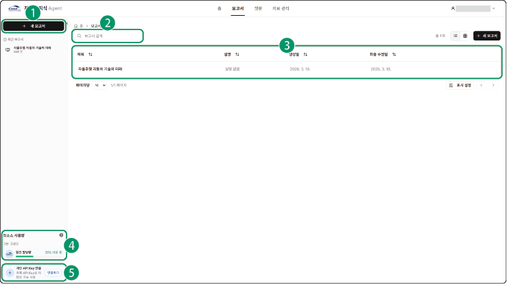

# 자동차 지식 에이전트 기능

자동차 지식 에이전트에서는 다음과 같은 다양한 서비스를 이용할 수 있습니다.

## 보고서

자동차 산업에 특화된 보고서 전문 AI 에이전트가 자동차 산업 데이터를 기반으로 전문적인 분석 보고서를 자동 생성할 수 있습니다.

자동차 지식 에이전트의 **보고서** 메뉴를 클릭하세요. 보고서 페이지로 이동합니다.

### 화면 구성

보고서 화면은 다음과 같이 구성됩니다.

| 번호 | 항목 | 설명 |

| --- | --- | --- |

| 1 | 새 보고서 | 새로운 보고서를 생성할 수 있습니다. |

| 2 | 검색창 | 보고서 이름을 입력하여 검색할 수 있습니다. |

| 3 | 보고서 목록 | 생성된 보고서 목록을 표시합니다. |

| 4 | 리소스 사용량 | 리소스 사용량을 표시합니다.<ul><li>을 클릭하면 대시보드 페이지로 이동하고, API 사용량과 비용 현황을 리소스별, API 키별로 확인할 수 있습니다.</li></ul> |

| 5 | 개인 API Key 연결 | **연결하기**를 클릭하면 대시보드 페이지로 이동하고, 카테고리별(LLM 또는 파서) API 키를 추가하거나 변경할 수 있습니다. |

