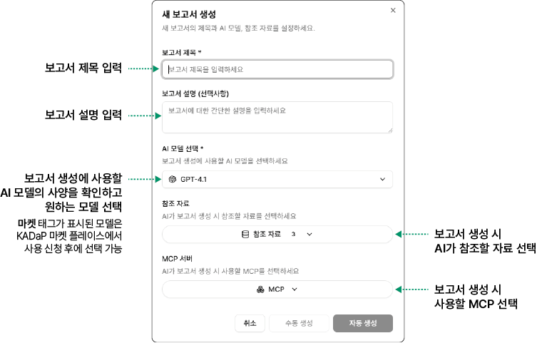
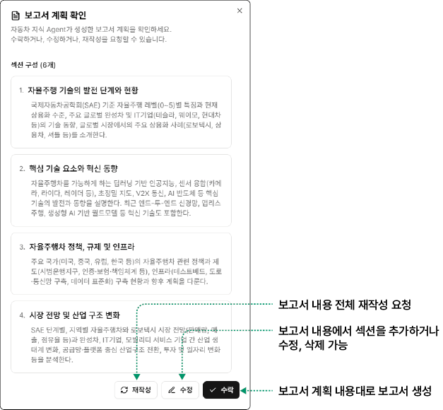

### 보고서 생성하기 {#보고서-생성하기}

보고서를 생성하려면 다음 순서대로 진행하세요.

1. **보고서** 페이지에서 **새 보고서**를 클릭하세요.

- **새 보고서 생성** 팝업창이 표시됩니다.

2. 보고서 생성을 위한 항목을 설정하세요.

* **참조 자료**

&#x20; - **웹 검색 (실시간)**: 실시간 웹 검색을 통한 최신 정보

&#x20; - **모빌리티 인사이트**: 모빌리티 분야의 전문 데이터 및 분석 자료 (한국자동차연구원 발행 공개 보고서)

&#x20; - **한국자동차공학회 논문**: 한국자동차공학회 발행 학술 논문 및 연구 자료

&#x20; - **유저 업로드 파일**: 사용자가 직접 업로드하거나 다른 사용자가 공개한 자료

* **MCP 서버**

&#x20; - **KADaP 데이터포털**: 자동차데이터플랫폼(KADaP)의 데이터 검색 도구입니다. 필터 검색과 키워드 검색의 두 가지 도구를 제공합니다.

&#x20; - **Academia**: 학술 연구를 가속화하는 도구 모음입니다. arXiv와 ACL Anthology에서 논문 검색, 인용 및 참고문헌 조회, 웹 소스 탐색이 가능합니다. 또한 논문을 텍스트로 다운로드하고, LaTeX 템플릿으로 원고를 작성하며, Hugging Face 데이터셋을 검색하여 실험을 지원합니다.

&#x20; - **Sequential Thinking**: 복잡한 문제를 단계별로 분석하고 해결하는 도구입니다.각 사고 단계가 이전 단계를 기반으로 구축되거나 수정될 수 있어 동적이고 반성적인 문제 해결이 가능합니다. 주로 복잡한 문제 분해, 계획 수립, 설계 작업에 활용됩니다.

3. **자동 생성**을 클릭하세요.

- 시스템이 데이터를 즉시 분석하여 자동으로 보고서 생성을 진행합니다.

- **수동 생성**을 클릭하면 보고서 생성 화면으로 이동합니다. 사용자가 챗봇을 사용하여 작성을 요청하거나 직접 보고서 내용을 입력하면서 보고서를 작성할 수 있습니다.

4. **보고서 계획 확인** 창에서 내용을 확인하세요.

5. 보고서를 생성하려면 **수락**을 클릭하세요. 보고서 생성이 완료되면 결과물이 표시됩니다.

