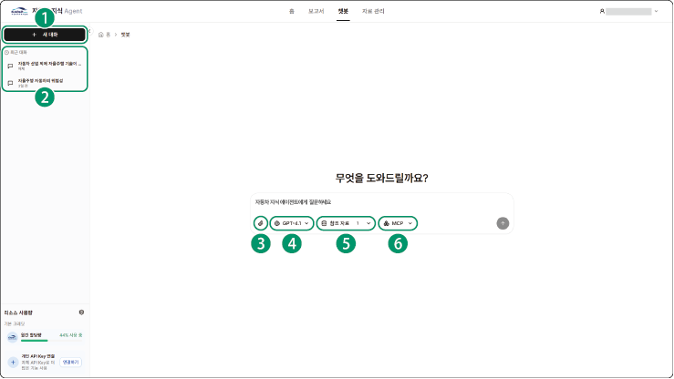

## 챗봇

자동차 산업에 특화된 전문 AI 챗봇이 즉각적인 정보와 분석을 제공합니다. 사용자가 파일을 첨부하여 AI가 응답 생성 시 참조할 자료로 활용할 수 있습니다. 또한 AI 모델, 참조 자료, MCP 서버를 변경할 수 있습니다.

자동차 지식 에이전트의 **챗봇** 메뉴를 클릭하세요. 챗봇 페이지로 이동합니다.

### 화면 구성

챗봇 화면은 다음과 같이 구성됩니다.

| 번호 | 항목 | 설명 |

| --- | --- | --- |

| 1 | 새 대화 | 새로운 대화창을 표시합니다. |

| 2 | 대화 목록 | 대화 목록을 표시합니다.<ul><li>목록 중 원하는 대화를 클릭하면 이어서 대화할 수 있습니다.</li></ul> |

| 3 | 파일 추가 | AI가 응답 생성 시 참조할 파일을 추가할 수 있습니다. |

| 4 | 모델 변경 | AI 모델의 사양을 확인하고 원하는 모델로 변경할 수 있습니다. |

| 5 | 참조 자료 | AI가 응답 생성 시 참조할 자료를 선택할 수 있습니다. |

| 6 | MCP 서버 | AI가 응답 생성 시 사용할 MCP를 선택할 수 있습니다. |

>  **참고**

>

> AI 모델, 참조 자료, MCP 서버 옵션에 자세한 내용은 [보고서 생성하기](#보고서-생성하기)를 참고하세요.

