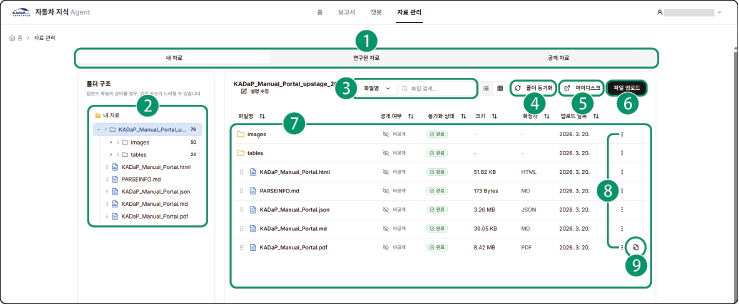

## 자료 관리

사용자가 업로드한 자료(내 자료)는 인공지능이 이해할 수 있는 구조와 포맷으로 변환됩니다. 업로드하거나 파싱된 파일들은 **마이디스크** > **My files** > **tools** > **agent** 폴더와 동기화되고, 공개 자료로 전환하면 챗봇이 응답 시 활용할 수 있습니다. 또한 한국자동차연구원이 제공하는 자료(연구원 자료)와 다른 사용자가 공개한 자료(공개 자료)도 확인할 수 있습니다.

자동차 지식 에이전트의 **자료 관리** 메뉴를 클릭하세요. 자료 관리 페이지로 이동합니다.

### 화면 구성

자료 관리 화면은 다음과 같이 구성됩니다.

| 번호 | 항목 | 설명 |

| --- | --- | --- |

| 1 |  | 속성에 따라 분류한 자료를 표시합니다.<ul><li>**내 자료**: 사용자가 업로드한 자료를 확인할 수 있습니다.</li></ul><ul><li>**연구원 자료**: 한국자동차연구원이 제공하는 자료를 확인할 수 있습니다.</li></ul><ul><li>**공개 자료**: 다른 사용자가 공개한 자료를 확인할 수 있습니다.</li></ul> |

| 2 | 자료 목록 | 자료 목록을 표시합니다.<ul><li>원하는 위치에 폴더를 생성할 수 있습니다.</li></ul> |

| 3 | 검색창 | 파일이나 폴더명을 입력하여 자료를 검색할 수 있습니다. |

| 4 | 폴더 동기화 | **내 자료** 탭의 전체 자료 또는 원하는 폴더를 **마이디스크** > **My files** > **tools** > **agent** 폴더와 동기화할 수 있습니다. |

| 5 | 마이디스크 | 마이디스크 페이지로 이동할 수 있습니다. |

| 6 | 파일 업로드 | 파일을 업로드하고 원하는 파서를 선택하여 문서를 파싱할 수 있습니다. |

| 7 | 자료 상세 | 자료 목록과 상세 정보를 표시합니다. |

| 8 |  | 해당 항목에 대한 컨텍스트 메뉴가 표시됩니다.<ul><li>필요한 경우 원하는 폴더나 파일을 **공개로 전환**할 수 있습니다. 공개로 전환한 자료는 **공개 자료** 탭에서 확인할 수 있습니다.</li></ul><ul><li>선택한 폴더나 파일 이름을 변경하고 삭제할 수 있습니다.</li></ul><ul><li>파일별로 다운로드 허용 또는 비허용을 설정할 수 있습니다.</li></ul> |

| 9 |  | 변환(파싱)결과 제공을 지원하는 일부 파서의 경우 시각화 창을 통해 결과를 확인할 수 있습니다. |

