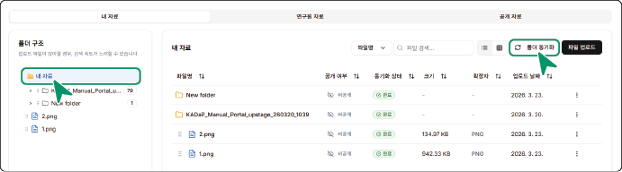
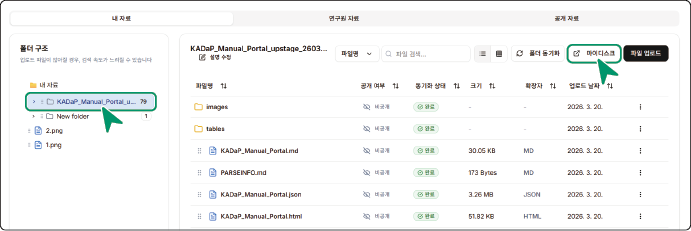

### 폴더 동기화하기

마이디스크의 자료와 내 자료 탭의 파일들을 동기화할 수 있습니다.

- **마이디스크** > **My files** > **tools** > **agent** 폴더 내의 자료를 내 자료로 동기화할 수 있습니다. **내 자료**를 선택한 후, **폴더 동기화**를 클릭하세요.

&#x20; 

- 내 자료에서 업로드하거나 파싱된 자료들을 **마이디스크** > **My files** > **tools** > **agent** 폴더 내로 동기화할 수 있습니다. 내 자료 내에서 동기화하려는 폴더를 선택한 후, **폴더 동기화**를 클릭하세요.

&#x20; 

