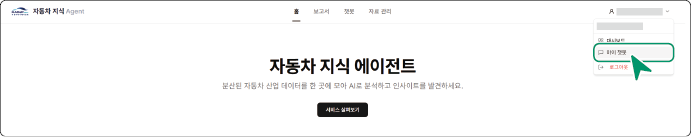
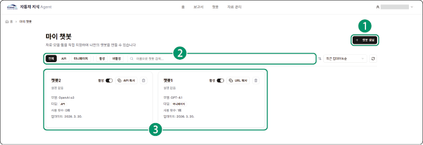
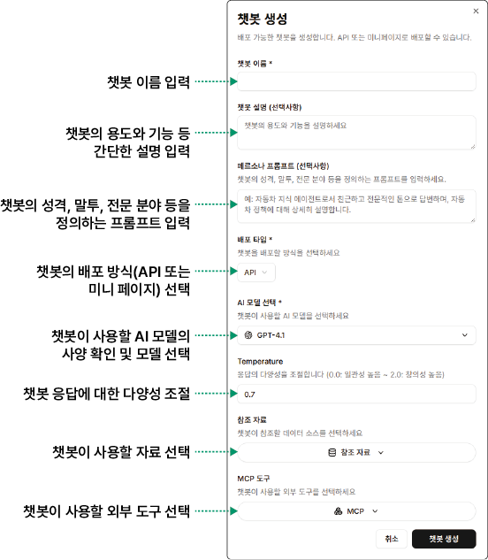
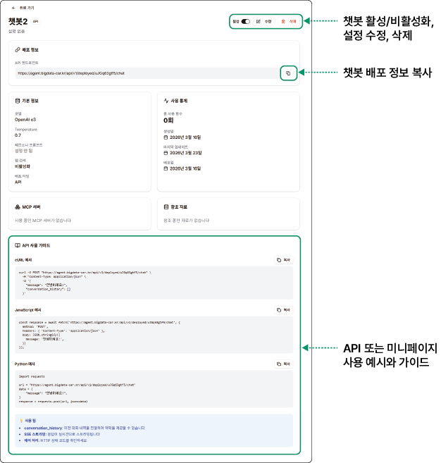

## 마이 챗봇

자동차 지식 에이전트에서는 사용자 전용 챗봇을 생성하여 활용할 수 있습니다. 챗봇이 참조할 자료나 AI 모델, 외부 툴 등을 직접 지정하여 챗봇을 생성할 수 있고, API 또는 미니페이지 방식으로 챗봇을 배포할 수 있습니다. 기업이 자사의 데이터를 기반으로 챗봇을 구축하여 홈페이지에 삽입하거나 독립된 페이지로 운영할 수 있습니다.

자동차 지식 에이전트의 로그인 계정을 클릭한 후, **마이 챗봇**을 클릭하세요. 마이 챗봇 페이지로 이동합니다.

### 화면 구성

마이 챗봇 화면은 다음과 같이 구성됩니다.

| 번호 | 항목 | 설명 |
| --- | --- | --- |
| 1 | 챗봇 생성 | 새로운 챗봇을 생성할 수 있습니다. |
| 2 | 검색창 | 챗봇의 이름이나 배포 형식, 활성 여부로 챗봇을 검색할 수 있습니다. |
| 3 | 챗봇 목록 | 챗봇 목록을 표시합니다.<ul><li>챗봇 위젯에서 해당 챗봇을 활성/비활성화, 삭제 또는 배포 정보(API 엔드포인트 또는 미니페이지 URL)을 복사할 수 있습니다.</li></ul><ul><li>복사한 미니페이지 URL을 브라우저 새 탭에 붙여넣어 챗봇을 사용할 수 있습니다.</li></ul><ul><li>챗봇 위젯을 클릭하여 해당 챗봇의 상세 정보를 확인하거나 수정할 수 있습니다.</li></ul><ul><li>챗봇 위젯을 클릭하여 해당 챗봇의 API 또는 미니페이지 사용 예시와 가이드를 확인할 수 있습니다.</li></ul> |

### 마이 챗봇 생성하기

마이 챗봇을 생성하려면 다음 순서대로 진행하세요.

1. **마이 챗봇** 페이지에서 **챗봇 생성**을 클릭하세요.

- **챗봇 생성** 팝업창이 표시됩니다.

2. 챗봇 생성을 위한 항목을 설정하세요.

3. **챗봇 생성**을 클릭하세요. 생성된 챗봇 위젯을 목록에서 확인할 수 있습니다.

>  **참고**

>

> AI 모델, 참조 자료, MCP 서버 옵션에 자세한 내용은 [보고서 생성하기](#보고서-생성하기)를 참고하세요.

### 마이 챗봇 관리하기

챗봇의 활용 유무에 따라 활성/비활성화하거나 삭제할 수 있고, 정보를 수정할 수 있습니다.

상세 정보를 확인하려는 챗봇 위젯을 클릭하세요.

