# 자동차산업클라우드 KADaP CLOUD

고사양 컴퓨팅 장비의 구입이나 구축없이 바로 자율주행 기술 개발, 자동차 데이터 분석그리고 AI 알고리즘 개발을 시작할 수 있습니다.

# 자동차 산업 클라우드 소개

자동차 산업 클라우드에서는 사용자에게 필요한 가상 서버 기반 개발 환경을 제공합니다. 자동차 데이터 포털에서 검색한 데이터나 사용자가 보유한 데이터를 활용해 클라우드에서 데이터 분석, 분석 알고리즘 개발 및 알고리즘을 이용한 서비스를 구현하고 테스트할 수 있습니다.

클라우드 서비스에서는 물리적 데이터 센터에 가상 서버와 저장 공간을 생성해 제공합니다. 그 외에도 개발 및 시뮬레이션에 필요한 소프트웨어가 설치된 환경을 제공하므로 추가 설치 작업 없이 바로 가상 서버를 생성해 활용할 수 있습니다.

## 서비스 구성

자동차 산업 클라우드의 주요 서비스 구성은 다음과 같습니다.

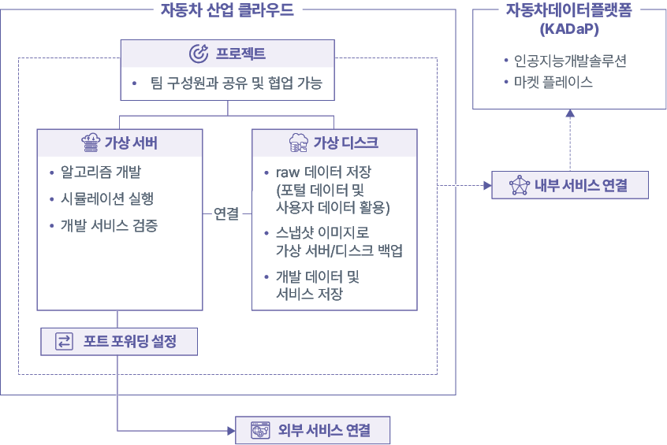

## 주요 기능과 특징

자동차 산업 클라우드가 제공하는 주요 기능과 특징은 다음과 같습니다.

- 다른 서비스와 달리 VPN 연결을 기본으로 제공해 보안 강화
- 사용자가 직접 가상 서버의 OS, SW, CPU, GPU, 메모리, 저장 공간 크기를 지정해 생성 가능
- 사용자 편의성 및 활용도 향상을 위한 자체 웹 인터페이스 적용
- 가상 서버 활용 편의를 위한 Web SSH, 원격 데스크탑(GUI), 포트 포워딩, 스냅샷 저장 등의 기능 제공

>  **참고**
>
> 자동차 산업 클라우드는 기관 사용자만 사용할 수 있습니다. 클라우드를 사용하려면 사용 신청이 필요합니다. 자세한 설명은 [클라우드 사용 신청하기](#클라우드-사용-신청하기)를 참고하세요.

자동차 산업 클라우드를 사용하려면 다음 순서대로 진행하세요.

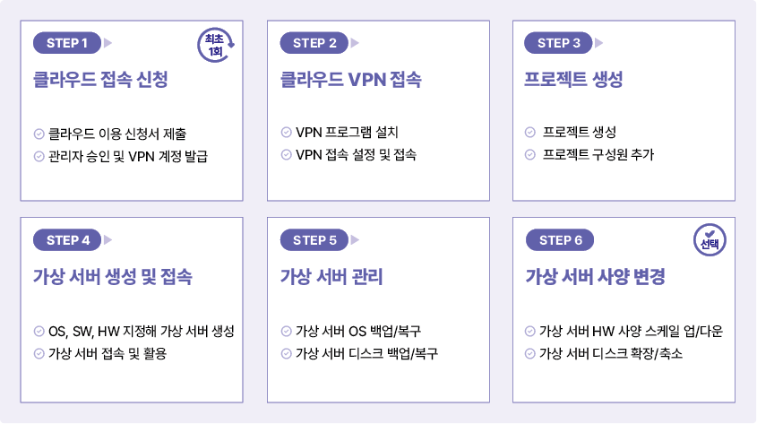

# 클라우드 접속 준비

자동차 산업 클라우드는 전용 VPN을 통해서만 접속할 수 있습니다. VPN 계정 신청, VPN 접속 프로그램 설치 등 클라우드 서버를 사용하기 위해 필요한 절차를 설명합니다.

## 클라우드 사용 신청하기 {#클라우드-사용-신청하기}

클라우드 접속을 위해 기관 사용자는 자동차데이터플랫폼(KADaP) 관리자에게 클라우드 사용 신청서를 제출합니다. 관리자는 사용 자격을 검증한 후 VPN 계정을 전달하며, 이 VPN 계정으로 클라우드 서버에 접속할 수 있습니다.

> **주의**
>
> 자동차 산업 클라우드는 기관에 등록되어 있는 기관 사용자만 신청할 수 있으며, 일반 사용자는 신청할 수 없습니다.

### VPN 계정 신청하기

클라우드 서버 접속을 위한 VPN 계정을 신청하려면 다음 순서대로 진행하세요.

1. 자동차 데이터 포털에서 기관 사용자로 가입하세요.
   - 일반 사용자로 가입된 경우, 기관 가입자로 다시 가입하세요. 기관 사용자로 회원 가입을 하려면 [회원 가입하기](KADaP_UserManual_Frontmatter.md#회원-가입하기)를 참고하세요.
2. VPN 안내 페이지(vpnalert.bigdata-car.kr)에 접속해 신청 서류를 다운로드하세요. 신청서를 작성한 후 관리자에게 메일을 전송하세요.
   - 관리자 메일 주소: admin@bigdata-car.kr
   - VPN 사용 신청이 접수되면 관리자 검토 후 5일 내에 사용자 메일로 VPN 계정 정보를 전송합니다.

### VPN 접속 프로그램 설치하기
클라우드 서버에 VPN 접속을 위한 프로그램을 다운로드해 설치합니다.

>  **웹매뉴얼**
>
> 자세한 등록 절차는 웹 매뉴얼을 참고하세요.
>   - 자동차 데이터 플랫폼(KADaP)의  > **매뉴얼** > **HTML** > **자동차 산업 클라우드** > **VPN 접속 프로그램 설치**

### VPN 접속 프로그램 설정하기

클라우드에 접속하려면 VPN 프로그램에 접속 정보를 등록하고 로그인해야 합니다.

#### VPN 접속 정보 등록

윈도우 OS에서 VPN 접속 정보를 등록하려면 다음 순서대로 진행하세요.

1. **AhnLab TrustGuard SSL VPN** 프로그램을 실행하세요.
2. 로그인 창이 나타나면 **서버 관리**를 클릭하세요.
3. 서버 관리창이 나타나면 다음 정보를 입력하고 **추가**를 클릭하세요.
   - VPN 서버 이름: KADaP VPN
   - VPN 서버 IP: vpn.bigdata-car.kr
   - VPN 서버 포트: 3443

   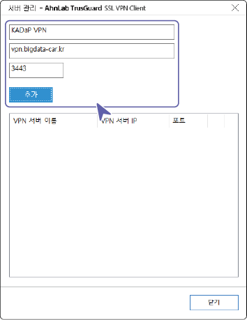

4. 접속 정보가 하단의 목록에 표시되면 **닫기**를 클릭해 종료하세요.

#### 로그인

VPN 접속 프로그램에 관리자가 이메일로 전달한 VPN 접속 ID와 임시 비밀번호를 입력해 로그인합니다.

VPN 계정으로 로그인하려면 다음 순서대로 진행하세요.

1. **AhnLab TrustGuard SSL VPN** 프로그램을 실행하세요.
2. 로그인 창의 서버 목록을 선택해 설정한 서버 이름 (KADaP VPN)을 선택하세요.
3. 전달받은 VPN 접속 정보를 입력하고 **로그인**을 클릭하세요.

   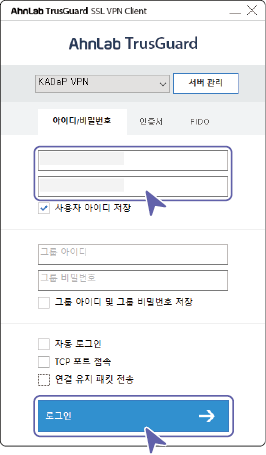

   - **사용자 아이디 저장**을 클릭하면 입력한 아이디가 저장됩니다.
   - **자동 로그인**을 클릭하면 입력한 아이디와 비밀번호가 저장되며 프로그램 실행 시 자동으로 로그인됩니다.
   - **TCP 포트 접속**을 클릭하면 TCP 포트로 VPN 계정에 접속할 수 있습니다.

>  **참고**
>
> 임시 비밀번호를 입력해 최초 로그인 시 VPN 접속 비밀번호 변경창이 나타나는 경우가 있습니다. 개인 정보 보안을 위해 비밀번호를 변경해 사용하세요.

>  **주의**
>
> VPN 접속 비밀번호는 **자동차 데이터 포털의 로그인 비밀번호와 다릅니다**. 비밀번호를 혼동하지 않도록 기록해두세요.

## 클라우드 서비스 로그인하기

VPN으로 접속되면 클라우드 서비스에 로그인하여 가상 서버 생성 및 다양한 서비스를 이용할 수 있습니다.

>  **주의**
>
> 휴대폰의 테더링 기능 등을 통해 접속하면 IPv6 주소로 인식하여 "**정상적인 접근이 아닙니다**" 경고창이 표시될 수 있습니다.
>   - 경고창 하단의 [핫스팟 or 테더링 접속 시] 설명을 참고해 설정을 변경하고 다시 접속하세요.

자동차 산업 클라우드 서비스를 시작하려면 다음 순서대로 진행하세요.

1. **자동차데이터플랫폼**(www.bigdata-car.kr)에 접속하세요.
2. 자동차 데이터 플랫폼 페이지에서 **데이터 분석 및 개발** > **자동차 산업 클라우드**를 클릭하세요.

   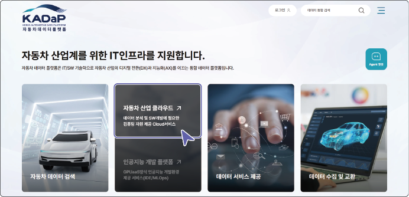

3. 클라우드 로그인 페이지에서 ID와 비밀번호를 입력하고 **로그인**을 클릭하세요.
   - 자동차 데이터 포털 가입 시 등록한 이메일 주소와 비밀번호를 입력합니다.
   - AhnLab TrustGuard SSL VPN 프로그램을 실행해 로그인한 후 클라우드 서비스에 접속할 수 있습니다.

>  **바로가기**
>
> 다음의 경로로 바로 접속할 수 있습니다.
>   - **자동차 산업 클라우드**: [cloud.bigdata-car.kr](https://cloud.bigdata-car.kr)

**자동차 산업 클라우드 접속 오류 시 해결 방안**

클라우드 접속 시 VPN에 로그인되어 있지 않거나 관리자 승인이 되지 않은 경우 등의 원인에 따라 오류 페이지가 표시됩니다. 해당 항목에 맞는 해결 방법을 참고해 클라우드 서비스 접속을 다시 시도하세요.

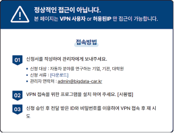

**VPN에 접속하지 않은 경우**
VPN에 접속하지 않은 상태에서 클라우드 페이지를 열면 접근 오류 화면이 표시됩니다.

**해결방법**
관리자가 전달한 VPN 계정으로 로그인한 후 클라우드 서비스에 다시 접속하세요.

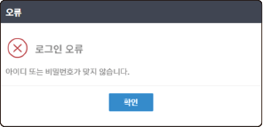

**로그인 정보를 잘못 입력한 경우**
자동차데이터플랫폼(KADaP) 로그인 아이디 또는 비밀번호를 잘못 입력한 경우 오류 알림창이 표시됩니다.

**해결 방법**
자동차데이터플랫폼(KADaP) 로그인 아이디와 비밀번호를 다시 한 번 확인하고 입력하세요.

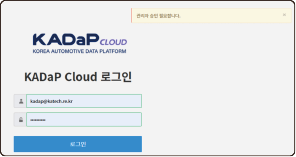

**클라우드 계정의 관리자 승인이 완료되지 않은 경우**
사용자가 클라우드 계정을 신청했지만 관리자가 승인하기 전에 로그인하면 아래와 같은 알림 메시지가 표시됩니다.

**해결 방법**
클라우드 서비스는 관리자 승인이 완료된 후에 사용할 수 있습니다. 계정 승인 상태를 확인하려면 관리자 메일 (admin@bigdata-car.kr)로 문의하세요.

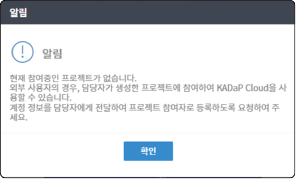

**참여중인 프로젝트가 없는 경우**
클라우드 서비스에 정상적으로 로그인되지만 프로젝트에 구성원으로 등록되지 않은 경우 아래와 같은 알림창이 표시됩니다.

**해결 방법**
프로젝트 책임자가 아닌 사용자는 특정 프로젝트에 할당되어 있지 않으면 클라우드 서비스를 사용할 수 없습니다. 조직이나 부서의 프로젝트 책임자에게 프로젝트 구성원 등록을 요청하세요.

# 클라우드 서비스 사용

자동차 산업 클라우드 서비스의 화면은 다음과 같이 구성됩니다.

## 전체 프로젝트 화면 구성

현재 사용중인 전체 프로젝트 목록을 확인할 수 있습니다. 전체 프로젝트 화면은 다음과 같이 구성됩니다.

| 번호 | 항목 | 설명 |
| --- | --- | --- |
| 1 | 검색창 | 프로젝트명을 입력해 검색할 수 있습니다. |
| 2 | 프로젝트 생성 | 클라우드에서 프로젝트를 생성할 수 있습니다. 프로젝트 생성에 대한 자세한 설명은 [프로젝트 생성하기](#프로젝트-생성하기)를 참고하세요. |
| 3 | 프로젝트 목록 | 등록된 전체 프로젝트 목록을 확인할 수 있습니다.<ul><li>프로젝트 목록에는 직접 생성한 프로젝트와 다른 프로젝트 관리자가 구성원으로 추가한 프로젝트가 표시됩니다.</li></ul> |

### 프로젝트 생성하기 {#프로젝트-생성하기}

클라우드에서 서버를 생성하려면 먼저 프로젝트를 생성해야 합니다.

>**주의**
> 
>   - 프로젝트 생성은 클라우드 서비스 신청 시 지정한 프로젝트 책임자만 생성할 수 있습니다.
>   - 프로젝트는 기본 1개만 생성 가능하며, 관리자에게 요청하여 추가할 수 있습니다.
>     - 로그인한 사용자가 프로젝트 책임자가 아니거나 생성 가능 수량(1개)를 초과하면 프로젝트 생성 버튼이 비활성화됩니다. 사용자 권한과 생성된 프로젝트 수를 확인하세요.

프로젝트를 생성하려면 다음 순서대로 진행하세요.
1. 클라우드 메인 페이지에서 **프로젝트**를 클릭하세요.
2. 프로젝트 목록 페이지가 나타나면 **프로젝트 생성**을 클릭하세요.
3. 프로젝트 생성창이 나타나면 프로젝트명을 입력하고 **프로젝트 생성**을 클릭하세요.

   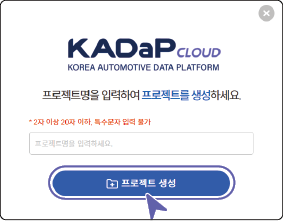

프로젝트가 생성되면 프로젝트 목록에 표시됩니다.

## 프로젝트 관리 화면 구성

프로젝트를 선택하면 프로젝트 관리 화면으로 이동합니다. 프로젝트 관리 화면의 각 항목별 기능을 설명합니다.

| 번호 | 항목 | 설명 |
| --- | --- | --- |
| 1 | 왼쪽 메뉴 숨김 | 왼쪽 메뉴를 숨겨 상세 화면을 크게 표시합니다. |
| 2 | 알람 | 클라우드 서버 사용량 알람이 표시됩니다.<ul><li>**알람 더보기+**를 클릭하면 서버 사용량에 따라 발생할 알람 이벤트를 설정할 수 있습니다.</li></ul> |
| 3 | 테마 | 클라우드 화면의 배경 색상을 변경할 수 있습니다. |
| 4 | 내 정보 | 로그인한 사용자 정보를 확인하고 로그아웃할 수 있습니다.<ul><li>**로그아웃**: 로그인한 계정에서 로그아웃합니다.</li><li>**나의 정보**: 자동차 데이터 포털의 마이페이지로 이동해 가입 정보를 확인할 수 있습니다.</li></ul> |
| 5 | 클라우드 메뉴 | 클라우드의 메뉴를 선택합니다.<ul><li>**프로젝트**: 사용자에게 할당된 프로젝트가 표시됩니다.</li><li>**서버 가상화**: 프로젝트에서 사용하는 서버와 디스크를 관리할 수 있습니다.</li></ul>|
| 6 | 메뉴 상세 화면 | 선택한 클라우드 메뉴의 상세 화면이 표시됩니다.<ul><li> : 프로젝트 전체 목록으로 이동합니다.</li><li>: 상세 화면의 정보를 새로고침합니다.</li></ul>|
| 7 | 질의 응답 | 클라우드 사용 중 궁금한 사항을 관리자에게 직접 문의할 수 있습니다. 질의 응답창에 문의 사항을 입력하면 관리자가 문의 순서대로 답변합니다. |

### 프로젝트 관리하기

프로젝트가 생성되면 프로젝트 관리 페이지에서 상세 정보를 확인할 수 있습니다.

프로젝트 정보를 확인하거나 관리하려면 다음 순서대로 진행하세요.

1. 클라우드 메인 페이지에서 **프로젝트**를 클릭하세요.
2. 프로젝트 목록에서 확인할 프로젝트를 클릭하세요.
3. 프로젝트 관리 페이지에서 각 상세 정보 탭을 클릭하세요.

#### 대시보드

대시보드에서는 프로젝트 정보 및 제공된 컴퓨팅 자원의 사용 현황을 한 눈에 확인할 수 있습니다.

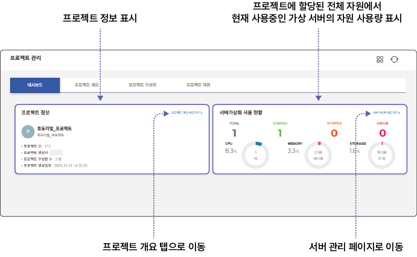

#### 프로젝트 개요

프로젝트 생성자, 프로젝트 ID, 프로젝트 참여자 목록 등을 확인하고 프로젝트를 삭제할 수 있습니다.

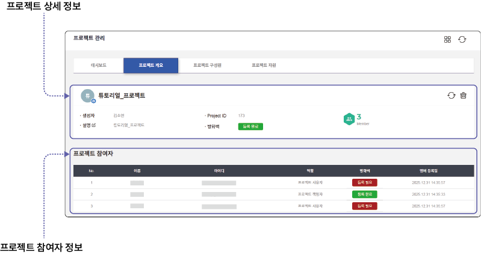

**프로젝트 상세 정보**
  - **생성자**: 프로젝트를 생성한 책임자 이름이 표시됩니다.
  - **Project ID**: 프로젝트 ID가 표시됩니다.
  - **프로젝트 참여자 수**: 프로젝트에 할당된 전체 참여자 수가 표시됩니다.
  - **설명**: 프로젝트 설명이 표시됩니다. 을 클릭하면 설명을 수정할 수 있습니다.
  - **방화벽**: 방화벽에 프로젝트 등록 여부를 표시합니다. 방화벽은 기본적으로 등록이 완료된 상태이며, **등록 필요**가 표시되는 경우 버튼을 클릭합니다. 방화벽에 프로젝트ID가 수동으로 등록되며 **등록 완료**로 변경됩니다.
  - : 프로젝트 및 참여자의 방화벽 등록 정보를 새로고침합니다.
  -  : 프로젝트를 삭제합니다. 프로젝트 삭제는 프로젝트 책임자만 할 수 있습니다. 프로젝트를 삭제하면 프로젝트 안에 생성된 서버가 모두 삭제됩니다.

**프로젝트 참여자 정보**
  - 방화벽에 **등록 필요**가 표시되는 경우 버튼을 클릭합니다. 방화벽에 프로젝트ID가 수동으로 등록되며 **등록 완료**로 변경됩니다.
  - 프로젝트 참여자는 프로젝트 구성원 탭에서 등록하거나 삭제할 수 있습니다.

>  **주의**
>
> 서버에 접속하려면 프로젝트 ID, 사용자 ID, 서버 IP가 모두 방화벽에 등록되어 있어야 합니다. 해당 항목의 **등록 필요**를 클릭하면 방화벽에 등록됩니다.

#### 프로젝트 구성원

프로젝트의 구성원을 확인하고 구성원을 등록하거나 삭제할 수 있습니다.

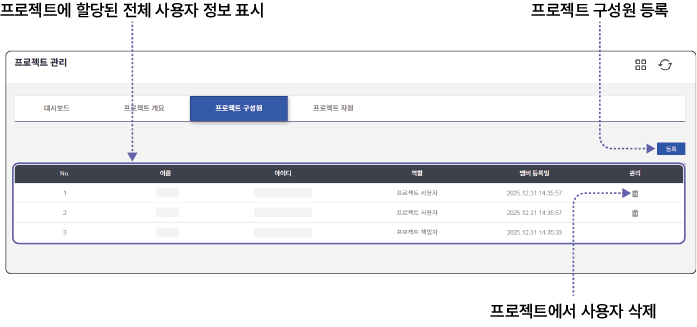

**구성원 추가**

프로젝트에 구성원을 추가할 수 있습니다.

>  **주의**
>
> - 프로젝트에 구성원 추가는 프로젝트 책임자만 할 수 있습니다.
> - 프로젝트 구성원 추가 시 프로젝트 책임자와 같은 소속(동일한 이메일 도메인 주소)만 조회할 수 있습니다. 다른 기관(타 도메인) 사용자를 프로젝트에 등록하려면 관리자 메일 (admin@bigdata-car.kr)로 문의하세요.

프로젝트에 구성원을 추가하려면 다음 순서대로 진행하세요.

1. 프로젝트 구성원 탭 페이지에서 **등록**을 클릭하세요.
2. 구성원 등록창이 나타나면 추가할 사용자를 조회하세요.
   - 이미 구성원으로 등록된 사용자는 조회되지 않습니다.

   

3. 조회 목록에서 체크박스를 클릭하고 **추가**를 클릭하세요.
4. 등록 목록에 선택한 사용자 정보가 표시되면 **생성**을 클릭하세요.
   - 등록 목록의 사용자 정보를 삭제하려면 **선택 삭제**를 클릭합니다.

선택한 사용자가 프로젝트 구성원 목록에 표시됩니다.

#### 프로젝트 자원 {#프로젝트-자원}

프로젝트에 할당된 컴퓨팅 자원 정보를 확인하고 자원 할당량(쿼터)를 변경 신청할 수 있습니다.

**프로젝트 쿼터 변경**

프로젝트에 할당되는 자원 쿼터를 변경할 수 있습니다.

> **주의**
>
> 프로젝트 쿼터 변경은 프로젝트 책임자만 신청할 수 있습니다.

프로젝트의 자원 쿼터를 변경하려면 다음 순서대로 진행하세요.

1. 프로젝트 자원 탭 페이지에서 쿼터 변경 요청의 을 클릭하세요.
2. 용량 변경 요청창이 나타나면 변경할 용량 항목을 선택하세요.
3. 변경 요청 사유 항목에 프로젝트 쿼터 추가 이유를 입력하고 **저장**을 클릭하세요.

   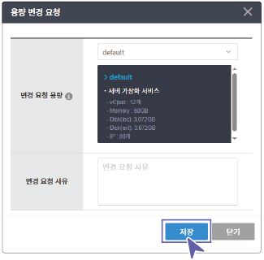

사용자의 쿼터 변경 신청 내역을 관리자가 검토한 후 승인합니다. 관리자 승인이 완료되면 변경된 쿼터가 프로젝트에 적용됩니다.

## 서버 생성 및 관리하기

서버 가상화 메뉴에서는 프로젝트에서 사용할 서버를 생성하고 관리할 수 있습니다.

### 화면 구성

사용자가 생성한 전체 서버 목록을 확인할 수 있습니다. 전체 서버 화면은 다음과 같이 구성됩니다.

| 번호 | 항목 | 설명 |
| --- | --- | --- |
| 1 | 새로고침 | 서버 목록을 새로고침합니다. |
| 2 | 검색창 | 서버명을 입력해 검색할 수 있습니다. |
| 3 | 서버 만들기 | 프로젝트에서 사용할 서버를 생성할 수 있습니다. |
| 4 | 서버 목록 | 등록된 전체 서버 목록을 확인할 수 있습니다.<ul><li>각 서버의 정보는 카드 형태로 표시되며, 서버 이름을 클릭하면 상세 페이지로 이동합니다.</li></ul> |

### 서버 생성하기 {#서버-생성하기}

서버를 생성하려면 다음 순서대로 진행하세요.

1. 클라우드 메인 페이지에서 **프로젝트**를 클릭하세요.
2. 프로젝트 목록에서 서버를 생성할 프로젝트를 선택하세요.
   - 프로젝트를 선택한 후에 왼쪽 메뉴에서 서버 가상화 메뉴를 선택할 수 있습니다.
3. **서버가상화** 메뉴에서 **서버 관리**를 클릭하세요.
4. 서버 관리 페이지에서 **서버 만들기**를 클릭하세요.

   

5. 서버 만들기 페이지에서 상세 항목을 입력하고 **서버 생성**을 클릭하세요.
   - [*]가 표시된 항목은 필수 입력 항목이므로 반드시 입력하세요.

- **서버 이름 지정**

   

- **OS 선택**

   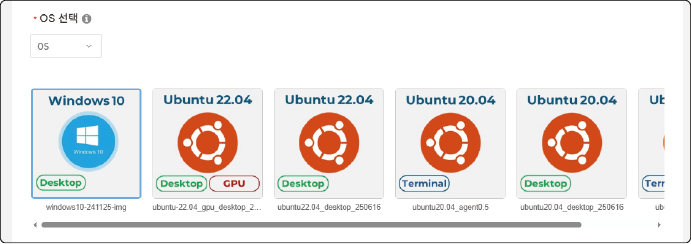  

  - **OS**: 운영체제(OS)를 선택할 수 있습니다.
  - **DevTools**: 개발과 관련된 OS를 선택합니다.
  - **Simulation**: 시뮬레이션 툴이 설치된 OS를 선택합니다.
    -  : 원격 데스크탑(GUI) 기반 접속 환경 제공
    -  : 터미널(CLI) 기반 접속 환경 제공
    -  : 웹 브라우저(Web) 기반 접속 환경 제공
    -  : GPU 드라이버가 설치된 환경 제공

>  **참고**
>
> GPU 드라이버는 사용자가 직접 설치할 수 있습니다.

- **사양 선택**

  서버 사양(Zone)을 선택한 후 서버의 하드웨어 사양을 설정합니다.

  

- **OS 디스크 설정**

  OS가 설치될 디스크의 크기를 설정합니다.

  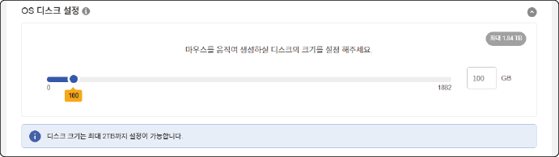

  -  OS 디스크는 윈도우의 C 드라이브에 해당합니다.
  -  최대 2 TB 이내에서 디스크 크기를 설정할 수 있습니다.

- **디스크 추가**

  추가 저장공간이 필요한 경우 디스크 크기를 설정합니다.

  

  -  추가 저장공간은 윈도우의 D 드라이브에 해당합니다.
  -  디스크 추가는 선택 사항으로 서버 사용 중 추가할 수 있습니다. 자세한 설명은 [디스크 생성하기](#디스크-생성하기)를 참고하세요.

- **서버 생성 정보**

  서버 생성 정보를 요약해서 표시합니다.

  

>  **참고**
>
> - 프로젝트 자원 계획에 여유가 있어도 서버 사양(Zone)의 여유 자원이 없으면 서버를 생성할 수 없습니다.
> - 사양 선택 시 프로젝트의 여유 자원에 따라 선택할 수 있는 항목이 제한됩니다. 여유 자원 이상의 사양은 항목이 비활성되어 선택할 수 없습니다.

### 서버 관리하기

서버 관리 페이지에서 사용자가 생성한 전체 서버 목록을 확인하고 관리할 수 있습니다.

#### 카드 정보 및 메뉴 설명 {#카드-정보-및-메뉴-설명}

서버 종류별로 카드에 표시되는 정보와 상세 메뉴를 설명합니다.

>  **참고**
>
> 선택한 서버의 OS 및 사양에 따라 사용할 수 있는 메뉴와 표시 항목이 달라집니다.

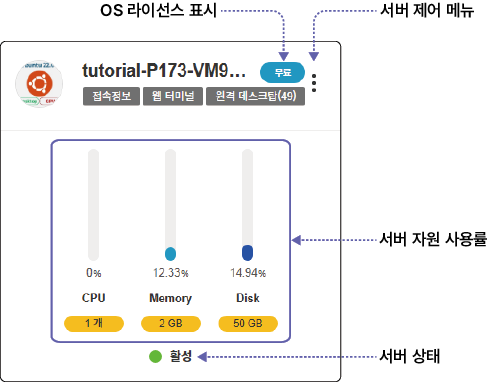

- **OS 라이선스 표시**
  - **Free**: 무료 사용 라이센스
  - **Paid**: 구매 후 제공되는 라이센스
  - **BYOL**: 사용자 보유 라이선스를 입력하여 사용

- **서버 제어 메뉴**
  를 클릭하면 선택한 서버의 제어 메뉴가 표시됩니다. ([서버 제어](#서버-제어) 참고)

- **접속 정보**
  서버 접속 정보가 표시됩니다. ([접속 정보 확인](#접속-정보-확인) 참고)

- **웹터미널**
  웹 기반 SSL 클라이언트로 서버에 접속합니다.([웹 터미널 접속](#웹-터미널-접속) 참고)

- **원격 데스크탑**
  원격 데스크탑에 접속합니다. ([원격 데스크탑 연결](#원격-데스크탑-연결) 참고)

- **서버 자원 사용률**
  프로젝트의 전체 쿼터에서 서버 자원 사용률을 표시합니다.

- **서버 상태**
  현재 서버 상태를 표시합니다.
  - **활성**: 서버가 정상 작동중입니다.
  - **비활성화**: 서버가 정지되고 자원이 회수된 상태입니다.
  - **정지**: 서버 작동이 정지된 상태입니다.
  - **미지원**: 모니터링 에이전트가 설치되지 않은 경우 표시됩니다.

#### 서버 제어 {#서버-제어}

카드 정보에서 를 클릭하면 서버 제어 메뉴를 사용할 수 있습니다.

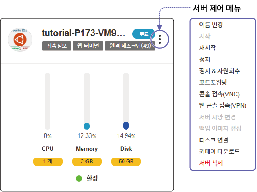

- **서버 제어 메뉴**
  - **이름 변경**: 서버 이름을 변경합니다.
  - **시작**: 정지된 서버를 부팅합니다.
  - **재시작**: 정지된 서버를 다시 작동시킵니다.
  - **정지**: 서버 작동을 정지합니다.
  - **정지 & 자원회수**: 서버 작동을 정지하고 서버에 할당된 자원을 회수해 비활성화합니다.
  - **정지 & 자원회수 해제**: 서버 작동을 시작하고 서버에 할당된 자원을 다시 사용합니다.
  - **포트포워딩**: 서버의 포트 포워딩을 설정합니다.
  - **콘솔 접속 (VNC)**: 가상 서버의 부팅 및 에러 등으로 접속이 제한될 경우 상태 확인을 위한 콘솔에 접속할 수 있습니다.
  - **웹 콘솔 접속 (VPN)**: 가상 서버의 관리를 위한 웹 콘솔 서비스에 접속할 수 있습니다. (VPN 연결 필요)
  - **서버 사양 변경**: 서버 자원 사양을 변경합니다. 서버가 정지된 상태에서만 사양을 변경할 수 있습니다.
  - **백업 이미지 생성**: 가상 서버의 현재 상태를 이미지 형태로 저장합니다. 저장된 이미지를 이용하여 현재 상태의 가상 서버를 생성할 수 있습니다. 서버가 정지된 상태에서만 백업 이미지를 생성할 수 있습니다. 자세한 설명은 [백업 이미지로 서버 생성하기](#백업-이미지로-서버-생성하기)를 참고하세요.
  - **디스크 연결**: 가상 서버에 새로운 저장 공간 및 기존 저장 공간을 연결할 수 있습니다.
  - **키페어 다운로드**: 가상 서버 접속 시 사용하는 보안 키를 다운로드할 수 있습니다.
  - **서버 삭제**: 선택한 서버를 삭제합니다. 삭제한 서버는 복구할 수 없습니다. 서버 삭제 전 백업 이미지를 생성하거나 필요한 데이터를 별도로 저장하세요.

### 서버 상세 정보

생성한 서버의 상세 정보를 확인하고 서버 이벤트나 시스템 로그 등을 확인할 수 있습니다.

#### 서버 상세 페이지 설명

서버 목록에서 카드 정보를 클릭하면 상세 페이지로 이동합니다.
서버 상세 페이지는 다음과 같이 구성됩니다.

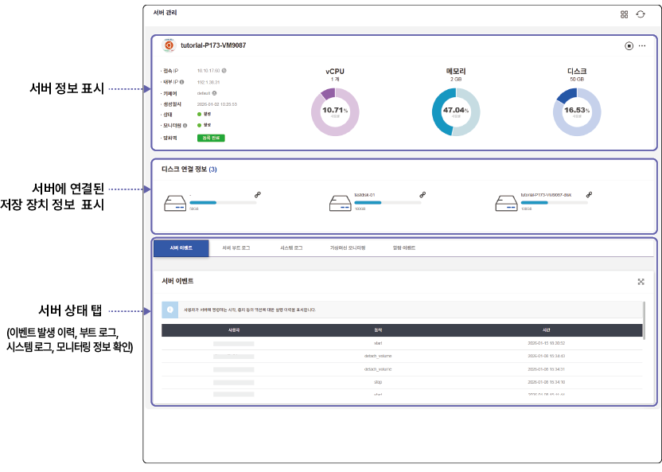

#### 서버 정보

서버의 상세 정보를 확인할 수 있습니다.

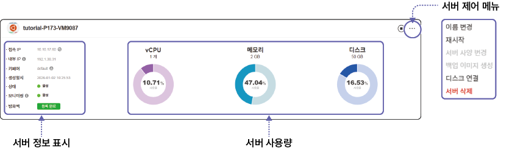

- **서버 정보**
  서버 정보를 표시합니다.
  - **접속 IP**: 서버의 접속 IP 정보를 표시합니다.
    - VPN에 접속하면 같은 네트워크에 포함됩니다.
  - **내부 IP**: 서버의 내부 IP 주소로 같은 프로젝트 내 가상 서버들이 통신할 때 사용합니다.
  - **키페어**: 를 클릭하면 서버의 개인키를 .pem 파일로 다운로드할 수 있습니다.
  - **생성일시**: 서버의 생성일시 정보를 표시합니다.
  - **상태**: 서버의 상태를 표시합니다. 서버가 작동 중일 경우 **활성**으로 표시되고, 정지 중일 경우 **정지**로 표시됩니다.
  - **모니터링**: 서버 자원의 사용 현황 모니터링 상태를 표시합니다.
  - **방화벽**: 방화벽에 서버 등록 여부를 표시합니다.
    - **등록 필요**를 클릭하면 자동으로 서버 IP 정보가 등록되며 **등록 완료**로 변경됩니다.

- **서버 사용량**
  서버의 현재 컴퓨팅 자원 사용률을 표시됩니다.

- **서버 제어**
  서버의 작동을 제어합니다.
  -  를 클릭하면 서버가 정지되고, 를 클릭하면 서버가 시작됩니다.
  -  를 클릭하면 추가 메뉴가 표시됩니다. 서버 제어 기능에 대한 자세한 설명은 [서버 제어](#서버-제어)를 참고하세요.

#### 디스크 연결 정보 {#디스크-연결-정보}

서버에 연결된 디스크 목록을 확인할 수 있습니다.

- 디스크를 연결하려면  > **디스크 연결**을 클릭하세요. 디스크 연결창에서 디스크를 선택해 연결할 수 있습니다.
-  > **연결해제**를 클릭하면 서버와 연결을 해제할 수 있습니다.
- 디스크를 신규 추가하려면 [디스크 생성하기](#디스크-생성하기)를 참고하세요.

  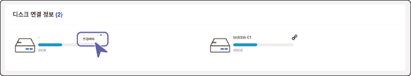

#### 서버 상태 탭

서버의 이벤트 발생 이력, 부트 로그, 시스템 로그, 모니터링 정보를 확인할 수 있습니다.

- **서버 이벤트**: 사용자가 서버에서 실행한 시작, 정지 등 액션 실행 이력을 표시합니다.

   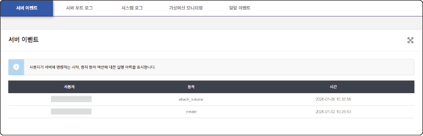

- **서버 부트 로그**: 서버가 시작될 때의 부팅 로그를 표시합니다.

   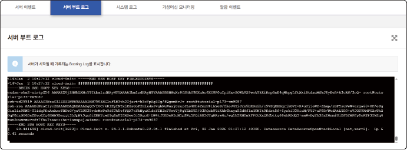

- **시스템 로그**: 서버의 시스템 로그를 표시합니다. 조회 범위를 선택해 로그를 검색할 수 있습니다.

   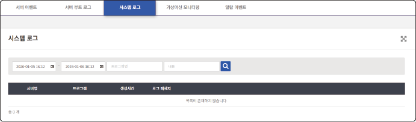

- **가상머신 모니터링**: 서버의 자원별 사용률을 그래프로 표시합니다. 조회 범위를 선택해 사용률을 조회할 수 있습니다.

   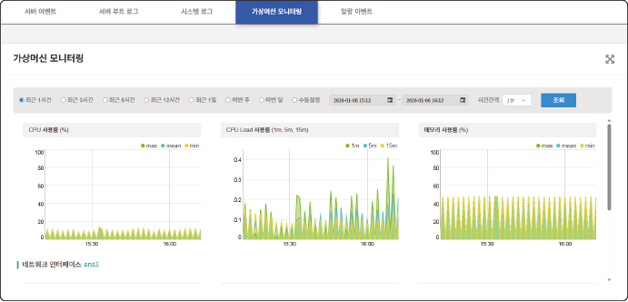

- **알람 이벤트**: 사전에 설정한 알람 이벤트를 조회할 수 있습니다.
  - 알람 설정은 상단 바의  > **알람 더보기+** > **알람설정** 페이지에서 할 수 있습니다.

  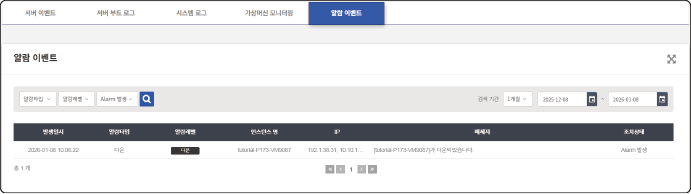

### 서버 접속하기

생성한 서버에 접속하는 방법을 설명합니다. 서버에는 다음 방법으로 접속할 수 있습니다.

| 항목 | VPN 접속 | 프로그램 설치 | 키파일 활용 |
| --- | --- | --- | --- |
| SSH Web 접속 (클라이언트) | ○ | ✗ | ✗ |
| SSH Web 접속 (웹 브라우저) | ✗ | ✗ | ✗ |

#### 접속 정보 확인 {#접속-정보-확인}

카드 정보의 **접속 정보**를 클릭하면 서버의 접속 정보를 확인할 수 있습니다.

- **접속 프로토콜**: 접속 프로토콜 방식을 표시합니다.
- **접속 IP**: 서버의 외부/내부 IP가 표시됩니다.
- **접속 계정**: 접속 계정 정보가 표시됩니다.
- **SSH 비밀번호**: **Reset**을 클릭해 초기 비밀번호를 변경할 수 있습니다.
- **접속 인증 키(KEY)**: 를 클릭해 키페어를 다운로드할 수 있습니다. 키페어는 서버에 접속할 때 사용하는 인증키를 말합니다.
- **접속 방법 가이드**: 서버에 접속하는 상세 절차를 확인할 수 있습니다.
- **AGENT 설치 가이드**: 모니터링 에이전트 프로그램 다운로드 및 설치 절차를 확인할 수 있습니다.
  - 모니터링 에이전트가 설치되지 않으면 서버 사용량 모니터링이 실행되지 않습니다.

#### 키페어 사용

카드 정보에서  > **키페어 다운로드**를 클릭하면 키페어를 다운로드할 수 있습니다. 키페어는 서버에 접속할 때 사용하는 인증키로 SSH 프로그램을 설치해 가상 서버에 접속할 때 사용자 인증에 사용합니다.

  - **서버 > 접속 정보 > 접속 인증 키(KEY)** 항목이나 서버 상세 페이지의 **키페어**에서도 pem 파일을 다운로드할 수 있습니다.

#### 콘솔 (VNC) 접속

카드 정보에서  > **콘솔 (VNC) 접속**을 클릭하면 가상 콘솔에 접속할 수 있습니다. 가상 콘솔은 OS 부팅 단계 및 에러 발생 시 이력 확인을 위해 사용됩니다.

#### 웹 콘솔 (VPN) 접속 {#웹-콘솔-vpn-접속}

카드 정보에서  > **웹 콘솔 (VPN) 접속**을 클릭하면 웹 콘솔에 접속할 수 있습니다. 서버의 웹 기반 환경에 접속해 시스템 로그, 서비스, 네트워크, 스토리지, 사용자 관리를 할 수 있습니다.

  - 웹 콘솔 접속 시 입력하는 로그인 정보는 가상 서버 로그인 정보와 동일합니다.

    

#### 웹 터미널 접속 {#웹-터미널-접속}

카드 정보의 **웹 터미널**을 클릭하면 서버의 접속 정보를 확인해 웹 터미널로 접속할 수 있습니다.

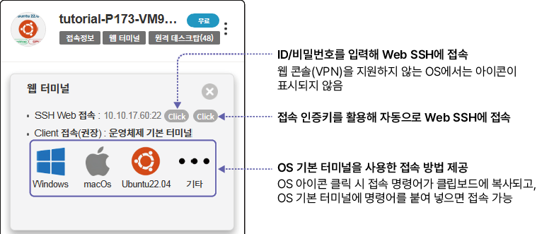

**웹 터미널 화면 설명**

서버에 접속되면 웹 터미널 화면이 나타납니다. 웹 터미널 화면은 다음과 같이 구성됩니다.

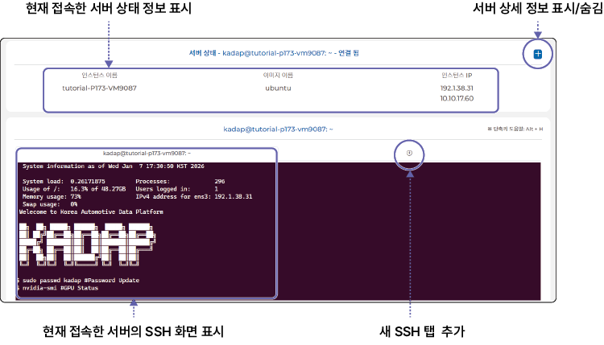

>  **참고**
>
> 웹 기반 SSL을 사용해 접속하는 경우 접속 안전성이 낮습니다. 이는 웹 기반 서비스의 일반적인 특성으로 웹 터미널 접속은 간단한 작업을 진행하는 경우에만 이용하는 것을 권장합니다.

#### 원격 데스크탑 연결 {#원격-데스크탑-연결}

카드 정보의 **원격 데스크탑**을 클릭하면 클라우드에 생성한 서버에 원격 데스크탑(GUI) 형태로 접속할 수 있습니다.

>  **참고**
>
> - 원격 데스크탑은 Amazon DCV 라이선스를 사용합니다. Amazon DCV는 고성능 원격 디스플레이 프로토콜로 클라우드에서 모든 장치로 원격 데스크톱이나 애플리케이션 스트리밍을 사용할 수 있습니다.
> - 원격 데스크탑 잔여 수량이 0으로 표시된다면 보유 라이선스가 모두 사용중인 상태이므로 원격 데스크탑 기능을 사용할 수 없습니다.

원격 데스크탑에 연결하려면 다음 순서대로 진행하세요.

1. 원격 데스크탑 접속창의 토글 버튼을 **ON**으로 변경하세요.
   - SSH 웹 접속 IP와 포트 정보를 확인할 수 있습니다.
2. 접속 접보창에서 Web 접속 항목의 **Click** 또는 Client 접속 항목의 **Click**을 클릭해 접속하세요.

   

- **클라이언트 접속**

  **Windows**, **macOs**, **ubuntu**를 클릭하면 각 OS별로 원격 데스크탑 접속 (DCV 뷰어) 프로그램이 자동으로 다운로드됩니다. **기타**를 클릭하면 다양한 OS별 최신 접속 프로그램을 다운로드할 수 있습니다.
  - 프로그램을 실행해 원격 데스크탑에 클라이언으로 접속할 수 있습니다.

>  **참고**
>
> 원격 데스크탑을 **ON**으로 설정한 후 1시간 동안 사용량이 없으면 **OFF**로 자동 변경됩니다. OFF 상태에서는 원격 데스크탑과 연결은 종료되지만 가상 서버는 종료되지 않습니다.
> - 다시 원격 데스크탑을 사용하려면 **ON**으로 변경한 후 접속해 사용하세요.

### 서버 백업하기

서버가 정지된 상태에서 현재 서버 설정을 스냅샷 이미지로 저장해 백업할 수 있습니다.

현재 사용중인 서버를 백업하려면 다음 순서대로 진행하세요.

1. 전체 서버 목록에서 백업할 서버 항목의  > **정지**를 클릭하세요.
   - 서버 상세 페이지 상단의 을 클릭해도 서버를 정지할 수 있습니다.
   - 서버가 정지 상태가 아닌 경우 백업 이미지 생성 메뉴는 비활성화됩니다.
2. 서버가 정지되면  > **백업 이미지 생성**을 클릭하세요.
3. 백업 이미지 생성창이 나타나면 백업 이미지 이름과 설명을 입력하고 **생성**을 클릭하세요.
   - 생성한 백업 이미지는 **서버가상화** > **백업 이미지 관리** > **서버 백업 이미지** 탭에 추가됩니다.

   

## 디스크 생성 및 관리하기

서버에 연결해 작업 데이터를 저장하는 가상 디스크를 생성할 수 있습니다. 하나의 서버에 여러 개의 가상 디스크를 연결해 관리할 수 있습니다.

### 화면 구성 {#화면-구성}

사용자가 생성한 전체 디스크 목록을 확인할 수 있습니다. 전체 디스크 화면은 다음과 같이 구성됩니다.

| 번호 | 항목 | 설명 |
| --- | --- | --- |
| 1 | 새로고침 | 디스크 목록을 새로고침합니다. |
| 2 | 검색창 | 디스크명을 입력해 검색할 수 있습니다. |
| 3 | 디스크 만들기 | 프로젝트에서 사용할 디스크를 생성할 수 있습니다. |
| 4 | 디스크 목록 | 등록된 전체 디스크 목록을 확인할 수 있습니다.<ul><li>각 디스크의 정보는 카드 형태로 표시됩니다.</li></ul> |

### 디스크 생성하기 {#디스크-생성하기}

디스크를 생성하려면 다음 순서대로 진행하세요.

1. 클라우드 메인 페이지에서 **프로젝트**를 클릭하세요.
2. 프로젝트 목록에서 디스크를 생성할 프로젝트를 선택하세요.
   - 프로젝트를 선택해야 왼쪽 메뉴에서 서버 가상화를 선택할 수 있습니다.
3. 서버가상화 메뉴에서 **디스크 관리**를 클릭하세요.
4. 디스크 관리 페이지에서 **디스크 만들기**를 클릭하세요.

   

5. 디스크 만들기 페이지에서 상세 항목을 입력하고 **디스크 만들기**를 클릭하세요.
   - [*]가 표시된 항목은 필수 입력 항목이므로 반드시 입력하세요.

- **디스크 이름**
  사용할 디스크 이름을 지정합니다.
  - disk - 00 조합으로 자동 입력됩니다. 필요 시 사용자가 원하는 이름을 입력할 수 있습니다.
 
  

- **디스크 크기**
  생성할 저장 공간 크기를 설정합니다.
  - 프로젝트 사용 가능 디스크 정보에서 사용중인 공간과 남은 공간을 확인할 수 있습니다. 남은 공간 내에서 디스크 크기를 입력합니다.
  - 최대 2 TB 이내에서 디스크 크기를 설정할 수 있습니다.

  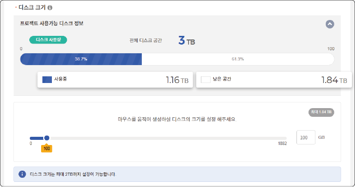

- **가상 서버와 연결**
  생성한 디스크와 연결할 서버를 목록에서 선택합니다.

  

- **디스크 생성 정보**
  디스크 생성 정보와 연결 서버 정보를 요약해서 표시합니다.

  

### 디스크 관리하기

디스크 관리 페이지에서 사용자가 생성한 전체 디스크 목록을 확인하고 관리할 수 있습니다.

#### 디스크 상세 정보 및 메뉴 설명

디스크 목록에 표시되는 정보와 제어 메뉴를 설명합니다.

>  **참고**
>
> 디스크는 카드 정보 외에 별도의 상세 정보 페이지가 없습니다.

- **디스크 제어 메뉴**
  디스크 제어 메뉴를 표시합니다.
  - **백업 이미지 생성**: 현재 디스크 설정을 백업 이미지로 저장할 수 있습니다.
  - **디스크 이름 변경**: 디스크 이름을 변경할 수 있습니다.
  - **디스크 크기 변경**: 디스크 용량을 변경할 수 있습니다. 디스크가 서버에 연결되지 않은 상태에만 용량 변경이 가능합니다.
  - **디스크 삭제**: 사용가능 상태의 디스크를 삭제할 수 있습니다.
    - 디스크와 서버의 연결이 해제된 경우에만 삭제할 수 있습니다. 디스크 연결 해제에 대한 자세한 설명은 [디스크 연결 정보](#디스크-연결-정보)를 참고하세요.
    - 삭제한 디스크는 복구할 수 없습니다. 디스크 삭제 전 백업 이미지를 생성하거나 필요한 데이터를 별도로 저장하세요.

### 디스크 연결하기

생성한 디스크를 서버에 연결해 사용할 수 있습니다.

디스크를 연결하려면 다음 순서대로 진행하세요.

1. 서버 상세 페이지에서  > **디스크 연결**을 클릭하세요.
2. 디스크 연결창이 나타나면 연결할 디스크를 선택하고 **연결**을 클릭하세요.
   - 서버에 디스크가 연결되면 해당 디스크 정보가 **서버 상세 페이지** > **디스크 연결 정보**에 표시되며, 디스크 목록의 디스크 정보에는 연결 서버 정보가 표시됩니다.

   

### 디스크 백업하기 {#디스크-백업하기}

현재 디스크 설정을 스냅샷 이미지로 저장해 백업할 수 있습니다.

디스크를 백업하려면 다음 순서대로 진행하세요.

1. 전체 디스크 목록에서 백업할 디스크 항목의  > **백업 이미지 생성**을 선택하세요.
2. 백업 이미지 생성창이 나타나면 백업 이미지 이름과 설명을 입력하고 **생성**을 클릭하세요.
   - 생성한 백업 이미지는 **서버가상화** > **백업 이미지 관리** > **디스크 백업 이미지** 탭에 추가됩니다.

   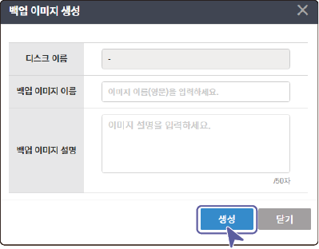

## 백업 이미지 관리하기

생성한 서버와 디스크의 백업 이미지를 생성하고, 백업 이미지로 서버나 디스크를 빠르게 생성해 사용할 수 있습니다.

### 화면 구성

사용자가 저장한 백업 이미지 목록을 확인할 수 있습니다. 백업 이미지 화면은 다음과 같이 구성됩니다.

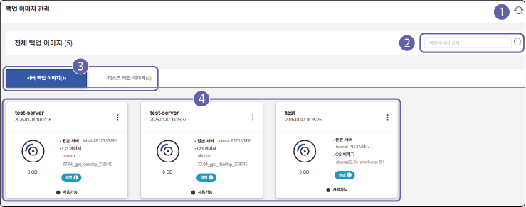

| 번호 | 항목 | 설명 |
| --- | --- | --- |
| 1 | 새로고침 | 백업 이미지 목록을 새로고침합니다. |
| 2 | 검색창 | 백업 이미지명을 입력해 검색할 수 있습니다. |
| 3 | 백업 이미지 선택 탭 | 저장한 서버 또는 디스크 백업 이미지를 확인할 수 있습니다. |
| 4 | 백업 이미지 목록 | 등록된 전체 백업 이미지 목록을 확인할 수 있습니다.<ul><li>각 백업 이미지 정보는 카드 형태로 표시됩니다.</li></ul> |

### 백업 이미지 상세 정보 및 메뉴 설명

백업 이미지 목록에 표시되는 정보와 제어 메뉴를 설명합니다.

백업 이미지 정보를 확인하려면 다음 순서대로 진행하세요.

1. 클라우드 메인 페이지에서 **프로젝트**를 클릭하세요.
2. 프로젝트 목록에서 백업 이미지를 확인할 프로젝트를 선택하세요.
3. 서버가상화 메뉴에서 **백업 이미지 관리**를 클릭하세요.
4. 전체 백업 이미지 목록에서 원하는 백업 이미지 탭을 클릭하세요.
5. 백업 이미지 목록에서 원하는 항목의 정보를 확인하세요.
   - **서버 백업 이미지**
      - **서버 생성**: 백업 이미지로 기존 설정과 동일한 서버를 생성할 수 있습니다.
      - **이미지 삭제**: 백업 이미지를 삭제할 수 있습니다.

   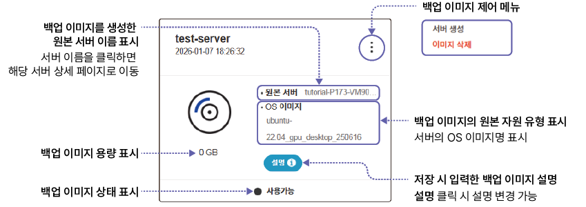

   - **디스크 백업 이미지**
      - **디스크 생성**: 백업 이미지로 기존 설정과 동일한 디스크를 생성할 수 있습니다.
      - **이미지 삭제**: 백업 이미지를 삭제할 수 있습니다.

   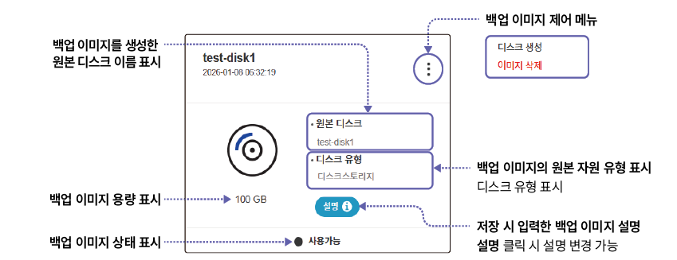

### 백업 이미지로 서버 생성하기 {#백업-이미지로-서버-생성하기}

저장한 백업 이미지로 서버를 생성하려면 다음 순서대로 진행하세요.

1. 전체 백업 이미지 목록에서 **서버 백업 이미지** 탭을 클릭하세요.
2. 서버 백업 이미지 목록에서 생성할 서버 항목의  > **서버 생성**을 클릭하세요.
   - 백업 이미지로부터 신규 서버 만들기 페이지로 이동합니다.
3. 백업 이미지로부터 신규 서버 만들기 페이지에서 필수 항목을 입력한 후 **서버 생성**을 클릭하세요.
   - 서버 생성 항목에 대한 자세한 설명은 [서버 생성하기](#서버-생성하기)를 참고하세요.

    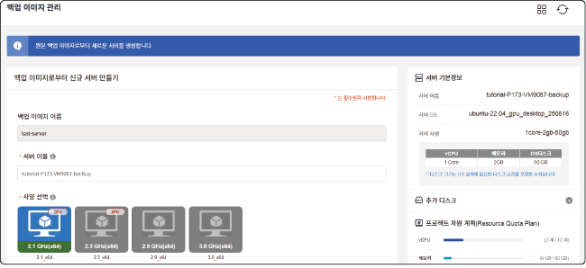

### 백업 이미지로 디스크 생성하기

저장한 백업 이미지로 디스크를 생성하려면 다음 순서대로 진행하세요.

1. 전체 백업 이미지 목록에서 **디스크 백업 이미지** 탭을 클릭하세요.
2. 디스크 백업 이미지 목록에서 생성할 디스크 항목의  > **디스크 생성**을 클릭하세요.
   - 백업 이미지로부터 신규 디스크 만들기 페이지로 이동합니다.
3. 백업 이미지로부터 신규 디스크 만들기 페이지에서 필수 항목을 입력한 후 **디스크 만들기**를 클릭하세요.
   - 디스크 생성 항목에 대한 자세한 설명은 [디스크 생성하기](#디스크-생성하기)를 참고하세요.

   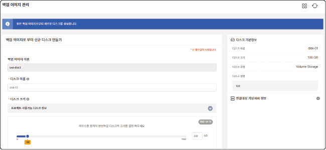

## 포트 포워딩하기 {#포트-포워딩하기}

외부 네트워크의 사용자가 정해진 포트를 통해 서버에 접속할 수 있도록 포트 포워딩을 설정할 수 있습니다. 서버에서 외부 사용자나 클라이언트에게 제공할 서비스나 웹 애플리케이션 등을 개발한 경우 특정 포트를 지정해 외부 접속이 가능하도록 설정할 수 있습니다.

> **주의** 
>
> 포트 포워딩을 설정해 VPN 접속 없이 서버에 접속하면 보안상 위험할 수 있습니다. 포트 포워딩은 반드시 필요한 경우에만 사용하세요.

### 화면 구성

등록한 포트 포워딩 목록을 확인할 수 있습니다. 포트 포워딩 화면은 다음과 같이 구성됩니다.

| 번호 | 항목 | 설명 |
| --- | --- | --- |
| 1 | 새로고침 | 포트 포워딩 목록을 새로고침합니다. |
| 2 | 포트 추가 | 가상 서버(인스턴스)에 포트 포워딩 정보를 설정할 수 있습니다.<ul><li>포트 포워딩 추가에 대한 자세한 설명은 [포트 추가하기](#포트-추가하기)를 참고하세요.</li></ul> |
| 3 | 검색창 | 서버명이나 프로젝트명을 입력해 검색할 수 있습니다. |
| 4 | 포트 목록 | 등록된 전체 포트 포워딩 목록을 확인할 수 있습니다.<ul><li>삭제할 항목의 를 클릭하면 포트 포워딩을 삭제할 수 있습니다. <ul><li>또는 삭제할 항목의 체크 박스를 선택하고 **선택항목 삭제**를 클릭해도 포트 포워딩을 삭제할 수 있습니다.</li></ul></li></ul> |

### 포트 추가하기 {#포트-추가하기}

특정 서버에 포트 포워딩을 설정하려면 다음 순서대로 진행하세요.

1. 클라우드 메인 페이지에서 **프로젝트**를 클릭하세요.
2. 프로젝트 목록에서 원하는 프로젝트를 선택하세요.
3. 서버가상화 메뉴에서 **포트 포워딩**을 클릭하세요.
4. 포트 포워딩 페이지에서 포트 추가 항목을 설정하고 **추가**를 클릭하세요.

   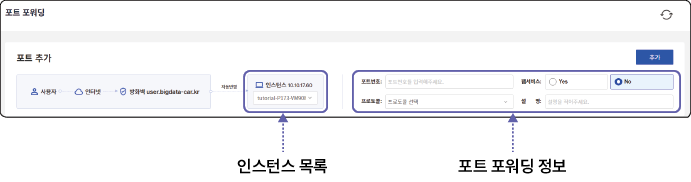

   - **인스턴스 목록**
      포트 포워딩을 설정할 가상 서버(인스턴스)를 선택합니다.

   - **포트 포워딩 정보**
      포트 포워딩 상세 정보를 설정합니다.
      - **포트번호**: 포트 포워딩에 사용할 포트 번호를 입력합니다.
      - **웹서비스**: 해당 포트를 웹 서비스용으로 사용할 지 설정합니다. 웹 서비스를 사용하려면 **YES**를 선택합니다. YES를 선택하면 통신 프로토콜이 **TCP + SSL**로 자동 지정됩니다. 이 프로토콜을 이용해 보안이 강화된 HTTP/HTTPS 기반 웹 트래픽 서비스를 제공할 수 있습니다.
      - **프로토콜**: 해당 포트에서 사용할 통신 프로토콜(TCP/UDP)를 선택합니다.
      - **설명**: 포트 포워딩의 설명을 입력합니다.
5. 포트 추가 확인창이 나타나면 **예**를 클릭하세요.
6. 포트 추가 완료창이 나타나면 **확인**을 클릭하세요.

## 서버 스토리지 연결하기­

서버 스토리지는 스토리지 전용 프로그램을 설치한 후 서버에 연결해 사용할 수 있습니다.

>  **웹매뉴얼**
>
> 자세한 등록 절차는 웹 매뉴얼을 참고하세요.
> - 자동차 데이터 플랫폼(KADaP)의  > **매뉴얼** > **문서** > **자동차 산업 클라우드** > **대용량 데이터 저장(S3)**
