# 데이터 교환 시스템 KADaP EXCHANGE

제조 설비 데이터 및 차량의 CAN 데이터를 수집해 전처리하고 각 수집 장치를 프로젝트로 구성해 편리하게 관리할 수 있습니다. 또한, 수집된 데이터를 표준화하고 기업 간에 안전하게 교환할 수 있는 환경을 제공합니다.

# 데이터 교환 시스템 소개

데이터 교환 시스템은 Gaia-X 규정을 준수하여 기업간 데이터 교환 환경을 조성하는 데이터 스페이스입니다. 기업이 데이터를 공유한 후에도 스스로 통제할 수 있도록 데이터 주권을 보호하며 탈중앙화된 연합형 네트워크를 통해 높은 보안성과 신뢰를 바탕으로 한 최적의 공유 환경을 제공합니다.

또한, 표준화 기술인 AAS(Asset Administration Shell)를 적용해 국내 기업은 물론 EU의 Catena-X 참여 기업과도 자유롭게 데이터를 교환할 수 있습니다. 이를 통해 다양한 데이터를 표준화된 포맷으로 교환할 수 있어, 국제 탄소 규제 및 자동차 공급망 규제에 효과적으로 대응할 수 있습니다.

이 시스템은 데이터 수집 시스템(IoT), 데이터 교환 시스템(Edge), 데이터 교환 시스템 포털의 세 가지 요소로 구성됩니다. 데이터 수집 및 전처리, 계약 관리 및 구독까지 사용자 편의를 위해 각각의 사이트를 별도로 제공합니다. 사용자는 AAS 표준 기반의 시맨틱 모델 등록, 기업 등록(온보딩), LCA·DPP·BOM 데이터 교환 등 복잡한 업무를 표준화된 방식으로 쉽게 사용할 수 있습니다.

## 서비스 구성

데이터 교환 시스템의 전체 서비스 구성은 다음과 같습니다.

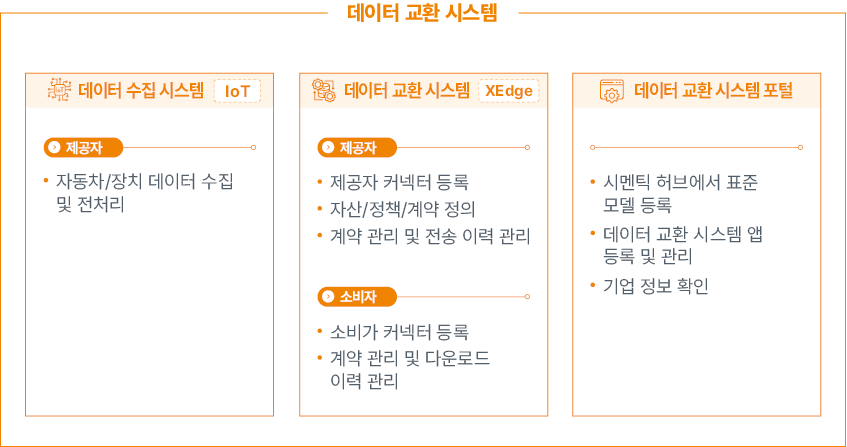

## 주요 기능과 특징

데이터 교환 시스템이 제공하는 주요 기능과 특징은 다음과 같습니다.

- **데이터 수집 시스템(KADaP-X IoT)에서는 자동차 CAN 데이터 및 설비 데이터를 실시간으로 수집하고 전처리 실행**
  - 데이터를 수집하는 장치를 실시간으로 확인하고 제어할 수 있습니다.
  - 수집된 로우 데이터에 전처리 모델을 적용해 AAS 표준 기술에 맞는 데이터로 저장합니다.
- **데이터 교환 시스템(KADaP-X Edge)에서는 데이터 자산과 계약 및 정책 정의, 계약 적용 후 데이터 공유 실행**
  - 데이터 공유를 위해 제공자/소비자 역할에 따라 편리하게 커넥터를 생성하고 관리할 수 있습니다.
  - 제공자의 경우 계약을 등록하기 위해 필요한 자산, 정책, 계약 정의를 쉽게 생성할 수 있습니다. 계약이 완료되면 계약 상세 정보와 전송 이력을 확인할 수 있습니다.
  - 소비자의 경우 제공자 카탈로그를 조회해 계약을 구독하고 데이터를 다운로드할 수 있습니다.
  - 디지털 트윈의 레지스트리로 디지털 자산 정보를 확인하고 데이터 적용 정책을 조회할 수 있습니다. 또한, 제공자가 보유하고 있는 데이터에 AAS 표준 기술을 적용해 다양한 데이터를 교환할 수 있습니다.
  - 제품 탄소 발자국 (PCF, Product Carbon Footprint) 정보가 필요한 데이터의 경우, PCF 데이터를 편리하게 등록해 전달할 수 있습니다.
- **데이터 교환 시스템(KADaP-X) 포털에서는 앱 공유를 위한 포털로 구독 앱 및 기업 정보 조회, 시맨틱 모델 등록 및 관리 가능**
  - 앱 제공자는 앱 마켓 플레이스에 출시할 앱을 등록하고 관리할 수 있습니다.
  - 사용자는 현재 구독하고 있는 앱이나 서비스 상세 정보를 확인할 수 있습니다.
  - 앱 구독 시 적용되는 시맨틱 모델을 검색하거나 추가하고, 기업 정보를 조회할 수 있습니다.

데이터 교환 시스템을 사용하려면 다음 순서를 참고해 진행하세요.

- **데이터 수집 시스템(IoT)**

  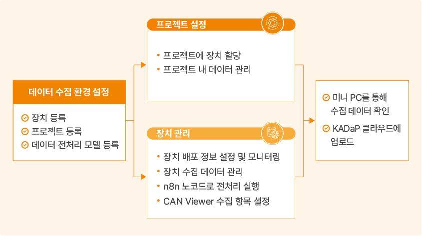

- **데이터 교환 시스템(Edge)**

  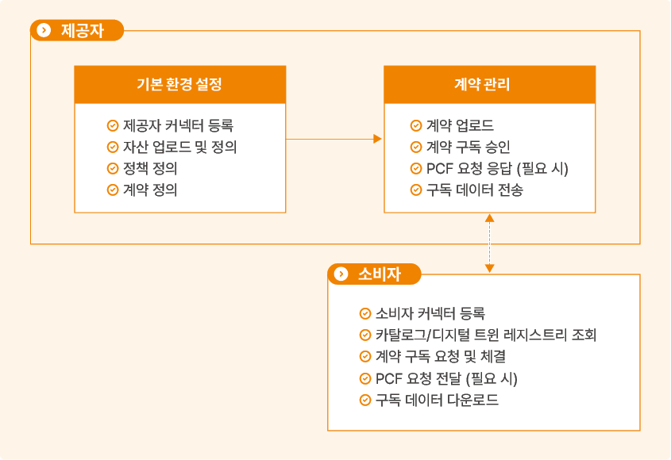

# 데이터 교환 시스템 접속

데이터 교환 시스템은 자동차데이터플랫폼(KADaP)에 등록한 기관 사용자만 사용할 수 있으며, 자동차데이터플랫폼(KADaP) 포털에 가입된 회원 정보로 로그인해 접속합니다.

>  **참고**
>
> 데이터 교환 시스템은 KADaP-X에 등록된 기업만 사용할 수 있습니다. 기업 등록(온보딩)에 대한 자세한 내용은 관리자 메일(admin@bigdata-car.kr)로 문의하세요.
> - 기업 등록 시 데이터 교환 시스템의 제공자 또는 소비자 중 역할을 선택할 수 있습니다.

## 데이터 교환 시스템 포털 접속하기

데이터 교환 시스템 포털 서비스에 접속하려면 다음 순서대로 진행하세요.

1. **자동차 데이터 플랫폼**([www.bigdata-car.kr](https://www.bigdata-car.kr))의 **로그인**을 클릭하세요.
2. 자동차데이터플랫폼에 로그인하세요.
   - 회원 가입과 로그인 방법은 [회원 가입하기](KADaP_UserManual_Frontmatter.md#회원-가입하기)와 [로그인하기](KADaP_UserManual_Frontmatter.md#로그인하기)를 참고하세요.
3. 자동차 데이터 플랫폼 화면에서  > **데이터 서비스** > **데이터 교환 시스템**을 클릭하세요.

   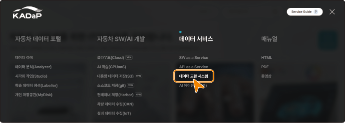

>  **바로가기**
>
> 다음의 경로로 바로 접속할 수 있습니다.
> - **데이터 교환 시스템 포털**: [exchange.bigdata-car.kr](https://exchange.bigdata-car.kr)
4. 회사 선택 화면이 나타나면 등록한 회사를 선택하세요.
   - 데이터 교환 시스템 포털 홈으로 이동해 앱 정보 및 기업 정보를 조회할 수 있습니다.

## 데이터 수집 시스템 IoT 접속하기

데이터 수집 시스템 IoT 서비스에 접속하려면 다음 순서대로 진행하세요.

1. **자동차 데이터 플랫폼**([www.bigdata-car.kr](https://www.bigdata-car.kr))의 **로그인**을 클릭하세요.
2. 자동차데이터플랫폼에 로그인하세요.
  - 회원가입과 로그인 방법은 [회원 가입하기](KADaP_UserManual_Frontmatter.md#회원-가입하기)와 [로그인하기](KADaP_UserManual_Frontmatter.md#로그인하기)를 참고하세요.
3. 자동차 데이터 플랫폼 화면에서 **데이터 수집 및 교환** > **데이터 수집 시스템**을 클릭하세요.

   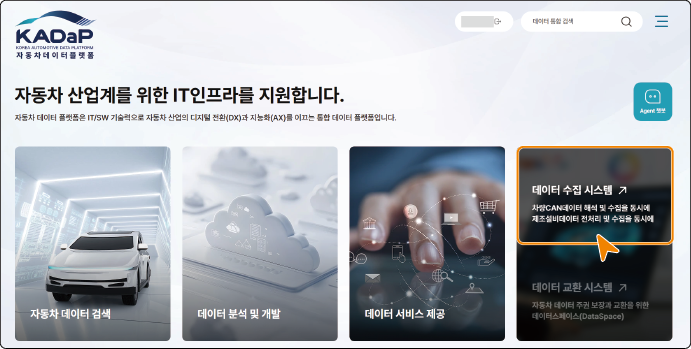

>  **바로가기**
>
> 다음의 경로로 바로 접속할 수 있습니다.
> - **데이터 수집 시스템(IoT)**: [iot3.bigdata-car.kr](https://iot3.bigdata-car.kr)
4. 회사 선택 화면이 나타나면 등록한 회사를 선택하세요.
   - 데이터 수집 시스템 홈으로 이동해 데이터 수집을 위한 장치 및 프로젝트 관리를 할 수 있습니다.

## 데이터 교환 시스템 Edge 접속하기

데이터 교환 시스템 Edge 서비스에 접속하려면 다음 순서대로 진행하세요.

1. **자동차 데이터 플랫폼**([www.bigdata-car.kr](https://www.bigdata-car.kr))의 **로그인**을 클릭하세요.
2. 자동차데이터플랫폼에 로그인하세요.
   - 회원가입과 로그인 방법은 [회원 가입하기](KADaP_UserManual_Frontmatter.md#회원-가입하기)와 [로그인하기](KADaP_UserManual_Frontmatter.md#로그인하기)를 참고하세요.
3. 자동차 데이터 플랫폼 화면에서 **데이터 수집 및 교환** > **데이터 교환 시스템**을 클릭하세요.

   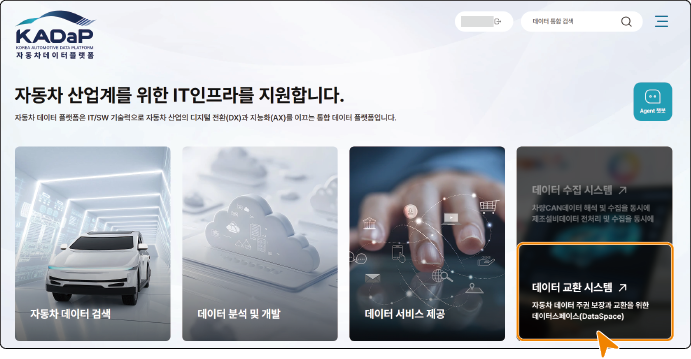

>  **바로가기**
>
> 다음의 경로로 바로 접속할 수 있습니다.
> - **데이터 교환 시스템(Edge)**: [exchange-edge2.bigdata-car.kr](https://exchange-edge2.bigdata-car.kr)
4. 회사 선택 화면이 나타나면 등록한 회사를 선택하세요.
   - 데이터 교환 시스템 홈으로 이동해 커넥터 및 공유 자산을 등록하고 관리할 수 있습니다.

# 데이터 교환 시스템 포털

일반 사용자는 마켓 플레이스에서 앱을 구독할 수 있으며, 구독 신청한 앱 정보와 자동차데이터플랫폼(KADaP)에 등록된 기업 정보를 조회할 수 있습니다. 서비스 제공자인 경우 마켓 플레이스에 앱 등록 및 데이터 서비스를 등록하고 관리할 수 있습니다.

>  **참고**
>
> 데이터 교환 시스템 포털에는 기관 회원 중 기업 정보 등록이 완료된 사용자만 접속할 수 있습니다.
> - 포털에 접속이 가능한 사용자만 데이터 수집 시스템(IoT)이나 데이터 교환 시스템(Edge)을 사용할 수 있습니다.

## 홈 화면 구성

데이터 교환 시스템 포털의 홈 화면은 다음과 같이 구성됩니다. 각 항목별 기능을 설명합니다.

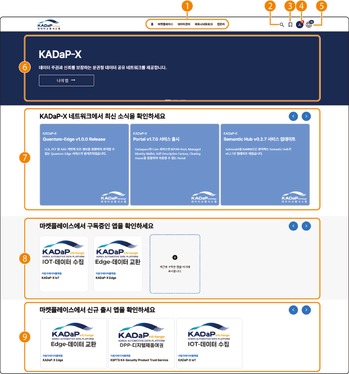

| 번호 | 항목 | 설명 |
| --- | --- | --- |
| 1 | 데이터 교환 시스템 포털 메인 메뉴 | 데이터 교환 시스템 포털의 메뉴를 선택합니다.<ul><li>**홈**: 데이터 교환 시스템의 홈 화면으로 이동합니다.</li><li>**마켓 플레이스**: 포털에 등록된 앱의 상세 정보를 확인하고 구독 신청을 할 수 있습니다.</li><li>**데이터 관리**: 데이터 제공자에게 시맨틱 모델을 제공하고, 필요한 경우 등록 신청할 수 있습니다.</li><li>**파트너 네트워크**: 포털에 등록된 회사 정보를 조회할 수 있습니다.</li><li>**앱 관리**: 회사 관리자인 경우 앱을 등록하고 관리할 수 있습니다.</li></ul>|
| 2 | 통합 검색 | 데이터 교환 시스템 포털의 정보를 검색할 수 있습니다. |
| 3 | 즐겨찾기 | 사용자가 구독하는 앱 중 즐겨찾기가 설정된 앱 목록이 표시됩니다. |
| 4 | 내 정보 | 로그인한 사용자 정보를 확인하고 알림을 확인할 수 있습니다.<ul><li>내 정보의 상세 메뉴는 사용자 권한에 따라 달라집니다. 관리자가 사용할 수 있는 메뉴에 대한 자세한 설명은 [내 정보 설정하기](#내-정보-설정하기)를 참고하세요.</li><li>**나의 계정**: 포털에 등록된 내 계정 정보를 확인할 수 있습니다.<ul><li>**TOKEN을 클립보드로 복사**: 사용자 계정의 토큰 데이터를 복사합니다. 사용자 토큰은 사용자 인증 시 적용할 수 있습니다.</li><li>**사용자 삭제**: 내 정보를 삭제합니다.사용자 삭제는 관리자 승인 후 적용됩니다.</li></ul><li>**나의 조직**: 사용자가 소속된 회사 정보 및 앱 구독 목록을 확인할 수 있습니다.</li><li>**알림**: 포털 공지사항이나 사용자 알림을 확인할 수 있습니다.</li><li>**로그아웃**: 사용자 계정에서 로그아웃합니다.</li></ul>|
| 5 | 언어 설정 | 데이터 교환 시스템 포털의 표시 언어를 국문/영문 중에서 설정할 수 있습니다. |
| 6 | 바로가기 | 데이터 교환 시스템 포털에서 가장 많이 사용하는 메뉴의 바로가기를 제공합니다.<ul><li>**나의 앱**: 로그인한 사용자의 조직 정보와 앱 구독 목록을 확인할 수 있는 나의 조직 화면으로 이동합니다.</li><li>**마켓 플레이스**: 앱 마켓 플레이스 화면으로 이동합니다.</li><li>**포털 사용자 관리**: 회사 관리자인 경우 포털 사용자 관리 화면으로 이동합니다.</li></ul>|
| 7 | 데이터 교환 시스템 포털 최신 정보 | 데이터 교환 시스템 포털의 최신 업데이트, 릴리즈 정보를 확인할 수 있습니다. |
| 8 | 구독 앱 | 사용자가 구독 중인 앱 목록을 확인할 수 있습니다. <ul><li>앱이 연동된 경우 해당 앱을 클릭하면 서비스 홈 화면으로 바로 이동합니다.</li></ul>|
| 9 | 신규 출시 앱 | 데이터 교환 시스템 포털에 신규 등록된 앱 목록을 확인할 수 있습니다. |

## 마켓 플레이스 사용하기

서비스 제공자 역할의 사용자는 마켓 플레이스에 앱을 출시할 수 있으며, 소비자 역할의 사용자는 마켓 플레이스에서 원하는 앱을 구독할 수 있습니다.

### 앱 상세 정보 확인하기

마켓 플레이스에 등록된 앱의 세부 정보를 확인할 수 있습니다.

앱의 세부 정보를 확인하려면 다음 순서대로 진행하세요.

1. 데이터 교환 시스템 포털 홈 화면에서 메인 메뉴의 **마켓 플레이스** > **앱 마켓 플레이스**를 클릭하세요.
2. 앱 마켓 플레이스 화면에서 확인할 앱의 **세부정보**를 클릭하세요.

   

3. 앱 세부 정보 화면에서 앱 정보를 확인하세요.
   - 앱 기본 정보: 앱의 사용 예시, 지원 언어, 가격 정보 및 앱 상태를 표시합니다.
   - **설명**: 앱에서 제공하는 서비스에 대한 설명을 표시합니다.
   - **개인정보처리방침**: 앱에서 수집하거나 처리, 저장하는 데이터 항목을 표시합니다.
   - **문서**: 앱의 이용 약관, 데이터 모델 등의 첨부 문서를 다운로드할 수 있습니다.
   - **기술 사용자**: 앱을 사용할 기술 사용자의 사용자 권한을 표시합니다.
   - **앱 공급자 정보**: 앱을 등록한 공급자의 홈페이지 및 연락처를 표시합니다.

### 앱 구독 신청하기

사용자는 앱 세부 정보를 확인하고 구독 신청을 할 수 있습니다. 서비스 제공자 승인 후 구독이 활성화되어 선택한 앱을 사용할 수 있습니다.

앱의 구독 신청을 하려면 다음 순서대로 진행하세요.

1. 데이터 교환 시스템 포털 홈 화면에서 메인 메뉴의 **마켓 플레이스** > **앱 마켓 플레이스**를 클릭하세요.
2. 앱 마켓 플레이스 화면에서 확인할 앱의 **세부정보**를 클릭하세요.
3. 앱 세부 정보 화면에서 앱 정보를 확인하고 **구독**을 클릭하세요.

   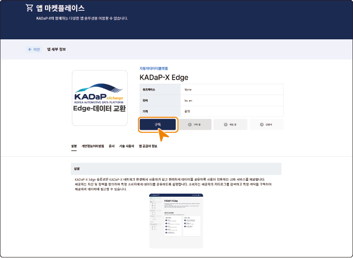

4. 앱 구독 요청 창이 나타나면 상세 설명을 읽고 **확인**을 클릭하세요.
   - 앱 구독 요청이 완료되면 앱 서비스 제공자에게 요청이 전달됩니다. 구독 프로세스는 최대 5일 정도 소요되며 프로세스가 완료되면 앱 구독의 다음 단계 진행을 위해 포털의 알림이 표시됩니다.

>  **참고**
>
> 앱 구독 취소는 각 업체별로 지정되는 회사 관리자만 실행할 수 있습니다. 앱 구독을 취소하려면 사용자가 속한 조직의 회사 관리자에게 문의하세요.

## 데이터 관리하기

데이터 교환 시스템에서는 BAMM(Bayer Aspect Meta Model)을 활용하여 데이터를 표준 규격(AAS, Asset Administration Shell)의 시맨틱 모델로 변환해 저장합니다.

### 모델 상세 정보 확인하기

포털에 등록된 시맨틱 모델의 상세 정보를 확인할 수 있습니다.

시맨틱 모델의 세부 정보를 확인하려면 다음 순서대로 진행하세요.

1. 데이터 교환 시스템 포털 홈 화면에서 메인 메뉴의 **데이터 관리** > **시맨틱 허브**를 클릭하세요.
2. 시맨틱 허브 화면에서 확인할 모델 세부정보 항목의 를 클릭하세요.

   

3. Aspect 모델 정보 창에서 세부 정보를 확인하세요.
   - **Aspect 모델 세부정보**: 모델의 이름, 버전, 상태와 모델 URN(Uniform Resource Name)을 확인할 수 있습니다.
   - **Aspect 모델 다이어그램**: 모델의 데이터의 계층 구조와 속성을 확인할 수 있습니다.
     - **확대**/**축소**/**원본**/**중앙**을 클릭해 다이어그램 크기나 위치를 변경해 볼 수 있습니다.
     - 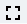를 클릭하면 새로운 창에서 전체 화면 이미지로 확인할 수 있습니다.
    - **Aspect 모델 다운로드**: 모델 관련 문서를 파일로 다운로드할 수 있습니다.
      - **문서**: 시맨틱 모델의 구조와 속성 등이 정리된 문서를 다운로드합니다.
      - **JSON 스키마**: JSON 데이터의 구조를 정의한 문서를 다운로드합니다.
      - **예제 PAYLOAD JSON**: 해당 모델 규격으로 작성된 샘플 데이터 파일을 다운로드합니다.
      - **TTL 파일**: BAMM 기반 시맨틱 모델의 원본 소스 코드를 다운로드합니다.
      - **AAS 파일/AAS XML**: AAS 규격으로 변환된 AASX 파일과 XML 파일 중 원하는 포맷을 선택해 다운로드할 수 있습니다. AASX 포맷은 서브모델과 관련 문서를 포함한 패키지 압축 파일이며, XML 포맷은 데이터 구조와 상세 정의를 포함한 텍스트 파일입니다.

### 시맨틱 모델 추가하기

포털에 사용할 시맨틱 모델을 추가할 수 있습니다.

시맨틱 모델을 추가하려면 다음 순서대로 진행하세요.

1. 데이터 교환 시스템 포털 홈 화면에서 메인 메뉴의 **데이터 관리** > **시맨틱 허브**를 클릭하세요.
2. 시맨틱 허브 화면에서 확인할 모델 세부정보 항목의 **+ 모델 추가**를 클릭하세요.
3. 모델 추가 창이 나타나면 모델 상태를 선택하세요.
   - **Draft**: 서비스 제공자가 모델 테스트용으로 업로드할 때 사용합니다.
   - **Release**: 모델 정의가 완료되어 실제 사용할 모델을 등록합니다.
4. 사용할 Submodel을 BAMM 형식으로 입력하고 **추가**를 클릭하세요.
   - BAMM 포맷은 다른 시맨틱 모델 정보를 참고해 입력하세요.

## 파트너 네트워크 확인하기

데이터 교환 시스템 포털에 등록한 파트너사의 사업자 등록 번호, 주소 등 상세 정보와 BPN 정보를 확인할 수 있습니다.

파트너사의 세부 정보를 확인하려면 다음 순서대로 진행하세요.

1. 데이터 교환 시스템 포털 홈 화면에서 메인 메뉴의 **파트너 네트워크**를 클릭하세요.
2. 파트너 네트워크 화면에서 확인할 회사 세부정보 항목의 를 클릭하세요.

   

3. 회사 세부 정보 창에서 상세 정보를 확인하세요.
   - **회사 정보**: 포털에 등록된 회사명과 BPN 정보를 표시합니다.
     - BPN 정보는 자동차데이터플랫폼(KADaP) 데이터 교환 시스템에 기업 정보를 등록하면 자동으로 부여되는 회사 식별 번호입니다.
   - **주소**: 회사 주소를 표시합니다.
   - **회사 고유번호**: 회사의 사업자 등록 번호를 표시합니다.

## 앱 관리하기

회사 관리자는 마켓 플레이스에 앱을 등록하고 출시한 앱을 관리할 수 있습니다.

>  **참고**
>
> 앱 관리 메뉴는 회사 관리자 권한 사용자가 로그인한 경우에만 표시됩니다.
> - 포털의 다른 권한 사용자는 앱 관리 권한이 없으므로 메뉴가 표시되지 않습니다.

### 앱 등록 관리하기

마켓 플레이스에 앱 등록을 신청할 수 있습니다. 또한 등록한 앱 정보 및 상태를 확인하고 변경할 수 있습니다.

#### 앱 등록 관리 화면 구성

KADaP-X 포털의 홈 화면에서 **앱관리 > 앱 등록 관리**를 클릭하면 앱 목록을 확인할 수 있습니다.

   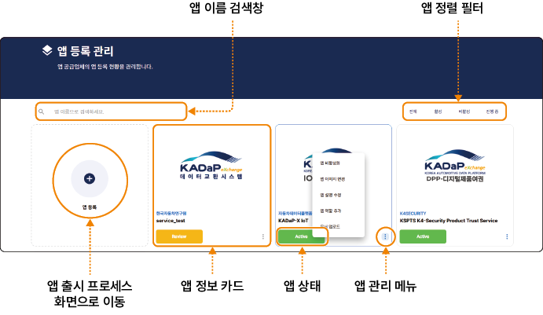

- **앱 등록**을 클릭하면 앱 출시 프로세스 화면으로 이동해 앱 정보를 입력할 수 있습니다. 앱 등록에 대한 자세한 설명은 [앱 출시 프로세스 진행하기](#앱-출시-프로세스-진행하기)를 참고하세요.
- 등록한 정보가 앱 정보 카드에 표시됩니다. 이 카드 이미지로 마켓 플레이스에 등록됩니다.
- 앱 관리 메뉴에서는 앱 상태 및 상세 정보를 변경할 수 있습니다.
  - 앱 등록 검토중이거나 비활성화된 앱은 앱 관리 메뉴가 표시되지 않습니다.

#### 앱 관리 메뉴 사용

앱을 등록한 후 앱 정보 및 상태를 변경하고 관리할 수 있습니다.

앱 관리 메뉴를 사용하려면 다음 순서대로 진행하세요.

1. 데이터 교환 시스템 포털의 홈 화면에서 **앱관리** > **앱 등록 관리**를 클릭하세요.
2. 앱 등록 관리 화면에서 원하는 앱 카드의 를 클릭하세요.
3. 앱 관리 메뉴가 나타나면 설정할 항목을 선택하세요.

   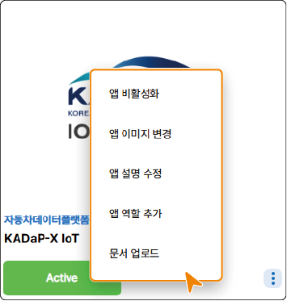

   - **앱 비활성화**: 활성 상태인 앱을 비활성화 상태로 변경합니다.
     - 앱 비활성화 화면에서 주의사항을 체크하고 **저장**을 클릭하세요. 앱을 비활성화하면 마켓 플레이스에서 비활성화되며 복구할 수 없습니다.
   - **앱 이미지 변경**: 앱 이미지를 변경할 수 있습니다.
     - 앱 이미지 변경 화면에서 신규 이미지 등록을 클릭해 이미지 파일을 업로드하세요. 업로드가 완료되면 **저장**을 클릭하세요.
     - 앱 이미지에는 최대 0.8 MB 이내의 png, jpg 파일만 등록할 수 있습니다.
   - **앱 설명 수정**: 앱 설명 변경 화면에서 앱 요약 설명과 세부 설명을 수정할 수 있습니다.
     - 앱 요약 설명/앱 세부 설명 탭의 한국어와 영어 설명을 수정하고 **저장**을 클릭하세요.
   - **앱 역할 추가**: 앱에 설정된 역할을 확인하고 추가할 수 있습니다.
     - 앱 역할 추가 화면에서 **+ 역할 추가**를 클릭하세요. 역할 추가 창이 나타나면 사용자 역할 템플릿을 클릭해 파일을 다운로드하세요. csv 파일에 역할과 정의를 입력한 후 저장해 업로드하세요. 업로드가 완료되면 **확인**을 클릭하세요.
   - **문서 업로드**: 각 항목의 **신규 문서 업로드**를 클릭해 이미지 파일이나 문서 파일을 업로드할 수 있습니다.
     - 앱 이미지에는 최대 0.8 MB 이내의 png, jpg 파일만 등록할 수 있습니다.
     - 앱 문서에는 최대 0.8 MB 이내의 pdf, csv, docx 파일만 등록할 수 있습니다.

### 앱 출시 프로세스 진행하기 {#앱-출시-프로세스-진행하기}

앱 출시 프로세스를 확인하고 출시할 앱 정보를 추가해 등록할 수 있습니다.

앱 정보를 등록하려면 다음 순서대로 진행하세요.

1. 데이터 교환 시스템 포털의 홈 화면에서 **앱관리** > **앱 출시 프로세스**를 클릭하세요.
2. 앱 출시 프로세스 화면에서 등록 단계를 확인하고 **앱 등록**을 클릭하세요.
3. 등록 단계에 따라 앱 상세 정보를 입력하고 **제출**을 클릭하세요.
   - [*]가 표시된 항목은 필수 입력 항목이므로 반드시 입력하세요.
   - **저장**을 클릭하면 각 등록 단계별로 입력한 내용이 저장되며, **저장 및 진행**을 클릭하면 다음 단계로 진행할 수 있습니다.
   - **이전**을 클릭하면 이전 단계로 이동합니다.

**앱 카드**

앱 카드에 표시할 앱 정보 및 이미지를 등록합니다.

   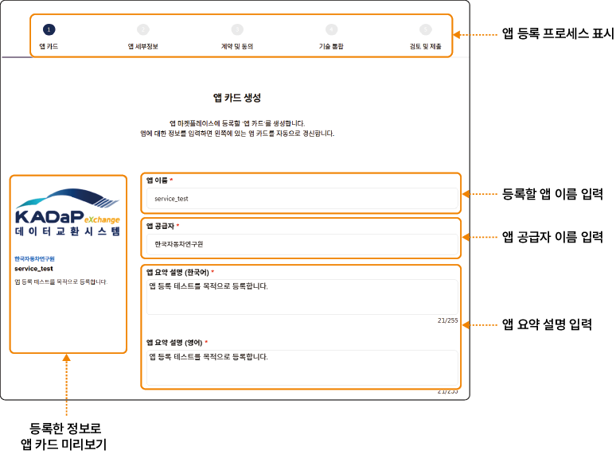

   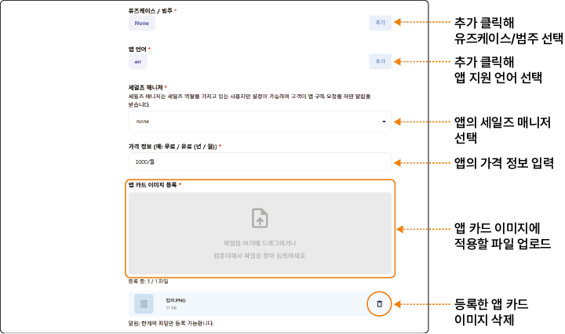

  - 유즈케이스/범주와 앱 언어는 해당되는 항목 여러 개를 추가할 수 있습니다.
  - 앱 카드 이미지 등록 항목의 박스를 클릭하면 파일을 선택할 수 있는 선택창이 열립니다. 선택창에서 파일을 선택하고 **열기**를 클릭하세요.
    - 앱 카드 이미지에는 최대 0.8 MB 크기의 png, jpg 파일을 1개만 등록할 수 있습니다.

**앱 세부정보**

앱 세부정보 화면에 표시할 상세 정보를 등록합니다.

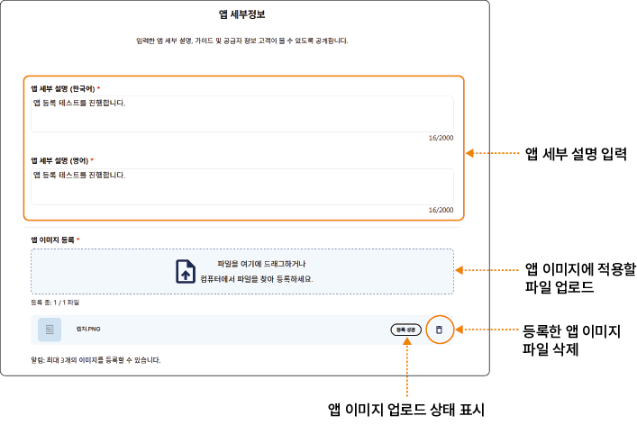

  - 앱 이미지 등록 항목의 박스를 클릭하면 파일을 선택할 수 있는 선택창이 열립니다. 선택창에서 파일을 선택하고 **열기**를 클릭하세요.
    - 앱 이미지에는 최대 0.8 MB 크기의 png, jpg 파일을 3개까지 등록할 수 있습니다.

    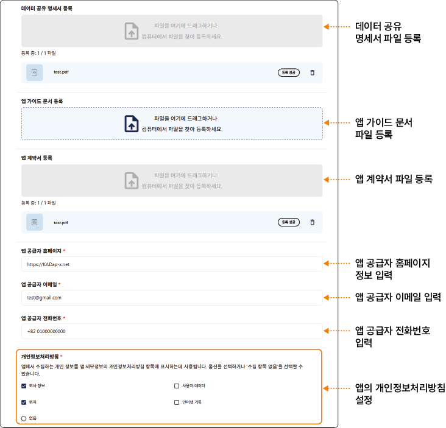

  - 데이터 공유 명세서, 앱 가이드 문서, 앱 계약서에는 최대 0.8 MB 크기의 pdf 파일을 1개만 등록할 수 있습니다.
  - 앱 사용 시 개인 정보를 수집하지 않는 경우 개인정보처리방침에서 **없음**을 선택합니다.

**계약 및 동의**

앱 마켓 플레이스를 사용하기 위해 KADaP-X 계약에 동의하고 앱 인증서를 등록합니다.

   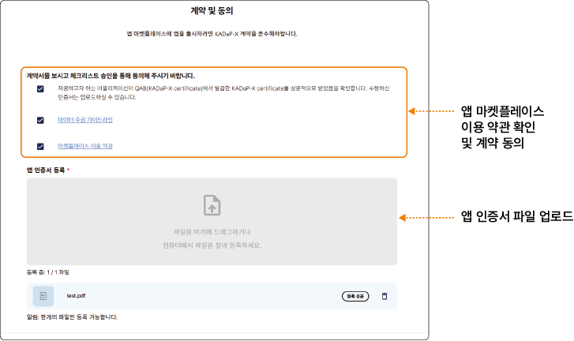

  - 데이터 주권 가이드라인과 마켓 플레이스 이용 약관 파일을 확인하고 체크리스트를 모두 선택해 계약에 동의합니다.
  - 앱 인증서에는 최대 0.8 MB 크기의 pdf 파일을 1개만 등록할 수 있습니다.

**기술 통합**

애플리케이션에서 지원하는 역할과 네트워크 내에서 애플리케이션을 실행하는데 필요한 기술 사용자 프로필을 업로드해 KADaP-X와 데이터스페이스의 앱을 통합할 수 있습니다.

기술 통합 단계에서는 인증 프레임만 실행하며 사용자가 생성되지는 않습니다.

   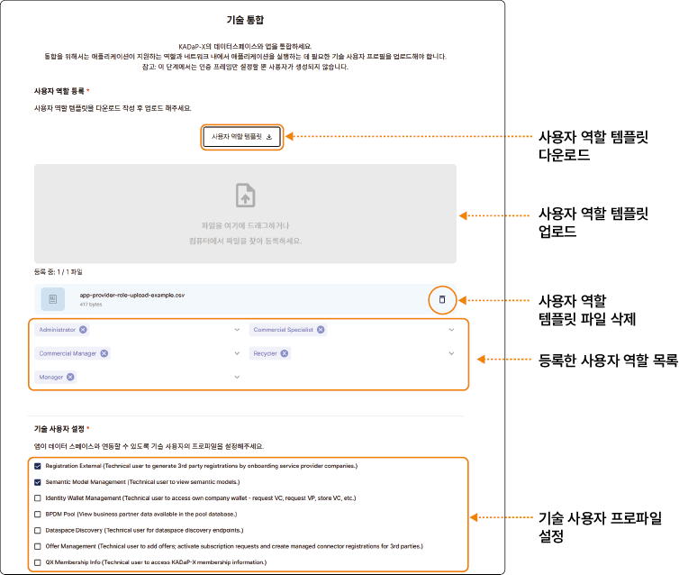

  - **사용자 역할 템플릿**을 클릭해 csv 파일을 다운로드합니다. 역할과 역할 정의를 입력한 후 파일을 저장해 업로드합니다.
    - 파일을 업로드하면 입력한 역할이 목록으로 표시됩니다. 삭제할 항목의 **X**를 클릭하면 해당 역할을 삭제할 수 있습니다.

**검토 및 제출**

4단계까지 입력한 앱 세부 정보를 확인하고 앱 등록 신청을 완료합니다.

   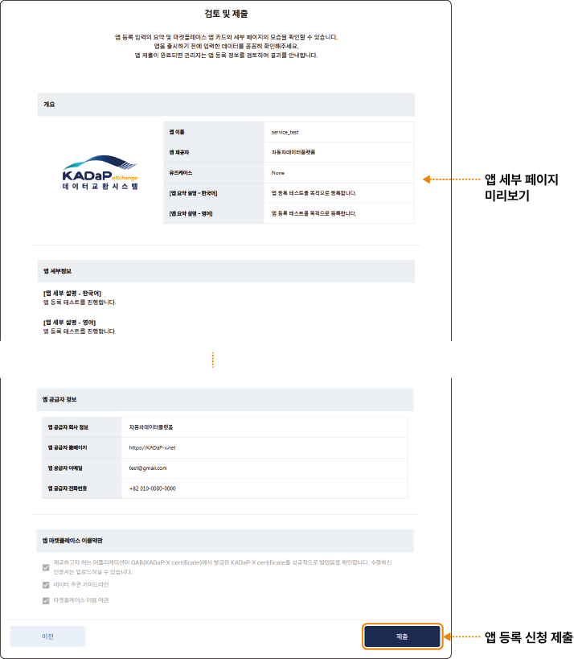

  - 앱 정보 수정이 필요한 경우, **이전**을 클릭해 수정이 필요한 단계로 이동할 수 있습니다. 내용을 수정한 후 **저장 및 진행**을 클릭하세요.

>  **참고**
>
> 앱 정보 등록 중 중단한 경우, 저장된 단계부터 추가로 이어서 등록할 수 있습니다.
> - **앱** > **앱 등록 관리** 목록에서 **Progress** 항목을 클릭하면 앱 출시 프로세스 세부 정보를 수정할 수 있습니다.

### 앱 구독 관리하기

앱 관리자는 사용자가 신청한 앱 구독 세부 정보를 확인하고 관리할 수 있습니다.

#### 앱 구독 세부 정보 확인

앱 구독 세부 정보를 확인하려면 다음 순서대로 진행하세요.

1. 데이터 교환 시스템 포털의 홈 화면에서 **앱관리** > **앱 구독 관리**를 클릭하세요.
2. 앱 구독 관리 화면에서 앱 항목의 **세부정보 표시**→를 클릭하세요.

   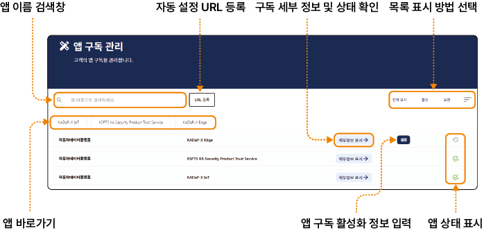

   - 를 클릭하면 고객별/오퍼별로 목록을 필터링해 표시할 수 있습니다.
   - 사용자가 앱 구독 신청을 하면 이 표시되며, 구독 활성화가 완료되면 이 표시됩니다.
3. 구독 세부 정보 및 상태 창에서 앱 구독 세부 정보와 상태를 확인하세요.
   - **구독 세부 정보**: 앱 이름, 상태, 고객 정보 등이 표시됩니다.
   - **기술 세부 정보**: 앱 사용을 위한 테넌트 URL, 기술 사용자 프로필 등 기술 세부 정보가 표시됩니다.

#### 앱 자동 설정 URL 등록

특정 고객이 앱의 구독을 신청하면 데이터 교환 시스템이 엔드포인트를 자동으로 실행해 바로 앱을 사용할 수 있도록 설정합니다.

앱의 자동 설정 URL을 등록하려면 다음 순서대로 진행하세요.

1. 데이터 교환 시스템 포털의 홈 화면에서 **앱관리** > **앱 구독 관리**를 클릭하세요.
2. 앱 구독 관리 화면에서 **URL 등록**을 클릭하세요.
3. 자동 설정 URL 등록 창이 열리면 고객의 URL을 입력하고 **확인**을 클릭하세요.

#### 앱 구독 활성화

사용자가 구독 신청을 하면 앱 관리자는 해당 고객의 앱 구독 활성화를 위한 실행 정보를 입력해야 합니다. 앱 구독 활성화가 완료되면 사용자가 앱을 정상적으로 사용할 수 있습니다.

앱 구독 활성화를 진행하려면 다음 순서대로 진행하세요.

1. 데이터 교환 시스템 포털의 홈 화면에서 **앱관리** > **앱 구독 관리**를 클릭하세요.
2. 앱 구독 관리 화면의 목록에서 **설정**을 클릭하세요.
3. 앱 구독 활성화 창이 열리면 앱 테넌트 URL을 입력하고 **확인**을 클릭하세요.

   

   - 앱 테넌트 URL을 입력할 때에는 **https://** 로 시작하는 주소를 입력합니다.
   - 앱 테넌트 URL이 정상적으로 연동되면 앱에 설정된 클라이언트 정보 및 기술관련 세부정보 창이 표시됩니다.

>  **참고**
>
> 앱이 활성화되면 구독을 신청한 사용자에게 앱 역할을 할당해야 합니다. 역할이 할당된 사용자만 앱을 실행할 수 있습니다. 앱 권한 할당에 대한 자세한 설명은 [포털 앱 사용자 관리](#포털-앱-사용자-관리)을 참고하세요.

## 내 정보 설정하기 {#내-정보-설정하기}

데이터 교환 시스템 포털의 설정 메뉴에서 사용자 정보를 확인하고 설정할 수 있습니다. 관리자로 할당된 사용자는 관리자 메뉴에서 포털 사용자 및 기술 사용자 등록 등 상세 설정을 할 수 있습니다.

>  **참고**
>
> - 관리자 메뉴는 관리자 역할 사용자가 로그인한 경우에만 표시됩니다.
> - 일반 사용자로 로그인하면 기본 내 정보 메뉴만 확인할 수 있습니다.

### 내 정보 메뉴 확인하기

데이터 교환 시스템 포털의 **내 정보** 메뉴에서 사용자 설정을 할 수 있습니다.

   

| 번호 | 항목 | 설명 |
| --- | --- | --- |
| 1 | 나의 계정 | 로그인한 사용자 정보를 확인할 수 있습니다.<ul><li>**TOKEN을 클립보드로 복사**: 사용자 계정의 토큰 데이터를 복사합니다. 사용자 토큰은 사용자 인증 시 적용할 수 있습니다.</li><li>**사용자 삭제**: 내 정보를 삭제합니다. 사용자 삭제는 관리자 승인 후 적용됩니다.</li><li>**개인 정보**: 사용자 이름과 이메일주소가 표시됩니다.</li><li>**상태 정보**: 사용자의 상태와 계정 생성일이 표시됩니다.</li><li>**발행 정보**: 조직명과 관리자 정보가 표시됩니다.</li><li>**포털 역할**: 사용자에게 할당된 포털 내 역할이 표시됩니다.</li><li>**앱 권한**: 앱별로 할당된 사용자 역할이 표시됩니다.</li><li>**DEV 전용 (현재 인증 Token)**: 사용자 인증 토큰의 전체 데이터가 표시되며, 앱이나 커넥터 연동 테스트 시 사용할 수 있습니다.</li>|
| 2 | 나의 조직 | 사용자가 속한 회사 정보와 앱 구독 목록을 확인할 수 있습니다.<ul><li>관리자 권한의 사용자는 앱 구독 목록의 **구독 취소**를 클릭해 앱 구독을 취소합니다. 앱 구독 취소는 관리자만 실행할 수 있습니다.</li></ul>|
| 3 | 알림 | 포털의 알림을 확인할 수 있습니다.<ul><li>읽지 않은 알림이 있으면 내 정보 아이콘에 배지가 표시됩니다.</li></ul> |
| 4 | 포털 사용자 관리 | 관리자 권한 사용자는 사용자별로 포털의 권한 및 앱별 접근 권한을 설정할 수 있습니다. 자세한 설명은 [포털 사용자 관리하기](#포털-사용자-관리하기)를 참고하세요. |
| 5 | 기술 사용자 관리 | 관리자 권한 사용자는 앱에 접근을 허용할 기술 사용자를 등록할 수 있습니다. 자세한 설명은 [기술 사용자 관리하기](#기술-사용자-관리하기)를 참고하세요. |
| 6 | ID 공급자 설정 | 관리자 권한 사용자는 회사의 ID 공급자 설정을 입력해 회사 사용자가 데이터 교환 시스템에 인증하는 방법을 관리할 수 있습니다. 자세한 설명은 [ID 공급자 설정하기](#ID-공급자-설정하기)를 참고하세요. |
| 7 | 커넥터 등록 | 관리자 권한 사용자는 서비스형/관리형 커넥터를 등록할 수 있습니다. 자세한 설명은 [커넥터 등록하기](#커넥터-등록하기)를 참고하세요. |
| 8 | 회사 역할 변경 | 관리자 권한 사용자는 포털에서 회사의 역할을 변경할 수 있습니다. 자세한 설명은 [회사 역할 변경하기](#회사-역할-변경하기)를 참고하세요. |
| 9 | 로그아웃 | 사용자 계정에서 로그아웃합니다. |

### 포털 사용자 관리하기 {#포털-사용자-관리하기}

관리자 권한 사용자는 사용자별로 포털 메뉴의 접근 권한과 앱별 접근 권한을 설정할 수 있습니다.

#### 화면 구성

데이터 교환 시스템 포털의 **내 정보** > **포털 사용자 관리** 메뉴에서 포털 사용자를 등록하고 관리할 수 있습니다.

#### 포털 사용자 등록

데이터 교환 시스템 포털에 접근할 수 있는 사용자를 등록할 수 있습니다.

##### 단일 사용자 추가

사용자를 한 명씩 등록하려면 다음 순서대로 진행하세요.

1. 데이터 교환 시스템 포털의 홈 화면에서 **내 정보**>**포털 사용자 관리**를 클릭하세요.
2. 포털 사용자 관리 화면에서 **+ 단일 사용자 추가**를 클릭하세요.
3. 단일 사용자 추가 창이 나타나면 상세 정보를 설정하고 **확인**을 클릭하세요.
   - [*]가 표시된 항목은 필수 입력 항목이므로 반드시 입력하세요.
   - **사용자 ID**: 등록할 사용자 ID를 입력합니다.
   - **이름**: 사용자 이름을 입력합니다.
   - **성**: 사용자 성을 입력합니다.
   - **이메일**: 사용자 이메일을 입력합니다.
   - **KX 포털 사용자 역할 선택**: 데이터 교환 시스템 포털에서 사용자에게 할당할 역할을 선택합니다. 역할에 대한 자세한 설명은 **역할 세부 도움말**을 클릭해 확인할 수 있습니다.

##### 복수 사용자 추가

여러 사용자를 한 번에 등록하려면 다음 순서대로 진행하세요.

1. 데이터 교환 시스템 포털의 홈 화면에서 **내 정보**>**포털 사용자 관리**를 클릭하세요.
2. 포털 사용자 관리 화면에서 **+ 복수 사용자 추가**를 클릭하세요.
3. 복수 사용자 추가 창이 나타나면 **템플릿 다운로드**를 클릭하세요.
4. 사용자 정보를 입력한 템플릿 파일을 업로드하고 **확인**을 클릭하세요.
5. 업로드 파일에 입력한 사용자의 역할을 선택하고 **확인**을 클릭하세요.
   - 모든 사용자에게 공통으로 적용할 역할만 선택하여 등록합니다. 사용자별로 개별 할당이 필요한 역할은 사용자 등록 완료 후 추가하는 것을 권장합니다.
     - 포털 사용자 역할은 사용자 계정 화면에서 **포털 역할 변경**을 클릭해 변경할 수 있습니다.

#### 포털 사용자 정보 확인

데이터 교환 시스템 포털에 등록된 사용자 정보를 확인하고 관리할 수 있습니다.

포털 사용자 정보를 확인하려면 다음 순서대로 진행하세요.

1. 데이터 교환 시스템 포털의 홈 화면에서 **내 정보**>**포털 사용자 관리**를 클릭하세요.
2. 포털 사용자 관리 화면에서 정보를 확인할 사용자의 를 클릭하세요.
3. 사용자 계정 화면에서 상세 정보를 확인하세요.
   - **사용자 중지**: 사용자 계정을 비활성화합니다. 계정을 비활성화하면 사용자는 포털 메뉴에 접근할 수 없습니다.
   - **사용자 삭제**: 사용자 계정을 삭제합니다. 계정을 삭제하면 포털의 로그인 정보가 모두 삭제됩니다.
   - **비밀번호 재설정**: 필요한 경우 사용자 계정의 비밀번호를 초기화할 수 있습니다. 비밀번호 재설정을 위한 링크가 사용자 메일로 전송되며 해당 링크에서 비밀번호를 변경합니다.
   - **포털 역할 변경**: 포털의 사용자 역할을 변경합니다. 사용자 역할이 변경되면 비밀번호를 재설정해야 정상 로그인할 수 있습니다.

#### 포털 앱 사용자 관리 {#포털-앱-사용자-관리}

마켓 플레이스의 앱에 사용자를 할당하고 권한을 관리할 수 있습니다.

사용자에게 앱 접근 권한을 할당하려면 다음 순서대로 진행하세요.

1. 데이터 교환 시스템 포털의 홈 화면에서 **내 정보**>**포털 사용자 관리**를 클릭하세요.
2. 포털 사용자 관리 화면에서 앱 접근 관리 목록의 앱을 클릭하세요.
3. 앱 사용자 관리 화면에서 **+ 앱 사용자**를 클릭하세요.
4. 앱 사용자 권한 추가 창에서 사용자를 선택하고 역할을 설정한 후 **확인**을 클릭하세요.
   - 앱 사용자 목록에서 사용자의 를 클릭해 역할 관리 창에서도 역할을 변경할 수 있습니다.
   - 사용자 역할이 변경되면 비밀번호를 재설정해야 정상 로그인할 수 있습니다.

### 기술 사용자 관리하기 {#기술-사용자-관리하기}

관리자 권한 사용자는 앱에 접근을 허용할 기술 사용자를 등록할 수 있습니다.

#### 화면 구성

데이터 교환 시스템 포털의 **내 정보** > **기술 사용자 관리** 메뉴에서 포털 사용자를 등록하고 관리할 수 있습니다.

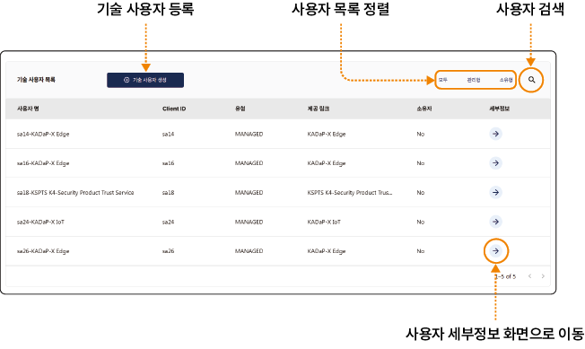

#### 기술 사용자 등록

데이터 교환 시스템 포털의 기술 사용자를 등록할 수 있습니다. 마켓 플레이스에 등록된 앱이 시스템의 특정 자원에 접근하고 작업을 수행할 수 있도록 실행 범위를 설정합니다.

기술 사용자를 등록하려면 다음 순서대로 진행하세요.

1. 데이터 교환 시스템 포털의 홈 화면에서 **내 정보**>**기술 사용자 관리**를 클릭하세요.
2. 기술 사용자 관리 화면에서 **+ 기술 사용자 생성**을 클릭하세요.
3. 단일 사용자 추가 창이 나타나면 상세 정보를 설정하고 **확인**을 클릭하세요.
   - [*]가 표시된 항목은 필수 입력 항목이므로 반드시 입력하세요.
   - **사용자 이름**: 등록할 사용자 이름을 입력합니다.
   - **설명**: 사용자에 대한 설명을 입력합니다. 여러 개의 기술 사용자 계정이 있어 구분이 어려운 경우 설명에 상세 정보를 입력해 관리할 수 있습니다.
   - **기술 사용자 역할**: 앱의 서비스 역할 중 사용자에게 할당할 역할을 선택합니다.
     - Registration External: 외부 시스템에서 기업의 온보딩이나 서비스 등록을 진행합니다.
     - Semantic Model Management: 시맨틱 모델을 생성하고 관리합니다. 데이터를 표준 규격으로 변환하거나 가공하는 앱에 필요한 역할입니다.
     - Identity Wallet Management: 기업 고유의 전자 지갑(Identity Wallet)에 접근하여 자격 증명을 요청하거나 저장하고, 데이터 계약 시 디지털 서명을 수행할 수 있습니다.
     - BPDM Pool: 비즈니스 파트너 데이터 관리 풀(BPDM, Business Partner Data Management)에 접근하여 등록된 기업들의 마스터 데이터(BPN 등)를 조회하거나 관리합니다.
     - Dataspace Discovery: 데이터 스페이스 내에서 활용 가능한 데이터 자산이나 참여자 엔드포인트를 조회합니다.
     - Offer Management: 마켓 플레이스에 데이터 상품이나 앱 서비스를 오퍼링으로 등록하고, 사용자의 구독 요청을 활성화하거나 커넥터를 등록하는 등의 오퍼링 관련 기능을 관리합니다.
     - QX Membership Info: 데이터 스페이스(QX)의 가입 정보 및 자격 상태를 검증하고 관리합니다.

#### 기술 사용자 정보 확인

데이터 교환 시스템 포털에 등록된 기술 사용자 정보를 확인하고 관리할 수 있습니다.

기술 사용자 정보를 확인하려면 다음 순서대로 진행하세요.

1. 데이터 교환 시스템 포털의 홈 화면에서 **내 정보**>**기술 사용자 관리**를 클릭하세요.
2. 기술 사용자 관리 화면에서 정보를 확인할 사용자의 를 클릭하세요.
3. 기술 사용자 세부 정보 화면에서 상세 정보를 확인하세요.
   - 기술 사용자 세부 정보 항목에서 를 클릭하면 정보를 복사할 수 있습니다.
   - **기술 사용자 삭제**: 기술 사용자 계정을 삭제합니다.
   - **기술 사용자 초기화**: 기술 사용자의 인증서 정보를 초기화합니다.

### ID 공급자 설정하기 {#id-공급자-설정하기}

관리자 권한 사용자는 회사의 ID 공급자 설정을 입력해 회사 사용자가 데이터 교환 시스템에 인증하는 방법을 관리할 수 있습니다.

#### 화면 구성

데이터 교환 시스템 포털의 **내 정보** > **ID 공급자 설정** 메뉴에서 ID 공급자를 등록하고 관리할 수 있습니다.

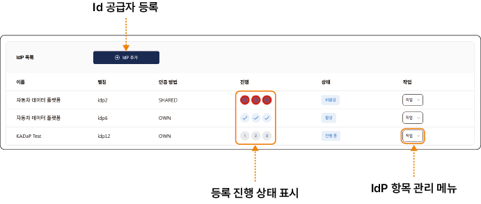

#### IdP 등록

회사의 ID 공급자 정보를 입력하고 사용자 프로필을 연결해 포털에 등록할 수 있습니다.

ID 공급자를 등록하려면 다음 순서대로 진행하세요.

1. 데이터 교환 시스템 포털의 홈 화면에서 **내 정보 > ID 공급자 설정**을 클릭하세요.
2. ID 공급자 설정 화면에서 **+ IdP 추가**를 클릭하세요.
3. IdP 추가 창이 나타나면 등록 단계에 따라 정보를 입력하세요.
   - [*]가 표시된 항목은 필수 입력 항목이므로 반드시 입력하세요.

**IdP 항목 생성**

IdP 이름과 유형을 설정하고 **IdP 항목 생성**을 클릭하세요.

  - **표시 이름**: 사용할IdP 이름을 입력합니다.
  - **인증 유형**: IdP 인증 프로토콜을 선택합니다.
    - OIDC: OIDC(OpenID Connect)는 OAuth 2.0 프로토콜을 기반으로 한 인증 방식으로 클라우드나 시스템이나 SaaS 앱 연동 시 선택합니다.
    - SAML: SAML(Security Assertion Markup Language)은 XML 기반으로 인증 데이터를 교환하며 온프레미스 환경 연동 시 선택합니다.
  - **IdP 유형**: 사용할 인증 시스템 유형을 선택합니다.
    - OWN - 회사 소유의 IdP에 연결: 기업이 운영 중인 인증 서버에 직접 연결합니다.
    - MANAGED - 제3자가 관리하는 IdP에 연결: 별도의 서버 없이 플랫폼 운영사나 제3자가 제공하는 인증 서비스를 이용합니다.

**IdP 데이터 추가**

IdP 세부 정보를 입력하고 **Metadata 저장**을 클릭하세요.

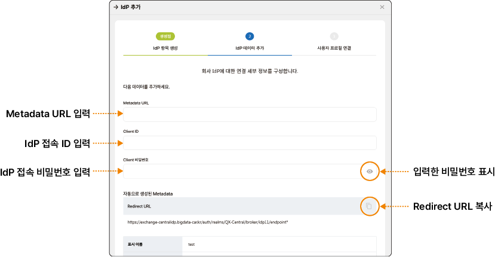

  - Metadata URL, Clietn ID, 비밀번호 입력창을 클릭하면 도움말이 표시됩니다.

**사용자 프로필 연결**

포털에 등록된 사용자 프로필과 연결해 IdP 등록을 완료하세요.

>  **참고**
>
> ID 공급자 등록 단계를 완료하지 않아도 **진행중** 항목이 목록에 추가됩니다.
> - IdP 목록의 **작업** > **설정**을 클릭하면 마지막으로 저장한 단계에 이어서 등록을 완료할 수 있습니다.

#### IdP 관리

데이터 교환 시스템 포털에 등록한 ID 공급자 정보를 확인하고 사용자 계정을 업데이트할 수 있습니다.

등록한 IdP를 관리하려면 다음 순서대로 진행하세요.

1. 데이터 교환 시스템 포털의 홈 화면에서 **내 정보**>**ID 공급자 설정**을 클릭하세요.
2. ID 공급자 설정 화면에서 설정할 항목의 **작업**을 클릭하세요.
3. ID 공급자 관리 메뉴가 나타나면 원하는 항목을 선택하세요.
   - **설정**: IdP 추가 창에서 IdP 연결 정보와 사용자 프로필 정보를 변경할 수 있습니다.
   - **활성**: 비활성 상태인 IdP 항목을 사용 설정할 수 있습니다.
   - **비활성화**: 활성 상태인 IdP 항목을 비활성해 사용을 중지할 수 있습니다.
   - **삭제**: IdP 항목을 삭제합니다.

##### 사용자 계정 업데이트

활성화 상태인 IdP 항목의 포털 사용자를 IdP 사용자 정보와 연결할 수 있습니다.

사용자 계정을 업데이트하려면 다음 순서대로 진행하세요.

1. 데이터 교환 시스템 포털의 홈 화면에서 **내 정보**>**ID 공급자 설정**을 클릭하세요.
2. ID 공급자 설정 화면에서 설정할 항목의 **작업**>**사용자 계정 업데이트**를 클릭하세요.
3. 사용자 계정 업데이트/이전 창에서 다운로드할 파일 형식을 선택하고 **사용자 목록 다운로드**를 클릭하세요.
   - JSON, CSV 중 원하는 파일 형식을 선택하고 **문서 서식**을 체크해 다운로드합니다.
4. 다운로드한 파일의 **ProviderUserId**, **ProviderUserName**항목에 회사 IdP 정보를 입력하고 저장하세요.
5. 파일을 업로드한 후 **업데이트된 사용자 목록 업로드**를 클릭하세요.

### 커넥터 등록하기 {#커넥터-등록하기}

관리자 권한 사용자는 데이터 교환 시스템 포털에서 사용할 커넥터를 등록하고 관리할 수 있습니다.

#### 화면 구성

데이터 교환 시스템 포털의 **내 정보** > **커넥터 등록** 메뉴에서 커넥터를 등록하고 관리할 수 있습니다.

#### 서비스형 커넥터 등록

회사 네트워크에 구현된 서비스형 커넥터를 등록할 수 있습니다.

서비스형 커넥터를 등록하려면 다음 순서대로 진행하세요.

1. 데이터 교환 시스템 포털의 홈 화면에서 **내 정보**>**커넥터 등록**을 클릭하세요.
2. 커넥터 등록 화면에서 서비스형 커넥터 목록의 **+ 커넥터 등록**을 클릭하세요.
3. 서비스형 커넥터 등록 창에서 커넥터 구성 방법을 확인하고 체크박스를 선택 후 **다음**을 클릭하세요.
4. 서비스형 커넥터 정보를 입력하고 **확인**을 클릭하세요.
   - **이름**: 커넥터 이름을 20자 이내로 입력합니다.
   - **커넥터 URL/엔드포인트**: HTTPS 프로토콜과 함께 도메인 또는 IP 주소 형식으로 사용할 커넥터 URL을 입력합니다.
   - **위치**: 두 자리 국가 코드를 입력합니다. 한국은 KR, 미국은 US 형식으로 입력합니다.

#### 관리형 커넥터 등록

고객/제3자가 제공하는 관리형 커넥터를 등록할 수 있습니다.

관리형 커넥터를 등록하려면 다음 순서대로 진행하세요.

1. 데이터 교환 시스템 포털의 홈 화면에서 **내 정보**>**커넥터 등록**을 클릭하세요.
2. 커넥터 등록 화면에서 관리형 커넥터 목록의 **+ 커넥터 등록**을 클릭하세요.
3. 서비스형 커넥터 등록 창에서 커넥터 구성 방법을 확인하고 체크박스를 선택 후 **다음**을 클릭하세요.
4. 서비스형 커넥터 정보를 입력하고 **확인**을 클릭하세요.
   - **이름**: 커넥터 이름을 20자 이내로 입력합니다.
   - **커넥터 URL/엔드포인트**: HTTPS 프로토콜과 함께 도메인 또는 IP 주소 형식으로 사용할 커넥터 URL을 입력합니다.
   - **위치**: 두 자리 국가 코드를 입력합니다. 한국은 KR, 미국은 US 형식으로 입력합니다.
   - **고객 링크**: 고객이 구독하는 앱 링크를 목록에서 선택합니다.

### 회사 역할 변경하기 {#회사-역할-변경하기}

관리자 권한 사용자는 데이터 교환 시스템 포털에서 회사가 수행하는 역할을 변경할 수 있습니다.

> **참고**
>
> - 포털에 등록된 회사는 하나 이상의 역할이 할당되어 있어야 합니다.
> - 역할을 변경하면 포털에서 사용할 수 있는 역할, 권한이 달라집니다. 역할을 변경하기 전에 사용 범위와 권한을 반드시 확인하세요.

회사 역할을 변경하려면 다음 순서대로 진행하세요.

1. 데이터 교환 시스템 포털의 홈 화면에서 **내 정보** > **회사 역할 변경**을 클릭하세요.
2. 회사 역할 변경 화면에서 사용할 역할을 선택하고 **변경**을 클릭하세요.
   - **앱 제공자**: 앱 마켓 플레이스에 앱을 등록하고, 출시한 앱의 구독 및 기술 사용자 프로필 등을 관리할 수 있습니다.
   - **서비스 제공자**: 데이터 커넥터를 등록하거나 관리하고, 시맨틱 모델이 적용된 데이터를 공유 자산로 등록하고 오퍼링을 관리할 수 있습니다.
   - **온보딩 서비스 제공자**: 데이터 스페이스 사용을 위해 기업의 온보딩 서비스를 제공하고 외부 등록 절차를 진행할 수 있습니다.

# 데이터 수집 시스템

데이터 수집 시스템(KADaP-X IoT)에서는 자동차 CAN 데이터 및 설비 데이터를 실시간으로 수집하고 전처리를 실행할 수 있습니다. 데이터를 수집하는 장치 상태를 실시간으로 확인하고 제어할 수 있으며, 수집된 로우 데이터에 전처리 모델을 적용해 AAS 표준 기술에 맞는 데이터로 저장합니다.

>  **참고**
>
> 데이터 수집 시스템에는 기관 회원 중 기업 정보 등록이 완료된 사용자만 접속할 수 있습니다.

## 홈 화면 구성

데이터 수집 시스템의 홈 화면은 다음과 같이 구성됩니다. 각 항목별 기능을 설명합니다.

| 번호 | 항목 | 설명 |
| --- | --- | --- |
| 1 | 데이터 수집 시스템 메뉴 | 데이터 수집 시스템의 메뉴를 선택합니다.<ul><li>**홈**: 홈 화면으로 이동합니다.</li><li>**장치 관리**: 장치를 등록하고 관리할 수 있습니다.</li><li>**프로젝트 관리**: 프로젝트를 등록하고 관리할 수 있습니다.</li><li>**전처리 모델 관리**: 전처리 모델을 등록할 수 있습니다.</li><li>**프로젝트 목록**: 프로젝트 설정 정보와 장치를 확인하고, 프로젝트 데이터를 관리할 수 있습니다.</li>|
| 2 | 내 정보 | 로그인한 사용자 정보를 확인하고 화면 표시 모드를 설정할 수 있습니다.<ul><li>**Dark mode**: 화면 표시 모드를 선택합니다.</li><li>**로그아웃**: 로그인한 계정에서 로그아웃합니다. |
| 3 | 프로젝트 및 장치 상태 | 전체 프로젝트 수와 전체 장치의 상태를 한 눈에 확인할 수 있습니다. |
| 4 | 프로젝트 목록 | 등록한 프로젝트별로 설정 정보와 장치 정보, 프로젝트 데이터를 확인할 수 있습니다.<ul><li>**프로젝트 설정**: 프로젝트 정보와 할당한 장치를 확인할 수 있습니다.</li><li>**프로젝트 데이터 관리**: root 경로에 저장된 데이터를 확인할 수 있습니다.</li><li>장치 정보: 장치 상세 정보와 모니터링 항목을 확인할 수 있으며, 장치별 데이터 및 CAN 뷰어를 설정할 수 있습니다.</li></ul>|
| 5 | 장치 위치 | 등록한 장치의 위치를 지도에서 확인할 수 있습니다. |

## 장치 관리하기

데이터를 수집할 장치를 등록하고 관리할 수 있습니다.

### 화면 구성

데이터 수집 시스템의 **장치 관리** 메뉴에서 장치를 등록하고 관리할 수 있습니다.

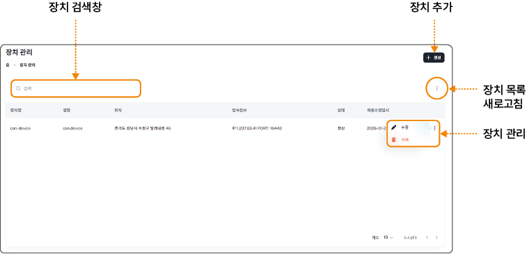

- 장치 관리 항목에서는 장치를 수정하거나 삭제할 수 있습니다.
  - **수정**: 장치 추가 화면으로 이동해 장치 정보를 수정할 수 있습니다.
  - **삭제**: 등록한 장치를 삭제합니다. 삭제한 장치는 복구할 수 없습니다.

### 장치 추가하기

데이터 수집 장치를 등록하려면 다음 순서대로 진행하세요.

1. 데이터 수집 시스템의 홈 화면에서 **장치 관리**를 클릭하세요.
2. 장치 관리 화면에서 **+ 생성**을 클릭하세요.
3. 장치 추가 화면에서 상세 정보를 입력하고 **생성**을 클릭하세요.
- **기본 정보**
  - **장치명**: 추가할 장치 이름을 입력합니다.
  - **설명**: 장치 설명을 입력합니다.
  - **IP**: 장치의 IP 주소를 입력합니다.
- **장치유형 정보**
  - 전처리: 수집된 데이터에 전처리 모델을 적용해 표준 언어로 변환합니다.
  - CAN: 차량 제어 유닛(ECU)에서 발생하는 다양한 정보를 실시간으로 수집합니다.
  - 센서: 제조 현장의 설비 상태나 특정 부품 상태를 측정해 실시간 데이터를 수집합니다.
- **SFTP 접속 정보**
장치의 SFTP(Secure File Transfer Protocol) 접속 정보를 입력합니다. 입력한 SFTP로 수집된 데이터가 암호화되어 전송됩니다.
  - **SFTP PORT**: SFTP 접속 포트를 입력합니다. (기본 포트: 22)
  - **SFTP ID**: SFTP 서버에 접속할 때 필요한 ID 정보를 입력합니다.
  - **SFTP PASSWORD**: SFTP 서버에 접속할 때 필요한 비밀번호를 입력합니다.
- **K8S 접속 정보**
  - **K8S PORT**: 장치의 K8S 접속 포트를 입력합니다. (기본 포트: 6443)
  - 장치의 K8S 클러스터에 접속하기 위한 **kubeconfig** 파일을 업로드합니다. 이 파일에는 API 서버 주소와 인증 정보가 포함되어 있습니다.
- **동기화 정보**
  - **동기화 주기(초)**: 장치와 연결된 클라우드 서버나 저장소와의 동기화 주기를 입력합니다. (기본 동기화 주기: 3600)
- **위치 정보**
    - 검색창에 도로명 주소를 입력하고 **검색**을 클릭하면 지도 위에 위치창이 나타납니다. 위치창의 주소 정보를 확인하고 **선택**을 눌러 장치 위치를 등록합니다.

> **참고**
>
> 등록한 장치는 **장치 목록 > 장치 관리** 항목을 클릭해 정보를 수정하거나 삭제할 수 있습니다.

## 프로젝트 관리하기

등록한 장치를 그룹으로 구성하는 프로젝트를 등록하고 관리할 수 있습니다.

### 화면 구성

데이터 수집 시스템의 **프로젝트 관리** 메뉴에서 프로젝트를 등록하고 관리할 수 있습니다.

- 프로젝트 관리 항목에서는 프로젝트를 수정하거나 삭제할 수 있습니다.
  - **수정**: 프로젝트 편집 화면으로 이동해 프로젝트 정보를 수정할 수 있습니다.
  - **삭제**: 등록한 프로젝트를 삭제합니다. 삭제한 프로젝트는 복구할 수 없습니다.

### 프로젝트 추가하기

프로젝트를 등록하려면 다음 순서대로 진행하세요.

1. 데이터 수집 시스템의 홈 화면에서 **프로젝트 관리**를 클릭하세요.
2. 프로젝트 관리 화면에서 **+ 생성**을 클릭하세요.
3. 프로젝트 추가 화면에서 상세 정보를 입력하고 **생성**을 클릭하세요.
   - **프로젝트명**: 추가할 프로젝트 이름을 입력합니다.
   - **설명**: 프로젝트 설명을 입력합니다.
   - **색상 태그 정보**: 지도에 표시할 프로젝트 색상을 설정합니다.

> **참고**
>
> 등록한 프로젝트는**프로젝트 목록 > 프로젝트 관리** 항목을 클릭해 정보를 수정하거나 삭제할 수 있습니다.

## 전처리 모델 관리하기

수집된 데이터 가공 시 적용할 전처리 모델을 등록할 수 있습니다.

### 화면 구성

데이터 수집 시스템의 **전처리 모델 관리** 메뉴에서 전처리 모델을 등록할 수 있습니다.

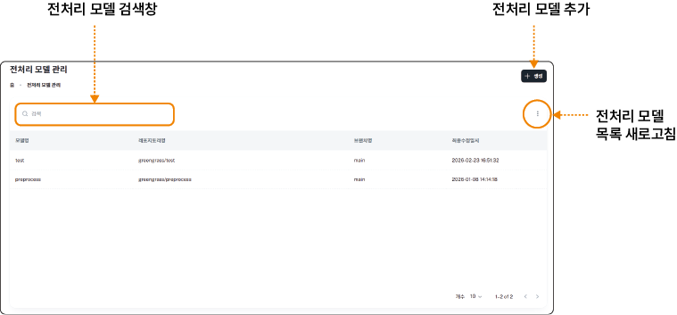

### 전처리 모델 추가하기

데이터 전처리 모델을 등록하려면 다음 순서대로 진행하세요.

1. 데이터 수집 시스템의 홈 화면에서 **전처리 모델 관리**를 클릭하세요.
2. 전처리 모델 관리 화면에서 **+ 생성**을 클릭하세요.
3. 전처리 모델 추가 화면에서 모델명을 입력하고 **생성**을 클릭하세요.

> **참고**
>
> - 전처리 모델은 추가만 할 수 있습니다. 모델을 삭제하려면 회사의 레포지토리 관리자에게 문의하세요.
> - 데이터 수집 시스템 사용 전 회사 데이터를 관리하는 레포지토리를 설정해야 합니다. 전처리 모델을 추가하면 회사별로 설정된 레포지토리 하위에 경로가 설정됩니다.
>   - 회사 레포지토리와 연동되지 않으며, 전처리 모델 경로 정보만 표시합니다.

## 프로젝트 목록 관리하기

프로젝트별로 장치를 추가해 데이터 수집을 설정하고 관리할 수 있습니다.

### 프로젝트 설정하기

등록한 프로젝트에 장치를 할당해 관리할 수 있습니다.

데이터 수집 프로젝트를 설정하려면 다음 순서대로 진행하세요.

1. 데이터 수집 시스템의 홈 화면에서 **프로젝트 목록**에서 원하는 프로젝트를 클릭하세요.
2. 프로젝트 관리 메뉴에서 **프로젝트 설정**을 클릭하세요.
3. 프로젝트 설정 화면에서 상세 정보를 확인하세요.
   - **프로젝트 정보**: 등록한 프로젝트 정보가 표시됩니다.
   - **위치**: 장치 위치가 지도에 표시됩니다.
   - **프로젝트 장치 목록**: 프로젝트에 할당한 장치 목록을 확인할 수 있습니다.

   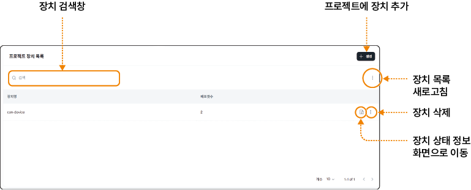

#### 프로젝트에 장치 추가

프로젝트에 장치를 추가하려면 다음 순서대로 진행하세요.

1. 프로젝트 장치 목록에서 **+ 생성**을 클릭하세요.
2. 프로젝트 장치 추가 화면에서 장치 정보의 **+ 추가**를 클릭하세요.
3. 장치 선택 창에서 등록된 장치 중 원하는 항목을 선택하세요.
   - 데이터 수집 시스템에 등록한 장치만 선택할 수 있으며, 각 장치는 하나의 프로젝트에만 추가할 수 있습니다.
4. 프로젝트 장치 추가 화면에서 **추가**를 클릭하세요.
   - 각 장치 항목에서 상세 정보를 확인하거나 삭제할 수 있습니다.

### 프로젝트 데이터 관리하기 {#프로젝트-데이터-관리하기}

자동차데이터플랫폼(KADaP) 클라우드에 저장된 장치별 데이터를 확인하고 관리할 수 있습니다.

프로젝트 데이터를 관리하려면 다음 순서대로 진행하세요.

1. 데이터 수집 시스템의 홈 화면에서 **프로젝트 목록**에서 원하는 프로젝트를 클릭하세요.
2. 프로젝트 관리 메뉴에서 **프로젝트 데이터 관리**를 클릭하세요.
3. 프로젝트 데이터 설정 화면에서 root 경로에 저장된 데이터를 확인하세요.

   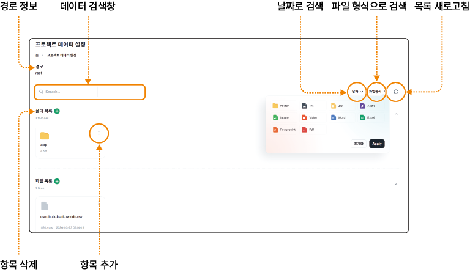

  - **파일형식**을 클릭해 필터링 항목을 선택하고 **Apply**를 클릭하면 해당 포맷 파일만 확인할 수 있습니다.
    - 검색창 하단에 선택한 파일형식 항목이 표시됩니다.
    - 파일형식 항목의 **X**를 클릭하거나 **초기화**를 클릭하면 선택한 항목을 해제할 수 있습니다.
  - 폴더 목록 중 **output**폴더 > 장치별 폴더에 전처리 모델로 처리된 데이터가 저장됩니다.
  - **폴더/파일 목록**의를 클릭하면 항목을 추가할 수 있습니다.
    - 폴더 생성 창이 열리면 폴더명을 입력하고 **생성**을 클릭해 추가합니다.
    - 파일 업로드 창이 열리면 업로드할 파일을 선택하고 **업로드**를 클릭해 추가합니다.
  - **폴더/파일 목록**의 를 클릭하면 선택한 항목을 삭제할 수 있습니다.
    - 파일 항목의 **다운로드**를 클릭하면 해당 파일을 PC로 다운로드할 수 있습니다.

### 장치 상태 정보 확인하기

프로젝트에 할당된 장치를 확인하고 수집된 데이터를 관리할 수 있습니다. 또한 n8n에 로그인해 데이터를 시맨틱 모델에 맞게 가공하도록 설정하며, 수집할 CAN 정보를 설정할 수 있습니다.

프로젝트의 장치 정보를 관리하려면 다음 순서대로 진행하세요.

1. 데이터 수집 시스템의 홈 화면에서 **프로젝트 목록**에서 원하는 프로젝트를 클릭하세요.
2. 프로젝트 관리 메뉴에서 **장치명**을 클릭하세요.
3. 장치 상태 정보 화면에서 탭을 클릭해 상세 정보를 확인하세요.

#### 기본 정보

장치 등록 정보, 모니터링 정보를 확인하고 장치 배포 설정을 할 수 있습니다.

- **장치 정보**: 등록한 장치 정보가 표시됩니다.
- **위치**: 장치 위치가 지도에 표시됩니다.
- **배포 정보**: CAN, 전처리, 센서 유형별로 장치 모델을 추가하고 배포하거나 관리할 수 있습니다.

  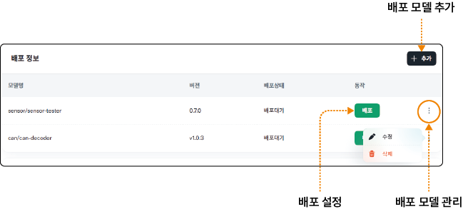

  - 동작 항목의 **배포**를 클릭하면 적용한 전처리 모델이 실행되며 데이터 수집이 시작됩니다. 배포 상태에서는 **정지**를 클릭해 실행을 중지할 수 있습니다.
  - 배포 모델 관리 항목에서 등록한 정보를 수정하거나 삭제할 수 있습니다.
- **장치 모니터링**: 장치의 하드웨어 및 네트워크 사용량을 모니터링할 수 있습니다.

##### 장치 모듈 추가

장치에 설정할 모듈의 상세 정보를 설정해 추가할 수 있습니다.

장치 모듈 정보를 추가하려면 다음 순서대로 진행하세요.

1. 배포 정보의 **+추가**를 클릭하세요.
2. 장치 모듈 추가 창에서 모듈 선택 항목의 **+선택**을 클릭하세요.
3. 모델 선택 창에서 모듈 유형을 선택하세요. 적용할 모델과 버전을 설정한 후 **+선택**을 클릭하세요.
4. 모듈의 필수 정보와 설정값 정보를 입력하고 **추가**를 클릭하세요.
   - 모듈을 선택한 후에만 필수 정보, 설정값 입력 항목이 표시됩니다.

   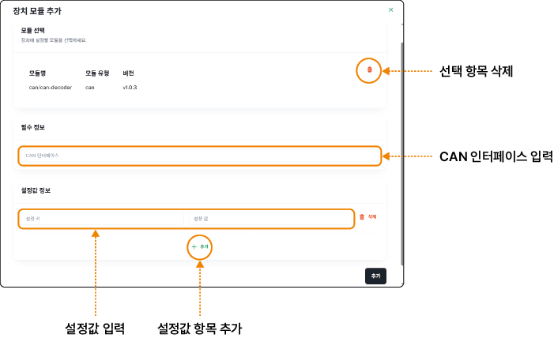

> **참고**
>
> 등록한 장치 모듈은**배포 모델 목록**>**배포 모델 관리** 항목을 클릭해 정보를 수정하거나 삭제할 수 있습니다.

#### 데이터 관리

**데이터 관리** 탭을 클릭하면 장치별로 전처리가 실행되기 전 로우 데이터를 확인할 수 있습니다.
- 데이터 관리 탭에서는 등록한 장치의 HDD에 저장된 정보를 검색할 수 있습니다. 필요 시 파일 업로드/다운로드 및 삭제를 실행할 수 있습니다.
- 데이터 관리 항목에 대한 자세한 정보는 [프로젝트 데이터 관리하기](#프로젝트-데이터-관리하기)를 참고하세요.

#### 노코드

**노코드** 탭을 클릭하면 노코드 워크플로우를 확인할 수 있습니다. 장치에 연결된 노코드 프로그램에 접속해 현재 정보를 가져와 표시합니다.

- n8n 로그인 화면에서 접속 정보를 입력해 상세 정보를 확인할 수 있습니다. n8n 사용 방법은 [https://docs.n8n.io/](https://docs.n8n.io/) 참고하세요.

#### CAN Viewer

**CAN Viewer** 탭을 클릭하면 장치에서 수집할 자동차 관련 CAN 데이터 항목을 설정할 수 있습니다.

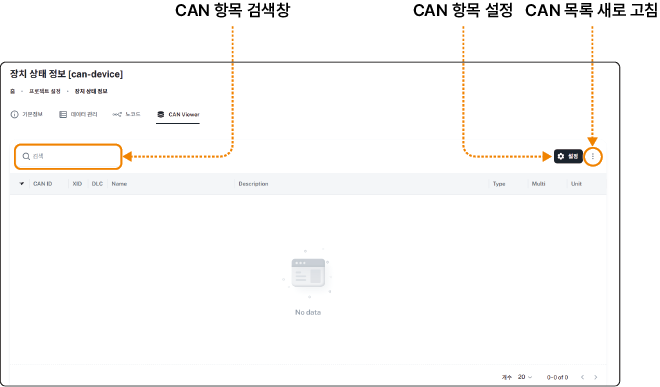

##### CAN 수집 항목 설정

장치에서 수집할 CAN 데이터 매핑 파일을 업로드하고 수집할 항목을 설정할 수 있습니다.

CAN 수집 항목을 설정하려면 다음 순서대로 진행하세요.

1. CAN Viewer 화면에서 **설정**을 클릭하세요.
2. CAN 필터링 창에서 **파일 선택**을 클릭해 CAN 데이터 매핑 파일을 업로드하세요.
   - CAN 데이터 정의 파일은 DCB, CSV 형식 파일만 업로드할 수 있습니다.
3. 업로드가 완료되면 CAN 목록에서 수집할 데이터 항목을 선택하고 **설정**을 클릭하세요.
   - 선택한 장치에 따라 설정할 수 있는 항목이 달라집니다.

# 데이터 교환 시스템

데이터 교환 시스템(KADaP-X Edge)에서는 데이터 자산과 계약 및 정책 정의, 계약 적용 후 데이터 공유를 실행할 수 있습니다. 데이터 공유 시스템의 제공자/소비자 역할에 따라 편리하게 커넥터를 생성하고 관리할 수 있습니다. 또한, 데이터 교환을 위해 필요한 데이터 자산 및 계약, 정책을 정의하고 관리할 수 있습니다.

> **참고**
>
> 데이터 교환 시스템에는 기관 회원 중 기업 정보 등록이 완료된 사용자만 접속할 수 있습니다.

## 홈 화면 구성

데이터 교환 시스템의 홈 화면은 다음과 같이 구성됩니다. 각 항목별 기능을 설명합니다.

| 번호 | 항목 | 설명 |
| --- | --- | --- |
| 1 | 데이터 교환 시스템 메뉴 | 데이터 수집 시스템의 메뉴를 선택합니다.<ul><li>**홈**: 홈 화면으로 이동합니다.</li><li>**커넥터 관리**: 제공자, 소비자 역할의 커넥터를 등록하고 관리할 수 있습니다.</li><li>**공유 자산**: 데이터 교환을 위해 자산을 업로드하고 자산, 정책, 계약을 등록하고 관리할 수 있습니다.</li><li>**디지털 트윈**: 데이터 교환 시 적용되는 AAS 표준을 기반으로 레지스트리 정보를 확인하고 서브 모델을 등록할 수 있습니다.</li><li>**PCF 관리**: 계약 완료 후 PCF(Product Carbon Footprint, 제품 탄소 발자국) 정보를 제공자에게 요청하고 응답 정보를 확인할 수 있습니다.</li><li>**커넥터 목록**: 제공자/소비자가 등록한 커넥터별로 데이터 교환 단계에서 필요한 정보를 등록하고 확인할 수 있습니다.</li></ul> |
| 2 | 조직 정보 | 로그인한 사용자가 속한 회사나 조직 이름이 표시됩니다. |
| 3 | 언어 설정 | 화면에 표시되는 언어를 한국어/영어 중에 선택할 수 있습니다. |
| 4 | 내 정보 | 로그인한 사용자 정보를 확인하고 로그아웃할 수 있습니다. |
| 5 | 데이터 공유 절차 안내 | 데이터 제공자/소비자가 데이터 공유를 위해 실행할 상세 절차를 설명합니다. |

## 커넥터 관리하기

데이터 제공자/소비자 역할에 맞는 커넥터를 등록하고 관리할 수 있습니다.

### 화면 구성

데이터 교환 시스템의 **커넥터 관리** 메뉴에서 커넥터를 등록하고 관리할 수 있습니다.

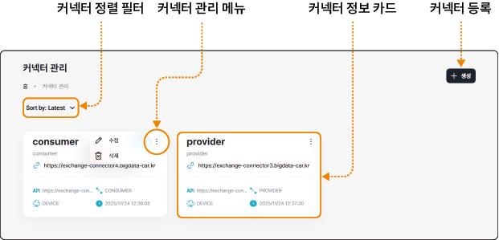

### 커넥터 생성하기

커넥터를 등록하려면 다음 순서대로 진행하세요.

1. 데이터 교환 시스템의 홈 화면에서 **커넥터 관리**를 클릭하세요.
2. **커넥터 관리** 화면에서 **생성**을 클릭하세요.
3. 커넥터 생성 화면에서 상세 정보를 입력하고 **생성**을 클릭하세요.
   - **커넥터명**: 사용할 커넥터명을 입력합니다.
     - 커넥터 유형과 동일하게 제공자일 경우 provider, 소비자인 경우 consumer를 입력하면 쉽게 용도를 확인할 수 있습니다.
   - **설명**: 등록할 커넥터 설명을 입력합니다.
   - **Dataspace**: 사용할 데이터스페이스를 선택합니다.
      - KADaP-X를 선택하면 해당 커넥터가 KADaP-X 데이터스페이스 내의 참여자로 등록되며, 동일한 데이터스페이스 안의 다른 커넥터와 데이터를 교환할 수 있습니다.
   - **커넥터 유형**: 등록할 커넥터 유형을 선택합니다.
      - 데이터 제공자일 경우 **provider**, 소비자인 경우 **consumer**를 선택합니다.
   - **서비스 형식**: 커넥터 서비스 형식을 선택합니다.
     - **Self Hosted**: 기업에서 커넥터를 직접 배포하고 운영하는 방식으로 보안이 중요한 경우 선택합니다.
     - **CaaS**(Connector as a Service): 자동차데이터플랫폼(KADaP)이 커넥터를 클라우드 환경에서 대신 호스팅하는 방식으로 별도의 서버를 구축하지 않아도 서비스를 이용할 수 있습니다.
   - **Base URL**: 커넥터의 컨트롤 플레인 주소로, 다른 참여자가 해당 커넥터에 접속하여 카탈로그 조회, 계약 정의 및 정책 정의 등 데이터 교환에 대한 정보을 확인할 때 사용하는 엔드포인트입니다.
   - **데이터플레인 URL**: 커넥터의 데이터 전송 영역 주소로, 계약이 완료된 후 실제 데이터를 주고받는 통로로 사용합니다.
   - **API Header**: 커넥터 API를 호출할 때 인증 정보를 전달하는 HTTP 헤더의 이름을 입력합니다.
   - **API Value**: 인증에 사용할 비밀번호나 토큰값을 입력합니다.

> **참고**
>
> 모든 온보딩 업체는 provider, consumer 커넥터를 등록해야 정상적으로 데이터 공유를 실행할 수 있습니다.

### 커넥터 정보 확인하기

커넥터 정보 카드의 **커넥터 관리** 메뉴를 클릭해 등록한 커넥터 정보를 확인하고 관리할 수 있습니다.

- 확인하려는 커넥터 정보 카드의 를 클릭하면 관리 메뉴가 표시됩니다.
  - **수정**: 커넥터 수정 화면으로 이동해 커넥터 정보를 수정할 수 있습니다.
  - **삭제**: 등록한 커넥터를 삭제합니다. 삭제한 커넥터는 복구할 수 없습니다.

## 공유 자산 관리하기

커넥터를 통해 교환할 데이터를 업로드하고 자산, 정책 및 계약을 정의해 등록할 수 있습니다.

### 자산 업로드하기

AAS 서브모델 템플릿에 맞게 자산을 가공한 후 저장소에 업로드할 수 있습니다.

> **참고**
>
> 서브모델은 국제 표준인 AAS 포맷에 따라 기술 데이터, 탄소 발자국 등 자산의 특정 정보를 표준화된 구조로 정의한 데이터 단위입니다. 모든 참여자가 동일한 필드 구조, 데이터 타입, 의미 정의에 맞춰 데이터를 작성하므로, 서로 다른 시스템과 조직 사이에서도 데이터 품질과 일관성을 유지하면서 데이터 교환을 할 수 있습니다.

공유할 자산을 업로드하려면 다음 순서대로 진행하세요.

1. 데이터 교환 시스템의 홈 화면에서 **공유 자산** > **자산 업로드**를 클릭하세요.
2. 자산 업로드 화면에서 + **생성**을 클릭하세요.
3. 서브모델 선택 창이 나타나면 데이터에 적용할 서브모델을 선택하고 **+ 선택**을 클릭하세요.
   - 를 클릭하면 서브모델 상세 창에서 버전 및 상세 정보를 확인할 수 있습니다.
4. 선택한 서브모델이 표시되면 자산 정보를 입력하고 **업로드**를 클릭하세요.

   

   - 서브모델을 선택한 후에만 자산을 입력하거나 업로드할 수 있습니다.
   - 자산 정보를 업로드하기 전에 서브모델의 템플릿이나 작성된 샘플 csv 파일을 다운로드해 상세 항목을 확인합니다. 템플릿에 맞게 자산을 입력해 파일을 업로드하면 자산을 일괄 업로드할 수 있습니다.
   - 자산 정보의 **+ 추가**를 클릭해 직접 세부 항목을 입력하거나 수정할 수 있습니다.

>  **참고**
>
> 자산 업로드가 완료되면 API 정보를 제공합니다. 실제 서비스 배포 시 해당 URL을 적용할 수 있습니다.

### 자산 정의하기

업로드한 자산 데이터를 데이터스페이스 내에서 식별하고 접근할 수 있도록 자산으로 등록합니다. 자산에 고유 ID, 데이터의 위치(엔드포인트), 유형, 설명 등 메타데이터를 정의하면 소비자가 카탈로그에서 해당 자산을 검색하고 확인할 수 있습니다.

#### 화면 구성

데이터 교환 시스템의 **공유 자산**> **자산 정의** 메뉴에서 자산을 정의하고 관리할 수 있습니다.

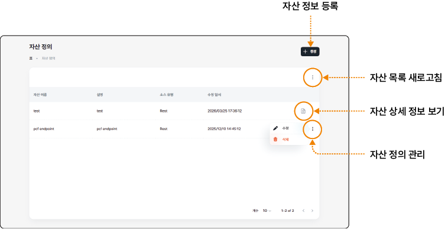

- 자산 정의 관리 항목에서는 자산을 수정하거나 삭제할 수 있습니다.
  - **수정**: 자산 편집 화면으로 이동해 자산 정보를 수정할 수 있습니다.
  - **삭제**: 등록한 자산을 삭제합니다. 삭제한 자산은 복구할 수 없습니다.

#### 자산 생성

자산의 메타데이터를 등록하려면 다음 순서대로 진행하세요.

1. 데이터 교환 시스템의 홈 화면에서 **공유 자산** > **자산 정의**를 클릭하세요.
2. 자산 정의 화면에서 + **생성**을 클릭하세요.
3. 자산 생성 화면에서 자산의 메타데이터를 입력하고 **생성**을 클릭하세요.
   - **자산**: 등록할 자산 이름과 상세 설명을 입력합니다.
   - **서브모델**: **+ 생성**을 클릭해 자산에 적용한 서브모델을 선택합니다.
     - 자산 업로드 시 선택한 서브모델과 동일한 항목을 선택해야 합니다.
     - 을 클릭하면 서브모델 창에서 상세 정보를 확인할 수 있으며, 을 클릭하면 서브모델을 다시 선택할 수 있습니다.
   - **소스 유형**: REST, CSV 중 소스 유형을 선택합니다.
     - **REST**: 데이터 교환 시스템이 외부 API에서 직접 데이터를 가져올 수 있도록 연결 정보 및 인증 정보를 설정합니다.
     - **CSV**: csv 파일을 직접 업로드한 경우 해당 파일이 실제 데이터 소스로 등록됩니다.
   - **소스 정보**: 자산 데이터가 업로드된 저장소에 접속할 때 필요한 엔드포인트 정보와 인증 정보를 입력합니다.
     - **엔드포인트**: 외부 API 호출 방식과 데이터를 가져올 외부 API 서버 URL을 입력합니다.
     - **인증**: 외부 API 서버 접속을 위한 인증 유형을 선택하고 Token URL 및 접속 시 필요한 Client ID와 Client Secret을 입력합니다.

   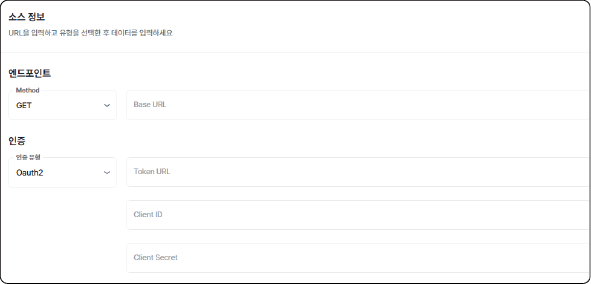

### 정책 정의하기

커넥터에 적용할 접근 정책과 사용 정책을 설정합니다. 데이터 제공자는 데이터 사용자 정보와 사용 범위 조건을 정의해 등록합니다. 이 정책을 적용하면 데이터를 공유하면서도 사용자와 사용 범위에 대한 통제권을 유지하는 데이터 주권을 실현할 수 있습니다.

#### 화면 구성

데이터 교환 시스템의 **공유 자산** > **정책 정의** 메뉴에서 데이터 사용 정책을 정의하고 관리할 수 있습니다.

- 정책 정의 관리 항목에서는 정책을 수정하거나 삭제할 수 있습니다.
  - **수정**: 정책 편집 화면으로 이동해 정책 정보를 수정할 수 있습니다.
  - **삭제**: 등록한 정책을 삭제합니다. 삭제한 정책은 복구할 수 없습니다.

#### 정책 생성

커넥터에 적용할 정책을 등록하려면 다음 순서대로 진행하세요.

1. 데이터 교환 시스템의 홈 화면에서 **공유 자산**>**정책 정의**를 클릭하세요.
2. 정책 정의 화면에서 + **생성**을 클릭하세요.
3. 정책 생성 화면에서 정책 상세 정보를 입력하고 **생성**을 클릭하세요.
   - **정책 정보**: 등록할 정책 이름과 상세 설명을 입력합니다.
   - **접근 정책**: 적용할 접근 정책을 추가합니다.
     - **+ 정책 추가**를 클릭해 유형과 값을 추가합니다. **삭제**를 클릭해 추가한 항목을 삭제할 수 있습니다.
   - **사용 정책**: 적용할 사용 정책을 추가합니다.
     - **+ 정책 추가**를 클릭해 유형과 값을 추가합니다. **삭제**를 클릭해 추가한 항목을 삭제할 수 있습니다.

### 계약 정의하기

데이터 제공자는 자산과 정책을 계약으로 묶어 등록합니다. 사전에 등록한 자산과 정책을 설정해 계약을 등록하며, 이 계약 정보가 데이터스페이스 카탈로그에 게시됩니다.

데이터 소비자는 등록된 계약 정보를 확인하고 계약을 요청하게 되며, 계약을 구독한 후에만 실제 데이터에 다운로드할 수 있습니다.

#### 화면 구성

데이터 교환 시스템의 **공유 자산** > **계약 정의** 메뉴에서 계약을 정의하고 관리할 수 있습니다.

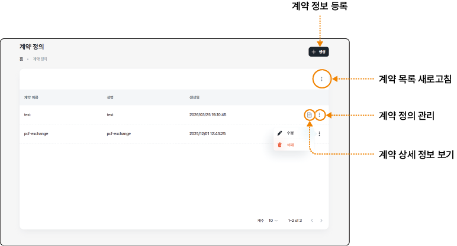

#### 계약 생성

커넥터에 적용할 계약을 등록하려면 다음 순서대로 진행하세요.

1. 데이터 교환 시스템의 홈 화면에서 **공유 자산** > **계약 정의**를 클릭하세요.
2. 계약 정의 화면에서 + **생성**을 클릭하세요.
3. 계약 생성 화면에서 계약상세 정보를 입력하고 **생성**을 클릭하세요.
   - **계약 정보**: 등록할 계약 이름과 상세 설명을 입력합니다.
   - **자산 설정**: 계약을 적용할 자산을 추가합니다.
     - **+ 생성**을 클릭해 사전에 등록한 자산 목록 중 선택한 후 **+ 선택**을 클릭합니다.
     - 자산 추가가 완료되면 상세 정보가 표시됩니다. 자산 이름 오른쪽의 을 클릭하면 추가한 자산을 삭제하고 다시 선택할 수 있습니다.
    - **정책 설정**: 계약을 적용할 정책을 추가합니다.
      - **+ 생성**을 클릭해 사전에 등록한 정책 목록 중 선택한 후 **+ 선택**을 클릭합니다.
      - 정책 추가가 완료되면 상세 정보가 표시됩니다. 정책 이름 오른쪽의 을 클릭하면 추가한 정책을 삭제하고 다시 선택할 수 있습니다.

## 디지털 트윈 관리하기

데이터스페이스의 레지스트리를 확인하고, 서브모델을 등록하거나 확인할 수 있습니다.

### 레지스트리 확인하기

레지스트리는 데이터스페이스 안에서 특정 자산이 어디에 있는지 알려주는 인덱스 역할을 합니다. 데이터 제공자/소비자는 레지스트리 메뉴에서 다음 항목을 확인할 수 있습니다.

- 데이터 제공자는 자산 업로드 및 자산 정의를 완료한 후 레지스트리에서 해당 디지털 트윈이 정상적으로 등록되었는지 확인할 수 있습니다.
- 데이터 소비자는 데이터스페이스에서 원하는 데이터 자산 정보를 확인할 수 있으며, 해당 자산에 연결된 서브모델과 엔드포인트 정보를 조회해 데이터 교환 여부를 결정합니다.

#### 레지스트리 정보 확인

데이터스페이스에 등록된 레지스트리를 확인하려면 다음 순서대로 진행하세요.

1. 데이터 교환 시스템의 홈 화면에서 **디지털 트윈**>**레지스트리**를 클릭하세요.
2. 디지털 트윈 레지스트리 화면에서 상세 정보를 확인할 레지스트리의 을 클릭하세요.

   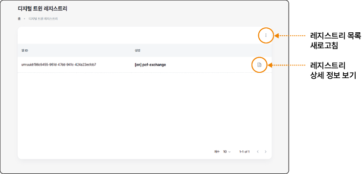

3. 디지털 트윈 쉘 상세 정보 창에서 상세 정보를 확인하세요.

### 서브모델 생성하기

디지털 트윈의 쉘에 연결되는 서브모델을 등록하고 상세 정보를 확인할 수 있습니다.

#### 화면 구성

데이터 교환 시스템의 **디지털 트윈** > **서브모델** 메뉴에서 서브모델을 등록할 수 있습니다.

  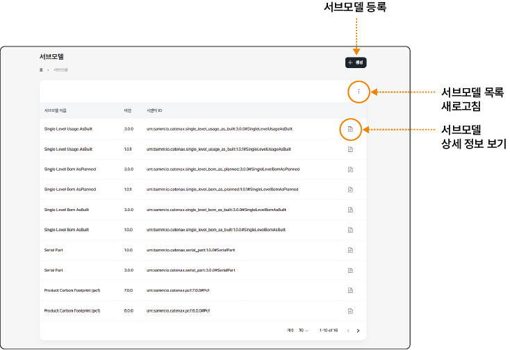

#### 서브모델 생성

디지털 트윈의 서브모델을 등록하려면 다음 순서대로 진행하세요.

1. 데이터 교환 시스템의 홈 화면에서 **디지털 트윈**>**서브모델**을클릭하세요.
2. 서브모델 화면에서 + **생성**을 클릭하세요.
3. 서브모델 생성 화면에서 **Upload file**을 클릭해 파일을 업로드하세요.
   - 서브모델은 json, aasx, xml 형식의 파일만 업로드할 수 있습니다.
4. 업로드가 완료되면 서브모델 정보를 확인하고 **업로드**를 클릭하세요.

#### 서브모델 정보 확인

**디지털 트윈** > **서브모델** 화면에서 상세 정보를 확인할 서브모델의 을 클릭하면 상세 정보 창이 열립니다. 서브모델 상세 정보 창에서 버전 및 시맨틱 ID 등 정보를 확인할 수 있습니다.

## PCF 관리하기

PCF(Product Carbon Footprint)는 제품의 생산 및 유통 과정에서 발생한 탄소 배출량 데이터입니다. 데이터 소비자는 계약이 완료된 후 부품의 PCF 데이터를 제공자에게 요청할 수 있습니다. PCF 데이터는 계약이 완료된 커넥터를 통해 데이터를 요청하고 다운로드할 수 있습니다.

### PCF 요청하기

데이터 교환 계약이 완료되면 PCF 데이터가 필요한 부품의 경우 데이터 제공자에게 해당 데이터 전달을 요청할 수 있습니다.

#### 화면 구성

데이터 교환 시스템의 **PCF 관리** > **PCF 요청** 메뉴에서 PCF 데이터를 요청할 수 있습니다.

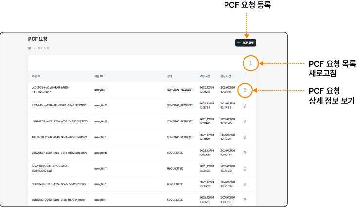

#### PCF 요청 생성

데이터 제공자에게 PCF 데이터를 등록하려면 다음 순서대로 진행하세요.

1. 데이터 교환 시스템의 홈 화면에서 **PCF 관리**>**PCF 요청**을클릭하세요.
2. PCF 요청 화면에서 **+PCF 요청**을 클릭하세요.
3. PCF 요청 화면에서 상세 정보와 커넥터 정보를 입력하고 **요청**을 클릭하세요.
   - **PCF 요청 정보**: 계약 정보에 포함되어 있는 BPN, 제품 ID를 확인해 입력하고, 추가로 전달할 메시지를 입력합니다.
   - **커넥터 정보**: PCF 데이터 요청을 전송할 커넥터를 선택합니다.
     - **+ 생성**을 클릭해 사전에 등록한 커넥터 목록 중 선택한 후 **+ 선택**을 클릭합니다. 커넥터 이름 오른쪽의 을 클릭하면 추가한 커넥터를 삭제하고 다시 선택할 수 있습니다.

### PCF 응답하기

데이터 계약이 완료된 후, 데이터 소비자가 부품의 PCF 데이터를 요청하면 지정된 커넥터로 전달합니다. 데이터 소비자는 제공자가 데이터 전달을 승인하면 커넥터를 통해 다운로드할 수 있습니다.

#### 화면 구성

데이터 교환 시스템의 **PCF 관리** > **PCF 응답** 메뉴에서 전달한 PCF 데이터 정보와 상태를 확인할 수 있습니다.

#### PCF 응답 확인

데이터 제공자가 전달한 PCF 데이터를 확인하려면 다음 순서대로 진행하세요.

1. 데이터 교환 시스템의 홈 화면에서 **PCF 관리**>**PCF 응답**을 클릭하세요.
2. PCF 응답 화면에서 응답 목록의 항목을 확인하세요.
   - 상태 항목에서 **승인 완료**가 표시되면 지정된 커넥터로 PCF 데이터를 다운로드할 수 있습니다.

## 커넥터 목록 관리하기

데이터 교환 시스템에는 사용자는 역할별 커넥터를 생성해 데이터 교환 구독을 실행할 수 있습니다. 데이터 제공자가 커넥터를 생성해 자산을 업로드하고 정책, 계약을 정의해 오퍼링을 등록하면 카탈로그에 게시됩니다. 데이터 소비자는 카탈로그에서 원하는 데이터를 검색해 데이터 교환 계약을 구독합니다. 구독이 승인되면 소비자는 제공자가 업로드한 자산을 다운로드해 이용할 수 있습니다.

커넥터 목록에서는 역할별 커넥터 정보를 확인하고 필요한 업무를 빠르게 실행할 수 있습니다.

### 제공자 (provider)

제공자 커넥터의 주요 업무를 실행하고 진행 상태를 확인할 수 있습니다.

#### 오퍼링 업로드

사전에 등록한 계약을 선택해 커넥터에 업로드할 수 있습니다.

계약을 업로드하려면 다음 순서대로 진행하세요.

1. 데이터 교환 시스템의 홈 화면에서 **커넥터 목록**>**provider [제공자]**>**오퍼링 업로드**를 클릭하세요.
2. 오퍼링 업로드 화면에서 + **생성**을 클릭하세요.
3. 계약 선택 창이 나타나면 적용할 계약을 선택하고 **+ 선택**을 클릭하세요.
   - 를 클릭하면 서브모델 상세 창에서 버전 및 상세 정보를 확인할 수 있습니다.
4. 선택한 계약의 자산 및 정책 정보가 표시되면 상세 내용을 확인하고 **업로드**를 클릭하세요.
   - 계약 이름 오른쪽의 을 클릭하면 추가한 계약을 삭제하고 다시 선택할 수 있습니다.

#### 계약 관리

소비자와의 계약 정보 및 상태를 확인하고 구독을 관리할 수 있습니다.

계약을 확인하려면 다음 순서대로 진행하세요.

1. 데이터 교환 시스템의 홈 화면에서 **커넥터 목록**>**provider [제공자]**>**계약 관리**를 클릭하세요.
2. 계약 관리 화면에서 계약 상세 정보를 확인하세요.

   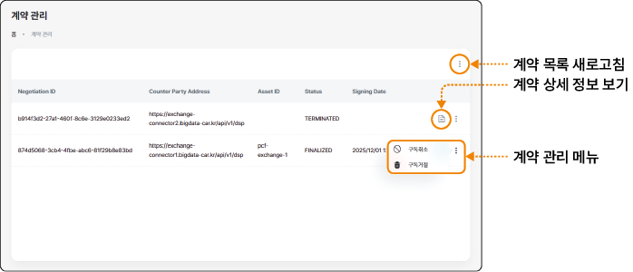

   - **Negotiation ID**: 계약을 식별하는 고유 번호로 시스템이 자동으로 부여합니다.
   - **Counter Party Address**: 계약을 요청한 데이터 소비자의 커넥터 주소 정보입니다. 이 커넥터 정보로 데이터가 실제로 전달됩니다.
   - **Asset ID**: 계약에 포함된 자산ID로 제공자가 자산을 정의할 때 등록한 이름을 표시합니다.
   - **Status**: 해당 계약의 상태를 표시합니다.
     - FINALIZED 상태인 경우에만 계약이 최종 체결되어 데이터 교환이 진행됩니다.
   - **Signing Date**: 계약이 최종 확정된 날짜를 표시합니다. 날짜 정보는 체결된 계약에만 표시됩니다.
   - 를 클릭하면 계약 상세 창에서 자산 및 정책 정보를 확인할 수 있습니다.
   - 를 클릭하면 계약 관리 메뉴에서 구독을 취소하거나 거절할 수 있습니다.
      - **구독 취소**: 계약이 체결된 후 제공자가 구독을 취소할 수 있습니다. 계약 완료 후 소비자가 사용 정책을 위반했거나, 더 이상 데이터 제공이 어려운 경우 사용합니다.
     - **구독 거절**: 소비자가 계약을 요청했을 때 구독을 거절할 수 있습니다. 정책 조건에 맞지 않거나 신뢰할 수 없는 소비자인 경우 계약이 체결되기 전에 사용할 수 있습니다.

#### 전송 이력

계약이 완료된 후 데이터 소비자의 데이터 요청 이력 및 전송 결과를 확인할 수 있습니다.

전송 이력을 확인하려면 다음 순서대로 진행하세요.

1. 데이터 교환 시스템의 홈 화면에서 **커넥터 목록**>**provider [제공자]**>**전송 이력**을 클릭하세요.
2. 전송 이력 화면에서 전송 이력 및 결과를 확인하세요.

   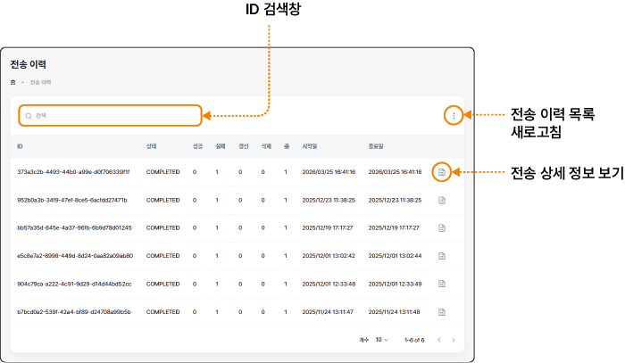

    - **ID**: 데이터 전송을 식별하는 ID로 전송 상세 내역을 조회할 때 사용됩니다.
    - **상태**: 데이터 전송의 처리 결과를 보여줍니다.
      - **성공/실패** 항목의 숫자로 실제 데이터의 정상 전송 여부를 확인할 수 있습니다.
      - **갱신/삭제** 항목의 숫자로 데이터의 변경 및 삭제 여부를 확인할 수 있습니다.
    - **시작일**: 소비자가 다운로드를 요청한 시점으로 데이터 전송이 시작된 일시입니다.
    - **종료일**: 데이터 전송이 완료된 일시입니다. 시작일과 종료일을 비교해 전송에 소요된 시간을 확인할 수 있습니다.
    - 를 클릭하면 전송된 데이터의 상세 정보를 확인할 수 있습니다.

### 소비자 (consumer)

소비자 커넥터의 주요 업무를 실행하고 처리 상태를 확인할 수 있습니다.

#### 카탈로그 조회

카탈로그에서 데이터 제공자가 등록한 계약 정보를 확인할 수 있습니다.

카탈로그에서 제공자 정보를 조회하려면 다음 순서대로 진행하세요.

1. 데이터 교환 시스템의 홈 화면에서 **커넥터 목록**>**consumer [소비자]**>**카탈로그 조회**를 클릭하세요.
2. 카탈로그 조회 화면에서 데이터 제공자의 BPN 정보를 입력하고 **검색**을 클릭하세요.
   - 제공자의 BPN 정보는 **데이터 교환 시스템 포탈** > **파트너 네트워크** 메뉴에서 확인할 수 있습니다.
3. 입력한 데이터 제공자의 계약 정보가 표시되면 원하는 계약을 선택해 구독을 신청하세요.

소비자가 구독을 신청하면 제공자에게 내역이 전송됩니다. 제공자가 구독을 승인하면 계약이 체결되어 계약 정보를 확인하고 실제 데이터를 다운로드할 수 있습니다.

#### 계약 관리

제공자와의 계약 정보 및 상태를 확인하고 구독을 관리할 수 있습니다.

계약을 확인하려면 다음 순서대로 진행하세요.

1. 데이터 교환 시스템의 홈 화면에서 **커넥터 목록**>**consumer [소비자]**>**계약 관리**를 클릭하세요.
2. 계약 관리 화면에서 계약 상세 정보를 확인하세요.

   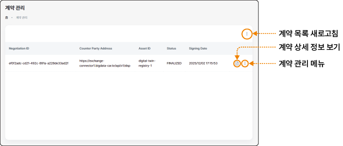

   - **Negotiation ID**: 계약을 식별하는 고유 번호로 시스템이 자동으로 부여합니다.
   - **Counter Party Address**: 계약을 요청한 데이터 소비자의 커넥터 주소 정보입니다. 이 커넥터 정보로 데이터가 실제로 전달됩니다.
   - **Asset ID**: 계약에 포함된 자산ID로 제공자가 자산을 정의할 때 등록한 이름을 표시합니다.
   - **Status**: 해당 계약의 상태를 표시합니다.
     - FINALIZED 상태인 경우에만 계약이 최종 체결되어 데이터 교환이 진행됩니다.
   - **Signing Date**: 계약이 최종 확정된 날짜를 표시합니다. 날짜 정보는 체결된 계약에만 표시됩니다.
    - 를 클릭하면 계약 상세 창에서 자산 및 정책 정보를 확인할 수 있습니다.
   - 를 클릭하면 계약 관리 메뉴에서 데이터를 다운로드하고 구독을 취소할 수 있습니다.
     - **다운로드**: 계약이 정상 체결되면 제공자에게 데이터 다운로드를 요청할 수 있습니다.
     - **구독 취소**: 계약이 체결된 후 소비자가 구독을 취소할 수 있습니다.

#### 다운로드 이력

계약이 완료된 후 데이터 다운로드 이력 및 전송 결과를 확인할 수 있습니다.

다운로드 이력을 확인하려면 다음 순서대로 진행하세요.

1. 데이터 교환 시스템의 홈 화면에서 **커넥터 목록**>**consumer [소비자]**>**다운로드 이력**을 클릭하세요.
2. 다운로드 이력 화면에서 다운로드 이력 및 결과를 확인하세요.

   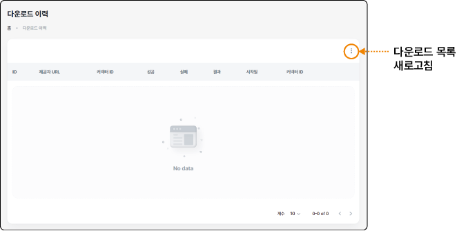

   - **ID**: 데이터 전송을 식별하는 ID로 다운로드 상세 내역을 조회할 때 사용됩니다.
   - **제공자 URL**: 데이터 제공자의 저장소 URL 정보를 표시합니다.
   - **상태**: 데이터 전송의 처리 결과를 보여줍니다.
     - **성공/실패** 항목에서 실제 데이터의 정상 전송 여부를 확인할 수 있습니다. 
     - **갱신/삭제** 항목에서 데이터의 변경 및 삭제 여부를 확인할 수 있습니다.
   - **시작일**: 데이터 다운로드가 시작된 일시입니다.
   - **종료일**: 데이터 다운로드가 완료된 일시입니다. 시작일과 종료일을 비교해 다운로드에 소요된 시간을 확인할 수 있습니다.
   - 를 클릭하면 다운로드한 데이터의 상세 정보를 확인할 수 있습니다.