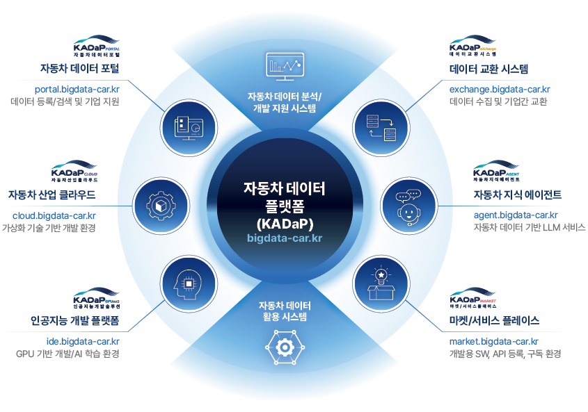
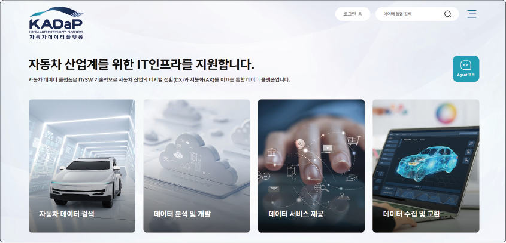
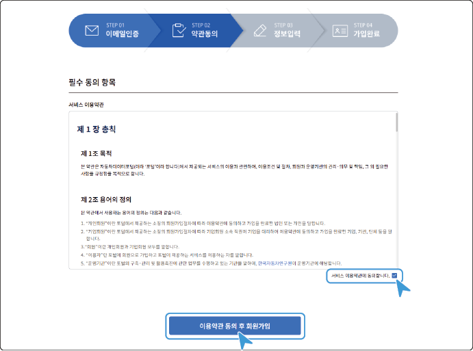
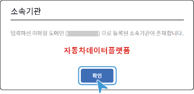
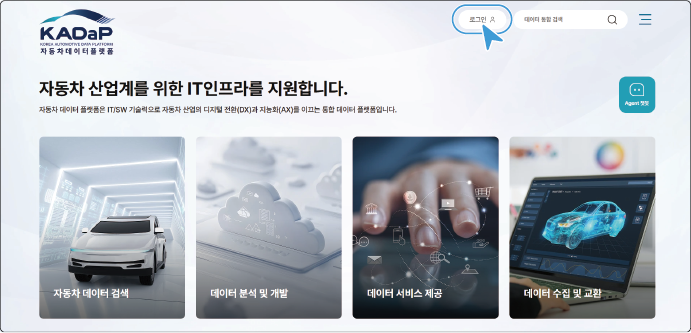
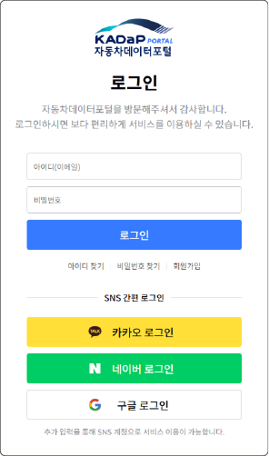

# 문서 목적

이 매뉴얼은 데이터 분석을 원하는 일반 사용자부터 기업 SW/AI 개발자에 이르기까지, 다양한 사용자가 **자동차데이터플랫폼(KADaP)**을 쉽고 효과적으로 활용할 수 있도록 돕는 것을 목적으로 합니다. 자동차데이터플랫폼(KADaP)의 다양한 기능과 사용 절차를 상세하게 설명함으로써, 사용자가 필요한 정보를 빠르게 찾아 적용할 수 있도록 안내합니다.

# 대상 독자

이 매뉴얼은 일반 사용자부터 자동차 산업 종사자, 데이터 분석가, AI 개발자에 이르기까지 폭넓은 독자층을 대상으로 합니다.

- **일반 사용자**: 자동차 데이터 검색 및 활용에 관심 있는 일반인, 관련 종사자
- **기업 및 기관 개발자**: 제조 공정 효율화, 부품 개발, 데이터 분석 업무 담당자
- **연구자 및 학계 종사자**: 자동차 산업, 모빌리티 서비스 관련 데이터 기반 연구자
- **AI 모델 학습/개발자**: AI 모델 개발을 위해 자동차 데이터와 GPU 서비스를 활용하려는 사용자

# 문서 사용 방법

이 매뉴얼은 자동차데이터플랫폼(KADaP)의 기능과 활용 방법을 각 서비스별로 독립적으로 구성하였으며 사용 절차를 단계적으로 이해할 수 있도록 설명하고 있습니다.

사용자는 아래 안내에 따라 필요한 정보를 빠르게 찾아볼 수 있으며, 아이콘과 표기 규칙을 통해 자동차데이터플랫폼(KADaP) 활용 시 유의해야 할 주요 내용을 직관적으로 식별할 수 있습니다.

## 문서 구성

사용자 매뉴얼의 구성과 내용은 다음과 같습니다.

|     | 구성 |    | 설명 |
| --- | --- | --- | --- |
| Part 1 | 자동차 데이터 포털 |  | 국내외 공개 데이터, 기업 보유 비공개 데이터, 한국자동차연구원이 제공하는 데이터를 키워드나 세분화된 카테고리를 이용해 검색하고 활용하는 방법을 설명합니다. |
| Part 2 | 자동차 산업 클라우드 |  | 프라이빗 클라우드 기반의 데이터 처리, 분석, AI 알고리즘 개발 환경을 구성하기 위해 필요한 가상 서버와 디스크 생성 및 활용 방법을 설명합니다. |
| Part 3 | 인공지능 개발 솔루션 |  | AI 기술 개발을 위해 제공되는 GPU를 활용하여 웹기반 AI 모델 개발, AI 모델 학습 방법을 설명합니다. |
| Part 4 | 마켓/서비스 플레이스 |  | 개발을 위해 필요한 소프트웨어, 알고리즘, AI 모델을 SW as a Service와 API as a Service 형태로 사용자가 직접 제공하거나 구독하여 사용하는 방법을 설명합니다. |
| Part 5 | 데이터 교환 시스템 |  | 제조 설비 및 차량에서 생성되는 데이터를 수집하고, 기업 간에 데이터를 안전하게 교환할 수 있는 방법을 설명합니다. |
| Part 6 | 자동차 지식 에이전트 |  | 자동차 분야 전문 지식을 학습한 특화 챗봇을 활용해 사용자의 질의에 응답하고, 분석 결과를 바탕으로 보고서를 생성하는 방법을 설명합니다. |

## 아이콘 및 표기 규칙

이 매뉴얼에서는 사용자의 이해를 돕고 중요한 정보를 강조하기 위해 다음과 같은 아이콘과 표기 규칙을 사용합니다.

| 아이콘/표기 | 의미 |
| --- | --- |
| 참고 | 사용자의 이해를 돕기 위한 추가 정보나 배경 지식을 안내할 때 사용합니다. |
| 주의 | 자동차데이터플랫폼(KADaP) 사용 시 발생할 수 있는 오류나 위험을 예방하기 위해 주의사항을 안내할 때 사용합니다. |
| 웹매뉴얼 | 더 자세한 내용을 웹매뉴얼로 안내할 때 사용합니다. |
| 바로가기 | URL로 직접 이동할 수 있는 링크를 표기할 때 사용합니다. |
| **볼드 표기** | 자동차데이터플랫폼(KADaP) 내의 메뉴 이름, 버튼 레이블 등 UI 용어를 표시할 때 사용합니다. |
| **>** | 메뉴 경로를 표시할 때 사용합니다. |

## 주요 용어 설명

자동차데이터플랫폼(KADaP) 및 자동차 데이터와 관련된 주요 용어는 다음과 같습니다.

| 용어 | 설명 |
| --- | --- |
| 자동차데이터플랫폼(KADaP) | **K**orea **A**utomotive **Da**ta **P**latform의 약어로, 국내 최초의 자동차산업 데이터 활용을 위한 개방형 플랫폼을 의미합니다. 자동차 부품·제조, 정비, 자율주행 등 다양한 분야의 데이터 활용을 활성화하기 위해 다양한 서비스를 통합 제공하는 자동차 분야 특화 플랫폼입니다. |
| 자동차 데이터 포털 | 자동차데이터플랫폼(KADaP)의 대표 서비스로, 다양한 자동차 관련 데이터를 검색하고 활용할 수 있는 창구입니다. 사용자는 데이터를 검색하여 다운로드하거나, 필요한 데이터를 생성 요청할 수 있습니다. |
| 산업 클라우드 | 자동차데이터플랫폼(KADaP)에서 제공하는 클라우드 컴퓨팅 환경으로, 대용량 데이터 처리와 AI 알고리즘 학습에 필요한 IT 인프라를 갖춘 공간입니다. 이용자는 별도의 고성능 장비가 없어도 이 클라우드 상에서 데이터 분석이나 모델 훈련을 수행할 수 있습니다 |
| 인공지능개발솔루션(GPUaaS) | AI 및 빅데이터 기반 기술 개발을 위해 고성능 GPU 연산 자원을 클라우드 형태로 제공합니다. 사용자는 별도의 장비 없이도 통합 개발 환경에서 자동차 데이터를 불러와 학습과 분석을 수행할 수 있으며, 이를 통해 AI 모델 개발과 연구를 효율적으로 진행할 수 있습니다. |
| (탈중앙) 데이터 교환 시스템 | 기관 간 또는 기관 내 자동차 데이터를 안전하고 효율적으로 주고받을 수 있도록 지원하며, 데이터의 표준화와 품질 검증, 접근 권한 관리 등을 통해 산업 전반의 데이터 연계 활용성을 높이는 핵심 역할을 수행합니다.
| OAS(OpenAPI Specification) | RESTful API의 구조와 동작을 표준 형식으로 기술하기 위한 규격으로, API의 요청/응답 형식, 경로, 파라미터, 보안 방식 등을 문서화하여 사람이 읽기 쉽고 시스템이 이해할 수 있도록 정의한 명세입니다. |
| 마이디스크 | 사용자에게 제공되는 개인 저장공간으로, 자동차데이터플랫폼(KADaP) 내의 서비스와 연계(mount)되어 활용할 수 있습니다. |

# 저작권 및 법적 고지

아래 고지 사항을 숙지하시고, 자동차데이터플랫폼(KADaP) 이용뿐 아니라 매뉴얼 활용 시에도 준수해 주세요.

## 저작권 안내

©2026 KATECH(Korea Automotive Technology Institute) All right reserved.

- 이 매뉴얼의 내용과 구성은 한국자동차연구원의 지적 재산이며, 법적으로 보호를 받습니다.
- 매뉴얼에 수록된 내용, 이미지 및 자료에 대한 저작권은 해당 소유자에게 귀속됩니다.
- 저작권자의 사전 허가 없이 이 매뉴얼의 내용을 무단으로 발췌하거나 복제, 변경하여 배포하는 행위는 법률로 금지되어 있습니다.
- 자동차데이터플랫폼(KADaP) 로고나 명칭 또한 관련 법령에 따라 보호를 받으며, 허가되지 않은 사용을 삼가 주세요.

## 배포/복제 제한 안내

- 승인되지 않은 사본의 배포는 최신 정보의 전달을 방해하고 잘못된 정보 확산의 원인이 될 수 있으므로 제한하고 있습니다. 특히 전자 파일 형태의 매뉴얼을 타인과 공유할 때에는 내용이 변경되지 않았는지 유의하시고, 반드시 최신 버전을 자동차데이터플랫폼(KADaP) 공식 홈페이지에서 다운로드하여 사용하세요.
- 교육이나 공익적인 목적으로 이 매뉴얼의 일부를 인용하는 경우에는 출처를 명시해 주세요.

## 면책 조항

- 한국자동차연구원은 이 매뉴얼의 내용에 최선을 다해 정확한 정보를 제공하고자 노력하였으나, 제공되는 정보의 완전성과 최신성을 보증하지는 않습니다.
- 자동차데이터플랫폼(KADaP)의 기능이나 정책은 지속적으로 개선될 수 있으므로, 이 매뉴얼의 내용은 사전 공지 없이 변경될 수도 있습니다. 따라서 사용자는 항상 자동차데이터플랫폼(KADaP)의 공식 업데이트 및 공지사항을 참고하여 최신 정보를 확인해야 합니다.
- 이 매뉴얼의 내용을 참고하여 자동차데이터플랫폼(KADaP)을 이용하는 과정에서 발생한 직·간접적인 손해나 문제에 대해 한국자동차연구원은 책임을 지지 않습니다. 아울러, 자동차데이터플랫폼(KADaP)에서 제공되는 데이터의 품질이나 타당성에 대한 판단 책임은 사용자에게 있으며, 자동차데이터플랫폼(KADaP)은 제공되는 데이터나 서비스 활용에 따른 결과에 대해 어떠한 보증도 하지 않습니다.

# 보안 및 개인정보 보호 안내

자동차데이터플랫폼(KADaP)은 안전한 데이터 활용 환경을 조성하고 사용자의 소중한 개인정보를 보호하기 위해 만전을 기하고 있습니다. 자동차데이터플랫폼(KADaP) 이용 시 지켜야 할 보안 수칙과 개인정보 보호 사항을 숙지해 주세요.

## 개인정보 보호 관련 안내

- 자동차데이터플랫폼(KADaP)은 「개인정보 보호법」 등 관련 법령을 준수하며, 사용자의 개인정보를 안전하게 관리합니다.
- 회원 가입 시 수집되는 이름, 이메일 주소 등 개인 식별 정보는 서비스 제공 및 사용자 인증, 통계 분석 등의 목적 범위 내에서만 활용됩니다.
- 수집된 개인정보는 사용자의 동의 없이 제3자와 공유되지 않으며, 엄격한 접근 통제와 암호화 기법을 통해 무단 접근나 유출로부터 보호됩니다.
- 자동차데이터플랫폼(KADaP)은 개인정보 처리방침을 통해 어떠한 정보가 수집되고 이용되는지 투명하게 공개하고 있으며, 사용자는 언제든지 자신의 개인정보를 열람, 수정 또는 삭제를 요청할 권리가 있습니다.
- 개인정보와 관련된 문의사항은 자동차데이터플랫폼(KADaP) 운영팀(admin@bigdata-car.kr)으로 연락주세요.

## 계정/접속 관련 주의사항

- 사용자 계정의 보안은 사용자 본인의 책임과 주의에 달려 있습니다. 자동차데이터플랫폼(KADaP)을 이용하기 위해 발급받은 계정의 비밀번호는 보안 기준에 적합하게 설정하고, 정기적으로 변경하여 계정 도용을 방지해 주세요.
- 본인의 인증 정보를 타인과 공유하거나 노출되지 않게 주의하여야 하며, 공용 컴퓨터를 이용한 후에는 반드시 로그아웃하여 세션 정보를 삭제하세요. 만약 의심스러운 로그인이 감지되거나 계정 보안에 문제가 발생한 경우, 즉시 비밀번호를 변경하고 필요한 경우 자동차데이터플랫폼(KADaP) 운영팀(admin@bigdata-car.kr)으로 연락주세요.
- 자동차데이터플랫폼(KADaP)은 사용자의 데이터 안전을 위하여 계정 권한에 따른 접근 제한을 두고 있으며, 강력한 보안 장치를 통해 기업 비밀에 해당하는 민감 데이터가 외부로 유출되지 않도록 보호하고 있습니다.
- 자동차데이터플랫폼(KADaP) 접속 시에는 가급적 신뢰할 수 있는 네트워크 환경을 사용하고, 악성 프로그램 예방을 위해 개인 PC의 보안 상태(백신 프로그램 업데이트 등)를 항상 최신으로 유지해 주세요.

# 자동차데이터플랫폼(KADaP) 개요

## 소개

자동차데이터플랫폼(KADaP)은 국내 자동차 산업의 데이터 활용 활성화와 AI 기술 기반의 혁신을 지원하기 위해 구축된 통합 데이터 플랫폼입니다. 산업계 전반에서 요구되는 데이터 수집, 저장, 분석, 활용, 교환까지의 전 과정을 단일 환경에서 처리할 수 있도록 설계되었으며, 이를 통해 자율주행, 전기차, 배터리 관리, 고장 예지 등 미래차 기술 개발에 필요한 기반을 제공합니다.

데이터는 자동차 분야의 보유 데이터, 연동 데이터, 외부/해외 데이터로 다양하게 구성되어 있고, 자체 구축된 보안 데이터센터에 저장·관리됩니다. 사용자는 클라우드 기반 개발 환경, GPU 학습 환경, API 및 SaaS 마켓 플레이스, 데이터 교환 시스템 등을 통해 데이터 기반의 AI 개발, 분석, 기술 실증(상품화)을 효과적으로 수행할 수 있습니다.

## 시스템 구성

자동차데이터플랫폼(KADaP)의 주요 시스템 구성은 다음과 같습니다.

## 주요 기능과 특징

자동차데이터플랫폼(KADaP)이 제공하는 주요 기능과 특징은 다음과 같습니다.

**통합형 플랫폼**

데이터 수집, 관리, 분석, 서비스 제공까지 전 단계를 포괄하는 다양한 시스템으로 구성되어 있어서 단일 환경에서 자동차 데이터를 활용한 개발과 서비스 운영을 효율적으로 수행할 수 있습니다.

**자동차 산업에 특화된 개발 환경**

자체 클라우드에서 SDV, 자율주행 등의 기술 개발에 필요한 솔루션이 설치된 가상 서버를 생성할 수 있습니다.
무료로 제공되는 GPU 자원을 활용하여 AI 모델 개발과 학습을 할 수 있습니다. 개발에 필요한 SW/API를 설치 없이 구독하여 바로 사용할 수 있습니다.

**데이터 수집 및 기업간 교환 지원**

기업의 제조공정 데이터 및 차량의 운행 데이터 수집 기능을 제공하며, 수집된 데이터의 국내 또는 국외 기업(Dataspace, Catena-x)간 교환을 지원합니다. 탈중앙 방식을 적용하여 데이터는 기업내에서만 이동되며, 외부에 노출되지 않습니다.

**안전한 데이터 저장 인프라**

자체 데이터센터 내 3개 랙 존(데이터 서버, 클라우드 서버, GPU 서버)을 구성하여 외부 클라우드가 아닌 독립된 자체 서버 및 보안 체계를 통해 산업 데이터를 보호합니다.

**포인트 기반 서비스 활용**

포인트 및 포인트 플러스를 적립하여 자동차데이터플랫폼(KADaP) 내 다양한 서비스를 이용할 수 있습니다. 적립된 포인트는 데이터 이용 및 서비스 신청 시 사용할 수 있습니다.

**기업의 기술 실증 지원**

자동차 데이터를 활용하여 개발된 기업의 결과물 실증 시 필요한 인증, 판매 승인, 과금, 모니터링, 보안 기능을 제공합니다. 자동차데이터플랫폼(KADaP) 사용자를 대상으로 베타 서비스 제공이 가능합니다.

# 시작하기

자동차데이터플랫폼(KADaP)을 처음 사용하는 사용자를 위해 사이트에 접속하고 회원 가입 절차를 단계별로 설명합니다. 가입한 계정으로 로그인하면 자동차데이터플랫폼(KADaP)의 다양한 서비스를 이용할 수 있습니다.

## 사이트 접속하기

자동차데이터플랫폼(KADaP)을 이용하려면 웹 브라우저를 통해 사이트에 접속해야 합니다.

자동차데이터플랫폼(KADaP)의 URL([bigdata-car.kr](https://bigdata-car.kr))을 브라우저의 주소창에 입력하여 사이트에 접속하세요. 자동차데이터플랫폼(KADaP) 메인 화면이 표시됩니다.

## 회원 가입하기 {#회원-가입하기}

자동차데이터플랫폼(KADaP)에서 제공되는 다양한 서비스를 이용하려면 회원가입이 필요합니다.

회원은 일반사용자와 기관(기업)사용자로 구분됩니다. 가입 유형에 따라 이용할 수 있는 서비스가 일부 제한됩니다.

- **일반사용자** | 네이버, 구글 등 이메일 주소로 가입하여 소속기관/기업 식별이 어려운 사용자 계정
- **기관사용자** | 소속기관/기업 이메일 주소로 가입하여 소속기관/기업 식별이 가능한 사용자 계정
>  **참고**
>
>- 보안상 일부 서비스는 사용자 확인이 가능한 '기관사용자'만 이용할 수 있습니다.
>- 사용자는 일반사용자 및 기관사용자 동시 회원 가입이 가능합니다.

### 회원 가입

자동차데이터플랫폼(KADaP)에 회원으로 가입하려면 다음 순서대로 진행하세요.

1. **자동차데이터플랫폼(KADaP)**([www.bigdata-car.kr](https://www.bigdata-car.kr)) > **자동차 데이터 포털**을 클릭하세요.

> **바로가기**
>
>다음의 경로로 바로 접속할 수 있습니다.
>- **자동차 데이터 포털**: [portal.bigdata-car.kr](https://portal.bigdata-car.kr)

2. 오른쪽 상단의 **회원가입**을 클릭하세요.

   - 회원가입 화면으로 이동합니다.

   

3. 회원가입 화면에서 **회원가입**을 클릭하세요.

   - 이메일 인증 화면으로 이동합니다.

   

4. 이메일 인증을 위한 항목을 입력한 후, **회원가입**을 클릭하세요.

   

   - **이메일**: 인증 및 사용자 계정으로 사용할 이메일 주소를 입력하세요.
     - 일반사용자로 가입 시 우측의 드롭다운 항목에서 도메인을 선택하거나, 원하는 도메인이 없으면 **직접입력**을 선택한 후 입력하세요.
      - 기관사용자로 가입 시 **직접입력**을 선택한 후 입력하세요.
   - **인증코드 요청**: 이메일 주소를 입력한 후, **인증코드 요청**을 클릭하세요. 입력한 이메일 주소로 인증 알림 메일이 전송됩니다.
   - **인증코드**: 이메일로 받은 인증 코드를 입력하세요.

>  **참고**
>
> 자동차데이터플랫폼(KADaP)에서는 이메일 주소를 아이디로 사용하며 등록한 이후에는 변경할 수 없습니다.

5. **일반사용자 가입하기** 또는 **기관가입자 가입하기**를 클릭하세요.
   - 약관동의 화면으로 이동합니다.

   

6. 서비스 이용약관의 내용을 확인하세요. **서비스 이용약관에 동의합니다** 항목에 체크한 후, **이용약관 동의 후 회원가입**을 클릭하세요.
   - 정보입력 화면으로 이동합니다.

   

7. 사용자 정보를 입력한 후, **회원가입(기업회원)**을 클릭하세요.

   

   - **이메일**: 이메일인증 화면에서 입력한 이메일 주소가 자동으로 표시됩니다.
   - **비밀번호**: 비밀번호를 입력하세요.
     - 영문 대/소문자, 숫자, 특수문자(!@#$%^&*-+:[])를 조합하여 8 ~ 20자로 입력할 수 있습니다.
   - **비밀번호 확인**: 비밀번호를 한 번 더 입력하세요.
   - **이름**: 사용자의 이름을 입력하세요.
   - **소속기관**: 기관사용자의 경우, **확인**을 클릭하여 소속 기관의 등록 여부를 확인할 수 있습니다.

     - 등록된 기관: 기관 정보가 맞으면 **확인**을 클릭하세요.

         

     - 미등록된 기관: 소속 기관명을 입력한 후, **확인**을 클릭하세요. 관리자 확인 후 가입이 완료됩니다.

         

   - **기관 설명**: 기관사용자의 경우, 소속 기관에 대한 설명을 입력할 수 있습니다.
      - 공백과 특수문자를 제외한 200자 이내로 입력할 수 있습니다.
8. 사용자의 회원가입이 완료됩니다. 자동차데이터플랫폼(KADaP)에 로그인하여 원하는 서비스를 이용할 수 있습니다.

> **주의**
>
> 정식 가입 절차 없이 SNS 계정으로 로그인을 하면, **추가정보 입력하기**를 통해 회원 가입을 할 수 있습니다.
>
> - 추가정보 등록은 일반사용자 회원 가입과 동일한 절차로 진행됩니다.
> - 일부 신규 서비스는 SNS 연동 제한 및 오류가 발생할 수 있으므로 [회원 가입하기](#회원-가입하기)에 따른 회원 가입 절차를 권장합니다.

## 로그인하기 {#로그인하기}

자동차데이터플랫폼(KADaP)에 로그인하려면 다음 순서대로 진행하세요.

1. **자동차데이터플랫폼**([www.bigdata-car.kr](https://www.bigdata-car.kr))에 접속하세요.
2. **로그인**을 클릭하세요.

   

3. 로그인 화면에서 아이디(이메일)와 비밀번호를 입력한 후, **로그인**을 클릭하세요.

   

>  **참고**
>
> - 카카오, 네이버, 구글의 SNS 계정으로 간편 로그인을 할 수 있습니다.
> - 정식으로 회원 가입 시 연동 절차를 통해 SNS 로그인 기능을 활용할 수 있습니다. 자세한 내용은 [회원 가입하기](#회원-가입하기)를 참고하세요.