# 인공지능 개발 플랫폼 KADaP GPUaaS

고가의 서버와 GPU 구축 없이도 AI 개발이 가능합니다.인공지능 개발솔루션은 필요한 시점에만 접속해 사용하는 방식으로 인프라 부담을 줄이고, 자동차데이터플랫폼과 연계된 최적의 개발 환경을 제공합니다.

# 인공지능 개발 플랫폼 소개

인공지능 개발 플랫폼에서는 AI 모델을 만들고 학습시킬 수 있는 통합 개발 환경 (IDE, Integrated Development Environment)을 제공합니다. GPUaaS (GPU as a Service) 기반으로 GPU 서버를 구축하지 않고 클라우드에서 필요한 만큼 GPU 리소스를 할당받아 사용할 수 있어 효율적으로 개발을 진행할 수 있습니다.

사용자는 인공지능 개발 플랫폼에서 원하는 AI 모델을 생성하고 검증하며, 데이터셋을 사용해 AI 모델을 학습시킨 후 결과를 확인할 수 있습니다. 또한 AI 기술 개발을 위한 코드, 데이터셋, GPU 학습 관리가 편리하도록 ML/AI 프레임워크와 통합개발환경을 연계해 제공합니다.

## 서비스 구성

인공지능 개발 플랫폼의 주요 서비스 구성은 다음과 같습니다.

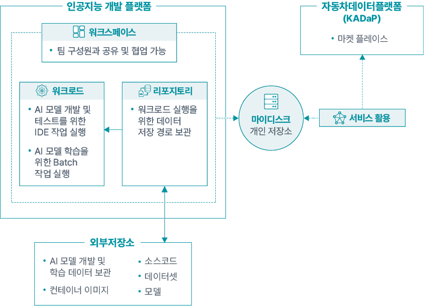

## 주요 기능과 특징

인공지능 개발 플랫폼이 제공하는 주요 기능과 특징은 다음과 같습니다.

인공지능 개발 플랫폼은 다음과 같은 특징이 있습니다.

- **인공지능 개발 플랫폼에서 제공하는 포인트를 사용해 여러 GPU 자원 사용 가능**
  - 자동차데이터플랫폼(KADaP)이 보유한 NVIDIA A100, H100, L40S의 고성능 GPU 자원을 제공합니다.
  - DePIN 기술을 활용해 협약기관 및 외부 기관의 고성능 GPU 자원을 활용하며, 사용자의 GPU를 등록해 노드로 사용할 수 있습니다.
- **관리자가 설정한 GPU 스케줄링 정책에 따라 주간에는 개발 모드(IDE), 야간에는 학습 모드(Batch)로 자동 전환되어 GPU 자원을 효율적으로 사용 가능**
  - Interactive Job: AI 모델 개발 및 코드 검증을 위한 실행 환경을 제공합니다.
  - Batch Job: 대규모 데이터셋 기반의 모델 분산 학습을 위한 일괄 처리 실행 환경을 제공합니다.
- **자동차데이터플랫폼(KADaP)이 제공하는 Object Detection ML 모델을 사용해 AI 모델 학습 가능**
- **자동차데이터플랫폼(KADaP)에서 제공하는 개발 툴, 리포지토리 및 스토리지 옵션을 선택해 자신만의 개발 환경 생성 가능**

인공지능 개발 플랫폼을 사용하려면 다음 순서를 참고해 진행하세요.

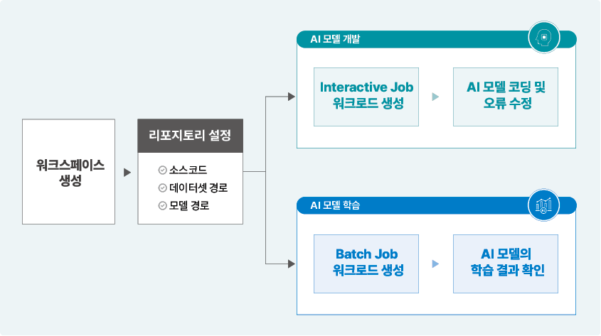

# 인공지능 개발 플랫폼 접속

인공지능 개발 플랫폼은 일반 사용자와 기관 사용자 모두 사용할 수 있으며, 자동차데이터플랫폼(KADaP) 포털에 가입된 회원 정보로 로그인해 접속합니다.

자동차 산업 클라우드 서비스를 시작하려면 다음 순서대로 진행하세요.

1. **자동차 데이터 플랫폼**([www.bigdata-car.kr](https://www.bigdata-car.kr))의 **로그인**을 클릭하세요.
2. 자동차데이터플랫폼에 로그인하세요.
   - 회원가입과 로그인 방법은 [회원 가입하기](KADaP_UserManual_Frontmatter.md#회원-가입하기)와 [로그인하기](KADaP_UserManual_Frontmatter.md#로그인하기)를 참고하세요.
3. 자동차 데이터 플랫폼 페이지에서 **데이터 분석 및 개발** > **인공지능 개발 플랫폼을** 클릭하세요.

   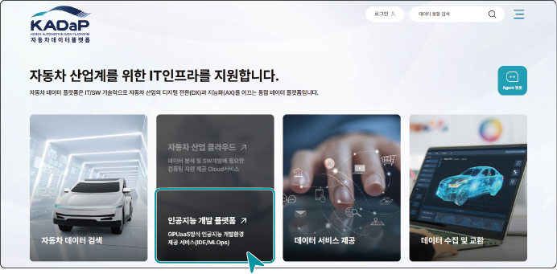

   - 자동차 데이터 포털 가입 시 등록한 이메일 주소와 비밀번호를 입력합니다.

>**바로가기**
>
> 다음의 경로로 바로 접속할 수 있습니다.
>  - **인공지능 개발 플랫폼**: [ide.bigdata-car.kr](https://ide.bigdata-car.kr)

# 인공지능 개발 플랫폼 서비스 사용

인공지능 개발 플랫폼에 로그인 후 할당된 워크스페이스 내에서 워크로드를 생성해 실행할 수 있습니다. 워크로드 실행에 필요한 소스코드, 데이터셋 및 모델 경로를 리포지토리에 등록해 사용할 수 있습니다.

## 홈 화면 구성

인공지능 개발 플랫폼의 홈 화면은 다음과 같이 구성됩니다. 각 항목별 기능을 설명합니다.

| 번호 | 항목 | 설명 |
| --- | --- | --- |
| 1 | 인공지능 개발 플랫폼 메인 메뉴 | 인공지능 개발 플랫폼의 메뉴를 선택합니다.<ul><li>**홈**: 인공지능 개발 플랫폼 대시보드 화면으로 이동합니다.</li><li>**워크스페이스**: 워크스페이스를 추가하고 관리할 수 있습니다.</li><li>**리포지토리**: 프라이빗 레지스트리 이미지, 소스 코드, 데이터셋, 모델, 스토리지를 추가하고 관리할 수 있습니다.</li><li>**허브**: 인공지능 개발 플랫폼에서 제공하는 Object Detection 모델로 워크로드를 생성할 수 있습니다.</li><li>**노드 관리**: 사용자가 추가한 노드 목록을 확인하고 관리할 수 있습니다.</li><li>**설정**: 외부 저장소 접근 시 사용되는 크레덴셜을 추가하고 관리할 수 있습니다.</li></ul>
| 2 | 내 포인트 | 자동차데이터플랫폼(KADaP)에서 사용할 수 있는 포인트를 표시합니다. GPU 자원을 사용할 때 사용 항목별로 포인트가 차감됩니다.<ul><li>포인트: 자동차데이터플랫폼(KADaP)에서 무료로 제공하는 포인트로 자동차데이터플랫폼(KADaP) 회원으로 가입하고 로그인, 포털 검색 등 사용자 활동으로 적립.</li><li>포인트: 협약을 통해 제공하는 포인트로 공유 GPU(Type2) 사용 시 차감.</li><li>**내 포인트**를 클릭하면 **자동차 데이터 포털 > 마이디스크 > 포인트 페이지**로 이동합니다.</li></ul> |
| 3 | 알림 | 인공지능 개발 플랫폼 알림 내역을 확인할 수 있습니다.<ul><li>각 탭별로 해당 항목에서 발생한 알림 내역이 표시되며, 탭의 배지로 알림 개수를 표시합니다. **읽지 않은 알림**을 설정하면 사용자가 확인하지 않은 알림 항목만 표시됩니다.</li></ul> |
| 4 | 내 정보 | 로그인한 사용자 정보를 확인하고 로그아웃할 수 있습니다.<ul><li>**마이페이지**: 사용자 정보를 확인하고 비밀번호를 변경할 수 있습니다.</li><li>**로그아웃**: 현재 로그인한 계정을 로그아웃합니다.</li></ul> |
| 5 | 공지사항 | 관리자가 게시한 공지사항을 확인할 수 있습니다. |
| 6 | GPU 사용 현황 | 현재 구동되는 프로젝트 및 GPU 자원 사용 현황을 표시합니다. |
| 7 | 자원 사용 현황 | 전체 인공지능 개발 플랫폼 자원 중 CPU, GPU, 메모리, 가상 디스크 자원 사용 현황을 표시합니다. |
| 8 | 자원 존 선택 탭 | 자원 존을 선택해 존별로 자원 사용 현황을 확인할 수 있습니다. |
| 9 | GPU/CPU 사용 상태 표시 기준 | 자원 존의 GPU/CPU 사용 상태 기준이 표시됩니다. |
| 10 | GPU 사용 정보 | GPU 자원 목록에서 특정 GPU를 선택하면 현재 사용 정보가 표시되며, 하단에는 사용자가 사용 중인 GPU 정보가 표시됩니다. |
| 11 | GPU 슬롯 목록 | 선택한 자원 존의 GPU 목록이 표시됩니다. <ul><li>GPU 슬롯을 선택하면 사용 정보의 **워크로드 생성**을 클릭해 워크로드를 바로 생성할 수 있습니다.</li><li>각 GPU 슬롯 목록 오른쪽에 현재 인공지능 개발 플랫폼 실행 모드가 표시됩니다.<ul><li>**IDE**: Web IDE를 활용하여 사용자가 AI 개발을 수행하는 모드</li><li>**Batch**: 개발된 코드를 업로드해 분산 학습을 수행하는 모드</li></li></ul></ul>|

### GPU 사용 정보 확인하기

인공지능 개발 플랫폼 대시보드의 GPU 슬롯 목록에서 GPU 슬롯을 클릭하면 왼쪽에서 상세 사용 정보를 확인할 수 있습니다.

>  **참고**
>
> 사용자가 사용 중인 GPU의 정보와 다른 사용자가 사용 중인 GPU를 클릭했을 때 표시되는 항목이 다릅니다.

#### 보유 GPU

보유 GPU 탭에는 자동차데이터플랫폼(KADaP)에서 보유한 GPU 목록이 표시됩니다. GPU 슬롯을 클릭하면 슬롯 상태에 따라 다음과 같이 상세 정보가 표시됩니다.

- **사용 가능한 GPU 슬롯 정보**

  

- **사용 중인 GPU 슬롯 정보**

  

>  **참고**
>
> - 워크로드명의 링크를 클릭하면 워크로드 상세 페이지로 이동합니다.
> - 남은 시간의 에 마우스를 올리면 사용 툴팁이 표시됩니다.
> - GPU 사용 시간 연장에 대한 자세한 설명은 [GPU 사용 연장하기](#gpu-사용-연장하기)를 참고하세요.

- **다른 사용자가 사용 중인 GPU 슬롯 정보**

  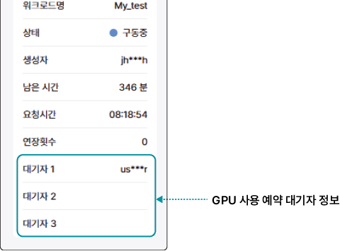

>  **참고**
>
> GPU 사용 예약을 신청하면 대기자 목록에 예약 순서대로 추가됩니다. GPU 사용 예약에 대한 자세한 설명은 [GPU 사용 예약하기](#gpu-사용-예약하기)을 참고하세요.

#### 공유 GPU

공유 GPU 탭에는 외부에서 공유하는 GPU 목록이 표시됩니다. GPU 슬롯을 클릭하면 다음과 같이 상세 정보가 표시됩니다.

- **공유 GPU (Type1)**: 사용자가 등록한 GPU 자원 목록을 표시합니다. **노드 관리** 목록에 표시되는 GPU를 사용할 수 있습니다.
- **공유 GPU (Type2)**: 자동차데이터플랫폼(KADaP) 협약기관에서 제공하는 GPU 자원 목록을 표시합니다. 작업에 맞는 GPU 사양을 선택해 사용할 수 있습니다.

  

### GPU 사용 연장하기 {#gpu-사용-연장하기}

현재 사용자가 사용 중인 GPU의 사용 시간 연장을 신청할 수 있습니다.

>  **참고**
>
> GPU 사용 연장은 최대 3회까지만 신청할 수 있습니다. 단, GPU의 사용 예약 대기자가 있는 경우에는 사용 연장을 신청할 수 없습니다.추가 사용 연장이 필요한 경우 관리자에게 메일로 문의하세요.
> - 관리자 메일 주소: admin@bigdata-car.kr

GPU 사용 연장을 신청하려면 다음 순서대로 진행하세요.

1. 인공지능 개발 플랫폼 홈 화면에서 현재 사용 중인 GPU 슬롯을 클릭하세요.
2. 왼쪽의 GPU 사용 정보에서 **시간 연장**을 클릭하세요.
3. 워크로드 사용 시간 연장창이 나타나면 종료 예정시간을 확인하고 추가 사용시간을 선택하세요.
   - 사용자가 보유한 포인트 내에서 추가 사용시간을 설정할 수 있습니다.
   - 추가 사용시간은 한 시간 단위 또는 10분 단위로 추가 설정할 수 있습니다.

   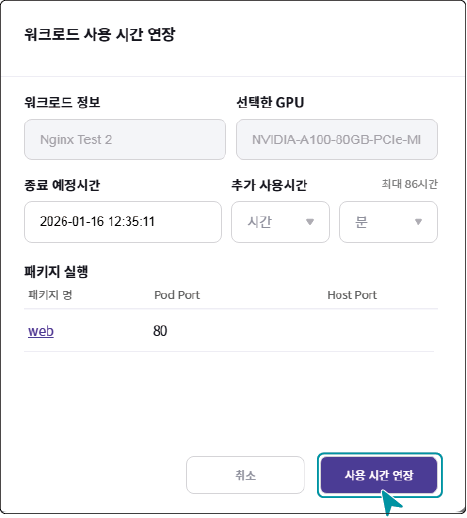

4. **사용 시간 연장**을 클릭하세요.
5. 사용 시간 연장 확인창이 나타나면 **확인**을 클릭하세요.  사용 시간 연장 신청이 완료되면 왼쪽 사용 정보의 연장횟수 항목에 신청 횟수가 표시됩니다.

### GPU 사용 예약하기 {#gpu-사용-예약하기}

현재 다른 사용자가 사용 중인 GPU의 사용 예약을 할 수 있습니다. 다른 사용자의 워크로드가 종료되면 예약한 워크로드가 생성되어 실행됩니다.

GPU 사용 연장을 신청하려면 다음 순서대로 진행하세요.

1. 인공지능 개발 플랫폼 홈 화면에서 사용하려는 GPU 항목의 **예약하기**를 클릭하세요.

   

2. 워크로드 예약창이 나타나면 생성할 워크로드 정보를 입력하거나 선택하세요.
   - 워크로드 생성 예약창은 워크로드 바로 생성하기 화면과 동일합니다. 자세한 설명은 [워크로드 바로 생성하기](#워크로드-바로-생성하기)를 참고하세요.
   - 예약창의 **워크로드 상세 설정**을 클릭하면 **워크스페이스** > **워크로드** > **워크로드 생성** 페이지로 이동합니다.
3. **워크로드 예약**을 클릭하세요.
   - GPU 워크로드 생성예약이 완료되면 선택한 GPU 사용 정보의 대기자 항목에 사용자 정보가 표시됩니다. 대기자는 최대 3명까지 표시되며 신청 순서대로 등록됩니다.

> **참고**
>
>워크로드 생성 예약을 취소하려면 워크로드 목록에서 대기중 항목의 를 클릭하세요.

### 워크로드 바로 생성하기{#워크로드-바로-생성하기}

현재 사용하지 않는 GPU 슬롯을 클릭하면 Built-in 기본 이미지만 선택해 워크로드를 바로 생성할 수 있습니다.

> **참고**
>
> 사용자가 원하는 상세 설정을 적용해 워크로드를 생성하려면 [워크로드 생성하기](#워크로드-생성하기)를 참고하세요.

워크로드를 바로 생성하려면 다음 순서대로 진행하세요.

1. 인공지능 개발 플랫폼 홈 화면에서 사용하지 않는 GPU 슬롯을 클릭하세요.
2. 왼쪽의 GPU 사용 정보에서 **워크로드 생성**을 클릭하세요.
3. 워크로드 생성창이 나타나면 필수 정보를 입력하거나 설정하세요.

   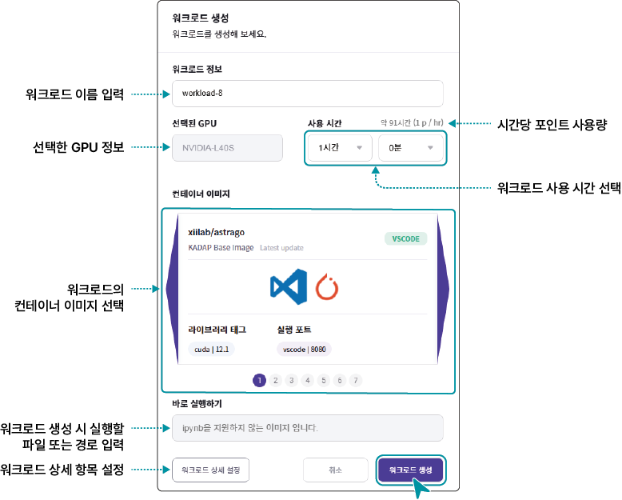

   - 워크로드 상세 설정을 클릭하면 워크로드 생성 화면으로 이동합니다. 자세한 설명은 [워크로드 생성하기](#워크로드-생성하기)를 참고하세요.
4. **워크로드 생성**을 클릭하세요.
   - 워크로드가 생성되면 **워크스페이스** > **워크로드** 목록 페이지로 이동해 상세 정보를 확인할 수 있습니다.

## 워크스페이스 관리 및 설정하기

워크스페이스에서는 워크로드를 생성하고 상세 정보를 확인할 수 있습니다. 또한 워크스페이스를 공유해 다른 구성원과 협업하며 AI 모델을 개발하고 테스트할 수 있습니다.

### 워크스페이스 관리하기

인공지능 개발 플랫폼에 로그인하면 사용자의 기본 워크스페이스 1개가 자동 할당됩니다. 기본워크스페이스의 리소스는 관리자가 설정한 기본 사양으로 적용됩니다.

#### 워크스페이스 목록 화면 구성

인공지능 개발 플랫폼 홈 화면에서 메인 메뉴의 **워크스페이스**를 클릭하면 워크스페이스 목록을 확인할 수 있습니다.

| 번호 | 항목 | 설명 |
| --- | --- | --- |
| 1 | 검색창 | 워크스페이스 이름을 입력해 검색합니다. |
| 2 | + 워크스페이스 추가 | 새로운 워크스페이스를 생성합니다. |
| 3 | 내가 생성한 워크스페이스 보기 | 워크스페이스 목록에 내가 생성한 워크로드만 표시합니다. |
| 4 | 워크스페이스 목록 | 워크스페이스 상세 정보를 표시합니다. <ul><li>워크스페이스 정보: 자원 존, 워크스페이스 이름 및 설명, 최근 생성한 워크로드 정보를 표시합니다.</li><li>:워크스페이스에 핀을 설정합니다. 핀을 설정하면 정렬 순서에 상관없이 항상 목록 최상단에 표시됩니다.</li></ul> |

#### 워크스페이스 추가

현재 사용 중인 워크스페이스 외에 추가적으로 워크스페이스가 필요한 경우, 관리자에게 메일로 문의해 추가할 수 있습니다.
   - 관리자 메일 주소: admin@bigdata-car.kr

> **참고**
>
> 사용자별로 워크스페이스는 1개씩 할당됩니다. 워크스페이스를 추가하려면 기본 워크스페이스를 삭제하고 새로 생성하세요.

워크스페이스를 추가하려면 다음 순서대로 진행하세요.

1. 인공지능 개발 플랫폼 홈 화면에서 메인 메뉴의 **워크스페이스**를 클릭하세요.
2. 워크스페이스 목록 페이지에서 **+ 워크스페이스 추가**를 클릭하세요.
3. 워크스페이스 생성 페이지가 나타나면 상세 정보를 입력하고 **생성**을 클릭하세요.
   - 워크스페이스 이름과 워크스페이스 설명은 필수 항목이므로 반드시 입력해야 합니다.
   - 워크스페이스의 리소스는 관리자가 설정한 사양으로 적용되어 수정할 수 없습니다.

   

   - 관리자가 승인이 완료된 후에만 워크스페이스 추가 생성이 가능하며, 생성이 완료되면 워크스페이스 목록에 추가됩니다.
   - 관리자 승인이 완료되지 않은 경우 생성 불가 안내 메시지가 오른쪽 상단에 나타납니다.

#### 워크스페이스 상세 정보 확인

워크스페이스의 상세 정보를 확인하고 수정하거나 삭제할 수 있습니다.

워크스페이스 정보를 확인하려면 다음 순서대로 진행하세요.

1. 인공지능 개발 플랫폼 홈 화면에서 메인 메뉴의 워크스페이스를 클릭하세요.
2. 워크스페이스 목록 페이지가 나타나면 확인할 **워크스페이스**를 클릭하세요.
3. 상단의 서브 메뉴에서 **상세정보**를 클릭하세요.
4. 워크스페이스 상세 정보 페이지에서 원하는 정보를 확인하세요.

   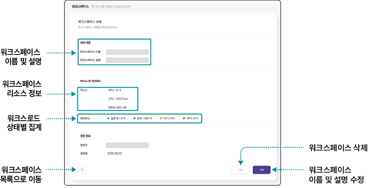

> **주의** 
>
>워크스페이스 내에 워크로드가 1개라도 있으면 워크스페이스를 삭제할 수 없습니다. 워크스페이스를 삭제하려면 먼저 워크스페이스 내의 워크로드를 모두 삭제하세요.

### 워크스페이스 설정하기

현재 사용 중인 워크스페이스의 데이터를 공유할 멤버를 추가하거나 삭제하고, 관리자에게 리소스를 요청하는 등 워크스페이스 설정을 관리할 수 있습니다.

#### 멤버 관리

사용자의 리포지토리를 공유할 멤버를 추가하거나 삭제할 수 있습니다. 추가된 멤버들과 소스 코드, 데이터셋 경로, 모델 정보를 공유하고 협업할 수 있습니다.

워크스페이스에 멤버를 추가하려면 다음 순서대로 진행하세요.

1. 인공지능 개발 플랫폼 홈 화면에서 메인 메뉴의 **워크스페이스**를 클릭하세요.
2. 워크스페이스 목록 페이지가 나타나면 멤버 관리를 진행할 워크스페이스를 클릭하세요.
3. 상단의 서브 메뉴에서 **워크스페이스 설정**을 클릭하세요.
4. 워크스페이스 설정 페이지에서 왼쪽의 **멤버 관리**를 클릭하세요.
5. 멤버 관리 페이지에서 멤버를 추가하거나 삭제하세요.

   

   - 워크스페이스의 소유자는 삭제할 수 없으며 추가한 멤버만 삭제할 수 있습니다.

**멤버 추가**

워크스페이스에 멤버를 추가하려면 다음 순서대로 진행하세요.

1. 멤버 관리 페이지에서 **멤버 추가**를 클릭하세요.
2. 워크스페이스 멤버 추가창이 나타나면 추가할 사용자를 검색하거나 목록에서 선택하세요.
   - 사용자 조직을 선택하면 해당 조직의 사용자만 확인할 수 있습니다.
     - **기관**: 사용자와 동일한 기관에 소속된 사용자로 이메일의 도메인이 동일한 경우 자동으로 사용자 목록에 표시됩니다.
     - **일반**: 사용자와 다른 조직에 소속된 사용자로 사용자의 전체 이메일 주소를 입력해 검색하면 사용자 목록에 표시됩니다.

   

3. 추가할 사용자를 확인하고 **확인**을 클릭하세요.
   - 멤버 추가를 완료하면 선택한 사용자에게 초대 알림이 전송됩니다. 알림을 수신한 사용자가 초대를 수락하면 추가가 완료됩니다.

#### 공유 리포지토리

워크스페이스 멤버와 공유할 소스코드와 데이터셋, 모델 경로를 추가할 수 있습니다.

> **참고**
>
> 리포지토리 메뉴에서 소스코드 및 데이터셋, 모델 경로를 추가할 수 있습니다.
> - 리포지토리에 해당 항목을 추가하는 자세한 설명은 [리포지토리 추가 및 관리하기](#리포지토리-추가-및-관리하기)를 참고하세요.

워크스페이스에 데이터를 등록하려면 다음 순서대로 진행하세요.

1. 인공지능 개발 플랫폼 홈 화면에서 메인 메뉴의 **워크스페이스**를 클릭하세요.
2. 워크스페이스 목록 페이지가 나타나면 데이터 경로를 추가할 워크스페이스를 클릭하세요.
3. 상단의 서브 메뉴에서 **워크스페이스 설정**을 클릭하세요.
4. 워크스페이스 설정 페이지에서 왼쪽의 **공유 리포지토리**를 클릭하세요.
5. 공유 리포지토리 페이지에서 추가할 항목을 선택해 등록하세요.

   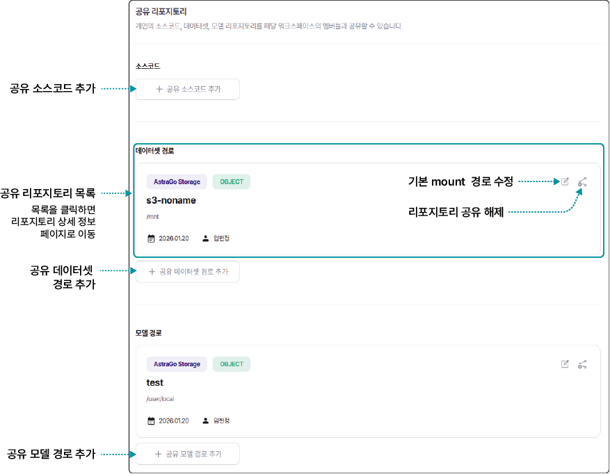

**공유 리포지토리 경로 추가**

> **참고**
>
> 공유 리포지토리 경로를 추가하는 방법은 소스코드, 데이터셋, 모델 경로 모두 동일합니다. 공유 소스코드를 예시로 추가 절차를 설명합니다.

공유 리포지토리 경로를 추가하려면 다음 순서대로 진행하세요.

1. 공유 리포지토리 페이지에서 **+ 공유 소스코드 추가**를 클릭하세요.
2. 공유 소스코드 추가창이 나타나면 소스코드 목록에서 소스코드를 선택하세요.
   - 소스코드를 새로 등록하려면 **+소스코드 생성**을 클릭합니다. 소스코드 바로 생성 화면에서 소스코드를 등록할 수 있습니다.

   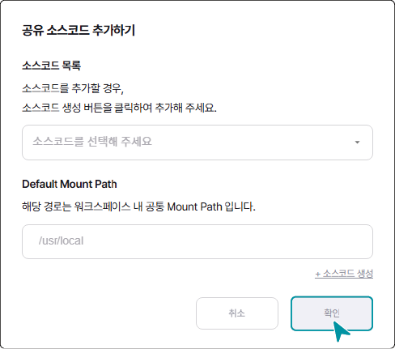

3. 기본 마운트 경로를 입력하고 **확인**을 클릭하세요.

#### 리소스 요청

워크스페이스 사용 중 리소스가 부족한 경우 관리자에게 워크스페이스의 리소스를 추가 요청할 수 있습니다.

워크스페이스의 리소스를 추가 요청하려면 다음 순서대로 진행하세요.

1. 인공지능 개발 플랫폼 홈 화면에서 메인 메뉴의 **워크스페이스**를 클릭하세요.
2. 워크스페이스 목록 페이지가 나타나면 리소스를 요청할 워크스페이스를 클릭하세요.
3. 상단의 서브 메뉴에서 **워크스페이스 설정**을 클릭하세요.
4. 워크스페이스 설정 페이지에서 왼쪽의 **리소스 요청**을 클릭하세요.
5. 리소스 요청 페이지에서 요청할 리소스 항목과 요청사유를 입력하고 **리소스 요청**을 클릭하세요.
   - 관리자가 리소스 요청을 승인하면 신청한 시간 동안 워크스페이스에서 추가 리소스를 사용할 수 있습니다.

   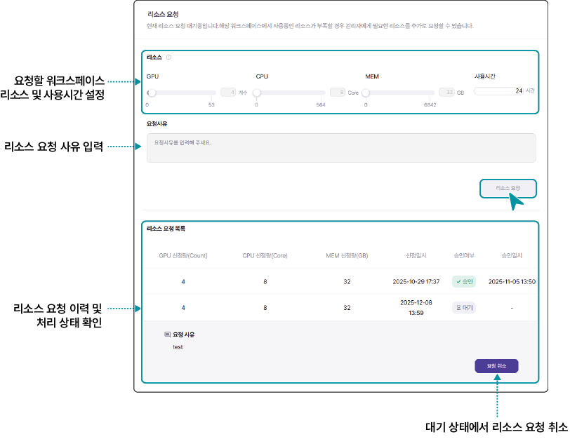

> **참고**
>
> 관리자 승인 전 대기 상태에서는 추가로 리소스 요청을 할 수 없습니다.

#### 알림 설정

워크스페이스 사용 중 사용자가 수신할 알림 항목을 설정할 수 있습니다.

워크스페이스의 알림을 설정하려면 다음 순서대로 진행하세요.

1. 인공지능 개발 플랫폼 홈 화면에서 메인 메뉴의 **워크스페이스**를 클릭하세요.
2. 워크스페이스 목록 페이지가 나타나면 알림을 설정할 워크스페이스를 클릭하세요.
3. 상단의 서브 메뉴에서 **워크스페이스 설정**을 클릭하세요.
4. 워크스페이스 설정 페이지에서 왼쪽의 **알림 설정**을 클릭하세요.
   - 각 항목의 알림을 수신할 방법을 설정합니다.

   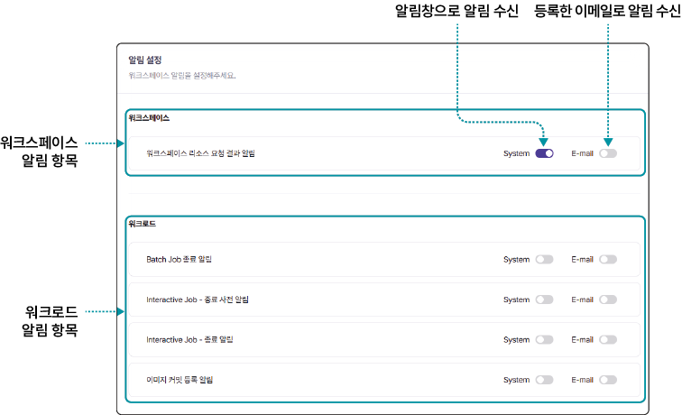

   - **이미지 커밋 등록 알림** 항목을 설정하면 워크로드 종료 후 컨테이너 이미지 저장 시 알림이 전송됩니다.

## 워크로드 생성 및 관리하기

사용자는 워크스페이스에서 원하는 작업의 워크로드의 상세 항목을 설정해 생성하고 실행할 수 있습니다. 생성한 워크로드의 상세 정보를 확인하고 수정 및 복제 등의 관리를 할 수 있습니다.

>  **참고**
>
> 인공지능 개발 플랫폼의 홈 화면에서 GPU 슬롯을 선택하면 워크로드의 기본 설정만 선택해 생성할 수도 있습니다. 워크로드 바로 생성에 대한 자세한 설명은 [워크로드 바로 생성하기](#워크로드-바로-생성하기)를 참고하세요.

### 워크로드 생성하기 {#워크로드-생성하기}

사용자는 원하는 설정으로 워크로드를 생성할 수 있습니다.

워크로드를 생성하려면 다음 순서대로 진행하세요.

1. 인공지능 개발 플랫폼 홈 화면에서 메인 메뉴의 **워크스페이스**를 클릭하세요.
2. 워크스페이스 목록 페이지가 나타나면 워크로드를 생성할 워크스페이스를 클릭하세요.
3. 상단의 서브 메뉴에서 **워크로드**를 클릭하세요.
4. 워크로드 목록 페이지에서 **+ 워크로드 생성**을 클릭하세요.

   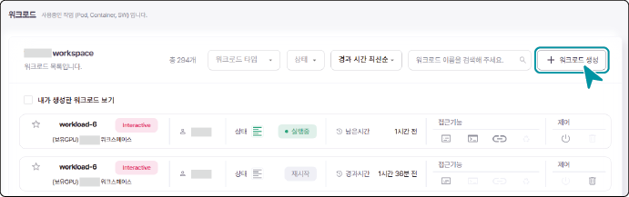

5. 워크로드 생성 페이지에서 상세 항목을 설정하고 **워크로드 생성**을 클릭하세요.
   - [*]가 표시된 항목은 필수 항목이므로 반드시 입력하세요.

- **워크로드 Job 타입 선택**
  - **Interactive Job (IDE)**: AI 모델 개발과 코드 검증을 위한 워크로드 생성 시 선택합니다.
  - **Batch Job**: AI 모델의 데이터셋 분산 학습을 위한 워크로드 생성 시 선택합니다.

   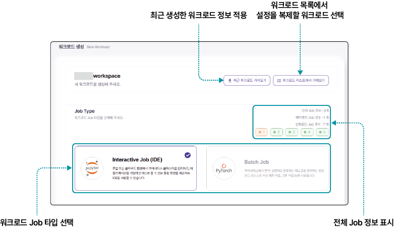

- **워크로드 Job 타입 선택**
  - Batch Job을 선택한 경우 예약 작업 시간을 설정할 수 있습니다.  **예약 작업 설정**을 선택한 후 워크로드가 실행될 날짜와 시간을 선택하세요.

   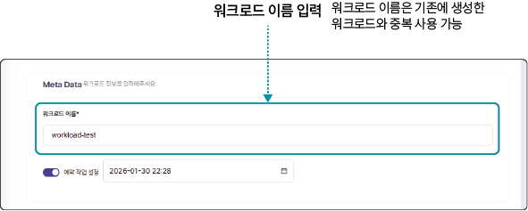

- **워크로드 GPU 노드 선택**
  - **노드**: Single Node/Multi Node 중 워크로드의 노드를 선택합니다.
    - Batch Job을 선택한 경우에만 Multi Node를 설정할 수 있습니다.
  - **자원 유형**: 보유 GPU, 공유 GPU(Type1) 중 GPU 자원 존을 선택합니다.
  - **GPU 선택**: 자원 존의 GPU 리소스 중 사용 가능한 노드를 선택해 워크로드를 생성합니다.

   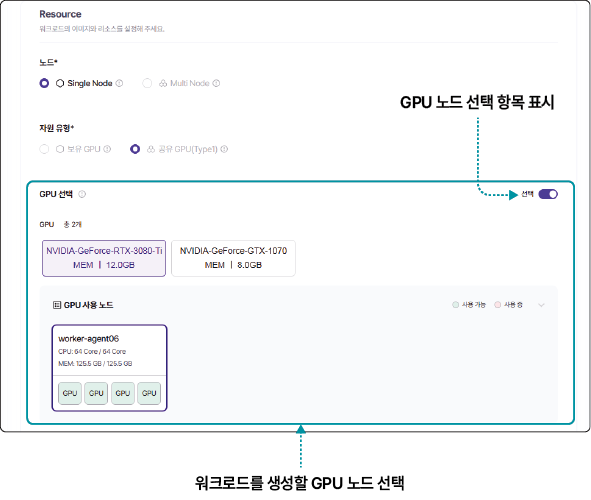

- **워크로드 사용 시간 선택**
  - 사용자가 보유한 포인트 안에서 워크로드 사용 시간을 선택할 수 있습니다. 선택한 사용 시간에 따라 보유 포인트가 차감됩니다.
    - Interactive Job (IDE)를 선택한 경우에만 사용 시간을 선택할 수 있습니다. Batch Job 워크로드는 설정된 작업이 끝나면 자동으로 종료되므로 사용 시간을 선택하지 않습니다.

   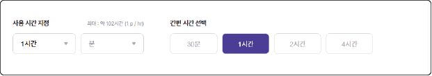

- **워크로드 및 이미지 선택**

   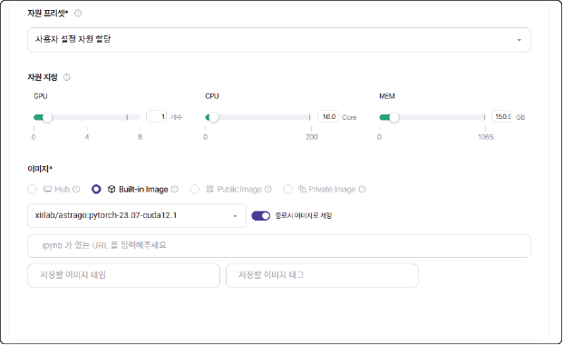

  - **자원 프리셋**: 워크로드에 사용될 자원을 설정합니다.  **사용자 설정 자원 할당**을 선택하면 사용자에게 할당된 자원 내에서 원하는 사양을 설정할 수 있습니다. **SMALL, MEDIUM, LARGE** 중 자원 프리셋을 선택하면 사전 설정된 자원 사양이 적용됩니다.
    - 자원 지정의 항목이 노란색으로 표시될 경우 기존 워크로드에서 자원이 사용되고 있는 상태입니다. 다른 워크로드가 종료된 후 사용 가능한 자원이 생기면 새로운 워크로드가 생성됩니다.
  - **이미지**: 소프트웨어 실행 환경이 저장된 이미지를 선택합니다.
    - **Hub**: 자동차데이터플랫폼(KADaP)에서 제공하는 ML 모델의 이미지를 선택하고 .ipynb 파일이 있는 URL을 입력합니다.
    - **Built-in Image**: 자동차데이터플랫폼(KADaP)에서 제공하는이미지 버전을 선택하고 .ipynb 파일이 있는 URL을 입력합니다.
    - **Public Image**: 이미지가 저장된 외부 리포지토리 경로를 입력하고 .ipynb 파일이 있는 URL을 입력합니다. Private image를 설정할 경우 크레덴셜을 선택해 사용자가 외부 레포지토리에 저장한 이미지를 가져와 적용할 수 있습니다.
    - **Private Image**: 사용자가 워크스페이스에 저장한 워크로드 이미지를 가져와 워크로드를 생성합니다. 저장된 이미지, 태그를 선택하고 .ipynb 파일이 있는 URL을 입력합니다. 크레덴셜을 선택하면 워크스페이스에 저장된 인증 정보를 적용할 수 있습니다.
    - **Credential**: 외부 리포지토리에 저장한 데이터를 적용할 때 인증에 필요한 크레덴셜을 선택합니다. **+Credential 등록**을 클릭해 자주 사용하는 크레덴셜을 워크스페이스에 등록할 수 있으며, 자세한 설명은 [크레덴셜 추가하기](#크레덴셜-추가하기)를 참고하세요.
    - **종료 시 이미지로 저장**: 워크로드가 종료되면 설정 환경을 이미지로 저장해 워크로드를 생성할 때 사용할 수 있습니다. 종료 시 이미지로 저장을 선택한 경우 저장할 이미지 이름과 이미지 태그를 입력합니다.

- **워크로드 데이터 연결**

   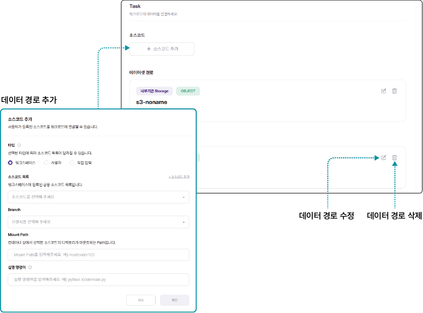

  - **소스코드**: **+ 소스코드 추가**를 클릭하면 추가창이 나타납니다. 선택한 타입에서 소스코드 목록, Branch, 마운트 경로, 실행 명령어를 입력한 후 **확인**을 클릭해 추가합니다.
    - Batch Job에서 Built-in 이미지를 선택한 경우에는 소스코드를 반드시 추가해야 합니다. 소스코드를 추가하면 실행 경로와 명령어가 자동으로 지정됩니다.
  - **데이터셋 경로**: **+ 데이터셋 경로 추가**를 클릭하면 추가창이 나타납니다. 선택한 타입에서 데이터셋 경로 목록, 마운트 경로를 입력한 후 **확인**을 클릭해 추가합니다.
  - **모델 경로**: + 모델 경로 추가를 클릭하면 추가창이 나타납니다. 선택한 타입에서 모델 경로 목록, 마운트 경로를 입력한 후 **확인**을 클릭해 추가합니다.
  - 데이터 추가 시 각 항목의 타입을 선택해 가져올 수 있습니다.
    - **워크스페이스**: 공유 리포지토리에 저장된 데이터를 사용합니다.
    - **사용자**: 사용자의 개인 리포지토리에 저장된 데이터를 사용합니다.
    - **직접 입력**: 소스코드의 경우 신규 생성해 적용합니다. 직접 입력을 선택해 추가한 소스코드는 해당 워크로드에만 적용되는 일회용 자원입니다.
    - **데이터 요청**: 사용자가 데이터셋을 요청한 경우 자동차데이터플랫폼(KADaP)의 데이터를 워크로드에 적용할 수 있습니다.

- **이미지 실행을 위한 실행 명령어 입력**

   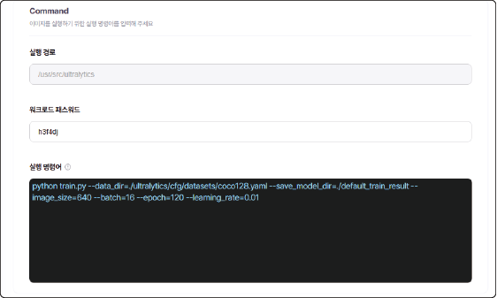

  - **실행 경로**: Batch Job을 선택한 경우 이미지 실행 경로가 자동으로 입력됩니다.
  - **워크로드 패스워드**: 웹 브라우저로 IDE에 로그인하거나 SSH 명령어로 접속 시 사용해 보안을 강화합니다.
  - **실행 명령어**: 일반적으로 이미지에는 기본 시작 명령어가 포함되어 있습니다. 사용자가 워크로드 생성 시 실행 명령어를 입력하면 이 명령어를 우선 실행합니다.
    - 선택한 이미지가 hub 또는 built-in image인 경우에는 사용자가 입력할 수 없습니다.

- **워크로드의 환경 변수와 포트 입력**

   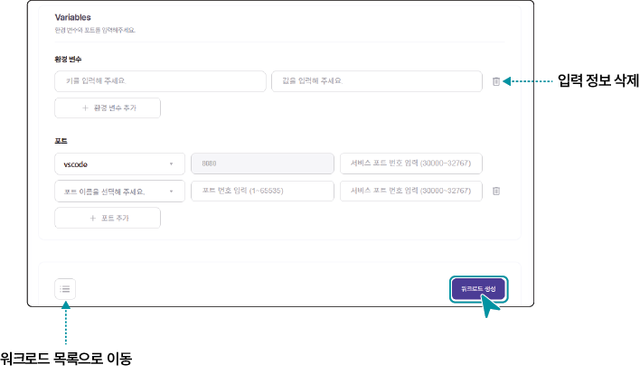

  - **환경 변수**: **+ 환경 변수 추가**를 클릭해 워크로드 실행 시 적용할 키와 값을 입력합니다.  API 키나 인증 토큰 및 학습 조건을 추가하거나 프레임워크의 동작 방식을 제어할 때 사용할 수 있습니다.
  - **포트**: **+ 포트 추가**를 클릭해 IDE에 접속 시 필요한 포트 번호와 외부에서 접속할 수 있는 서비스 포트 번호를 입력합니다.
    - Built-in Image를 선택한 경우 선택한 항목에 따라 기본 포트는 자동으로 입력됩니다.

- **워크로드의 시간 예측 파라미터 입력**
  - Batch Job에서 정확한 학습 시간 예측을 위한 파라미터로 사용자가 학습시키는 모델에 대한 변수입니다. 시간 예측 파라미터 값을 입력하면 예상 학습 수행 시간이 표시됩니다.

    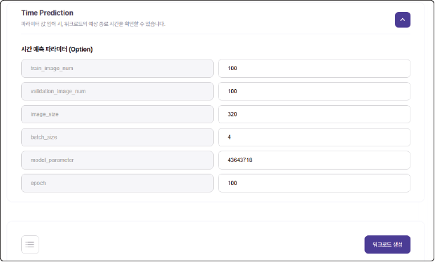

워크로드가 생성되면 워크로드 목록에 표시됩니다.  생성이 완료되면 **실행중** 상태로 변경되며 워크로드가 구동됩니다.

- 구동중인 워크로드는 홈 화면의 GPU 슬롯을 클릭해도 확인할 수 있습니다.

> **참고**
>
> - 관리자가 설정한 GPU 실행 스케줄에 따라 AI 개발 모드와 AI 학습 모드가 실행됩니다. GPU 실행 스케줄은 사용량이나 사용 패턴에 따라 적용 시간 및 적용되는 자원이 달라질 수 있습니다.
> - 워크로드가 종료되면 워크로드의 모든 데이터와 설치 패키지는 자동으로 삭제됩니다. 보관이 필요한 업로드 데이터는 워크로드 종료 전에 마이디스크 폴더에 저장하세요.
>   - 마이디스크 저장 경로: **root** > **자동차데이터플랫폼(KADaP)** > **MyDisk**

### 워크로드 관리하기

생성한 워크로드의 상세 정보를 확인하고 로그, 모니터링, 이벤트 이력을 확인할 수 있습니다. 구동중인 워크로드에서는 웹터미널 접속창을 실행할 수 있고, 파일 목록에서 데이터를 업로드하고 확인할 수 있습니다.

#### 워크로드 목록 확인

사용자가 생성한 워크로드나 다른 사용자가 공유한 워크로드 목록을 확인할 수 있습니다.

>  **참고**
>
> 생성한 워크로드 종류에 따라 워크로드를 제어할 수 있는 상세 항목이 달라집니다.

| 번호 | 항목 | 설명 |
| --- | --- | --- |
| 1 | 워크로드 목록 필터 | 목록 필터를 선택해 워크로드 목록에 적용합니다.<ul><li>**워크로드 타입**: 워크로드의 Job 종류별로 표시</li><li>**상태**: 워크로드의 실행, 대기, 에러, 종료 상태 기준으로 표시</li><li>경과 시간 순서: 워크로드 생성 후 종료 시간 기준으로 최신순/과거순으로 표시</li></ul> |
| 2 | 검색창 | 워크로드 이름을 입력해 검색합니다. |
| 3 | + 워크로드 생성 | 새로운 워크로드를 생성합니다. |
| 4 | 내가 생성한 워크로드 보기 | 워크로드 목록에 내가 생성한 워크로드만 표시합니다. |
| 5 | 워크로드 상세 항목 | 워크로드 상세 정보를 표시합니다.<ul><li>: 워크로드에 핀을 설정합니다. 핀이 설정되면 정렬 순서에 상관없이 항상 목록 최상단에 표시됩니다. 핀은 최대 6개까지 설정할 수 있습니다.</li><li>워크로드 정보: 워크로드 이름, Job 종류, 워크스페이스 이름을 표시합니다.</li><li>생성자: 워크로드 생성자 이름을 표시합니다.</li><li>상태: 상태 아이콘을 클릭하면 이벤트 내역 페이지로 이동합니다.</li><ul><li>**대기중**: 워크로드가 생성되어 실행 대기중입니다.</li><li>**실행중**: 현재 워크로드가 구동중입니다.</li><li>**재시작**: 워크로드가 종료되어 해당 워크로드 정보로 워크로드를 생성할 수 있습니다. 재시작을 클릭하면 워크로드 생성 페이지로 이동합니다.</li></ul><li>시간 정보: 워크로드 종료 후 경과 시간과 실행중인 워크로드의 남은 시간을 표시합니다.</li><li>접근 기능: 워크로드의 상세 정보를 표시합니다.<ul><li>: 워크로드의 로그 페이지로 이동합니다.</li><li>: 워크로드의 웹터미널 페이지로 이동합니다. 웹터미널 아이콘은 실행중인 경우에만 활성화됩니다.</li><li>: 워크로드의 포트로 연결되며 코드를 작성하거나 수정하고 실행할 수 있습니다. 연결된 포트가 여러 개인 경우 포트 목록이 표시됩니다.</li><li>: 워크로드의 배치 작업을 실행할 수 있습니다.</li></ul><li>제어: 실행중 상태의 워크로드를 제어합니다.<ul><li>: 워크로드를 종료합니다.</li><li>: 워크로드를 삭제합니다.</li></ul></li></ul> |

#### 상세 정보

워크로드 목록에서 워크로드를 선택하면 상세 정보 페이지로 이동합니다. 상세 정보 페이지에서는 워크로드 생성 시 설정한 정보를 확인할 수 있습니다.

>  **참고**
>
> 인공지능 개발 플랫폼의 홈 화면에서 사용 정보의 워크로드 이름을 클릭하면 상세 정보 페이지로 이동해 상세 정보를 확인할 수 있습니다.

워크로드의 상세 정보를 확인하려면 다음 순서대로 진행하세요.

1. 인공지능 개발 플랫폼 홈 화면에서 메인 메뉴의 **워크스페이스**를 클릭하세요.
2. 워크스페이스 목록 페이지가 나타나면 워크로드를 확인할 워크스페이스를 클릭하세요.
3. 상단의 서브 메뉴에서 **워크로드**를 클릭하세요.
4. 워크로드 정보 페이지에서 왼쪽의 **상세정보**를 클릭하세요.
5. 상세정보 페이지에서 워크로드 정보를 확인하고 원하는 기능을 실행하세요.
   - 워크로드 복제: **워크로드 복제**를 클릭하면 현재 설정으로 워크로드를 생성할 수 있습니다.
   - 워크로드 종료/삭제: **종료하기** 를 클릭하면 구동중인 워크로드를 종료할 수 있습니다. 워크로드의 종료 시점에는 삭제 버튼으로 변경됩니다.
   - 워크로드의 컨테이너 이미지 생성: **Commit Image 실행**을 클릭하면 구동중인 워크로드의 설정을 컨테이너 이미지로 저장할 수 있습니다. Container Image 생성창이 나타나면 이름과 태그를 입력하고 **생성**을 클릭합니다.
     - 저장한 컨테이너 이미지는 **리포지토리** > **프라이빗 레지스트리** 목록에 추가됩니다.
   - 워크로드 서버 접속: 을 클릭하면 워크로드의 포트로 연결되며 코드를 작성하거나 수정해 실행할 수 있습니다.
   - 워크로드 수정: **수정**을 클릭해 워크로드 설정을 변경할 수 있습니다. **저장**을 클릭해 완료합니다.
   - 워크로드 삭제: **삭제**를 클릭해 종료된 워크로드를 삭제할 수 있습니다. 삭제 확인창이 나타나면 **확인**을 클릭해 삭제합니다.

#### 로그

워크로드의 로그 정보에서 상태 및 오류를 확인할 수 있습니다.

워크로드의 로그 정보를 확인하려면 다음 순서대로 진행하세요.

1. 인공지능 개발 플랫폼 홈 화면에서 메인 메뉴의 **워크스페이스**를 클릭하세요.
2. 워크스페이스 목록 페이지가 나타나면 워크로드를 확인할 워크스페이스를 클릭하세요.
3. 상단의 서브 메뉴에서 **워크로드**를 클릭하세요.
4. 워크로드 정보 페이지에서 왼쪽의 **로그**를 클릭하세요.
   - 워크로드의 로그 이력이 표시됩니다.
   - 을 클릭하면 모니터링 그래프가 오른쪽에 표시됩니다.
   - 을 클릭하면 로그창의 배경색을 변경할 수 있습니다.

> **참고**
>
> Batch Job 워크로드의 경우 로그창에 게이지 바가 표시됩니다. 게이지 바는 현재 워크로드의 작업 예상 시간 정보를 제공합니다.

#### 웹터미널

웹터미널에서 실시간으로 애플리케이션을 제어하고 디버깅할 수 있습니다. 또한 워크로드의 실행 상태, 결과, 작업 진행 상황을 확인할 수 있습니다.

> **참고**
>
> 워크로드의 웹터미널 메뉴는 실행중인 워크로드에만 표시됩니다.

워크로드의 웹터미널 접속창을 실행하려면 다음 순서대로 진행하세요.

1. 인공지능 개발 플랫폼 홈 화면에서 메인 메뉴의 **워크스페이스**를 클릭하세요.
2. 워크스페이스 목록 페이지가 나타나면 워크로드를 확인할 워크스페이스를 클릭하세요.
3. 상단의 서브 메뉴에서 **워크로드**를 클릭하세요.
4. 워크로드 정보 페이지에서 왼쪽의 **웹터미널**을 클릭하세요.
5. 웹터미널 접속창이 나타나면 직접 명령어를 입력해 실행하세요.
   - 서버에 접속해 원하는 작업을 실행할 수 있습니다.

   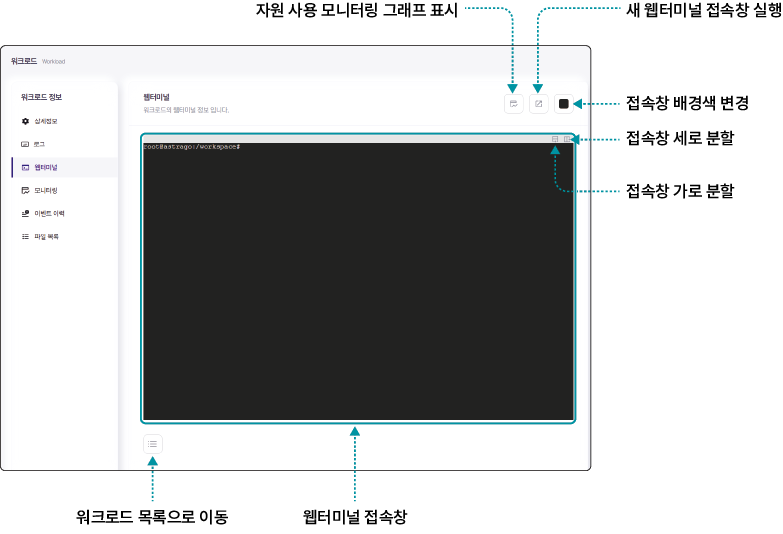

>  **참고**
>
> Batch Job 워크로드의 경우 웹터미널에 게이지 바가 표시됩니다.  게이지 바는 현재 워크로드의 작업 예상 시간 정보를 제공합니다.

#### 모니터링

구동중인 워크로드의 실시간 사용률을 모니터링할 수 있으며, 종료된 워크로드의 자원 사용률 모니터링 이력을 확인할 수 있습니다.

워크로드의 모니터링 정보를 확인하려면 다음 순서대로 진행하세요.

1. 인공지능 개발 플랫폼 홈 화면에서 메인 메뉴의 **워크스페이스**를 클릭하세요.
2. 워크스페이스 목록 페이지가 나타나면 워크로드를 확인할 워크스페이스를 클릭하세요.
3. 상단의 서브 메뉴에서 **워크로드**를 클릭하세요.
4. 워크로드 정보 페이지에서 왼쪽의 **모니터링**을 클릭하세요.
5. 모니터링 항목에서 워크로드의 자원 사용률을 확인하세요.
   - : 구동중인 워크로드의 실시간 모니터링을 정지합니다. 실시간 모니터링을 정지하면 기간을 설정해 자원 사용률을 조회할 수 있습니다.
   - : 실시간 모니터링을 다시 시작합니다.

#### 이벤트 이력

워크로드 K8s 컨테이너의 이벤트 발생 내역을 확인할 수 있습니다.

워크로드의 이벤트 이력을 확인하려면 다음 순서대로 진행하세요.

1. 인공지능 개발 플랫폼 홈 화면에서 메인 메뉴의 **워크스페이스**를 클릭하세요.
2. 워크스페이스 목록 페이지가 나타나면 워크로드를 확인할 워크스페이스를 클릭하세요.
3. 상단의 서브 메뉴에서 **워크로드**를 클릭하세요.
4. 워크로드 정보 페이지에서 왼쪽의 **이벤트 이력**을 클릭하세요.
5. 이벤트 내역에서 K8s 이벤트 메시지를 확인하세요.
   - 검색창에 이벤트 메시지를 입력해 이벤트를 검색할 수 있습니다.

#### 파일 목록 {#파일-목록}

구동중인 워크로드의 파일 목록에서는 애플리케이션의 구성과 파일 상태를 확인할 수 있습니다. 워크로드 구동 중 필요한 파일을 업로드하고 저장한 파일을 확인할 수 있습니다.

> **참고**
>
> 워크로드의 파일 목록 메뉴는 실행중인 워크로드에만 표시됩니다.

워크로드의 파일 목록을 확인하려면 다음 순서대로 진행하세요.

1. 인공지능 개발 플랫폼 홈 화면에서 메인 메뉴의 **워크스페이스**를 클릭하세요.
2. 워크스페이스 목록 페이지가 나타나면 워크로드를 확인할 워크스페이스를 클릭하세요.
3. 상단의 서브 메뉴에서 **워크로드**를 클릭하세요.
4. 워크로드 정보 페이지에서 왼쪽의 **파일 목록**을 클릭하세요.
5. 파일 목록 페이지에서 워크로드에 사용되는 파일을 업로드하거나 다운로드하세요.
   - 워크로드에 사용할 파일을 폴더를 생성해 업로드할 수 있습니다.
   - 워크로드에서 사용한 데이터는 아래 경로에 저장됩니다. **전체** > **root** > **자동차데이터플랫폼(KADaP)** > **MyDisk**

   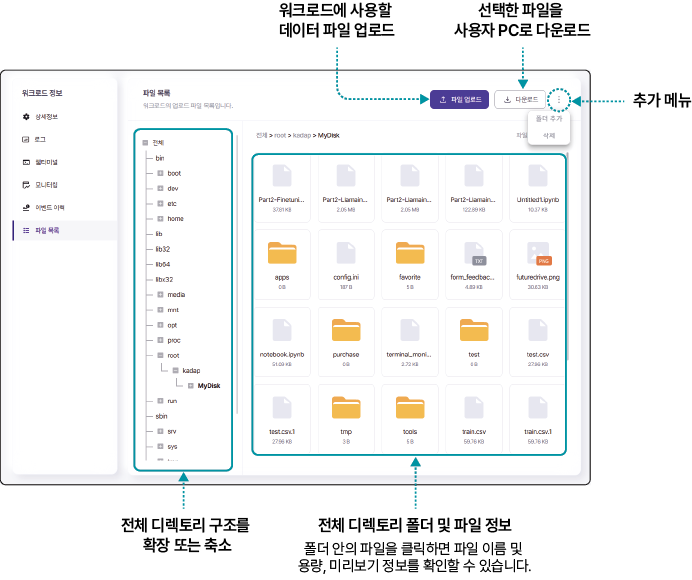

**추가 메뉴**

마이디스크에 폴더를 추가하거나 삭제할 수 있습니다.
  -  > **폴더 추가**를 클릭하면 디렉토리에 폴더를 추가할 수 있습니다. 단, 최하위 폴더 안에서는 새로운 폴더를 생성할 수 없습니다.
  -  > **삭제**를 클릭하면 선택한 폴더나 파일을 삭제할 수 있습니다.

> **참고**
>
> 스토리지 타입을 **On-premise 스토리지**로 선택한 경우 파일 업로드 및 삭제, 폴더 추가 기능을 사용할 수 없습니다.

## 리포지토리 추가 및 관리하기 {#리포지토리-추가-및-관리하기}

Container Image를 추가하고 워크로드 생성 시 사용하는 소스코드, 데이터셋 경로, 모델 경로 정보를 추가할 수 있습니다. 또한 데이터를 저장할 수 있는 스토리지를 추가해 데이터를 저장하고 관리할 수 있습니다.

### 프라이빗 레지스트리 설정하기

워크로드 설정 환경을 Container Image로 저장할 수 있습니다. 저장한 이미지를 적용해 기존과 동일한 설정의 워크로드를 빠르게 생성하고 실행할 수 있습니다.

#### 프라이빗 레지스트리 목록 화면 구성

사용자가 추가한 프라이빗 레지스트리 목록을 확인할 수 있습니다. 프라이빗 레지스트리 목록 화면은 다음과 같이 구성됩니다.

| 번호 | 항목 | 설명 |
| --- | --- | --- |
| 1 | 프라이빗 레지스트리 목록 필터 | 목록 필터를 선택해 프라이빗 레지스트리 목록에 적용합니다.<ul><li>상태: 프라이빗 레지스트리의 진행 중, 완료 상태 기준으로 표시</li><li>생성 시간 순서: 프라이빗 레지스트리 생성 시간 기준으로 최신순/과거순으로 표시</li> |
| 2 | 검색창 | 프라이빗 레지스트리 이름을 입력해 검색합니다. |
| 3 | + Container Image 추가 | 워크로드의 설정을 가져와 Container Image를 생성합니다. |
| 4 | Container Image 목록 | Container Image 목록에는 이름과 태그 개수, 다운로드 정보, 생성 시간이 표시됩니다. <ul><li>Container Image 상세 페이지에서는 기본 정보와 태그를 확인하고 이미지 정보를 수정하거나 삭제할 수 있습니다. 또한 선택한 태그의 로그를 조회하거나 삭제할 수 있습니다.</li></ul> |

#### Container Image 생성

Container image는 다음 세 가지 방법으로 생성할 수 있습니다.

- 사용자가 워크로드 생성 시 **종료 시 이미지 저장**을 설정하면 워크로드가 종료된 후 Container image로 저장됩니다.
- 구동중인 워크로드의 상세 페이지에서 **프라이빗 레지스트리** > **Commit Image 실행**을 클릭해 저장하면 Container image로 저장됩니다.
- 프라이빗 레지스트리 페이지에서 **Container Image 추가**를 클릭해 기존 워크로드 정보를 불러와 Container image로 저장할 수 있습니다.

**워크로드 생성 페이지에서 종료 시 이미지 저장 설정**

> **참고**
>
> 워크로드 생성에 대한 자세한 설명은 [워크로드 바로 생성하기](#워크로드-바로-생성하기)를 참고하세요.

워크로드 생성 페이지에서 종료 시 이미지 저장을 설정하려면 다음 순서대로 진행하세요.

1. 워크로드 생성 페이지에서 **이미지** > **종료 시 이미지로 저장**을 설정하세요.
2. 저장할 이미지 이름과 이미지 태그를 입력하세요.

   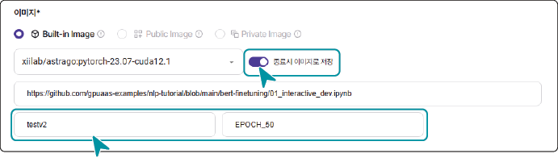

3. 필수 정보를 설정하고 **워크로드 생성**을 클릭하세요.
    - 설정한 시간 동안 워크로드가 실행되고, 워크로드 종료 시 입력한 정보로 Container image가 저장됩니다. 저장된 이미지는 **리포지토리** > **프라이빗 레지스트리** 목록에 추가됩니다.

**워크로드 상세 페이지에서 Commit Image 실행**

워크로드 상세 페이지에서 Commit Image 실행하려면 다음 순서대로 진행하세요.

1. 워크로드 상세 페이지에서 **프라이빗 레지스트리** > **Commit Image 실행**을 클릭하세요.

   

2. Container Image 생성창이 나타나면 이름과 태그를 입력하고 **생성**을 클릭하세요.
   - 저장된 이미지는 **리포지토리** > **프라이빗 레지스트리** 목록에 추가됩니다.

   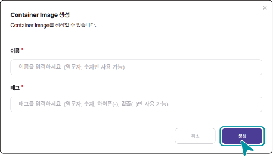

**프라이빗 레지스트리 페이지에서 Container Image 추가**

프라이빗 레지스트리 페이지에서 Container Image를 추가하려면 다음 순서대로 진행하세요.

1. 인공지능 개발 플랫폼 홈 화면에서 메인 메뉴의 **리포지토리**를 클릭하세요.
2. 상단의 서브 메뉴에서 **프라이빗 레지스트리**를 클릭하세요.
3. 프라이빗 레지스트리 페이지에서 **+ Container Image 추가**를 클릭하세요.
4. Container Image 생성창이 나타나면 워크스페이스를 선택하고 **다음**을 클릭하세요.
5. 워크로드 목록 중에서 추가할 Container Image를 선택하고 **다음**을 클릭하세요.
6. Container Image의 이름과 태그를 입력하고 **생성**을 클릭하세요.
   - 저장된 이미지는 **리포지토리** > **프라이빗 레지스트리**목록에 추가됩니다.

#### Container Image 활용

사용자가 Container image를 저장해두면 기존과 동일한 설정의 워크로드를 실행할 수 있어 개발을 빠르고 효율적으로 진행할 수 있습니다. 또한 테스트 결과가 반영된 Container image를 버전별로 저장해 버전 이력을 관리할 수도 있습니다.

>  **참고**
>
> 워크로드 생성에 대한 자세한 설명은 [워크로드 생성하기](#워크로드-생성하기)를 참고하세요.

사용자가 저장한 Container image를 활용해 워크로드를 생성하려면 다음 순서대로 진행하세요.

1. 인공지능 개발 플랫폼 홈 화면에서 메인 메뉴의 **워크스페이스**를 클릭하세요.
2. 워크스페이스 목록 페이지가 나타나면 워크로드를 생성할 워크스페이스를 클릭하세요.
3. 상단의 서브 메뉴에서 **워크로드**를 클릭하세요.
4. 워크로드 목록 페이지에서 **+ 워크로드 생성**을 클릭하세요.
5. 워크로드 생성 페이지에서 **이미지** > **Private Image**을 선택하세요.
6. 저장된 Container image 이름과 태그를 선택하고 URL을 입력하세요.

   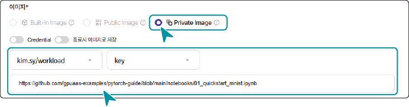

7. 워크로드 생성 페이지에서 상세 항목을 설정하고 **워크로드 생성**을 클릭하세요.
   - 사용자가 저장한 Container image로 워크로드가 생성되어 실행됩니다.

### 소스코드 경로 추가 및 관리하기

소스코드는 일반적으로 사용자가 사전에 생성한 외부 저장소에서 저장해 관리합니다. 워크로드가 실행되면 외부 저장소에 저장된 소스코드를 연결해 개발이나 학습을 진행합니다.

#### 소스코드 목록 화면 구성

사용자가 추가한 소스코드 목록을 확인할 수 있습니다. 소스코드 목록 화면은 다음과 같이 구성됩니다.

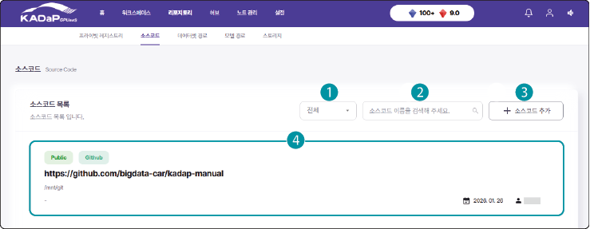

| 번호 | 항목 | 설명 |
| --- | --- | --- |
| 1 | 소스코드 목록 필터 | 목록 필터를 선택해 소스코드 목록에 적용합니다.<ul><li>저장소 타입: Git hub, Git lab, Docker 종류별로 표시</li></ul> |
| 2 | 검색창 | 소스코드 이름을 입력해 검색합니다. |
| 3 | + 소스코드 추가 | 외부 저장소의 소스코드 경로를 추가합니다. |
| 4 | 소스코드 목록 | 소스코드 목록에는 공개 범위 및 저장소 타입, url 경로, 기본 마운트 경로, 생성 정보가 표시됩니다. <ul><li>소스코드 상세 정보 페이지에서는 소스코드 경로 기본 정보와 크레덴셜 사용 여부, 실행 명령어와 파라미터 설정 항목이 표시됩니다. 또한 소스코드의 정보를 수정하거나 삭제할 수 있습니다.</li></ul>|

#### 소스코드 경로 추가 {#소스코드-경로-추가}

사용자가 사전에 생성한 소스코드를 워크로드에 연결할 수 있습니다.

사용자의 소스코드 경로를 추가하려면 다음 순서대로 진행하세요.

1. 인공지능 개발 플랫폼 홈 화면에서 메인 메뉴의 **리포지토리**를 클릭하세요.
2. 상단의 서브 메뉴에서 **소스코드**를 클릭하세요.
3. 소스코드 목록 페이지에서 **+ 소스코드 추가**를 클릭하세요.
4. 소스코드 추가창이 나타나면 상세 항목을 입력하고 **추가**를 클릭하세요.
    - 소스코드가 추가가 완료되면 소스코드 목록에 표시됩니다.

   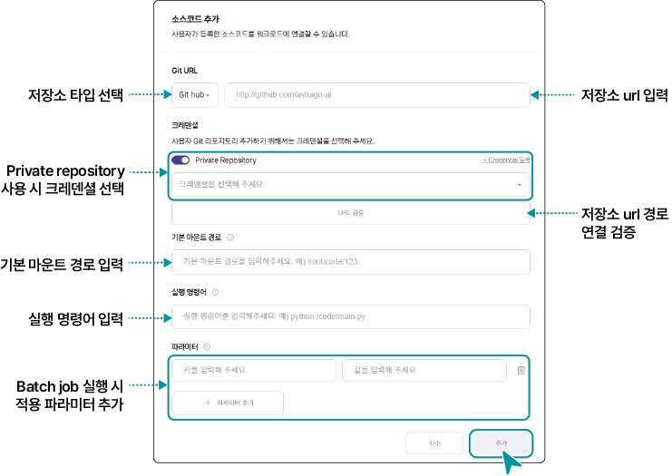

> **참고**
>
> - 저장소 타입은 Git hub, Git lab, Bitbucket 중에서 선택할 수 있습니다.
> - 외부 저장소의 Private repository 경로를 등록할 경우에는 크레덴셜 항목을 설정해야 합니다. **설정** > **크레덴셜**에 등록한 크레덴셜을 선택해 적용하세요.
>   - 크레덴셜을 새로 등록해야 한다면 **+ Credential 등록**을 클릭합니다. 크레덴셜 추가에 대한 자세한 설명은 [크레덴셜 추가하기](#크레덴셜-추가하기)를 참고하세요.

#### 소스코드 활용

소스코드 경로를 추가하면 **워크스페이스** > **공유 리포지토리**에 추가해 워크스페이스에 등록한 멤버와 공유할 수 있으며 워크로드 생성 시 적용할 수 있습니다.

**공유 리포지토리에 추가해 멤버와 공유**

워크스페이스에 추가된 멤버들과 소스코드를 공유할 수 있습니다.

공유 리포지토리에 소스코드를 추가하려면 다음 순서대로 진행하세요.

1. 인공지능 개발 플랫폼 홈 화면에서 메인 메뉴의 **워크스페이스**를 클릭하세요.
2. 워크스페이스 목록 페이지가 나타나면 소스코드를 추가할 워크스페이스를 클릭하세요.
3. 상단의 서브 메뉴에서 **워크스페이스 설정**을 클릭하세요.
4. 워크스페이스 정보 페이지에서 왼쪽의 **공유 리포지토리**를 클릭하세요.
5. 공유 리포지토리 페이지에서 **+ 공유 소스코드 추가**를 클릭하세요.
6. 공유 소스코드 추가창이 나타나면 등록한 소스코드를 선택하고 기본 마운트 경로를 입력한 후 **확인**을 클릭하세요.

**워크로드 생성 시 적용**

사용자가 저장한 소스코드를 활용해 워크로드를 생성하려면 다음 순서대로 진행하세요.

1. 인공지능 개발 플랫폼 홈 화면에서 메인 메뉴의 **워크스페이스**를 클릭하세요.
2. 워크스페이스 목록 페이지가 나타나면 워크로드를 생성할 워크스페이스를 클릭하세요.
3. 상단의 서브 메뉴에서 **워크로드**를 클릭하세요.
4. 워크로드 목록 페이지에서 **+ 워크로드 생성**을 클릭하세요.
5. Task에서 **+ 소스코드 추가**를 클릭하세요.
6. 소스코드 추가창이 나타나면 **타입** > **워크스페이스**나 **사용자**를 선택하세요.
    - **직접 입력**을 선택해 추가하는 소스코드는 해당 워크로드에서만 사용되는 일회용 소스코드입니다. 소스코드를 저장해 사용하려면 [소스코드 경로 추가](#소스코드-경로-추가)를 참고하세요.
7. 소스코드 목록에서 적용할 소스코드를 선택하고 상세 항목 설정 후 **확인**을 클릭하세요.

   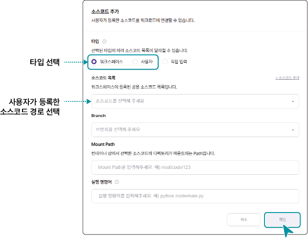

8. 워크로드 생성 페이지에서 상세 항목을 설정하고 **워크로드 생성**을 클릭하세요.
   - 사용자가 등록한 경로의 소스코드가 워크로드에 연결되어 실행됩니다.

### 데이터셋 경로 추가 및 관리하기

인공지능 개발 플랫폼에서 AI 모델을 개발하거나 테스트할 때 사전에 준비된 데이터셋을 사용합니다. 데이터셋 경로 메뉴에서는 실제 AI 모델 개발 및 학습에 사용할 폴더나 파일의 경로를 등록해 관리할 수 있습니다. 데이터셋 경로에 등록된 데이터를 워크로드에 적용할 수 있습니다.

#### 데이터셋 경로 목록 화면 구성

사용자가 추가한 데이터셋 경로 목록을 확인할 수 있습니다. 데이터셋 경로 목록 화면은 다음과 같이 구성됩니다.

| 번호 | 항목 | 설명 |
| --- | --- | --- |
| 1 | 데이터셋 경로 목록 필터 | 목록 필터를 선택해 데이터셋 경로 목록에 적용합니다.<ul><li>생성일자 순, 이름 순으로 표시</li> <li>Storage type 종류별로 표시</li></ul> |
| 2 | 검색창 | 데이터셋 경로 이름을 입력해 검색합니다. |
| 3 | + 데이터셋 경로 추가 | 데이터가 저장되어 있는 데이터셋 경로를 추가합니다. |
| 4 | 데이터셋 경로 목록 | 데이터셋 경로 목록에는 Storage type과 데이터셋 경로 이름, 생성 정보가 표시됩니다. <ul><li>데이터셋 경로 상세 정보 페이지에서는 기본 정보, 설정 내용, 생성 정보와 워크로드 정보가 표시됩니다. 또한 데이터셋 경로의 정보를 수정하거나 삭제할 수 있습니다.</li></ul> |
| 5 | 데이터 요청목록 필터 | 목록 필터를 선택해 데이터 요청 목록에 적용합니다.<ul><li>상태: 데이터 요청의 처리 상태 기준으로 표시</li></ul> |
| 6 | + 데이터 요청하기 | 자동차데이터플랫폼(KADaP)이 보유한 데이터 중 필요한 데이터의 사용 신청을 합니다. |
| 7 | 데이터 요청 목록 | 사용자가 요청한 데이터 요청 항목의 처리 상태, 생성 정보가 표시됩니다.<ul><li>항목을 클릭하면 팝업창으로 요청 상세 내역이 표시되며, 요청 정보를 수정할 수 있습니다.</li> <li>를 클릭하면 데이터 요청을 삭제할 수 있습니다.</li></ul>|

#### 데이터셋 경로 추가 {#데이터셋-경로-추가}

저장소의 데이터셋 경로를 등록해 워크로드 생성 시 적용할 수 있습니다.

데이터셋 경로를 추가하려면 다음 순서대로 진행하세요.

1. 인공지능 개발 플랫폼 홈 화면에서 메인 메뉴의 **리포지토리**를 클릭하세요.
2. 상단의 서브 메뉴에서 **데이터셋 경로**를 클릭하세요.
3. 데이터셋 경로 목록 페이지에서 **+ 데이터셋 경로 추가**를 클릭하세요.
4. 데이터가 저장되어 있는 저장소 타입을 선택하세요.

   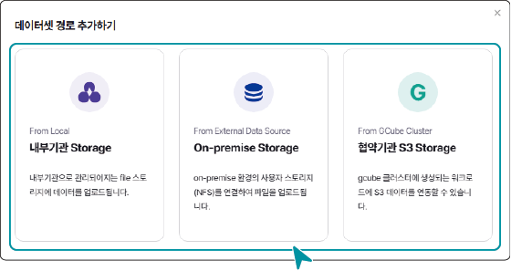

5. 선택한 저장소에 따라 상세 항목을 입력하고 **추가**를 클릭하세요.

   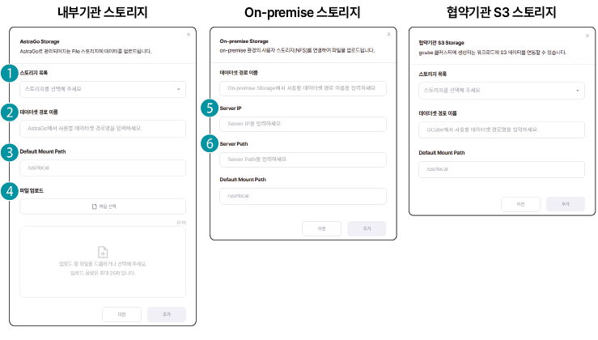

| 번호 | 항목 | 설명 |
| --- | --- | --- |
| 1 | 스토리지 목록 | 데이터를 업로드하거나 연결할 스토리지 목록을 선택합니다.<ul><li>내부기관을 선택한 경우 데이터를 업로드할 자동차데이터플랫폼(KADaP) 내부 스토리지를 선택합니다.</li><li>S3 스토리지를 선택한 경우 등록한 버킷 폴더 중 사용할 항목을 선택합니다.</li></ul> |
| 2 | 데이터셋 경로 이름 | 사용할 데이터셋 경로 이름을 입력합니다. |
| 3 | Default mount path | 워크로드가 실행될 때 연결할 컨테이너 내부 경로를 입력합니다. |
| 4 | 파일 업로드 | 사용자 PC에 저장되어 있는 데이터 파일을 드래그하거나 **파일 선택**을 클릭해 업로드합니다.<ul><li>최대 2 GB 크기의 데이터 파일을 업로드할 수 있습니다.</li></ul> |
| 5 | Server IP | 데이터가 저장된 외부 NFS 스토리지 서버의 IP 주소를 입력합니다. |
| 6 | Server Path | 데이터가 저장된 외부 NFS 스토리지 서버의 디렉토리 경로를 입력합니다. |

> **참고**
>
> - 데이터셋 경로를 등록하면 **워크스페이스** > **공유 리포지토리**에 추가해 워크스페이스에 등록한 멤버와 공유할 수 있으며, 워크로드 생성 시 적용할 수 있습니다.
> - **내부기관 스토리지**를 선택한 경우, 왼쪽의 **파일 목록** 메뉴를 사용할 수 있습니다. 선택한 경로에 저장된 파일을 확인하고, 파일을 업로드하거나 다운로드할 수 있습니다.  파일 목록에 대한 자세한 설명은 [파일 목록](#파일-목록)을 참고하세요.

#### 데이터 요청

자동차데이터플랫폼(KADaP)가 보유하고 있는 데이터를 요청해 다운로드할 수 있습니다.

>  **참고**
>
> 자동차데이터플랫폼(KADaP)의 S3 스토리지에 저장된 데이터를 사용하려면 관리자 승인이 필요합니다.   관리자 요청이 승인된 후에 요청한 데이터를 다운로드해 사용할 수 있습니다.

인공지능 개발 플랫폼의 데이터를 요청하려면 다음 순서대로 진행하세요.

1. 인공지능 개발 플랫폼 홈 화면에서 메인 메뉴의 **리포지토리**를 클릭하세요.
2. 상단의 서브 메뉴에서 **데이터셋 경로**를 클릭하세요.
3. 데이터셋 경로 목록 페이지에서 **+ 데이터 요청하기**를 클릭하세요.
4. 데이터 요청하기 창에서 상세 항목을 설정하고 **요청하기**를 클릭하세요.

   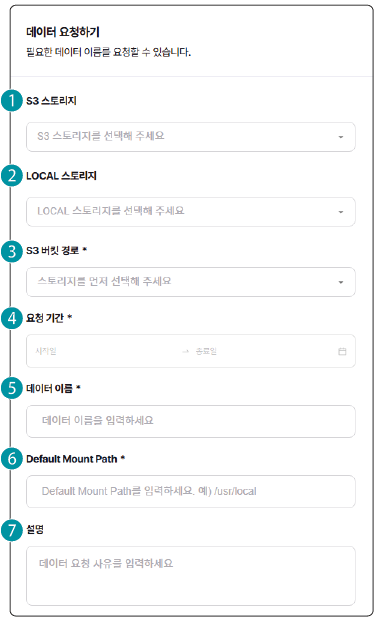

| 번호 | 항목 | 설명 |
| --- | --- | --- |
| 1 | S3 스토리지 | 인공지능 개발 플랫폼의 S3 스토리지를 선택합니다. |
| 2 | Local 스토리지 | 인공지능 개발 플랫폼의 로컬 스토리지를 선택합니다. |
| 3 | S3 버킷 경로 | 선택한 S3 스토리지 내부의 버킷 경로를 선택합니다. |
| 4 | 요청 기간 | 데이터를 사용할 시작일/종료일을 달력에서 선택합니다.<ul><li>최대 일주일 동안 신청한 데이터를 다운로드할 수 있습니다.</li></ul> |
| 5 | 데이터 이름 | 사용할 데이터 이름을 입력하세요. |
| 6 | Default mount path | 워크로드가 실행될 때 연결할 컨테이너 내부 경로를 입력합니다. |
| 7 | 설명 | 데이터 요청 사유를 입력합니다. |

> **참고**
>
> 관리자가 데이터 요청을 승인하면 상태 항목이 **승인됨**으로 변경되고, 신청한 경로의 데이터를 다운로드해 사용할 수 있습니다.

#### 데이터셋 활용

데이터셋 경로를 추가하면 **워크스페이스** > **공유 리포지토리**에 추가해 워크스페이스에 등록한 멤버와 공유할 수 있으며 워크로드 생성 시 적용할 수 있습니다.

**공유 리포지토리에 추가해 멤버와 공유**

워크스페이스에 추가된 멤버들과 데이터셋 경로를 공유할 수 있습니다.

공유 리포지토리에 데이터셋 경로를 추가하려면 다음 순서대로 진행하세요.

1. 인공지능 개발 플랫폼 홈 화면에서 메인 메뉴의 **워크스페이스**를 클릭하세요.
2. 워크스페이스 목록 페이지가 나타나면 데이터셋 경로를 추가할 워크스페이스를 클릭하세요.
3. 상단의 서브 메뉴에서 **워크스페이스 설정**을 클릭하세요.
4. 워크스페이스 정보 페이지에서 왼쪽의 **공유 리포지토리**를 클릭하세요.
5. 공유 리포지토리 페이지에서 **+ 공유 데이터셋 경로 추가**를 클릭하세요.
6. 공유 데이터셋 경로 추가창이 나타나면 등록한 데이터셋 경로를 선택하고 기본 마운트 경로를 입력한 후 **확인**을 클릭하세요.

**워크로드 생성 시 적용**

사용자가 저장한 데이터셋 경로를 활용해 워크로드를 생성하려면 다음 순서대로 진행하세요.

1. 인공지능 개발 플랫폼 홈 화면에서 메인 메뉴의 **워크스페이스**를 클릭하세요.
2. 워크스페이스 목록 페이지가 나타나면 워크로드를 생성할 워크스페이스를 클릭하세요.
3. 상단의 서브 메뉴에서 **워크로드**를 클릭하세요.
4. 워크로드 목록 페이지에서 **+ 워크로드 생성**을 클릭하세요.
5. Task에서 **+ 데이터셋 경로 추가**를 클릭하세요.
6. 데이터셋 경로 추가창이 나타나면 **타입** > **워크스페이스**나 **사용자**를 선택하세요.
    - **데이터 요청**을 선택하는 경우 **승인됨** 상태의 데이터 요청만 적용할 수 있습니다.
7. 데이터셋 경로 목록에서 적용할 데이터셋 경로를 선택하고 상세 항목 설정 후 **확인**을 클릭하세요.

   

8. 워크로드 생성 페이지에서 상세 항목을 설정하고 **워크로드 생성**을 클릭하세요.
   - 사용자가 등록한 경로의 데이터셋 경로가 워크로드에 연결되어 실행됩니다.

### 모델 경로 추가 및 관리하기

사용자가 생성한 AI 모델의 가중치 파일이나 설정 파일, 체크포인트 파일 등을 자동차데이터플랫폼(KADaP)의 파일 스토리지에 직접 업로드하거나 외부의 저장 공간에 데이터를 보관하는 경우 등록한 경로의 데이터를 워크로드에서 실행할 수 있습니다.

#### 모델 경로 목록 화면 구성

사용자가 추가한 모델 경로 목록을 확인할 수 있습니다. 모델 경로 목록 화면은 다음과 같이 구성됩니다.

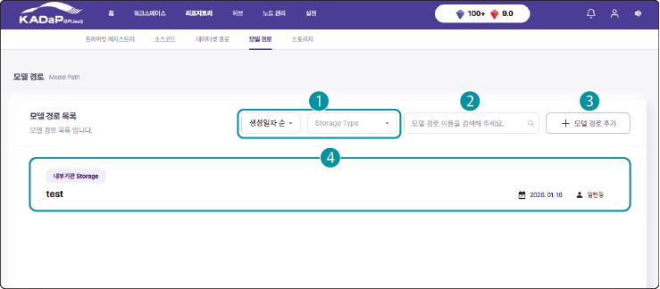

| 번호 | 항목 | 설명 |
| --- | --- | --- |
| 1 | 모델 경로 목록 필터 | 목록 필터를 선택해 모델 경로 목록에 적용합니다.<ul><li>생성일자 순, 이름 순으로 표시</li> <li>Storage type 종류별로 표시</li></ul> |
| 2 | 검색창 | 모델 경로 이름을 입력해 검색합니다. |
| 3 | + 모델 경로 추가 | 데이터가 저장된 모델 경로를 추가합니다. |
| 4 | 모델 경로 목록 | 모델 경로 목록에는 Storage type과 모델 경로 이름, 생성 정보가 표시됩니다.<ul><li>모델 경로 상세 정보 페이지에서는 기본 정보, 설정 내용, 생성 정보와 워크로드 정보가 표시됩니다. 또한 모델 경로의 정보를 수정하거나 삭제할 수 있습니다.</li></ul>|

#### 모델 경로 추가 {#모델-경로-추가}

저장소의 모델 경로를 등록해 워크로드 생성 시 적용할 수 있습니다.

모델 경로를 추가하려면 다음 순서대로 진행하세요.

1. 인공지능 개발 플랫폼 홈 화면에서 메인 메뉴의 **리포지토리**를 클릭하세요.
2. 상단의 서브 메뉴에서 **모델 경로**를 클릭하세요.
3. 모델 경로 목록 페이지에서 **+ 모델 경로 추가**를 클릭하세요.
4. 데이터가 저장되어 있는 저장소 타입을 선택하세요.

   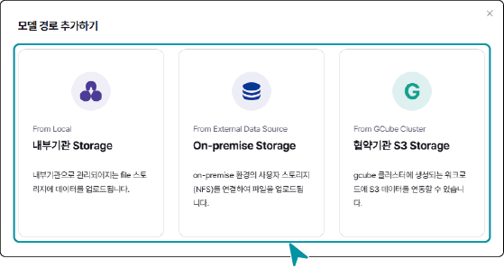

5. 선택한 저장소에 따라 상세 항목을 입력하고 **추가**를 클릭하세요.

   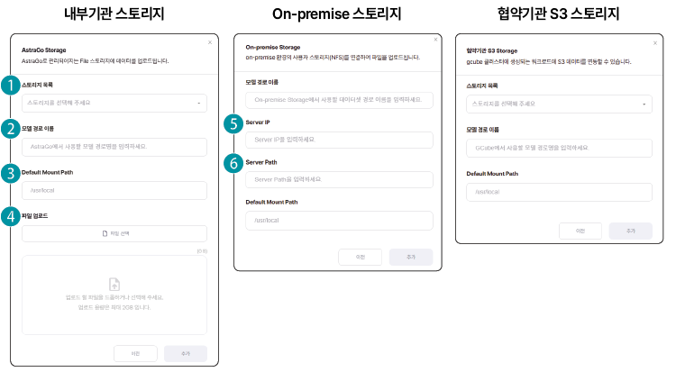

| 번호 | 항목 | 설명 |
| --- | --- | --- |
| 1 | 스토리지 목록 | 모델 데이터를 업로드하거나 연결할 스토리지 목록을 선택합니다.<ul><li>내부기관을 선택한 경우 모델 데이터를 업로드할 자동차데이터플랫폼(KADaP) 내부 스토리지를 선택합니다.</li><li>S3 스토리지를 선택한 경우 등록한 버킷 폴더 중 사용할 항목을 선택합니다.</li></ul> |
| 2 | 모델 경로 이름 | 사용할 모델 경로 이름을 입력합니다. |
| 3 | Default mount path | 워크로드가 실행될 때 연결할 컨테이너 내부 경로를 입력합니다. |
| 4 | 파일 업로드 | 사용자 PC에 저장되어 있는 모델 데이터 파일을 드래그하거나 **파일 선택**을 클릭해 업로드합니다.<ul><li>최대 2 GB 크기의 모델 데이터 파일을 업로드할 수 있습니다.</li></ul> |
| 5 | Server IP | 데이터가 저장된 외부 NFS 스토리지 서버의 IP 주소를 입력합니다. |
| 6 | Server Path | 데이터가 저장된 외부 NFS 스토리지 서버의 디렉토리 경로를 입력합니다. |

>  **참고**
>
> - 모델 경로를 등록하면 **워크스페이스** > **공유 리포지토리**에 추가해 워크스페이스에 등록한 멤버와 공유할 수 있으며, 워크로드 생성 시 적용할 수 있습니다.
> - **내부기관 스토리지**를 선택한 경우, 왼쪽의 **파일 목록** 메뉴를 사용할 수 있습니다. 선택한 경로에 저장된 파일을 확인하고, 파일을 업로드하거나 다운로드할 수 있습니다. 파일 목록에 대한 자세한 설명은 [파일 목록](#파일-목록)을 참고하세요.

#### 모델 활용

모델 경로를 생성하면 **워크스페이스** > **공유 리포지토리**에 추가해 워크스페이스에 등록한 멤버와 공유할 수 있으며 워크로드 생성 시 적용할 수 있습니다.

##### 공유 리포지토리에 추가해 멤버와 공유

워크스페이스에 추가된 멤버들과 공유할 모델 데이터를 공유할 수 있습니다.

공유 리포지토리에 소스코드를 추가하려면 다음 순서대로 진행하세요.

1. 인공지능 개발 플랫폼 홈 화면에서 메인 메뉴의 **워크스페이스**를 클릭하세요.
2. 워크스페이스 목록 페이지가 나타나면 소스코드를 추가할 워크스페이스를 클릭하세요.
3. 상단의 서브 메뉴에서 **워크스페이스 설정**을 클릭하세요.
4. 워크스페이스 정보 페이지에서 왼쪽의 **공유 리포지토리**를 클릭하세요.
5. 공유 리포지토리 페이지에서 **+ 공유 모델 경로 추가**를 클릭하세요.
6. 공유 모델 경로 추가창이 나타나면 등록한 모델 경로를 선택하고 기본 마운트 경로를 입력한 후 **추가**를 클릭하세요.

##### 워크로드 생성 시 적용

사용자가 저장한 모델 경로를 적용해 워크로드를 생성하려면 다음 순서대로 진행하세요.

1. 인공지능 개발 플랫폼 홈 화면에서 메인 메뉴의 **워크스페이스**를 클릭하세요.
2. 워크스페이스 목록 페이지가 나타나면 워크로드를 생성할 워크스페이스를 클릭하세요.
3. 상단의 서브 메뉴에서 **워크로드**를 클릭하세요.
4. 워크로드 목록 페이지에서 **+ 워크로드 생성**을 클릭하세요.
5. Task에서 **+ 모델 경로 추가**를 클릭하세요.
6. 모델 경로 추가창이 나타나면 **타입** > **워크스페이스**나 **사용자**를 선택하세요.
7. 모델 경로 목록에서 공유 모델 경로를 선택하고 마운트 경로를 입력한 후 **확인**을 클릭하세요.

   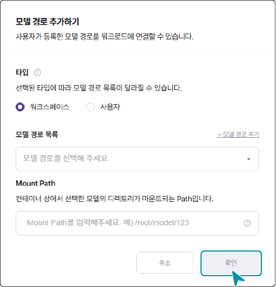

8. 워크로드 생성 페이지에서 상세 항목을 설정하고 **워크로드 생성**을 클릭하세요.
   - 사용자가 등록한 모델 데이터가 워크로드에 연결되어 실행됩니다.

### 스토리지 추가 및 관리하기

인공지능 개발 플랫폼에서 사용할 스토리지를 추가해 모델 개발 및 학습 시 필요한 데이터를 저장하고 관리할 수 있습니다. 사용자가 사용하는 NFS, S3 등의 외부 저장소나 자동차데이터플랫폼(KADaP)에서 제공하는 Object Storage를 추가할 수 있습니다.

#### 스토리지 목록 화면 구성

사용자가 추가한 스토리지 목록을 확인할 수 있습니다. 스토리지 목록 화면은 다음과 같이 구성됩니다.

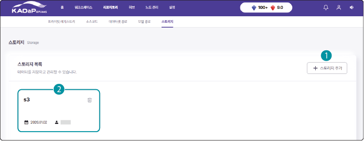

| 번호 | 항목 | 설명 |
| --- | --- | --- |
| 1 | + 스토리지 추가 | 데이터를 저장할 스토리지 경로를 추가합니다. |
| 2 | 스토리지 목록 | 스토리지 목록에는 스토리지 이름과 생성 정보가 표시됩니다.<ul><li>를 클릭하면 선택한 스토리지를 삭제할 수 있습니다.</li> <li>스토리지 상세 정보창에서는 스토리지 이름, IP 주소나 서버주소가 표시되며, 스토리지의 이름을 수정할 수 있습니다.</li></ul> |

#### 스토리지 추가

스토리지 경로를 추가하려면 다음 순서대로 진행하세요.

1. 인공지능 개발 플랫폼 홈 화면에서 메인 메뉴의 **리포지토리**를 클릭하세요.
2. 상단의 서브 메뉴에서 **스토리지**를 클릭하세요.
3. 스토리지 목록 페이지에서 **+ 스토리지 추가**를 클릭하세요.
4. 스토리지 추가창이 나타나면 상세 항목을 설정하고 **추가**를 클릭하세요.

   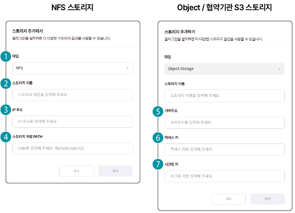

| 번호 | 항목 | 설명 |
| --- | --- | --- |
| 1 | 타입 | 스토리지 타입을 선택합니다.<ul><li>**NFS**: 기존에 사용 중인 NAS 저장장치가 있는 경우 선택합니다.</li><li>**DELL Unity**: 대규모 데이터 처리를 위해 사용하는 기업 전용 DELL 스토리지가 구축되어 있는 경우 선택합니다.<ul><li>Unity를 연결하려면 스토리지 장비에서 사전 설정을 진행해야 합니다. 사전 설정에 대해서는 인공지능 개발 플랫폼 관리자에게 문의하세요.</li></ul></li><li>**Object Storage**: 대용량 데이터를 저장하거나 외부 클라우드 저장소와 연동하는 경우 선택합니다.</li><li>**협약기관 S3 Storage**: Gcube 클러스터의 S3 저장소와 연동하는 경우 선택합니다.</li></ul> |
| 2 | 스토리지 이름 | 사용할 스토리지 이름을 입력합니다. |
| 3 | IP 주소 | 스토리지 서버의 IP 주소를 입력합니다. |
| 4 | 스토리지 저장 Path | 스토리지 서버 내부에 데이터를 저장할 폴더 경로를 입력합니다. |
| 5 | 서버 주소 | Object Storage에 접속할 수 있는 API 엔드포인트 주소를 입력합니다. |
| 6 | 액세스 키 | Object Storage 접속 시 ID 역할을 하는 액세스 키를 입력합니다. |
| 7 | 시크릿 키 | Object Storage 접속 시 비밀번호 역할을 하는 시크릿 키를 입력합니다. |

#### 스토리지 활용

스토리지 정보를 등록해 놓으면 데이터셋 경로나 모델 경로를 추가할 때 스토리지를 적용할 수 있습니다.

- **리포지토리** > **데이터셋 경로** > **데이터셋 경로 추가** > **내부기관 Storage** > 등록한 스토리지 선택해 저장
  - 데이터셋 경로 추가에 대한 자세한 설명은 [데이터셋 경로 추가](#데이터셋-경로-추가)를 참고하세요.
- **리포지토리** > **모델 경로** > **모델 경로 추가** > **내부기관 Storage** > 등록한 스토리지 선택해 저장
  - 모델 경로 추가에 대한 자세한 설명은 [모델 경로 추가](#모델-경로-추가)를 참고하세요.

## 허브 활용하기

인공지능 개발 플랫폼에서 지원하는 ML 모델로 Batch Job 워크로드를 실행해 분산 학습을 수행할 수 있습니다

### ML 모델을 사용해 워크로드 생성하기

>  **참고**
>
> 워크로드 각 항목에 대한 자세한 설명은 [워크로드 생성하기](#워크로드-생성하기)를 참고하세요.

ML 모델 이미지로 워크로드를 생성하려면 다음 순서대로 진행하세요.

1. 인공지능 개발 플랫폼 홈 화면에서 메인 메뉴의 **허브**를 클릭하세요.
2. 허브 목록에서 원하는 모델을 클릭하세요.
3. 모델 상세 페이지에서 필요한 데이터와 상세 정보를 확인하고 **+ 워크로드 생성**을 클릭하세요.

   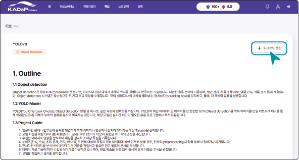

4. 워크스페이스 선택창에서 사용할 워크스페이스를 선택하고 **선택**을 클릭하세요.
5. 워크로드 생성 페이지에서 상세 항목을 설정하고 **워크로드 생성**을 클릭하세요.
   - [*]가 표시된 항목은 필수 항목이므로 반드시 입력하세요.

   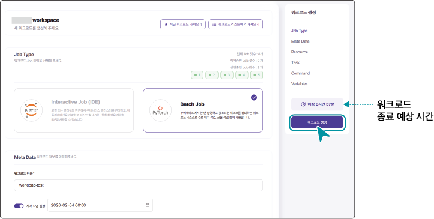

>  **참고**
>
> - Hub 선택 시 소스코드가 지정되어 있으므로 변경하거나 삭제할 수 없습니다.
> - 데이터셋 경로와 모델 경로를 각각 1개씩만 추가할 수 있으며, 각 경로를 삭제하면 해당 경로가 지정된 필드도 함께 삭제됩니다.
> - 파라미터는 추가하거나 삭제할 수 없으며 적용된 항목의 값을 수정만 할 수 있습니다.
> - Hub 선택 시 실행 경로와 실행 명령어가 자동으로 입력되며 수정할 수 없습니다.
> - 시간 예측 파라미터 항목은 자동으로 적용되며 적용된 항목의 값을 수정만 할 수 있습니다. 입력된 파라미터 값에 따라 워크로드의 예상 종료 시간을 확인할 수 있습니다.

모델 학습 결과 활용하기 [항목 추가 검토 요청!!]

## 노드 관리

사용자가 추가한 노드를 확인하고 관리할 수 있습니다. 사용자가 보유한 로컬 서버나 GPU 자원을 노드로 등록하면 AI 모델 개발 및 학습에 활용할 수 있습니다.

>  **참고**
>
> 사용자의 노드를 인공지능 개발 플랫폼에서 관리하려면 노드 관리 에이전트를 설치해 등록해야 합니다. 노드 관리 에이전트 프로그램 설치에 대한 자세한 설명은 [에이전트 소프트웨어 설치하기 [내용 추가 예정!!]](#에이전트-소프트웨어-설치하기)를 참고하세요.

#### 노드 목록 화면 구성

사용자가 추가한 노드 목록을 확인할 수 있습니다. 노드 목록 화면은 다음과 같이 구성됩니다.

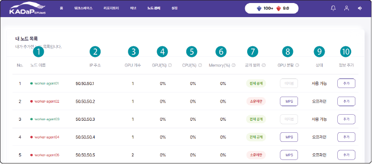

| 번호 | 항목 | 설명 |
| --- | --- | --- |
| 1 | 노드 이름 | 사용자가 설정한 노드 이름을 표시합니다. |
| 2 | IP 주소 | 노드 IP 주소를 표시합니다. |
| 3 | GPU 개수 | 노드의 GPU 개수를 표시합니다. |
| 4 | GPU 사용률 | 전체 GPU 용량 중 현재 사용량을 표시합니다. |
| 5 | CPU 사용률 | 전체 CPU 용량 중 현재 사용량을 표시합니다. |
| 6 | Memory 사용률 | 전체 메모리 용량 중 현재 사용량을 표시합니다. |
| 7 | 공개 범위 | 공개 범위 항목을 클릭하면 노드 공개 범위를 설정할 수 있습니다. |
| 8 | GPU 분할 | GPU 분할 항목을 클릭하면 GPU의 MIG/MPS 분할 설정을 할 수 있습니다. |
| 9 | 상태 | GPU의 현재 상태를 표시합니다. |
| 10 | 정보 추가 | 추가를 클릭하면 노드의 사용자 정보를 추가하거나 등록 해제할 수 있습니다. |

### 에이전트 소프트웨어 설치하기 [내용 추가 예정!!] {#에이전트-소프트웨어-설치하기}

인공지능 개발 플랫폼에서 사용자가 추가한 노드를 제어하고 모니터링할 수 있는 노드 관리 에이전트 소프트웨어를 설치해 사용할 수 있습니다. [해당 내용 확인 필요]

#### Windows에 설치

[다운로드 경로, 설치 절차 추가 필요]

#### Linux에 설치

[다운로드 경로, 설치 절차 추가 필요]

>  **웹매뉴얼**
>
>자세한 등록 절차는 웹 매뉴얼을 참고하세요. 자동차 데이터 플랫폼(자동차데이터플랫폼(KADaP))의  > **매뉴얼** > **문서** > **인공지능 개발 플랫폼** > **노드 에이전트 설치**

### 노드 등록하기

[노드 등록 절차 추가 예정]

>  **참고**
>
> - 사용자가 등록한 노드는 홈 화면의 공유 GPU2 (Type1)에 표시됩니다. 사용 가능한 GPU를 선택해 워크로드를 생성하고 실행할 수 있습니다.
> - 동일 도메인이나 전체 공개를 설정한 경우, 다른 사용자가 등록 GPU를 사용한 만큼 포인트가 제공됩니다.

### 내 노드 관리하기

내 노드 목록에서 공개 범위 변경, GPU 분할 등을 설정할 수 있습니다.

#### 공개 범위 설정

**내 노드 목록** > **공개 범위** 항목을 클릭해 노드의 공개 범위를 변경할 수 있습니다.

- 노드 공개 범위 설정창이 나타나면 원하는 공개 범위를 선택하고 **변경**을 클릭합니다.

  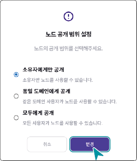

#### GPU 분할 설정

**내 노드 목록** > **GPU 분할** 항목을 클릭해 노드의 GPU 분할 설정을 할 수 있습니다.

- GPU 분할 설정창이 나타나면 분할 개수를 선택하고 **설정**을 클릭합니다.
  - **미지원**: GPU 분할을 지원하지 않는 노드는 미지원으로 표시됩니다. 버튼이 비활성화되어 선택할 수 없습니다.
  - **MPS** (Multi-Process Service): GPU를 분할하지 않고 하나의 GPU에서 사용되지 않는 자원을 여러 연산 작업 시 나눠서 사용하는 방식으로 소규모 AI 모델 추론 작업 여러 개를 동시에 실행할 수 있습니다.
  - **MIG** (Multi-Instance GPU): 하나의 GPU를 독립된 가상 GPU 인스턴스로 분할하는 방식으로 고성능 GPU에 적용해 대규모 모델 학습을 실행할 수 있습니다.

  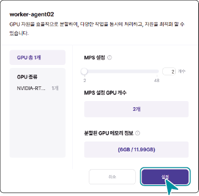

#### 노드 개인 정보 등록 설정

**내 노드 목록** > **정보 추가** > **추가**를 클릭해 사용자 정보를 추가하거나 등록 해제할 수 있습니다.

- 추가: 노드 개인 정보 등록창이 나타나면 개인 정보를 확인하고 **등록**을 클릭합니다.
- 등록 해제: 노드 개인 정보 등록창이 나타나면 **등록 해제**를 클릭합니다.

## 크레덴셜 추가 및 관리하기

사용자가 데이터를 저장한 외부 저장소나 자동차데이터플랫폼(KADaP)의 마이디스크에 연결하기 위해 사용하는 크레덴셜을 등록해 편리하게 관리할 수 있습니다.

#### 크레덴셜 목록 화면 구성

사용자가 추가한 크레덴셜 목록을 확인할 수 있습니다. 크레덴셜 목록 화면은 다음과 같이 구성됩니다.

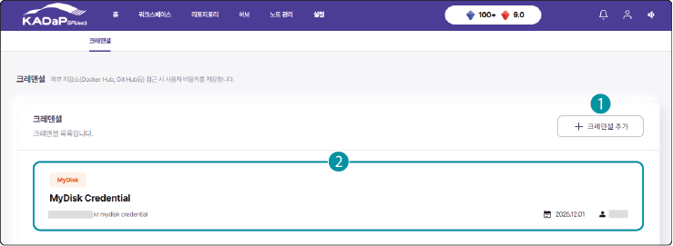

| 번호 | 항목 | 설명 |
| --- | --- | --- |
| 1 | + 크레덴셜 추가 | 외부 저장소나 마이디스크 연결 시 사용하는 크레덴셜을 추가합니다. |
| 2 | 스토리지 목록 | 크레덴셜 목록에는 크레덴셜 이름과 설명, 생성 정보가 표시됩니다.<ul><li>크레덴셜 상세 페이지에서는 기본 정보, 설정 내용, 생성 정보가 표시됩니다. 또한 크레덴셜 정보를 수정하거나 삭제할 수 있습니다.</li></ul> |

### 크레덴셜 추가하기 {#크레덴셜-추가하기}

인공지능 개발 플랫폼와 연동해 사용할 저장소의 크레덴셜을 추가할 수 있습니다.

크레덴셜을 추가하려면 다음 순서대로 진행하세요.

1. 인공지능 개발 플랫폼 홈 화면에서 메인 메뉴의 **설정**을 클릭하세요.
2. 상단의 서브 메뉴에서 **크레덴셜**을 클릭하세요.
3. 크레덴셜 목록 페이지에서 **+ 크레덴셜 추가**를 클릭하세요.
4. 크레덴셜 추가창이 나타나면 상세 항목을 설정하고 **추가**를 클릭하세요.

   

| 번호 | 항목 | 설명 |
| --- | --- | --- |
| 1 | 타입 | 외부 저장소 타입을 선택합니다.<ul><li>Git: 사용자 소스코드 및 데이터 저장</li><li>Docker: 사용자 컨테이너 이미지 저장</li><li>KADaP mydisk: 사용자가 마이디스크에 저장한 데이터에 접근</li></ul> |
| 2 | 이름 | 사용할 크레덴셜 이름을 입력합니다. |
| 3 | 설명 | 크레덴셜에 대한 설명을 입력합니다. |
| 4 | 아이디 | 선택한 저장소에서 사용하는 사용자 계정을 입력합니다. |
| 5 | 토큰 | Git에서 발급받은 개인 액세스 토큰을 입력합니다. |
| 6 | 프라이빗 레지스트리 URL | Docker에서 컨테이너 이미지가 저장된 url을 입력합니다. |
| 7 | 패스워드 | 외부저장소 접속 시 적용할 패스워드를 입력합니다. <ul><li>Docker: 로그인 비밀번호나 발급받은 액세스 토큰을 입력합니다.</li><li>자동차데이터플랫폼(KADaP) mydisk: 자동차데이터플랫폼(KADaP) 로그인 비밀번호를 입력합니다.</li></ul> |
| 8 | 유저명 | 자동차데이터플랫폼(KADaP)에 등록한 사용자 이메일 계정을 입력합니다. |

### 외부 저장소의 크레덴셜 생성하기

> **주의** 
>
>외부 저장소의 크레덴셜을 생성한 후 반드시 크레덴셜 정보를 저장해두세요. 크레덴셜 정보는 보안을 위해 생성 시에만 표시되며 다시 확인할 수 없습니다.

#### Git에서 크레덴셜 발급

사용할 Git 사이트의 **Personal access token** 메뉴에서 토큰을 생성합니다.

- 토큰 생성에 대한 자세한 설명은 해당 사이트의 도움말을 참고하세요.

#### Docker에서 크레덴셜 발급

사용할 Docker 사이트의 **Security** 메뉴에서 토큰을 생성합니다.

- 토큰 생성에 대한 자세한 설명은 해당 사이트의 도움말을 참고하세요.

#### WebDAV에서 마이디스크 크레덴셜 발급

자동차데이터플랫폼(KADaP) Portal의 마이디스크는 WebDAV 프로토콜을 지원합니다. WebDAV(Web Distributed Authoring and Versioning)는 자동차데이터플랫폼(KADaP)의 마이디스크를 별도의 연결 프로그램 없이 사용자 PC의 확장 드라이브로 연결해 사용할 수 있습니다.

WebDAV에서 마이디스크 크레덴셜을 발급하려면 다음 순서대로 진행하세요.

1. **자동차데이터플랫폼(KADaP) 포털** > **마이디스크**를 클릭하세요.
2. 마이디스크 페이지에서 왼쪽 하단의 **사용자 이름** > **Connect app**을 클릭하세요.
3. WebDAV Authrization 페이지에서 **Accept**를 클릭하세요.
4. WebDAV Credential 페이지에서 발급된 크레덴셜 정보를 복사해 저장하세요.
   - 크레덴셜 정보는 분실하지 않도록 반드시 저장해두세요.

### 크레덴셜 활용하기

크레덴셜 정보를 등록해 놓으면 소스코드를 추가하거나 워크로드 생성 시 적용할 수 있습니다.

- **리포지토리** > **소스코드** > **소스코드 추가** > **크레덴셜** > **Private Repository**선택 시 적용
  - 소스코드 추가에 대한 자세한 설명은 [소스코드 경로 추가](#소스코드-경로-추가)를 참고하세요.
- 워크로드 생성 시 적용
  - **이미지** > **Public Image**또는**Private Image**선택 시 적용
  - **소스코드 추가** > **직접 입력**시 적용
  - 워크로드 생성 시 각 항목에 대한 자세한 설명은 [워크로드 생성하기](#워크로드-생성하기)를 참고하세요.