# 마켓 플레이스 KADaP MARKET

자동차 데이터 기반의 분석 및 개발에 필요한 다양한 데이터뿐만 아니라, APP과 API 형태의 상품이나 서비스를 간편하게 구매하고 활용할 수 있습니다.

# 마켓 플레이스 소개

마켓 플레이스는 KADaP 내에서 운영되는 데이터 기반 거래 공간으로, 기업과 기관이 데이터를 공유하거나 판매하고, 필요한 데이터를 구매하는 등 데이터 상품의 거래와 서비스 환경을 제공합니다.

마켓 플레이스는 SaaS 마켓 플레이스와 API 마켓 플레이스로 구성되어 있고, 각 마켓 플레이스의 서비스 구성과 주요 특징은 다음과 같습니다.

### 서비스 구성

마켓 플레이스의 주요 서비스 구성은 다음과 같습니다.

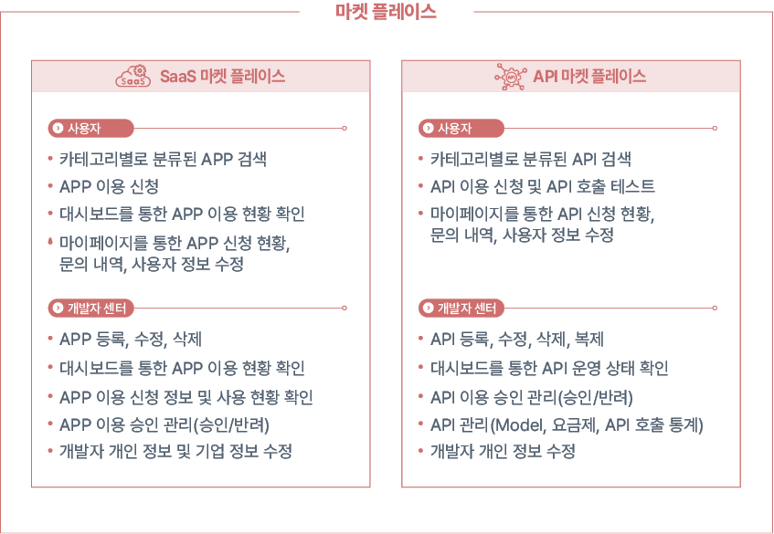

## 주요 기능과 특징

### SaaS 마켓 플레이스

- **APP 검색 및 탐색 기능 제공**

  다양한 자동차 기술 분야의 APP을 카테고리별로 분류하여 쉽게 찾아볼 수 있습니다.

- **APP 이용 신청**

  원하는 APP을 선택하여 이용 신청하고, 승인 후 바로 사용할 수 있습니다. 무료 APP은 이용 신청을 하면 바로 사용 가능하고, 유료 APP은 개발자 승인 후 사용할 수 있습니다.

- **포인트 기반 과금**

  포인트(무료 APP)·포인트 플러스(유료 APP)를 통해 사용 시간에 따라 차감됩니다.

- **APP 등록 및 게시 기능 제공**

  개발자는 자체 개발한 APP을 등록하고, 관리자 승인 후 마켓에 공개할 수 있습니다.

- **승인 기반 운영 체계**

  관리자의 검토 및 승인 절차를 통해 신뢰할 수 있는 APP만 마켓에 공개됩니다.

- **대시보드**

  사용 중인 APP 목록과 이용 상태를 한눈에 확인할 수 있습니다.

### API 마켓 플레이스

- **API 신청 · 구독 · 호출 기능 제공**

  사용자가 원하는 API를 선택해 신청하고, 구독 후 바로 호출할 수 있습니다.

- **표준화된 서비스 구조**

  API 문서와 요청/응답 규격, 인증 체계를 통일된 방식으로 구성해 사용자 편의성을 높였습니다.

- **승인 기반 보안 체계**

  개발자 및 관리자의 승인 절차를 거쳐 안전하게 API를 이용할 수 있는 환경을 제공합니다.

- **사용 통계 및 구독 관리 대시보드**

  API 호출 현황, 응답 상태, 에러 비율, 사용 신청 내역 등 API 사용 현황을 직관적으로 파악할 수 있습니다.

# 마켓 플레이스 시작

마켓 플레이스를 이용하려면 자동차데이터플랫폼(KADaP) 포털 계정으로 로그인하세요.

## 마켓 플레이스 접속하기

마켓 플레이스를 접속하려면 다음 순서대로 진행하세요.

1. **자동차데이터플랫폼**(www.bigdata-car.kr)에 접속하세요.
2. 자동차데이터플랫폼에 로그인하세요.
   - 회원가입과 로그인 방법은 [개발자 등록](#saas-개발자-등록)과 [로그인하기](KADaP_UserManual_Frontmatter.md#로그인하기)를 참고하세요.
3. 자동차 데이터 플랫폼 페이지에서 **데이터 서비스 제공** > **SaaS 마켓 플레이스** 또는 **API 마켓 플레이스**를 클릭하세요.

   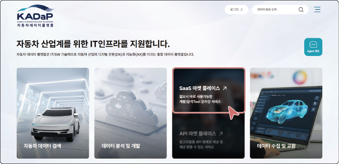

>  **바로가기**
>
> 다음의 경로로 바로 접속할 수 있습니다.
> - **SaaS 마켓 플레이스**: [app.bigdata-car.kr](https://www.app.bigdata-car.kr)
> - **API 마켓 플레이스**: [api.bigdata-car.kr](https://www.api.bigdata-car.kr)

# SaaS 마켓 플레이스

SaaS 마켓 플레이스는 자동차데이터플랫폼(KADaP) 내에서 운영되는 APP 거래 플랫폼으로, 자동차 기술 분야의 다양한 APP을 카테고리별로 검색하고 간편하게 이용 신청하여 사용할 수 있습니다. 또한 개발자는 자체 개발한 APP을 등록하고 관리자 승인 후 마켓에 공개할 수 있습니다.

## 메뉴 및 화면 구성

SaaS 마켓 플레이스의 메인 화면은 다음과 같이 구성됩니다.

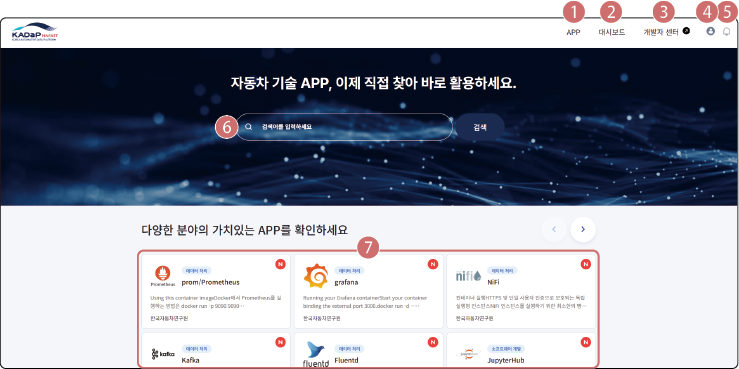

| 번호 | 항목 | 설명 |
|---|------|------|
| 1 | APP | 마켓에 등록된 APP이 카테고리별로 분류되어 표시됩니다. |
| 2 | 대시보드 | 사용 중인 APP 목록과 이용 상태를 확인할 수 있습니다. |
| 3 | 개발자 등록/개발자 센터 | APP을 등록하거나 등록된 APP을 관리하려면 개발자 등록이 필요합니다. 개발자 등록 신청이 승인되면 개발자 센터에 접속할 수 있고, 개발자 센터를 통해 APP 등록과 관리에 필요한 전반적인 기능을 이용할 수 있습니다. |
| 4 | 마이페이지 | APP 신청 현황 확인, 문의 내역, 내 정보 수정 등의 기능을 이용할 수 있습니다. |
| 5 | 알림 | 공지사항과 FAQ 등의 알림을 확인할 수 있습니다. |
| 6 | 검색 | 마켓에 등록된 APP를 검색어를 통해 검색할 수 있습니다. |
| 7 | APP 목록 | 마켓에 등록된 APP 목록이 표시됩니다. |

### APP

마켓에 등록된 APP은 카테고리별로 분류되어 있어 쉽게 찾아볼 수 있습니다. 또한 검색창에 키워드를 입력하여 원하는 APP을 바로 검색할 수도 있습니다. 검색 결과는 리스트 또는 카드 형식으로 표시할 수 있으며, 최신순 또는 인기순으로 정렬할 수 있습니다.

- **전체 APP**: 마켓에 등록된 전체 APP 목록입니다.
- **운영체제(OS)**: 운영체제 관련 소프트웨어 APP 목록입니다.
- **데이터 처리**: 데이터 수집·가공·분석 관련 APP 목록입니다.
- **소프트웨어 개발**: 개발 도구, 코딩 환경, 버전 관리 등의 APP 목록입니다.
- **자동차 산업 특화**: 자동차 제조·부품·자율주행 등 산업 특화 APP 목록입니다.
- **사무환경DX화**: 업무 환경의 디지털 전환을 지원하는 사무용 APP 목록입니다.

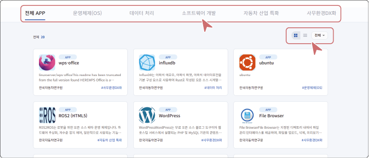

>  **참고**
>
> APP 카테고리는 관리자에 의해 운영·관리됩니다.

### 대시보드 {#saas-대시보드}

사용자가 신청한 APP의 실행 현황을 대시보드에서 확인할 수 있습니다. 사용/실행 대기, 사용/실행 중, 정지 상태별 APP 현황을 제공하며, CPU·메모리 사용량 및 남은 사용 시간 등 개별 APP의 상세 정보를 조회할 수 있습니다.

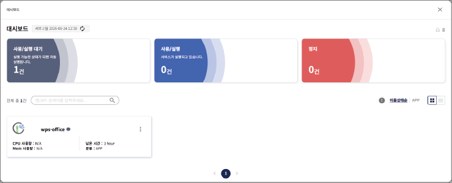

### 개발자 등록/개발자 센터

APP을 등록하거나 등록된 APP을 관리하려면 개발자 등록 신청이 필요합니다.

#### 개발자 등록 {#saas-개발자-등록}

>  **참고**
>
> 개발자 등록은 기업 및 기관 회원만 가능합니다.

화면 상단의 **개발자 등록**을 클릭한 후, 개발자 등록 정보를 입력하세요. 관리자가 신청 내용을 검토한 후, 승인 여부를 이메일로 안내해 드립니다.

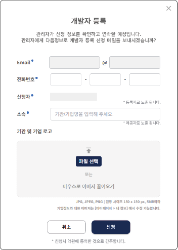

#### 개발자 센터

개발자 등록 신청이 승인되면 개발자 센터에 접속할 수 있습니다. 개발자 센터는 총 5개의 메뉴로 구성되어 있으며, 각 메뉴에 대한 상세 설명은 해당 메뉴 페이지에서 확인할 수 있습니다.

- **대시보드**: 등록된 전체 APP의 이용 상태와 현황을 표시합니다.
- **APP 정보**: APP의 이용 신청 정보와 사용 현황을 표시합니다.
- **APP 등록관리**: APP을 등록, 수정, 삭제하고 이용 테스트를 합니다.
- **승인 관리**: 사용자가 신청한 APP 이용 요청을 승인하거나 반려합니다.
- **환경설정**: 내 정보를 확인하고 수정합니다.

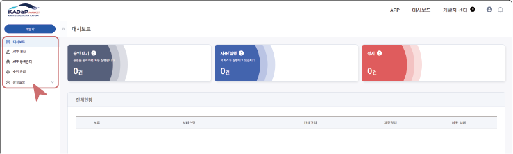

### 마이페이지

APP 신청 현황 확인, 문의 내역, 내 정보 수정 등의 기능을 이용할 수 있습니다.

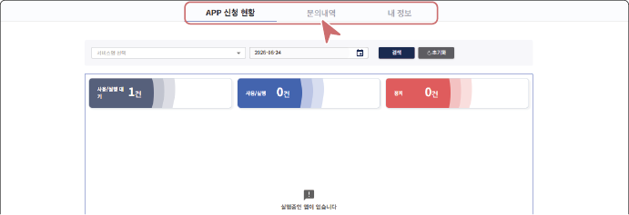

- **APP 신청 현황**

  이용 신청한 APP 목록과 상태를 확인할 수 있습니다.

- **문의내역**

  SaaS 마켓 플레이스 이용 중에 문의 사항을 등록할 수 있고, 등록된 문의 사항을 카테고리 또는 키워드로 검색할 수 있습니다.

- **내 정보**

  가입 시 등록한 개인 정보 또는 기업 정보를 조회하고 수정할 수 있습니다. 개인 정보 수정은 자동차 데이터 포털 사이트로 이동하여 진행합니다.

### 알림

공지사항과 FAQ 등의 알림을 확인할 수 있습니다.

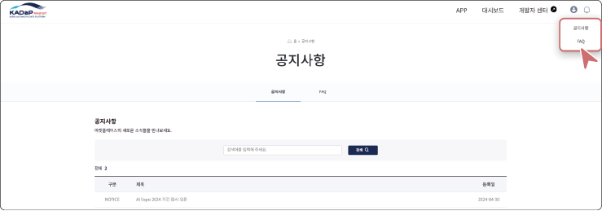

## APP 사용하기

사용자는 SaaS 마켓 플레이스에 등록된 APP을 검색하고, 사용 신청할 수 있습니다.

### APP 사용 신청하기

APP 사용하려면 다음 순서대로 진행하세요.

#### APP 검색

1. APP 마켓 플레이스 검색창 또는 **APP** 메뉴에서 원하는 APP을 검색하세요.
   - 키워드 검색, 카테고리 선택, 정렬 옵션(인기순, 최신순)을 활용해 원하는 APP을 빠르게 찾을 수 있습니다.

   

2. 검색 결과에서 원하는 APP을 클릭하세요.
   - APP 상세 페이지로 이동하며, 해당 APP의 상세 정보, 도커 정보, 요금제 정보를 확인할 수 있습니다.

#### APP 사용 신청

1. APP 상세 페이지에서 **이용 신청**을 클릭하세요.

   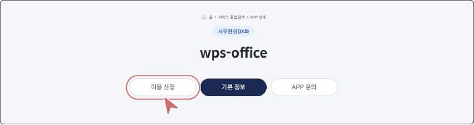

2. **구매 신청** 화면에서 다음 항목을 설정하고 **신청**을 클릭하세요.

   

   - **보유 포인트**: 현재 보유한 포인트와 포인트 플러스를 확인합니다.
   - **시간당 예상 차감**: 선택한 APP의 시간당 예상 차감 포인트를 확인합니다.
   - **예상 사용 시간**: 사용 예정 시간을 입력하여 총 차감 포인트를 예상할 수 있습니다.
   - **권장 사양**: CPU, Memory, DISK 권장 사양을 확인합니다.
   - **보유 자원**: 현재 할당된 CPU, Memory, DISK 자원을 확인합니다.
   - **mydisk 연동**: 포털의 마이디스크와 연동할지 선택합니다.
   - **Scale to Zero**: 사용자가 없을 때 절전 모드로 전환합니다. 포인트 차감이 50% 감소합니다.
   - **포인트 플러스**: 보유 자원 제약 없이 사용합니다. 관리자가 지정한 포인트 플러스 단가로 차감됩니다.

   APP 이용 신청이 완료되었고, 해당 APP 개발자의 승인 절차가 진행됩니다.

>  **참고**
>
> 무료 APP은 이용 신청 즉시 사용할 수 있습니다. 유료 APP은 개발자의 승인 이후에 이용할 수 있습니다.

#### APP 이용 신청 상태 확인

**마이페이지** > **APP 신청 현황**에서 신청한 APP의 목록과 상태를 확인할 수 있습니다.

- **사용/실행 대기**: APP 승인은 완료되었으나, 사용자가 아직 실행하지 않은 건수를 표시합니다.
- **사용/실행**: APP을 정상적으로 사용할 수 있는 건수를 표시합니다.
- **정지**: 포인트 부족 또는 사용자 요청에 의해 APP이 정지된 건수를 표시합니다.
- **서비스 목록**
  - **실행**: APP을 사용할 수 있습니다.
  - **실행 대기**: APP 승인은 완료되었고, 사용자 실행 대기 상태입니다.
  - **승인 대기**: 개발자의 이용 승인 대기 상태입니다.

>  **참고**
>
> 사용 신청한 APP의 승인 여부는 이메일을 통해 안내됩니다.

### APP 실행하기

무료 APP은 이용 신청 즉시 사용할 수 있고, 유료 APP은 개발자의 승인 이후에 이용할 수 있습니다.

APP을 실행하려면 다음 순서대로 진행하세요.

1. **마이페이지** > **APP 신청 현황**에서 사용할 APP을 클릭하세요.

   

2. 상세 화면에서 실행정보를 확인하세요.
   - **실행정보** 탭에서 APP의 도커 이미지 정보, 접속 URL, 실행 포트 구성(SSH·HTTP·HTTPS), CPU 및 메모리 할당 현황 등 APP 구동에 필요한 상세 정보를 확인할 수 있습니다.

   

3. **실행정보** 탭의 Knative URL을 클릭하여 해당 APP에 접속하세요.

   

>  **참고**
>
> 유료 APP은 사용 승인이 완료된 후 Knative URL이 활성화됩니다.

### APP 실행 모니터링 및 제어하기

실행 중인 APP의 리소스 사용 현황을 통계로 확인하고, 터미널을 통한 직접 제어 및 로그 조회를 통해 APP의 이용 상태를 확인할 수 있습니다.

##### 통계

날짜별로 APP의 vCPU 및 메모리(MEM) 사용량과 잔여 용량을 도넛 차트로 시각화하여 리소스 현황을 확인할 수 있습니다.

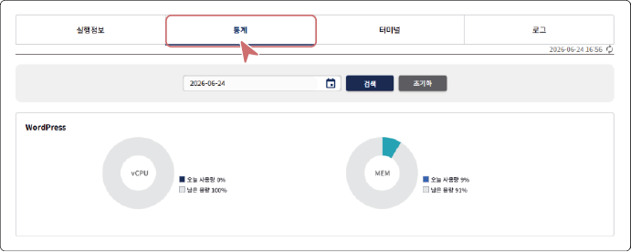

#### 터미널

실행 중인 APP 컨테이너에 직접 접속하여 명령어를 입력하고 제어할 수 있는 웹 기반 환경을 제공합니다.

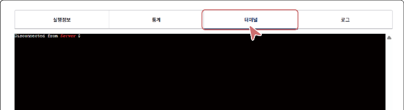

#### 로그

APP 실행 시 발생하는 시스템 로그를 실시간으로 확인할 수 있으며, 오류 및 동작 상태를 추적하는 데 활용합니다.

## APP 수정 및 삭제하기

사용 중인 APP의 표시 방식을 수정하거나 불필요한 APP을 삭제할 수 있습니다.

#### APP 수정하기

APP의 서비스명, 로고 이미지, 상단 고정 여부를 변경할 수 있습니다.

1. **대시보드** > APP 카드의 더보기 () > **수정**을 클릭하세요.

   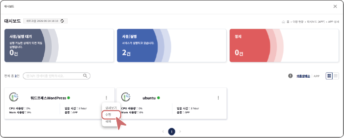

2. 원하는 표시 방식으로 변경한 후, **수정**을 클릭하세요.

   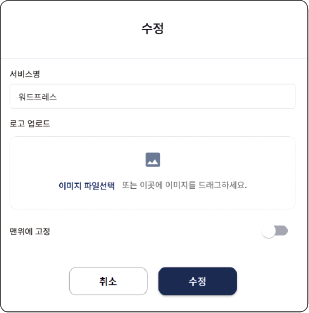

#### APP 삭제하기

사용하지 않은 APP은 삭제할 수 있습니다. APP 삭제는 **대시보드** 또는 **마이페이지**의 APP 상세정보 화면에서 가능하며, 삭제 시 목록에서 해당 APP이 삭제됩니다.

- **마이페이지의 APP 상세정보 화면**

  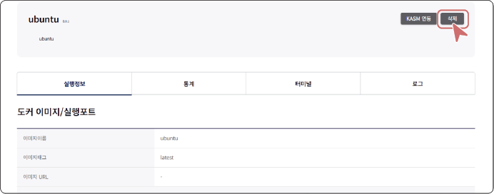

- **대시보드**

  **대시보드** > APP 카드의 더보기 () > **삭제**를 클릭하세요.

  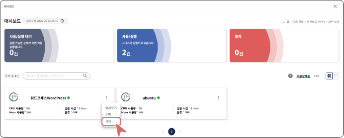

### 대시보드 확인하기 {#saas-사용자-대시보드}

대시보드에서는 사용 중인 APP 목록과 이용 상태를 한눈에 확인할 수 있습니다.

## APP 등록하기 {#app-등록하기}

APP을 SaaS 마켓 플레이스에 등록하여 사용자에게 공개할 수 있습니다. 등록된 APP은 승인 과정을 거쳐 공개되며, 사용자는 해당 APP에 대해 이용 신청을 진행할 수 있습니다.

>  **참고**
>
> APP 등록과 관리는 **개발자 센터**에서 수행하며, **개발자 센터**를 이용하려면 개발자 권한이 필요합니다. 개발자 권한 신청은 [개발자 등록](#saas-개발자-등록)을 참고하세요.

APP을 SaaS 마켓 플레이스에 등록하려면 다음 순서대로 진행하세요.

1. **APP 등록관리** > **APP 등록**을 클릭하세요.

   

2. APP 기본 정보를 입력하세요.

   

3. APP 기술 정보를 입력하세요.

   

   - **입력 방식**
   
      APP 설정 정보를 입력하는 방식을 선택합니다. **직접입력** 선택 시 각 항목을 개별 필드에 입력하고, **YAML 입력** 선택 시 Knative 기반의 YAML 코드 입력창이 표시되어 설정 정보를 한 번에 입력할 수 있습니다.

   - **프록시 여부**
   
      APP에 프록시 서버 사용 여부를 설정합니다.
  
   - **도커 이미지 이름**
   
      배포할 APP의 도커 이미지 이름을 입력합니다.
   
   - **이미지 태그**
   
      배포할 도커 이미지의 버전 태그를 입력합니다.
   
   - **도커 이미지 URL**
   
      Docker Hub 등 도커 이미지의 상세 정보를 확인할 수 있는 링크를 입력합니다.
  
   - **Command**
   
      컨테이너 실행 시 수행할 명령어를 입력하며, 여러 개의 명령어는 세미콜론(;)으로 구분합니다.
  
   - **실행포트**
   
      APP이 사용할 포트명, 포트 번호, 프로토콜을 설정하며, 포트는 최대 15자로 입력합니다.
  
   - **환경 변수**
   
      컨테이너 실행 시 필요한 환경 변수의 변수명과 변수값을 설정합니다.
  
   - **권장 사양**
   
      APP 실행에 권장되는 CPU(0.5~2 Core) 및 메모리(1~8192 Mi) 사양을 설정합니다.

4. APP 이용 요금 및 컴퓨팅 자원 요금을 설정하세요.

   시간당 차감 포인트는 (APP 요금 + 컴퓨팅 자원 요금 + GPU 자원 요금) × 사용 시간으로 산정됩니다.

   

   - **APP 요금 (개발자 보상)**
   
     무료 또는 유료로 설정할 수 있습니다. 유료 선택 시 시간당 포인트를 입력하고, 포인트 유형을 Point 또는 Point+ 중에서 선택할 수 있습니다.

   - **컴퓨팅 자원 요금 (운영자 보상)**
   
      APP 실행에 사용되는 CPU·MEM·DISK 자원에 대한 시간당 요금을 입력합니다.
   
   - **GPU 지원 (GPU 제공자 보상)** 
   
     GPU 자원 사용 여부를 설정하며, Yes 선택 시 GPU 자원 요금이 포인트 산정에 포함됩니다.

5. 요금제 내용을 입력하세요.
   - APP의 상세 화면에 표시될 요금제 내용을 에디터를 통해 직접 작성합니다. 작성한 내용은 요금제 정보의 요금제 상세 항목에 표시됩니다.

   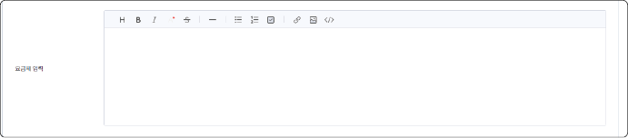

6. 기술지원 정보를 입력하세요.
   - APP 이용 중 발생할 수 있는 문의나 장애에 대한 기술지원 방법 등을 입력합니다. 작성한 내용은 사용자의 APP 상세 화면 내 기술지원 정보 항목에 표시됩니다.

   

7. 모든 정보를 입력한 후 **등록** 버튼을 클릭하세요.
   - APP 등록이 완료되었습니다.

>  **참고**
>
> **즉시 사용** 기능을 통해 APP 등록 후 실제 배포 전에 작동 여부를 테스트할 수 있습니다.
>
> 

### APP 등록 상태 확인 및 공개하기

APP 등록 상태는 **개발자 센터** > **APP 등록관리** 목록에서 확인할 수 있습니다. 개발자가 APP을 공개하면 **승인 대기** 상태로 전환되며, 관리자의 검토 및 승인 후 SaaS 마켓 플레이스에 공개됩니다. 공개된 APP은 사용자가 이용 신청을 할 수 있습니다.

- **승인 대기**: APP 등록 신청 후 관리자 승인을 기다리는 상태입니다.
- **반려**: 관리자가 APP 등록을 반려한 상태이며, 반려 사유를 확인 후 수정하여 재신청이 가능합니다.
- **공개**: 사용자에게 APP이 공개된 상태입니다.
- **비공개** (개발자): APP 등록은 완료되었으나 개발자가 공개하지 않은 상태입니다.
- **비공개** (관리자): 개발자가 공개한 APP을 관리자가 필요에 따라 비공개로 설정한 상태입니다.

### APP 수정 및 삭제하기

등록된 APP의 정보를 수정하거나 삭제할 수 있습니다.

#### APP 수정

1. **APP 등록 관리** 목록에서 수정할 APP을 클릭한 후, APP 상세 페이지 하단의 **수정**을 클릭하세요.

   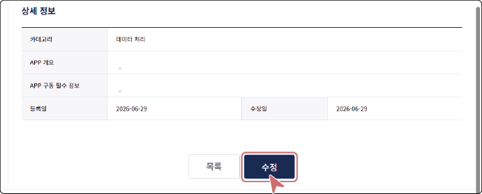

2. 수정할 내용을 변경한 후, **수정**을 클릭하세요.
   - 수정된 APP도 관리자의 검토 및 승인 후 SaaS 마켓 플레이스에 반영됩니다.

#### APP 삭제

**APP 등록 관리** 목록에서 삭제할 APP의 더보기 () > **삭제**를 클릭하세요.

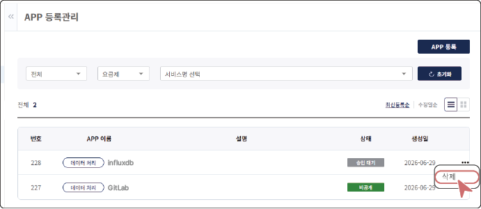

>  **주의**
>
> 
> 이용 중인 사용자가 있는 APP을 삭제할 경우, 해당 사용자의 APP 서비스가 즉시 중단될 수 있습니다. 삭제 전 이용 중인 사용자에게 사전 안내 후 진행하세요.

### APP 정보 확인하기 {#saas-app-정보-확인하기}

개발자가 등록한 APP의 승인 대기, 실행, 정지 건수와 APP 이용 신청자의 신청 정보 및 사용 정보를 확인할 수 있습니다.

### APP 승인 관리하기 {#saas-app-승인-관리하기}

사용자가 이용 신청한 APP 목록을 확인하고 승인 또는 반려할 수 있습니다. 서비스명, 요금제, 상태 조건으로 목록을 검색할 수 있으며, 승인 시 사용자의 APP 이용이 즉시 시작됩니다.

### 대시보드 확인하기 {#saas-개발자-대시보드}

대시보드에서는 개발자가 등록한 APP 목록과 이용 상태를 확인할 수 있습니다.

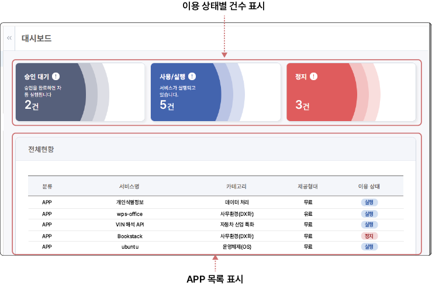

### 내 정보 수정하기 (환경설정) {#saas-내-정보-수정하기}

**환경설정** > **내 정보** 메뉴에서 개발자 개인 정보와 기업 정보를 수정할 수 있습니다. 개인 정보 수정은 자동차 데이터 포털 사이트로 이동하여 진행합니다.

# API 마켓 플레이스

API 마켓 플레이스에서는 API 사용 신청, 키 발급, 사용 이력 조회뿐만 아니라, 직접 개발한 API를 등록하고 관리할 수 있는 다양한 기능을 제공합니다.

## 메뉴 및 화면 구성

API 마켓 플레이스의 메인 화면은 다음과 같이 구성됩니다.

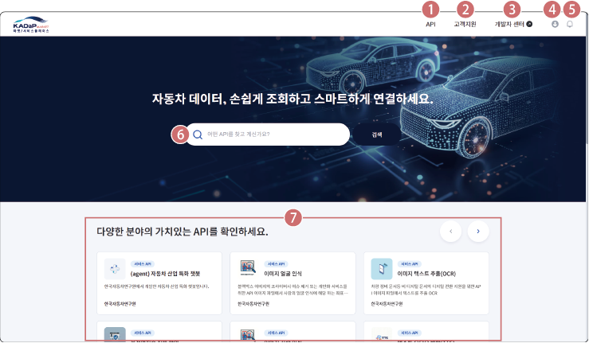

| 번호 | 항목 | 설명 |
|---|------|------|
| 1 | API | 마켓에 등록된 API가 카테고리별로 분류되어 표시됩니다. |
| 2 | 고객지원 | 마켓 이용과 관련된 공지사항, 자주 묻는 질문(FAQ), 문의사항 등을 확인할 수 있습니다. |
| 3 | 개발자 등록/개발자 센터 | API를 등록하거나 등록된 API를 관리하려면 개발자 등록이 필요합니다. 개발자 등록 신청이 승인되면 개발자 센터에 접속할 수 있고, 개발자 센터를 통해 API 등록과 관리에 필요한 전반적인 기능을 이용할 수 있습니다. |
| 4 | 마이페이지 | API 신청 현황 확인, 문의 작성, 내 정보 수정 등의 기능을 이용할 수 있습니다. |
| 5 | 알림 | API 사용 신청 결과, 최신 소식, 문의 사항에 대한 알림을 확인할 수 있습니다. |
| 6 | 검색 | 마켓에 등록된 API를 검색어를 통해 검색할 수 있습니다. |
| 7 | API 목록 | 마켓에 등록된 API 목록이 표시됩니다. |

### API

마켓에 등록된 API는 카테고리별로 분류되어 있어 쉽게 찾아볼 수 있습니다. 또한 검색창에 키워드를 입력하여 원하는 API를 바로 검색할 수도 있습니다. 검색 결과는 리스트 또는 카드 형식으로 표시할 수 있으며, 최신순 또는 인기순으로 정렬할 수 있습니다.

- **전체 API**: 마켓에 등록된 전체 API 목록입니다.
- **서비스 API**: 입력된 데이터를 처리하고, AI 기반의 분석 및 예측 기능을 수행하는 API 목록입니다.
- **자동차산업특화**: 차량 번호 기반 이력 조회, 운전면허증 확인, 차량 이미지 인식 등 자동차 서비스 현장에서 활용 가능한 실무 중심의 API 목록입니다.
- **AI/알고리즘**: 다양한 대형 언어 모델(LLM)과 이미지 분석, 텍스트 음성 변환(TTS) 등 AI 기반 기능을 손쉽게 연동할 수 있는 API 목록입니다.

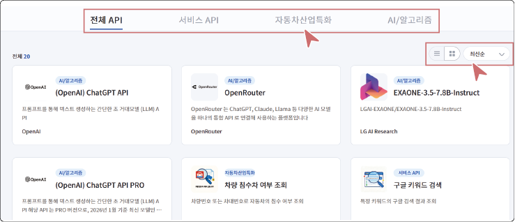

### 고객지원

마켓 이용과 관련된 공지사항, 자주 묻는 질문(FAQ), 고객 문의를 확인할 수 있습니다. 자주 묻는 질문(FAQ)과 고객문의는 카테고리별로 분류되어 있어 쉽게 찾아볼 수 있습니다.

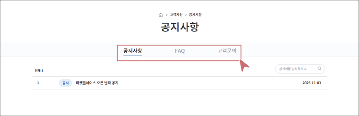

### 개발자 등록/개발자 센터

API를 등록하거나 등록된 API를 관리하려면 개발자 등록 신청이 필요합니다.

#### 개발자 등록 {#api-개발자-등록}

>  **참고**
>
> 개발자 등록은 기업 및 기관 회원만 가능합니다.

화면 상단의 **개발자 등록**을 클릭한 후, **확인**을 클릭하면 개발자 등록 신청이 완료됩니다. 관리자가 신청 내용을 검토한 후, 승인 여부를 이메일과 API 마켓 플레이스의 알림으로 안내해 드립니다.

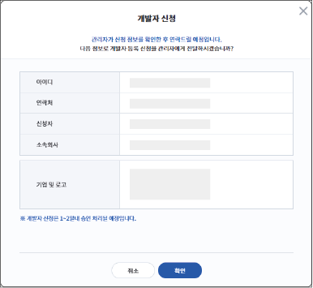

##### 개발자 센터

개발자 등록 신청이 승인되면 개발자 센터에 접속할 수 있습니다. 개발자 센터에서는 API 등록, 버전 관리, 호출 통계 조회 등 API 관리에 필요한 기능을 제공합니다. 개발자 센터는 총 9개의 메뉴로 구성되어 있으며, 각 메뉴에 대한 상세 기능은 해당 메뉴 페이지에서 확인할 수 있습니다.

| | | |
|---|---|---|
| ■ [대시보드](#api-대시보드-사용하기) | ■ [API 사용 신청 관리](#api-사용-신청-관리하기) | ■ [통계](#api-호출-통계-확인하기) |
| ■ [타겟 서버 관리](#타겟-서버-그룹-등록하기) | ■ [Models 관리](#model-관리하기) | ■ [환경설정](#환경-설정하기) |
| ■ [API 관리](#api-생성하기api-관리) | ■ [요금제 관리](#요금제-관리하기) | ■ [고객지원](#고객-지원하기) |

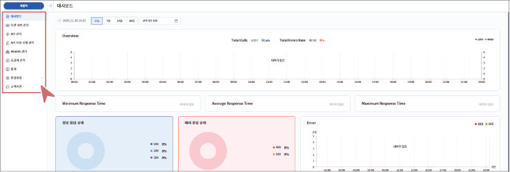

### 마이페이지

API 신청 현황 확인, 문의 내역, 내 정보를 확인할 수 있습니다.

#### API 신청 현황

사용 신청한 API 목록의 상태 정보를 확인할 수 있습니다.

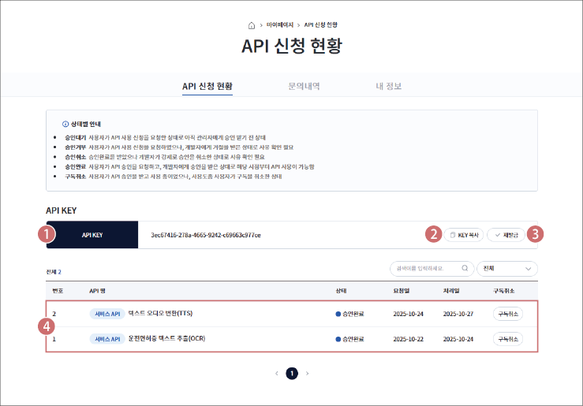

| 번호 | 항목 | 설명 |
|---|------|------|
| 1 | API KEY | 개발자가 승인한 API를 호출할 때 접근 권한을 인증하기 위해 사용합니다. 이 KEY는 승인된 모든 API를 테스트할 때 활용할 수 있는 공용 키입니다. |
| 2 | KEY 복사 | 화면에 표시된 API KEY 값을 사용자가 간편하게 클립보드에 복사할 수 있도록 제공되는 기능입니다. |
| 3 | 재발급 | 기존에 발급된 API KEY를 폐기하고 새로운 API KEY를 발급합니다. API KEY가 외부에 노출되는 등의 보안상 필요한 경우 API KEY를 재발급할 수 있습니다.<ul><li>재발급 후에는 기존 키로는 API를 호출할 수 없으므로, 기존 키를 사용하던 시스템에서는 새 키로 반드시 업데이트해야 합니다.</li></ul> |
| 4 | 사용 신청한 API 목록 | <ul><li>사용자가 신청한 API의 상태를 확인할 수 있고, **구독취소**를 통해 해당 API에 대한 사용 권한을 해지할 수 있습니다.<ul><li>구독취소 시 해당 API는 더 이상 호출할 수 없으며, 필요할 경우 다시 신청해야 합니다.</li></ul></li></ul><ul><li>각 API 목록을 클릭하면 해당 API의 상세 정보를 확인할 수 있습니다. 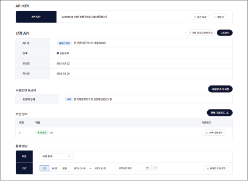</li></ul></ul> |

#### 문의내역

API 마켓 플레이스 이용 관련 문의를 작성할 수 있으며, 등록된 문의는 목록에서 확인할 수 있습니다. 여기에서 작성한 문의는 **고객지원** > **고객문의** 메뉴에도 함께 게시됩니다.

#### 내 정보

회원 기본 정보와 개발자 인증 정보 등을 확인하고 수정할 수 있습니다. 내 정보 수정은 **자동차 데이터 포털** 사이트로 이동하여 진행합니다.

### 알림

API 사용 신청 승인 결과, 고객지원 관련 안내 등 사용자 계정과 서비스 이용에 필요한 다양한 알림을 확인할 수 있습니다. 알림 목록은 최신순으로 정렬되며, 필요 시 **전체 알림 확인** 기능을 사용할 수 있습니다.

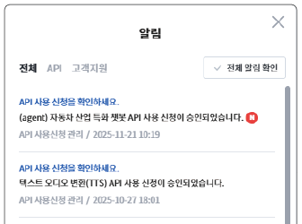

## API 사용하기

사용자는 API 마켓 플레이스에서 원하는 API의 사용을 신청할 수 있습니다. 사용 승인은 해당 API 개발자의 승인을 받아야 하며, 승인 이후에만 실제 API 호출이 가능합니다.

### API 사용 신청하기

API 사용하려면 다음 순서대로 진행하세요.

#### API 검색

1. API 마켓 플레이스 검색창 또는 **API** 메뉴에서 원하는 API를 검색하세요.
   - 키워드 검색, 카테고리 선택, 정렬 옵션(인기순, 최신순)을 활용해 원하는 API를 빠르게 찾을 수 있습니다.

   

2. 검색 결과에서 원하는 API를 클릭하세요.
   - API 상세 페이지로 이동하며, 해당 API에서 제공하는 기능과 사용 조건 등을 확인할 수 있습니다.

#### API 사용 신청

1. API 상세 페이지에서 **사용 신청하기**를 클릭하세요.

   

2. 요금제를 선택한 후, **확인**을 클릭하세요.
   - 실제 요금이 차감되는 방식이 아니며, API 사용 건수를 확인하기 위한 옵션입니다.

   API 사용 신청이 완료되었고, 해당 API 개발자의 승인 절차가 진행됩니다.

>  **참고**
>
> 개발자 본인이 등록한 API는 사용 신청할 수 없습니다.

#### API 사용 신청 상태 확인

**마이페이지** > **API 신청 현황**에서 신청한 API의 승인 상태를 확인할 수 있으며, 승인 완료된 API는 바로 호출하여 사용할 수 있습니다.

>  **참고**
>
> 사용 신청한 API의 승인 여부는 이메일과 알림을 통해 안내됩니다.

### API 호출 테스트하기

API 사용 승인이 완료되면 API 호출 테스트를 진행할 수 있습니다.

1. **마이페이지** > **API 신청 현황**에서 해당 API를 클릭하세요.

2. 상세 화면에서 **API DOCS 바로가기**를 클릭하세요.

   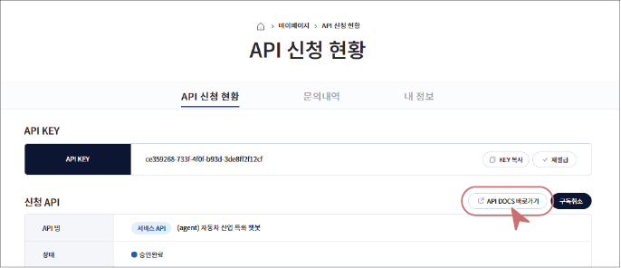

3. Parameters와 Request body 영역에 필요한 값을 입력하세요.
   - 필수 값(*)이 표시된 항목은 반드시 입력해야 합니다.
   - 선택 값은 필요에 따라 입력합니다.

   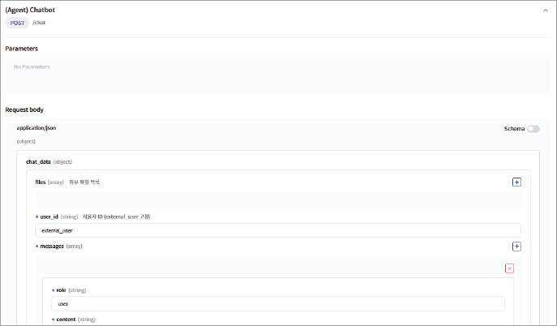

4. 해당 값을 모두 입력 후, **Execute**를 클릭하세요.
   - 요청과 응답 결과가 화면에 표시되며, 응답 상태 코드와 반환 데이터를 확인할 수 있습니다.

>  **참고**
>
> - 사용 신청 전이라도 API가 정상적으로 작동하는지 최대 10회까지 테스트할 수 있습니다.
>   - API 검색 > 호출 테스트할 API 클릭 > **API DOCS 바로가기** > **Test Key 발급** > 호출 테스트 시작
> - API 문서는 버전별로 json 포맷으로 제공합니다.

### API Key 관리하기

API 마켓 플레이스에서는 승인된 모든 API 테스트에 사용할 수 있는 공용 API Key를 제공합니다. 공용 API Key는 여러 API에서 공통으로 사용되기 때문에 노출이나 오용되지 않도록 주의하시기 바랍니다.

#### 재발급

API Key가 노출되었거나 보안 상의 이유로 새 Key가 필요한 경우, **재발급** 기능을 이용해 새로운 API Key를 생성할 수 있습니다. 재발급 후 기존 Key는 즉시 사용 중단되며, 새로 발급된 Key로만 API 호출이 가능합니다.

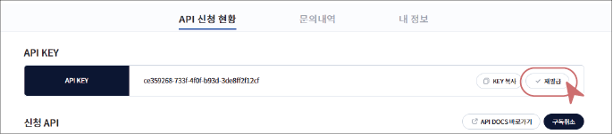

#### 구독취소

API Key는 사용자가 구독취소 전까지 지속적으로 사용할 수 있습니다. API가 불필요한 경우 **구독취소**를 통해 해당 API 사용을 해지할 수 있습니다. 구독취소 후에는 API Key가 비활성화되며, API 호출이 불가능합니다.

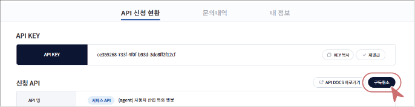

#### 보안 주의사항

API Key는 외부에 노출될 경우 부정 사용 또는 오용 위험이 있으므로 다음 보안 사항을 준수해야 합니다.

- API Key는 외부에 공유하거나 저장소(깃허브 등)에 공개하지 않습니다.
- 노출이 의심되는 경우 즉시 재발급하여 기존 Key를 폐기합니다.
- 클라이언트 애플리케이션 등에서 직접 노출되지 않도록 서버 환경에서 안전하게 관리합니다.
- 불필요한 Key는 구독 취소하여 보안 위험을 최소화합니다.

## API 등록하기

API 등록 기능은 개발자가 직접 제공하는 API를 API 마켓 플레이스에 등록하여 사용자에게 공개할 수 있도록 하는 기능입니다. 등록된 API는 승인 과정을 거쳐 마켓 플레이스에 노출되며, 사용자는 해당 API에 대해 사용 신청을 진행할 수 있습니다. API 제공자는 등록된 API의 정보, 버전, 사용 현황 등을 관리할 수 있습니다.

>  **참고**
>
> API 등록과 관리는 **개발자 센터**에서 수행하며, **개발자 센터**를 이용하려면 개발자 권한이 필요합니다. 개발자 권한 신청은 [개발자 등록](#api-개발자-등록)를 참고하세요.

### API 등록 절차

API를 등록하려면 다음 순서대로 진행하세요.

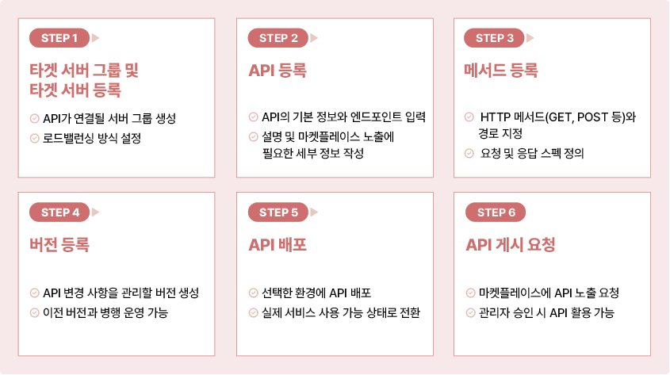

- **타겟 서버 그룹 및 타겟 서버 등록**

   API가 연결될 서버 그룹을 생성하고, 서버를 추가한 후 로드밸런싱 방식을 설정합니다.

- **API 등록**

   API 이름, 설명, 인증 방식 등 기본 정보를 입력해 API를 생성합니다.

- **메서드 등록** 

  API 요청을 처리할 HTTP 메서드와 경로를 지정하고 요청 및 응답 스펙을 정의합니다.

- **버전 등록**

  API 변경 사항을 관리하기 위해 새로운 버전을 생성합니다. 필요 시 다중 버전을 운영할 수 있습니다.

- **API 배포**

  설정이 완료된 API를 선택한 환경에 반영하여 실제 서비스에 배포합니다.

- **API 게시 요청**

  마켓 플레이스에 API를 노출하기 위한 게시를 요청합니다. 게시된 API는 관리자 승인 후 마켓 플레이스에 공개됩니다.

### 타겟 서버 그룹 등록하기 {#타겟-서버-그룹-등록하기}

API를 연결하기 위해 먼저 타겟 서버 그룹을 생성해야 합니다. 타겟 서버 그룹은 실제 서비스 엔드포인트를 논리적으로 묶어 관리하기 위한 단위이며, 생성된 그룹은 로드밸런싱 설정과 그룹 단위 모니터링 기능을 제공합니다.

타겟 서버 그룹을 등록하려면 화면 상단의 **개발자 센터**에 접속한 후, 다음 순서대로 진행하세요.

1. **타겟 서버 관리** 메뉴를 클릭한 후, **타겟 서버 그룹 등록**을 클릭하세요.

   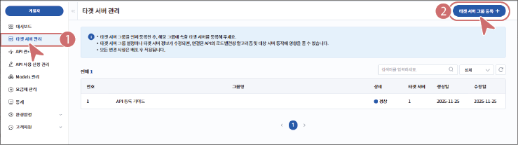

2. 등록할 타겟 서버 그룹의 정보를 입력하세요.
   - **그룹명/설명**: 타겟 서버 그룹의 이름과 설명을 입력합니다.
   - **인증**: API의 보안을 위해 필요한 인증서를 등록하거나 업데이트할 수 있습니다.
   - **로드밸런싱 알고리즘**: 로드밸런싱 방식을 선택합니다.

   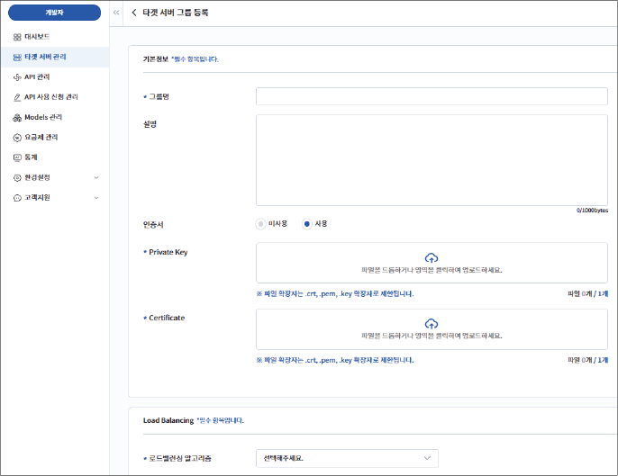

3. **저장**을 클릭하세요.

타겟 서버 그룹 등록이 완료되었습니다. 다음 절차에 따라 등록된 타겟 서버 그룹에 타겟 서버를 등록하세요.

### 타겟 서버 등록하기

타겟 서버 그룹에 실제로 사용할 엔드포인트(타겟 서버)를 등록할 수 있습니다.

1. 타겟 서버 그룹 상세 화면에서 **타겟 서버 등록**을 클릭하세요.

   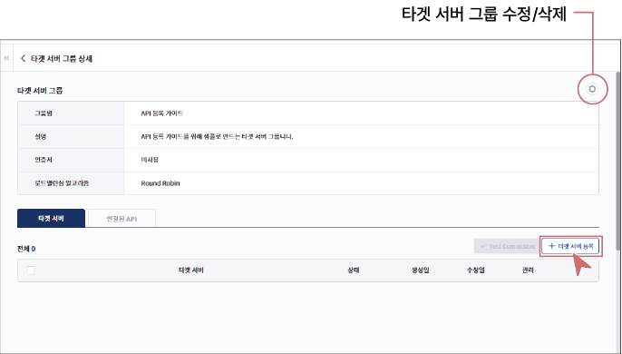

2. 등록할 타겟 서버의 세부 정보를 입력하세요.
   - 서버에 접근하기 위한 호스트(IP 또는 도메인)와 포트 번호를 입력합니다.
   - 연결 검증을 위해 **Test Connection**을 클릭하여 정상적으로 통신이 가능한지 확인합니다.

   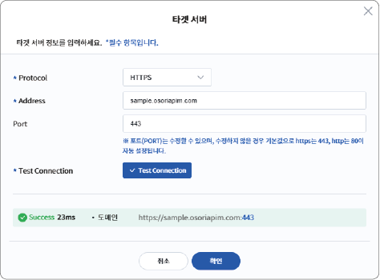

3. 연결 검증이 완료되면 **확인**을 클릭하세요.

타겟 서버 등록이 완료되었습니다. 다음 절차에 따라 API를 등록하세요.

### API 생성하기(API 관리) {#api-생성하기api-관리}

#### 기본 설정

API 등록 시 필요한 기본 정보를 입력하는 단계입니다. 이 단계에서 정의한 설정은 이후 API 관리와 연결 과정에서 주요 기준으로 활용됩니다.

1. **API 관리** 메뉴를 클릭한 후, **API 생성**을 클릭하세요.
   - 기본 설정 화면으로 이동합니다.

   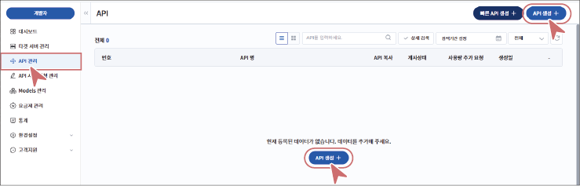

   >  **참고**
   >
   > **API 빠른 생성** 기능을 사용하면 필수 항목만 입력하여 API를 간편하게 생성할 수 있습니다.

2. 등록할 API의 기본 정보를 입력하세요.
   - **API 명/설명**: API의 이름과 설명을 입력합니다.
   - **기본 경로**: 서비스 URL로써 API를 등록할 때 사용자에게 노출할 URL을 입력합니다.
   - **타겟 서버 그룹**
     - **기존 그룹 선택**: API가 연결될 타겟 서버 그룹을 선택합니다.
     - **직접 입력**: 등록된 서버가 아닌 경우 서버 정보를 입력하고 **추가**를 클릭하세요. API 생성과 동시에 타겟 서버 그룹 메뉴에 자동으로 등록됩니다.

   

   - **카테고리**: API를 구분하기 위해 카테고리를 선택합니다. 선택한 카테고리는 포털에서 해시태그로 표시되고, 검색 시에도 활용됩니다. 카테고리는 관리자가 사전에 생성한 목록으로 제공됩니다.
   - **해시태그**: API를 설명하는 키워드를 입력합니다. 주제나 기능별로 해시태그를 등록하면 API 검색과 분류에 활용됩니다.
   - 에디터 영역: 등록할 API의 개요 및 필요성, 설계 및 알고리즘 등과 같은 정보를 입력합니다. **샘플**을 클릭하면 이 에디터 영역에서 입력한 정보가 포털의 어느 위치에 노출되는지 확인할 수 있습니다.

   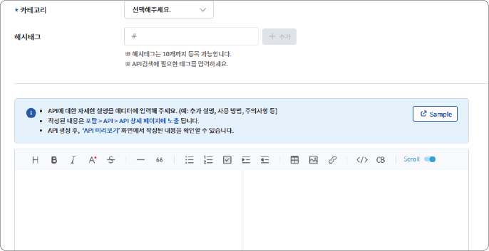

   - API의 **데이터 기본 정보** 영역에 노출할 정보를 입력합니다.

   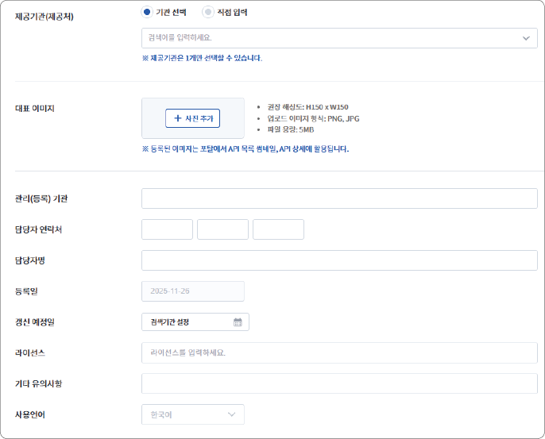

3. 기본 설정 정보를 모두 입력한 후, **다음**을 클릭하세요.
   - 고급 설정 화면으로 이동합니다.

#### 고급 정보 설정

기본 정보 외에 추가 제어가 필요한 경우, 고급 설정을 통해 사용량 제한과 요청 제어를 설정할 수 있습니다.

1. 고급 설정은 기본값이 적용되어 있으므로 필요한 항목만 선택하여 수정하세요.
   - **CORS**: 외부 도메인에서 API 호출을 허용할지 설정합니다. 필요 시 허용할 Origin, Method, Header 등을 지정합니다.
   - **요금제**: **요금제 관리** 메뉴에서 설정한 항목을 사용합니다.
   - **요청 제어**: API 호출 시 특정 헤더를 반드시 포함하도록 설정할 수 있습니다. 기본값은 **사용안함**이며, **사용**으로 설정하면 API 호출 시 지정한 헤더 또는 쿼리 파라미터가 포함되지 않은 경우 여기에서 입력한 값을 자동으로 추가합니다.

   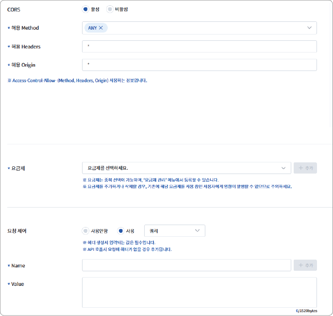

2. 고급 설정 정보를 모두 입력한 후, **저장**을 클릭하세요.

API 생성이 완료되었습니다. 생성된 API는 **API 관리** 메뉴에서 등록한 API명으로 확인할 수 있습니다. 다음 절차에 따라 메서드를 등록하세요.

### 메서드 등록하기

메서드(Method)는 API 요청 시 서버가 수행해야 할 동작을 지정하는 규칙입니다. 데이터 조회(GET), 생성(POST), 수정(PUT/PATCH), 삭제(DELETE) 등의 메서드를 사용하며, 각 메서드는 요청 목적을 명확히 구분해 서버가 올바르게 동작하도록 합니다.

API 상세 페이지 하단의 **메서드 생성**을 클릭하면, 메서드 세팅 정보 화면으로 이동합니다.

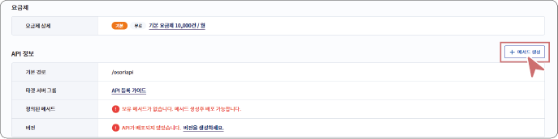

#### 세팅 정보 설정

메서드 등록은 API의 엔드포인트별 동작 방식을 정의하는 단계입니다. 각 메서드에서 경로, 타겟 경로, 타겟 서버 그룹 등을 설정할 수 있으며, 이를 통해 API 호출 시 어떤 요청이 수행될지 결정됩니다.

1. 메서드의 세팅 정보를 입력하세요.
   - **이름/설명**: 메서드의 이름과 설명을 입력합니다.
   - **경로**: 엔드포인트의 경로를 입력합니다. 사용자에게 노출되는 경로로 실제 API의 경로와 일치하지 않아도 무방합니다.
   - **메서드**: GET, POST, PUT, DELETE 등의 요청 방식을 선택합니다.
   - **API KEY 필요**: API 호출 시 API KEY를 헤더 또는 파라미터로 전달하여 권한을 검증합니다.
   - **타겟 경로**: 타겟 경로에 요청을 전달할 실제 서버의 경로를 입력합니다.
   - **타겟 서버 그룹**: API에 설정된 그룹을 그대로 사용할 수도 있고, 필요시 개별적으로 설정할 수 있습니다.

   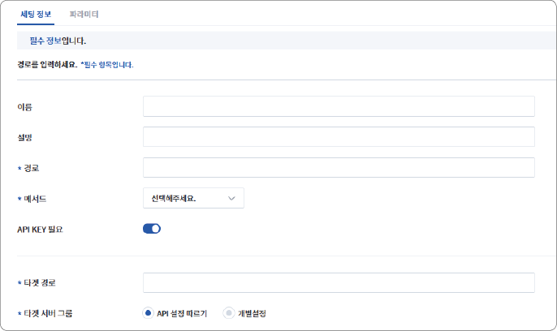

2. 세팅 정보 입력이 완료되면, **다음** 또는 **파라미터** 탭을 클릭하세요.
   - 파라미터 설정 화면으로 이동합니다.

#### 파라미터 설정

요청 파라미터는 API 호출 시 클라이언트가 전달하는 입력값을 정의하는 단계입니다. 필수 여부, 데이터 타입, 배열 여부 등을 설정할 수 있으며, 이는 API 요청을 검증하고 일관성있는 동작을 보장하기 위해 필요합니다.

1. 요청 파라미터 정보를 입력하세요.
   - **파라미터 타입**: 파라미터가 전달되는 위치(쿼리, 헤더, 쿠키, 경로)를 선택합니다.
   - **이름/설명**: 실제 요청 시 사용될 파라미터 Key 값과 설명을 입력합니다.
   - **타입**: 데이터 타입(String, Number)을 선택합니다.
   - **Required/Array**: 해당 파라미터가 반드시 포함되어야 하는지, 여러 값을 배열 형태로 받을지 설정합니다.
   - **추가**를 클릭하면 입력한 내용이 새로운 파라미터로 생성됩니다.

   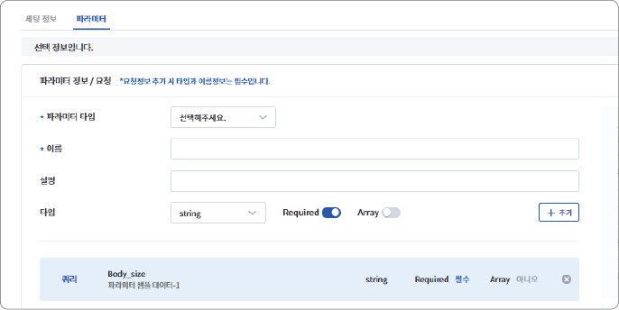

2. 요청 바디 정보를 입력하세요.
   - 요청 바디는 필수 입력 항목이 아닙니다. 필요한 경우에만 컨텐츠 타입, JSON 스키마 등을 입력하여 요청 구조와 사용 방법을 명확히 정의할 수 있습니다.

   >  **참고**
   >
   > 요청 바디 모델은 OpenAPI Specification(OAS)의 scheme 구조로 작성해야 합니다.

   - **컨텐츠 타입**: 실제 요청에 사용되는 MIME 타입을 입력합니다.
   - **이름/설명**: 요청 바디의 식별 이름과 설명을 입력합니다. 이름은 스키마 이름으로도 활용됩니다.
   - **모델**: 요청 본문의 구조를 JSON Schema 형식으로 입력합니다. Type, Properties, Required, default, example 등의 항목을 포함할 수 있습니다. 작성한 모델은 OAS의 requestBody → content → schema 영역에 반영됩니다.

   

3. 응답 정보를 입력하세요.
   - 요청 바디는 필수 입력 항목이 아닙니다. 필요한 경우 상태 코드, 응답 필드, 데이터 타입, JSON 스키마 등을 지정하여 API 응답 형식을 관리할 수 있습니다.

   

4. 모든 정보를 입력한 후, **저장**을 클릭하세요.

메서드 생성이 완료되었습니다. 다음 절차에 따라 API 버전을 등록하세요.

#### API Docs 가져오기

이미 작성된 API 문서를 업로드하면 문서에 정의된 경로, 메서드, 요청/응답 구조 등을 불러와 메서드를 자동으로 생성할 수 있습니다.

### 버전 등록하기

API 버전은 API의 변경 사항을 관리하기 위해 필요한 단계입니다. API 버전을 등록하면 엔드포인트 설정이 엔진에 배포되며, 배포가 완료되면 최종 서비스 URL이 생성됩니다.

1. **버전** 탭에서 **버전 생성**을 클릭하세요.

   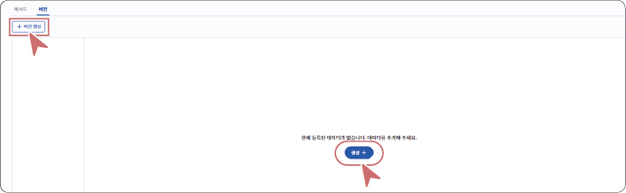

2. 버전 정보를 입력하세요.
   - **이름**: 등록할 버전 이름을 입력합니다. (예: V01, Ver1.0 등)
   - **IP 제한**: API 호출을 허용할 IP 주소 범위를 지정하여 특정 IP에서만 접근할 수 있도록 설정합니다.

   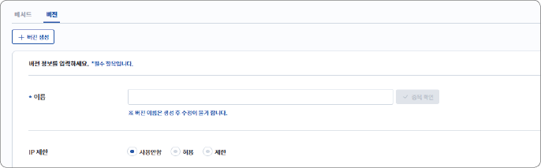

3. 모든 정보를 입력한 후, **저장**을 클릭하세요.

버전 생성이 완료되었습니다. 최초 버전인 경우에는 생성과 동시에 자동으로 배포까지 진행됩니다.

## API 수정/삭제/복사하기

API 상세 페이지 상단의  옵션을 통해 생성된 API를 수정하거나 삭제할 수 있으며, 기존 API를 복사하여 새로운 API 생성에 활용할 수도 있습니다.

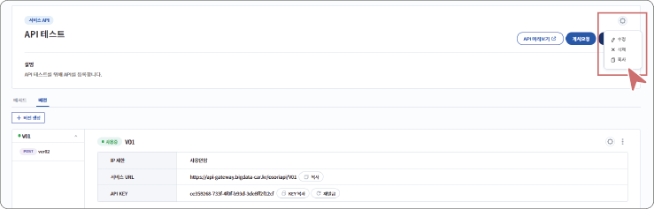

### API 수정 및 삭제하기

API 이름, 설명, 버전 정보, 메서드 정의 등 기존에 설정한 항목을 변경할 수 있습니다. 설정을 변경한 후, **저장**을 클릭하면 해당 API에 변경된 내용이 바로 적용됩니다.

사용하지 않은 API는 삭제할 수 있습니다. API 삭제 시 관련 메서드 및 구독 정보도 함께 삭제되므로 삭제하기 전에 반드시 해당 API의 구독 상태를 확인하세요.

### API 복사하기

기존 API 설정을 기반으로 새로운 API를 간편하게 생성할 수 있으며, 유사한 구조의 API를 빠르게 만들 때 유용합니다.

## API 배포하기

API의 최초 버전 생성 이후 변경 사항이 발생하면, 신규 버전으로 배포하거나 기존 버전으로 재배포할 수 있습니다.

>  **참고**
>
> API의 최초 버전은 생성과 동시에 자동으로 API Gateway에 배포되므로, 별도의 추가 절차를 수행할 필요가 없습니다.

API 상세 페이지 상단의 **API 배포**를 클릭한 후, 버전 선택창에서 **새 버전** 또는 배포할 버전을 선택하세요.

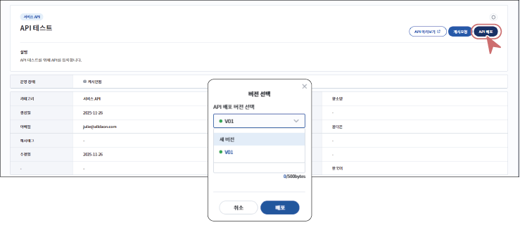

### 신규 버전 배포하기

변경된 내용을 새로운 버전으로 관리할 수 있으며, 이전 버전은 그대로 유지됩니다. 여러 버전을 병행 운영해야 하거나 하위 호환성을 유지해야 하는 경우 유용합니다.

### 기존 버전 재배포하기

기존 버전에 변경 사항을 그대로 반영하여 덮어쓰는 방식으로, 이전 버전이 필요 없고 단일 버전만 운영할 때 적합합니다.

## API 게시 요청하기

API 배포가 완료되면 마켓 플레이스에서 사용할 수 있도록 게시 요청을 진행할 수 있습니다.

API 상세 페이지 상단에서 **게시요청**을 클릭하면, API 목록에서 해당 API의 상태가 **게시대기**로 변경됩니다.

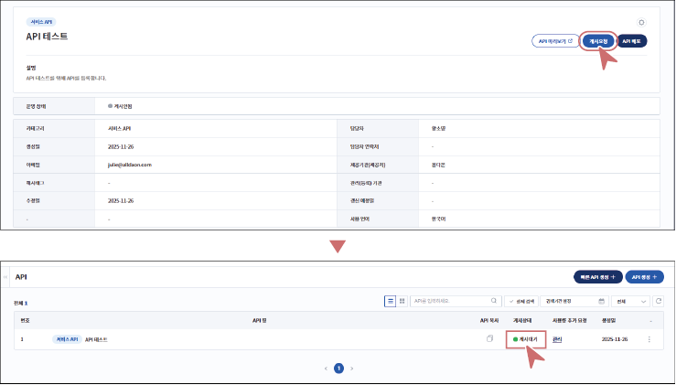

### API 게시 요청 조건 및 절차

API 게시 요청은 다음 조건을 만족해야 합니다.

- API는 메서드와 버전이 생성되어야 게시 요청이 가능합니다.
- 게시 요청 후에는 관리자 검토 및 승인이 필요합니다.
- 관리자가 승인을 완료하면 API가 마켓 플레이스에 공개되어 실제 사용자가 호출할 수 있습니다.

### API 게시 요청 상태 확인하기

게시 요청 후에는 **API 관리** > API 목록에서 게시 상태를 확인할 수 있습니다.

| 게시 상태 | 설명 |
|-----------|------|
| 게시대기 | 게시 요청이 완료되었고, 관리자의 승인 대기 중에 있습니다. |
| 게시완료 | 관리자가 승인을 완료했고, API가 마켓 플레이스에 공개되었습니다. |
| 게시거부 | 게시가 거부된 상태입니다. 게시 거부 사유는 메일로 발송됩니다. 문제를 해결한 후, 다시 게시 요청을 진행할 수 있습니다. |

>  **참고**
>
> 게시가 완료된 API의 게시를 취소하려면 API 상세 페이지 상단의 **게시취소**를 클릭하세요. 이때 해당 API를 구독 중인 사용자가 없는 경우에만 게시 취소가 가능합니다.

## API 관리하기

### 대시보드 사용하기 {#api-대시보드-사용하기}

등록된 전체 API의 호출 현황, 응답 코드 비율, 에러 발생 현황, 사용 신청 내역 등 API 운영 상태를 확인할 수 있습니다.

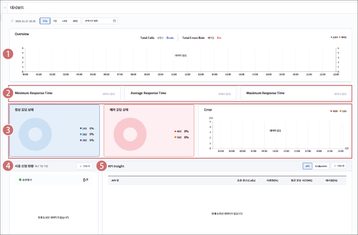

| 번호 | 항목 | 설명 |
|---|------|------|
| 1 | 전체 호출 현황 | 시간 및 기간대별 API 호출 건수(요청 수)와 에러 발생 비율을 그래프로 보여줍니다. |
| 2 | 응답 시간 | <ul><li>**Minimum Response Time**: 선택한 시간 및 기간 동안 가장 빠르게 응답한 API 호출의 응답 시간을 보여줍니다.</li><li>**Average Response Time**: 전체 호출의 평균 응답 시간을 표시하여 API 성능 상태를 확인할 수 있습니다.</li><li>**Maximum Response Time**: 선택한 시간 및 기간 중 가장 오래 걸린 API 호출의 응답 시간을 나타냅니다. API 성능 저하나 장애 가능성을 확인하는 데 유용합니다.</li></ul> |
| 3 | 응답 코드 비율/오류 건수 | <ul><li>**정상 응답 상태**: 정상적으로 처리된 응답 코드 비율을 표시합니다.</li><li>**에러 응답 상태**: API 호출에서 발생한 클라이언트 및 서버 오류 응답 비율을 보여줍니다.</li><li>**Error**: 시간 및 기간대별 에러 발생 건수를 그래프로 표시하여 에러 발생 추이를 확인합니다.</li></ul> |
| 4 | 사용 신청 현황 (최근 7일 기준) | 최근 7일 기준으로 API 사용 신청 건수와 승인 대기 중인 건수를 보여줍니다.<ul><li>**더보기**: **API 사용 신청 관리** 메뉴로 이동합니다. ([API 사용 신청 관리하기](#api-사용-신청-관리하기) 참조)</li></ul> |
| 5 | API Insight | 각 API의 상세 성능 및 호출 정보를 요약해 보여줍니다.<ul><li>**API**: API 호출 횟수가 많은 순으로 API 목록을 표시합니다.</li><li>**Endpoints**: 각 API의 엔드포인트별 호출 횟수가 많은 순으로 목록을 표시합니다.</li><li>**더보기**: **통계** 메뉴로 이동합니다. ([API 호출 통계 확인하기](#api-호출-통계-확인하기) 참조)</li></ul> |

### API 사용 신청 관리하기 {#api-사용-신청-관리하기}

사용자가 신청한 API 사용 요청 목록을 확인할 수 있습니다. 개발자는 신청 정보를 확인한 후 해당 사용자가 API를 호출할 수 있도록 승인을 하거나, 필요 시 신청을 거부할 수 있습니다. 승인된 사용자는 해당 API를 호출할 수 있게 됩니다.

### Model 관리하기 {#model-관리하기}

API 요청 또는 응답에 사용되는 데이터 모델(구조)을 생성하고 관리할 수 있습니다. JSON Schema 기반으로 필드 이름, 자료형, 필수 여부 등을 정의할 수 있으며, API 생성 시 작성된 모델을 재사용하면 API 요청과 응답 영역에 매핑됨으로써 일관된 데이터 구조를 유지할 수 있습니다.

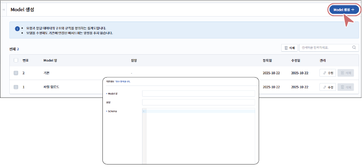

### 요금제 관리하기 {#요금제-관리하기}

API 이용에 필요한 요금제를 생성하고 관리할 수 있습니다. 요금제 이름, 유형, 제공 기간, 요청 건수 등을 설정하여 API 사용 정책을 체계적으로 운영할 수 있습니다.

- **기간**: 요금제가 적용되는 기간을 선택합니다.
- **요청건수**: 요금제 기간 동안 API를 호출할 수 있는 요청 횟수를 입력합니다.

### API 호출 통계 확인하기 {#api-호출-통계-확인하기}

특정 API의 버전별 호출량, 응답 상태 코드, 에러 발생 비율 등을 조회할 수 있습니다.

- **자체 호출**: 개발자가 API 등록 후 정상 동작 여부를 확인하기 위해 수행한 테스트 호출 통계를 보여줍니다.
- **테스트 호출**: API DOCS에서 실행한 테스트 호출에 대한 통계를 보여줍니다.
- **리포트 다운로드**: 검색된 통계 데이터를 CSV 형식으로 내려받을 수 있습니다.

## 환경 설정하기 {#환경-설정하기}

### 내 정보 수정하기

내 정보를 조회할 수 있으며, 정보 수정은 자동차 데이터 포털에서 가능합니다. 화면 하단의 **정보 수정**을 클릭하면 자동차 데이터 포털로 이동합니다.

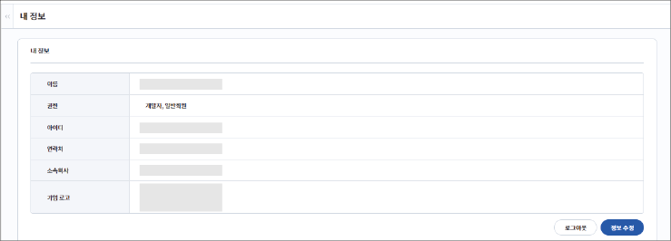

## 고객 지원하기 {#고객-지원하기}

### 고객 문의 관리하기

사용자가 등록한 문의사항을 조회하고 관리할 수 있습니다. 문의 유형, 답변 상태, 기간 등 다양한 조건으로 문의를 필터링하여 필요한 정보를 빠르게 확인할 수 있습니다.

### API 소식 등록하기

API 관련 공지, 업데이트 정보, 변경 사항 등을 등록하고 관리할 수 있습니다. 개발자는 API별 또는 전체 API를 대상으로 공지를 작성할 수 있으며, 사용자는 게시된 소식을 알림을 통해서 확인할 수 있습니다.

