# 자동차데이터포털 KADaP PORTAL

자동차 관련 데이터를 키워드 검색과 세분화된 카테고리를 이용하여 손쉽게 찾을 수 있습니다.

# 자동차 데이터 포털 소개

자동차 데이터 포털에서는 한국자동차연구원이 보유한 전문성 높은 실험, 평가, 개발 관련 데이터를 제공합니다. 또한 국내와 해외 공공 데이터 포털 및 기관이 공개한 데이터를 주기적으로 수집하고 자동차 데이터만을 AI 알고리즘을 이용하여 분류하여 제공하고 있습니다.검색되지 않는 데이터는 한국자동차연구원이 보유한 장비를 이용하여 생성을 요청할 수 있습니다.

> **참고**
>
> 수집 대상의 목록은 **자동차 데이터 포털** > **검색** > **수집 현황**에서 확인할 수 있습니다.

자동차 데이터 포털에서는 기업이 보유한 데이터를 등록하고, 키워드 또는 세분화된 카테고리를 이용하여 손쉬운 검색이 가능한 환경을 제공합니다. 또한 검색한 데이터에 대한 기본적인 분석 및 시각화 툴도 함께 제공하고 있습니다.

자동차 데이터는 '산업 데이터'의 속성을 가지고 있어 공공 데이터의 '공개'의 개념보다는 기업 보유 데이터의 '공유'에 목적을 두고 있습니다. 데이터 수요자와 데이터 공급자를 연결하여 활용할 수 있도록 하기 위해 제공자 요청 시 일부 데이터는 샘플 파일과 메타 데이터만을 제공하고 있습니다.

>  **참고**
>
> -  데이터의 안전한 공유를 위해 데이터 교환 시스템을 제공하고 있습니다.
> -  데이터의 안전한 분석을 위해 안심존과 자동차 산업 클라우드를 제공하고 있습니다.

## 서비스 구성

자동차 데이터 포털의 주요 서비스 구성은 다음과 같습니다.

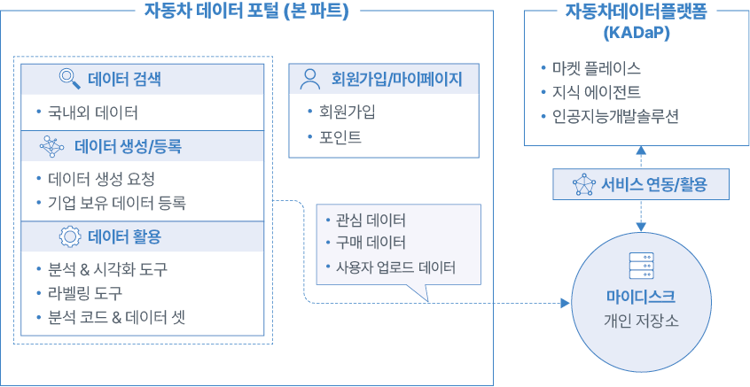

## 주요 기능과 특징

자동차 데이터 포털이 제공하는 주요 기능과 특징은 다음과 같습니다.

- **자동차 데이터 통합 검색**
  - 한국자동차연구원이 보유한 전문성 높은 데이터를 제공합니다.
  - 국내 기관 및 기업이 공개한 데이터를 제공합니다.
  - 국내외 데이터 포털 내의 데이터 중에서 자동차 데이터만을 분류하여 제공합니다.
- **데이터 확인을 위한 편의 기능**
  - **기본**: 데이터의 제공기관과 데이터의 유형, 보안 설정, 데이터 셋 ID와 같은 기본적인 내용을 확인할 수 있습니다.
  - **데이터 본문 정보**: 데이터의 개요 및 특징, 수집 환경(장비/장소/절차), 활용성, 관련 논문과 출처(외부링크)를 확인할 수 있습니다.
  - **파일 정보**: 샘플 데이터의 미리보기를 제공하고, 다운로드 시 샘플 파일 전체 내용을 확인할 수 있습니다.
  - **품질관리 리포트**: 5대 품질 진단 기준을 토대로 한 데이터 분석 결과를 확인할 수 있습니다.
- **데이터 활용을 위한 소프트웨어 툴 제공**
  - **데이터 분석 툴**: 마이디스크를 포함한 다양한 출처(Source)의 데이터를 연계하여 분석할 수 있습니다.
  - **데이터 시각화 툴**: 데이터를 시각적 형태로 표현하거나 대시보드를 생성할 수 있습니다.
  - **학습 데이터 생성 툴**: 원본 데이터를 AI 학습에 활용할 수 있도록 가공(Annotation) 작업을 할 수 있습니다.
- **데이터 활용을 위한 개인 저장공간 '마이디스크' 제공**
  - 관심 데이터나 구매한 데이터를 마이디스크에 저장할 수 있습니다.
  - 저장된 데이터는 자동차데이터플랫폼(KADaP)에서 제공되는 다양한 서비스와 연계하여 활용할 수 있습니다.
- **데이터 보안 기능**
  - 데이터 등록 시 데이터 공개 범위를 설정할 수 있습니다. (전체 공개, 소속기관 공개, 지정 공개)
  - 데이터 제공 방식을 설정할 수 있습니다. (마이디스크 복사 방지, 다운로드 방지, 안심 분석 존)

# 자동차 데이터 포털 시작

자동차 데이터 포털 사이트에 로그인하면 포털에서 제공되는 다양한 서비스를 이용할 수 있습니다.

## 자동차 데이터 포털 접속하기

자동차 데이터 포털을 시작하려면 다음 순서대로 진행하세요.

1. **자동차데이터플랫폼**([www.bigdata-car.kr](https://www.bigdata-car.kr))에 접속하세요.
2. 자동차데이터플랫폼에 로그인하세요.
   - 회원가입과 로그인 방법은 [회원 가입하기](KADaP_UserManual_Frontmatter.md#회원-가입하기)와 [로그인하기](KADaP_UserManual_Frontmatter.md#로그인하기)를 참고하세요.
3. **자동차 데이터 포털**을 클릭하세요.

   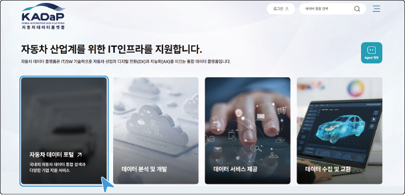

>  **바로가기**
>
> 다음의 경로로 바로 접속할 수 있습니다.
> - **자동차 데이터 포털**: [portal.bigdata-car.kr](https://portal.bigdata-car.kr)

## 화면 구성

자동차 데이터 포털의 메인 화면은 다음과 같이 구성됩니다.

| 번호 | 항목 | 설명 |
| --- | --- | --- |
| 1 | 홈 | 자동차 데이터 포털의 메인 화면으로 이동합니다. |
| 2 | 내 정보 | 마이페이지로 이동합니다. |
| 3 | 로그아웃 | 로그인한 계정에서 로그아웃합니다. |
| 4 | 마이디스크 | 마이디스크 페이지로 이동합니다. |
| 5 | 검색 | 검색란에 검색어를 입력하면 데이터 검색 화면으로 이동하고 결과를 확인할 수 있습니다. |
| 6 | 메뉴 | 자동차 데이터 포털의 메뉴를 표시합니다. 메뉴 위에 마우스를 올리면 하부 메뉴를 확인할 수 있습니다. |

## 메뉴 구성

자동차 데이터 포털의 메뉴는 다음과 같이 구성됩니다.

### 검색

자동차 데이터 포털에서 제공되는 데이터를 검색하고 확인할 수 있습니다.

>  **참고**
>
> 자동차 데이터 검색과 결과 확인에 대한 자세한 설명은 [데이터 검색](#데이터-검색)과 [데이터 검색 결과 확인](#데이터-검색-결과-확인)을 참고하세요.

#### 데이터 검색

`자동차 데이터 포털` > `검색` > `데이터 검색`

카테고리별로 분류된 데이터 트리에서 원하는 항목을 선택하여 검색할 수 있습니다.

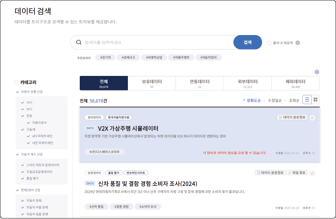

- 검색란에 검색어를 입력한 후 **검색**을 클릭하거나, 왼쪽의 데이터 트리에서 검색하려는 항목을 클릭하면 검색 결과가 표시됩니다.
- 검색 결과 중 데이터를 클릭하면 상세 정보 페이지로 이동합니다.

#### 데이터 맵

`자동차 데이터 포털` > `검색` > `데이터 맵`

카테고리별로 분류된 데이터 타일에서 원하는 항목을 선택하여 검색할 수 있습니다.

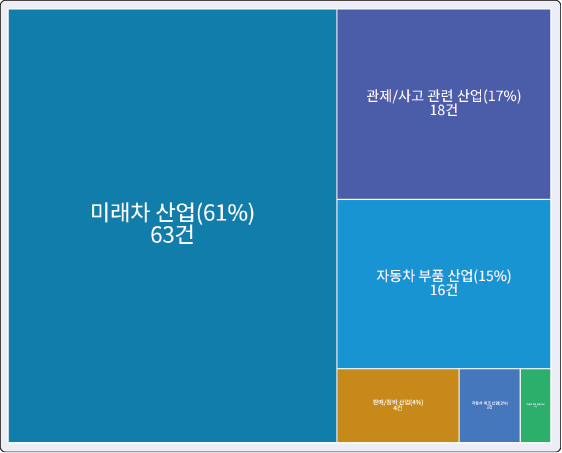

- 데이터 타일에서 검색하려는 항목을 클릭하면 데이터 검색 화면으로 이동하고 검색 결과가 표시됩니다.
- 검색 결과 중 데이터를 클릭하면 상세 정보 페이지로 이동합니다.

#### 연관 검색

`자동차 데이터 포털` > `검색` > `연관 검색`

자동차 산업 데이터와 데이터 분류별로 연관된 데이터를 확인할 수 있습니다.

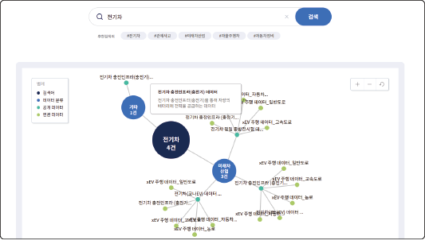

- 검색란에 검색어를 입력한 후 **검색**을 클릭하면, 검색어를 포함한 데이터와 검색어와 관련 있는 데이터의 검색 결과가 표시됩니다.
- 검색 결과 중 데이터를 클릭하면 상세 정보 페이지로 이동합니다.

#### 수집 현황

`자동차 데이터 포털` > `검색` > `수집 현황`

데이터의 유형별 수집 용량을 포함하여 탭별(보유/연동/국내/해외)로 분류된 데이터 수집 현황을 확인할 수 있습니다.

> **참고**
>
> - 국내와 해외 데이터는 주 1회 수집하고 AI 기술을 활용하여 등록됩니다.
> - 수집 대상에 추가할 데이터 포털 및 주소를 관리자에게 전달하여 새로 반영할 수 있습니다.

### 데이터 요청

한국자동차연구원에서 보유하고 있는 장비를 활용하여 데이터 생성을 요청하거나, 기업이 보유하고 있는 데이터를 등록하여 자동차 데이터 포털에서 공유 및 판매할 수 있습니다.

#### 데이터 생성 요청

`자동차 데이터 포털` > `데이터 요청` > `데이터 생성 요청`

한국자동자연구원에서 보유하고 있는 장비 목록 중에서 필요한 장비를 선택하여 데이터 생성을 요청할 수 있습니다.

1. **데이터 요청** 메뉴에서 **데이터 생성 요청**을 클릭하세요.
2. 검색란에 검색어를 입력한 후, **검색**을 클릭하세요.
   - 검색어를 포함한 검색 결과가 표시됩니다.

   

3. 검색 결과 중 데이터 생성을 요청하려는 장비데이터를 클릭하세요.
   - 데이터의 상세 정보 페이지로 이동합니다.
      - 데이터 목록으로 돌아가려면 **목록**을 클릭하세요.
4. 데이터의 상세 정보를 확인한 후, **의뢰하기**를 클릭하세요.
   - **확인** 팝업창이 표시됩니다.

   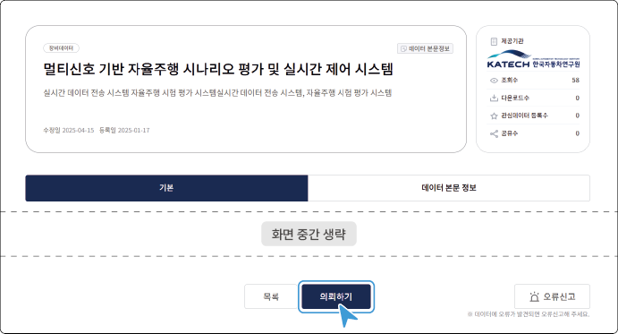

5. 팝업창에서 **확인**을 클릭하면 관리자에게 데이터 생성 의뢰 메일이 전송됩니다.

#### 데이터 등록 요청 {#데이터-등록-요청}

`자동차 데이터 포털` > `데이터 요청` > `데이터 등록 요청`

기업이 보유하고 있는 데이터를 등록하여 공유 및 판매할 수 있습니다.

1. **데이터 요청** 메뉴에서 **데이터 등록 요청**을 클릭하세요.
2. 데이터 등록을 위한 항목을 입력하세요.

   

   - **제공 형태**: 제공 방식을 **데이터** 또는 **API** 형태로 지정할 수 있습니다.
   - **데이터 구분**: 원본 데이터 제공 시에는 **보유데이터** 또는 **연동데이터**를 선택하고, 메타 데이터 제공 시에는 **외부데이터**를 지정하세요.
   - **공개 대상**: 검색 노출 대상을 **전체**, **내부 사용자**(이메일 도메인 기반) 또는 **지정 사용자**로 제한할 수 있습니다.
   - **데이터 보안**: 제공 데이터의 **마이디스크 방지**, **다운로드 방지**, **안심 분석 존** 내에서 활용 여부를 지정할 수 있습니다.
   - **데이터 타입**: 원본 데이터를 제공(**데이터 셋 파일**, **Object Storage**)하거나 외부 서버의 링크(**데이터서비스 링크**)를 지정할 수 있습니다.
3. **등록**을 클릭하세요.
4. 팝업창에서 **확인**을 클릭하면 관리자에게 데이터 등록 의뢰 메일이 전송됩니다.

>  **웹매뉴얼**
>
> 자세한 등록 절차는 웹 매뉴얼을 참고하세요.
> - 자동차 데이터 플랫폼(KADaP)의  > **매뉴얼** > **HTML, PDF** > **자동차 데이터 포털** > **데이터 요청** > **데이터 등록 요청**

>  **참고**
>
> 등록 요청된 데이터는 **데이터 요청** > **요청 관리** 메뉴에서 확인할 수 있습니다.

### 서비스

자동차 데이터 포털에서 검색된 데이터의 분석과 가공을 위한 소프트웨어 툴을 제공합니다.

#### 데이터 분석 및 시각화 툴

`자동차 데이터 포털` > `서비스` > `시각화 분석 툴`

- **데이터 분석**:제공되는 마이디스크를 포함한 다양한 출처(Source)의 데이터를 연계하여 분석을 수행할 수 있습니다.
- **데이터 시각화**:데이터를 그래프, 차트, 지도, 이미지 등의 시각적 형태로 표현하거나 대시보드를 생성하여 활용할 수 있습니다.

**이용하기**를 클릭하면 해당 툴이 제공되는 플랫폼으로 이동합니다.

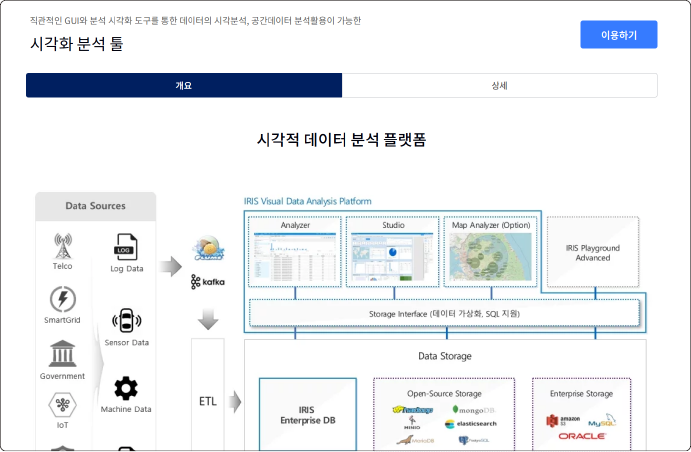

>  **바로가기**
>
> 다음의 경로로 바로 접속할 수 있습니다.
> - **데이터 분석**: [studio.bigdata-car.kr](https://studio.bigdata-car.kr) >  > Analyzer
> - **데이터 시각화**: [studio.bigdata-car.kr](https://studio.bigdata-car.kr) >  > Studio

#### 라벨 생성 툴

`자동차 데이터 포털` > `서비스` > `라벨 생성 툴`

원본 데이터를 AI 학습에 활용하기 위한 학습데이터로 변환하기 위한 툴을 제공합니다. 팀 구성원과 함께 작업 분량을 나누어서 진행 현황을 확인할 수 있습니다.

**이용하기**를 클릭하면 해당 툴이 제공되는 플랫폼으로 이동합니다.

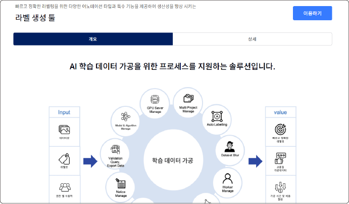

>  **바로가기**
>
> 다음의 경로로 바로 접속할 수 있습니다.
> - **라벨 생성 툴**: [labeller.bigdata-car.kr](https://labeller.bigdata-car.kr)

#### 안심 분석 존

`자동차 데이터 포털` > `서비스` > `안심 분석 존`

데이터 등록 시, 아래와 같이 **데이터 보안** 항목에서 **안심 분석 존**을 선택하면 분석존 내 사용 신청만 가능합니다.

아래와 같이 **분석 요청하기**를 클릭하면 관리자에게 신청 메일이 발송되고 접속 계정과 가이드를 받아 사용할 수 있습니다.

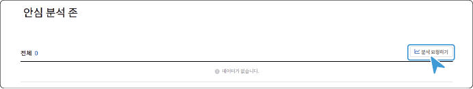

### 활용

데이터 분석 시 활용할 수 있는 분석 코드와 자동차 분야에 특화된 데이터 셋을 제공합니다. 또한 다양한 시각분석 활용 사례를 확인할 수 있습니다.

#### 시각분석

`자동차 데이터 포털` > `활용` > `시각분석`

데이터를 활용한 다양한 시각 분석 활용 사례를 제공합니다.

#### 분석코드

`자동차 데이터 포털` > `활용` > `분석코드`

데이터 분석 시 자주 활용될 수 있는 분석 코드를 제공합니다.

#### 추천 데이터 셋

`자동차 데이터 포털` > `활용` > `추천 데이터 셋`

자동차 분야 특화 데이터 셋에 대한 소개 및 특징 정보를 제공합니다.

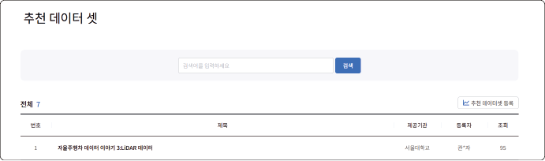

### 기업지원

자동차 데이터의 생성과 활용에 대한 지원 필요 시 신청할 수 있습니다.

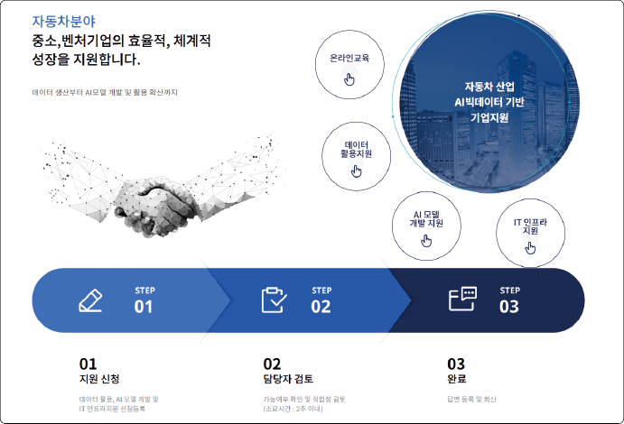

- **온라인 교육**
    자동차 분야 데이터의 활용 분석에 대한 교육 자료를 제공합니다.

- **데이터 활용 지원**
    자동차 분야 데이터의 품질 개선 및 시각화 분석 자료 활용, 라벨 생성 작업을 지원합니다.

- **AI 모델 개발 지원**
    자동차 분야의 AI 모델 개발 및 분석, 개선을 지원합니다.

- **IT 인프라 지원**
    자동차 분야 데이터의 수집 시스템, 데이터 저장과 백업, 데이터 포털 사이트 구축 등의 IT 인프라를 지원합니다.

>  **참고**
>
> 지원 신청 목록과 처리 상태는 **기업지원** > **기업지원 관리** 메뉴에서 확인할 수 있습니다.

### 알림

자동차 데이터 포털의 새로운 소식이나 자주 묻는 질문들을 확인할 수 있고, 궁금한 사항을 문의할 수 있습니다. 자동차 데이터 포털에 대한 궁금한 사항은 **문의하기**에 내용을 등록하여 답변을 받을 수 있습니다. 문의 및 답변의 공개 여부는 문의사항 등록 시 선택하세요.

#### 공지 사항

`자동차 데이터 포털` > `알림` > `공지 사항`

자동차 데이터 포털의 시스템이나 이벤트 등과 관련된 새로운 소식을 확인할 수 있습니다.

#### FAQ

`자동차 데이터 포털` > `알림` > `FAQ`

자동차 데이터 포털에서 자주 묻는 질문들을 확인할 수 있습니다.

#### 문의하기

`자동차 데이터 포털` > `알림` > `문의하기`

자동차 데이터 포털에 대한 궁금한 사항을 문의할 수 있습니다.

**문의하기**를 클릭하여 내용을 등록하세요. 문의 및 답변의 공개 여부는 문의사항 등록 시 선택하세요.

### 마이페이지

자동차 데이터 포털 화면에서 사용자 이름을 클릭하면 **마이페이지**로 이동합니다.

#### 포인트

`자동차 데이터 포털` > `마이페이지` > `포인트`

사용자가 포털, 클라우드, IDE 서비스 내의 활동을 통해 적립하거나 사용된 포인트 내역을 확인할 수 있습니다.

- **포인트**: 무상 제공 또는 활동을 통해 적립되는 포인트
- **포인트 플러스**: 협약을 통해 제공되는 포인트

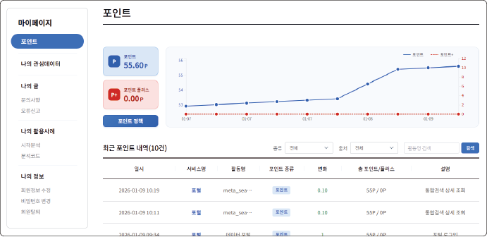

**포인트 정책**을 클릭하면 활동별 포인트 종류와 적립/차감되는 포인트를 확인할 수 있습니다.

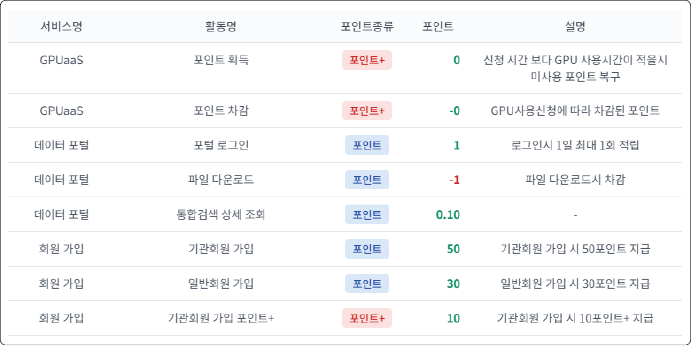

#### 나의 관심데이터

`자동차 데이터 포털` > `마이페이지` > `나의 관심데이터`

사용자가 관심데이터로 등록한 데이터 목록을 확인하거나 검색어를 입력하여 검색할 수 있습니다.

- **데이터 검색** 화면에서 데이터 항목의 을 클릭하면 으로 변경되고 관심데이터로 등록됩니다.

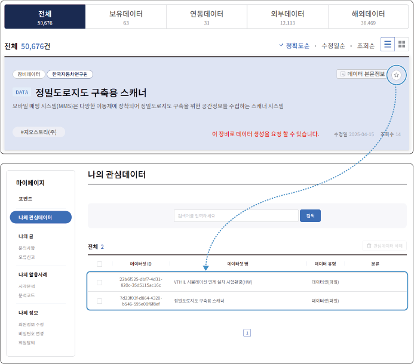

- 관심데이터 목록에서 삭제하려면, 원하는 항목을 선택한 후 **관심데이터 삭제**를 클릭하세요.

#### 나의 글

`자동차 데이터 포털` > `마이페이지` > `나의 글`

자동차 데이터 포털 사용 중 문의사항이나 데이터의 오류사항에 대해 사용자가 작성한 글의 목록과 진행 상태를 확인할 수 있습니다. 또한 작성 기간과 진행 상태를 선택하거나 검색어를 입력하여 검색할 수 있습니다.

#### 나의 활용사례

`자동차 데이터 포털` > `마이페이지` > `나의 활용사례`

시각분석 또는 분석코드를 활용한 데이터 목록과 진행 상태를 확인할 수 있습니다. 또한 작성 기간과 진행 상태를 선택하거나 검색어를 입력하여 검색할 수 있습니다.

#### 나의 정보

`자동차 데이터 포털` > `마이페이지` > `나의 정보`

사용자의 회원정보나 비밀번호를 변경하고 회원 탈퇴를 요청할 수 있습니다.

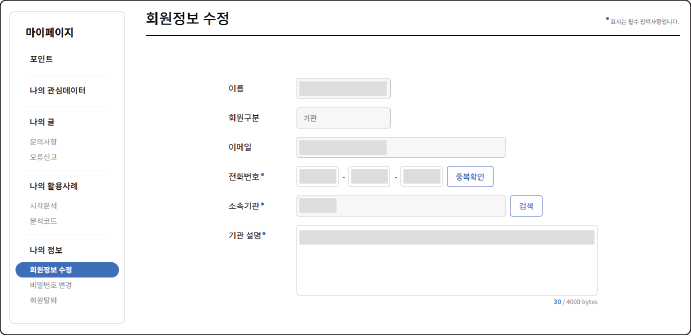

- **회원정보 수정**
   회원정보 변경 시 본인 확인을 위해 사용 중인 비밀번호를 입력한 후, **확인**을 클릭하세요. 회원정보 수정 화면에서 정보를 변경한 후, **수정**을 클릭하세요. 변경된 회원정보가 적용됩니다.

- **비밀번호 변경**
   현재 사용 중인 비밀번호와 새로운 비밀번호를 입력한 후, **확인**을 클릭하세요. 변경된 비밀번호로 로그인할 수 있습니다.

- **회원탈퇴**
   회원탈퇴 시 본인 확인을 위해 사용 중인 비밀번호를 입력한 후, **확인**을 클릭하세요. 팝업창에서 내용을 확인한 후, **탈퇴하기**를 클릭하세요. 회원탈퇴가 완료됩니다.

>  **참고**
>
> - 회원탈퇴 시 재가입 방지를 위해 계정정보는 비활성화하여 보관됩니다.
> - 동일 계정으로 재가입이 필요한 경우에는 관리자(admin@bigdata-car.kr)에게 요청하세요.

## 데이터 검색 {#데이터-검색}

자동차 데이터 포털에서 제공되는 데이터를 키워드, 결과 내 재검색, 산업 카테고리, 제공기관, 제공형태, 데이터 타입으로 검색할 수 있습니다.

**검색** 메뉴에서 **데이터 검색**을 클릭하세요. **데이터 검색** 화면으로 이동합니다.

### 화면 구성

**데이터 검색** 화면은 다음과 같이 구성됩니다.

| 번호 | 항목 | 설명 |
| --- | --- | --- |
| 1 | 검색란 | 검색어를 입력하여 데이터를 검색할 수 있습니다.<ul><li>**결과 내 재검색**: 검색 결과 내에서 추가 검색을 하려면 항목에 체크하세요. **결과 내 재검색**은 3회 제공됩니다.</li></ul> |
| 2 | 추천 검색어 | 사용자가 많이 검색한 단어나 관련 있는 단어를 표시합니다. |
| 3 | 카테고리 | 카테고리별로 분류된 데이터 트리에서 원하는 항목을 선택하면 검색 결과가 표시됩니다. (산업 분류, 제공기관, 제공형태, 데이터 타입, 키워드) |
| 4 | 분류 탭 | 원본 데이터와 메타 데이터의 관리 주체 및 수집 경로에 따른 분류를 표시합니다. |
| 5 | 정렬 메뉴 | 데이터를 원하는 기준으로 정렬할 수 있습니다. |
| 6 | 검색 결과 | 원하는 기준으로 검색한 데이터의 검색 결과를 표시합니다.<ul><li>검색 결과 중 데이터를 클릭하면 상세 정보 페이지로 이동합니다.</li></ul> |
>  **참고**
>
> 데이터 분류 탭의 내용은 다음과 같습니다.
> - **보유데이터**
> 한국자동차연구원에서 업로드한 메타 데이터와 테이터 셋의 유형별 수집 용량과 건수, 데이터의 분포도를 카테고리와 키워드 별로 확인할 수 있습니다.
> - **연동데이터**
> 한국자동차연구원에서 메타 데이터를 업로드하고 협약기관의 데이터 셋을 연동한 데이터의 수집 건수를 확인할 수 있습니다.
> - **외부데이터**
> 국내 여러 분야의 빅데이터 플랫폼에서 수집된 자동차 관련 데이터를 확인할 수 있습니다.
> - **해외데이터**
> 국외 여러 국가의 다양한 분야의 빅데이터 플랫폼에서 수집된 자동차 관련 데이터를 확인할 수 있습니다.

### 데이터 검색하기

데이터를 검색하려면 다음 순서대로 진행하세요.

1. **검색** 메뉴에서 **데이터 검색**을 클릭하세요.
   - **데이터 검색** 화면으로 이동합니다.
2. 검색란에 검색어를 입력한 후 **검색**을 클릭하거나, 왼쪽의 데이터 트리에서 검색하려는 항목을 클릭하세요.
   - 검색 결과가 표시됩니다.
     - **카테고리**: 자동차 산업계 분야
     - **제공기관**: 데이터를 제공하는 기관
     - **제공형태**: 제공되는 데이터의 형태 (DATA 또는 API)
     - **데이터타입**: 제공되는 데이터의 타입 (데이터 셋, 데이터 서비스, 또는 Object storage)
     - **키워드**: 자동차 분야와 관련 있는 키워드

## 데이터 검색 결과 확인 {#데이터-검색-결과-확인}

원하는 조건으로 검색한 결과의 데이터 목록을 확인할 수 있습니다.

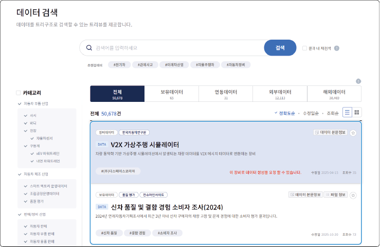

>  **참고**
>
> 검색 키워드의 데이터를 생성할 수 있는 장비 또는 장비 데이터는 색상()으로 표시됩니다.

### 데이터 검색 결과 목록

데이터 검색 결과 목록에서 데이터 피드는 다음과 같이 구성됩니다.

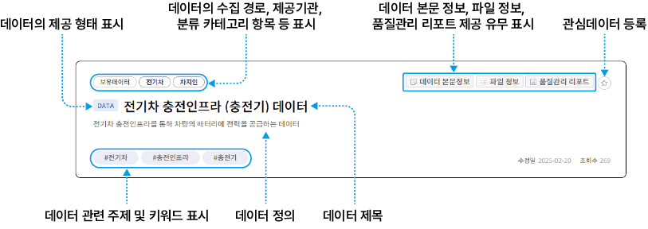

### 데이터 상세 정보

데이터 검색 결과 중에서 상세 정보 확인을 원하는 데이터를 클릭하세요. 선택한 데이터의 상세 정보 페이지로 이동합니다.

데이터의 상세 정보는 다음과 같이 구성됩니다.

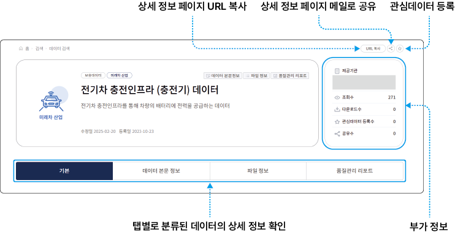

>  **참고**
>
> 상세 탭은 해당 정보가 제공되지 않으면 표시(활성화)되지 않습니다.
> - 모든 정보 제공
>
>    
>
> - 파일정보, 품질관리 미제공
>
>    

#### 기본 탭

데이터의 제공기관과 데이터의 유형, 보안 설정, 데이터 셋 ID와 같은 기본적인 상세 내용을 확인할 수 있습니다.

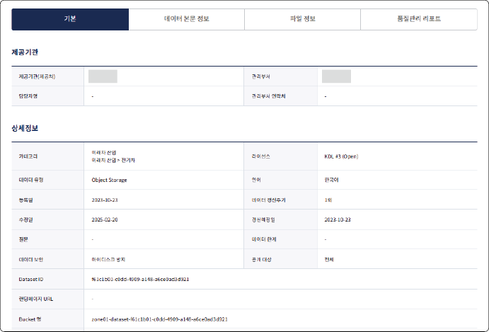

- **Dataset ID**
   내부적으로 관리하는 데이터 셋 고유 ID입니다.

- **랜딩페이지 URL**
   협약 및 수집을 통해 제공되는 데이터의 원본 출처 URL입니다.

- **Bucket 명**
   대용량 저장장치(Object Storage)로 제공 시 저장공간(Bucket)의 ID입니다.

>  **참고**
> 라이선스 내용은 아래를 참고하세요.
>
>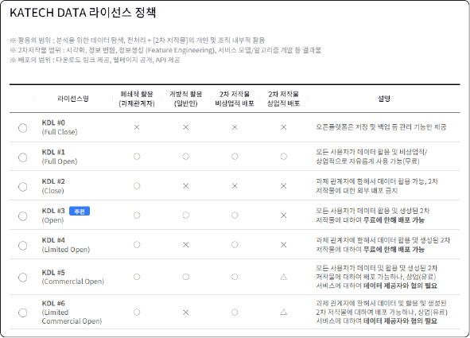
>

#### 데이터 본문 정보 탭

데이터의 개요 및 특징, 수집 환경(장비/장소/절차), 활용성, 관련 논문과 출처(외부링크) 등을 확인할 수 있습니다.

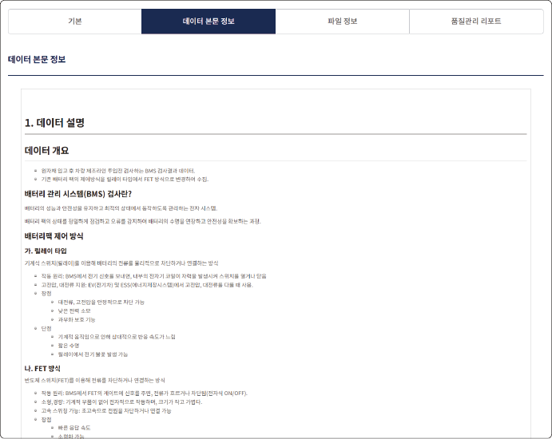

#### 파일 정보 탭

샘플 데이터가 등록되었을 경우, 일부를 미리보기로 제공합니다. 샘플 파일의 전체 내용을 확인하려면 다운로드하세요.

원본이 제공된 데이터는 웹 기반의 탐색기로 확인할 수 있습니다. 텍스트, 엑셀 또는 이미지 파일의 미리보기를 제공하고, 필요한 경우 해당 파일을 다운로드하거나 마이디스크에 저장할 수 있습니다.

**마이디스크 저장**을 선택하면 **마이디스크** > **favorite** 폴더에 저장됩니다.

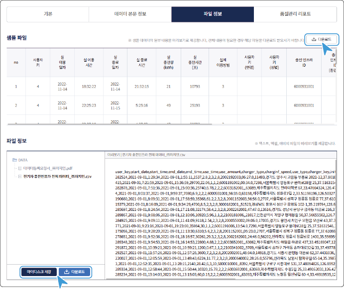

>  **참고**
>
> 데이터 제공자가 데이터 등록 시 보안 설정에 따라 **다운로드**, **마이디스크 저장** 기능이 표시되지 않을 수 있습니다. 이 경우 **안심존 분석 요청** 기능이 활성화됩니다. 자세한 설명은 [데이터 등록 요청](#데이터-등록-요청)을 참고하세요.

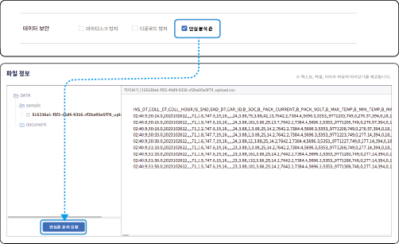

#### 품질관리 리포트 탭

데이터의 5대 품질 진단 기준을 토대로 분석한 결과를 확인할 수 있습니다. 또한 데이터 셋에서 개인 식별정보의 유무를 검출하고, 민감 정보의 가능성이 있는 필드에 대해서도 확인합니다.

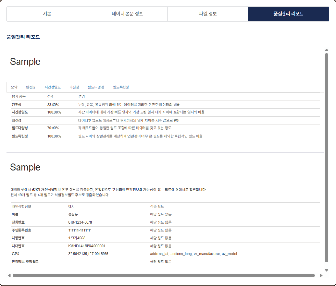

>  **참고**
>
> 정형 데이터에 한해서 품질관리 리포트가 생성됩니다.
> 원본 데이터가 존재하지 않거나 분석을 위한 충분한 양이 되지 않으면 **품질관리 리포트**탭은 표시되지 않습니다.

## 마이디스크

자동차 데이터 포털에서는 데이터 활용을 위해 개인 저장 공간인 마이디스크를 제공합니다. 검색 결과에서 마이디스크 저장을 선택하거나, 구매한 데이터 또는 사용자가 직접 업로드한 데이터를 저장하여 자동차데이터플랫폼(KADaP)에서 제공하는 다른 서비스들과 연계(Mount)하여 활용할 수 있습니다.

자동차 데이터 포털 화면에서 **마이디스크**를 클릭하세요. **마이디스크** 화면으로 이동합니다.

>  **바로가기**
>
> 다음의 경로로 바로 접속할 수 있습니다.
> - **마이디스크**: [mydisk.bigdata-car.kr](https://mydisk.bigdata-car.kr)

### 화면 구성

마이디스크 화면은 다음과 같이 구성됩니다.

| 번호 | 항목 | 설명 |
| --- | --- | --- |
| 1 | My files | My files 마이디스크로 저장한 데이터 파일, 구매한 데이터, 서비스 툴, 데이터 개별등록 시 업로드한 파일 등이 폴더별 속성에 맞게 저장됩니다. My files 하부 폴더는 디폴트로 생성되어 있습니다. |
| 2 | 보기 설정 | 파일 선택 옵션, 목록의 정렬이나 보기 옵션, 컬럼 설정 옵션, 파일 필터링 옵션 등을 선택할 수 있습니다.<ul><li>폴더나 파일을 선택한 후, 마우스 오른쪽 버튼을 클릭하면 컨텍스트 메뉴가 표시됩니다. 컨텍스트 메뉴에서 다양한 기능을 사용할 수 있습니다.</li></ul> |
| 3 | 상세 정보 | 마이디스크 내 폴더 또는 파일에 대한 상세 내용을 확인하고, 부가 설명을 입력할 수 있습니다. |
>  **참고**
>
> My files 폴더 내용은 다음과 같습니다.
> * **app**: 마켓플레이스 'App'과 연동되는 폴더
> * **favorite**: 자동차 데이터 포털에서 '마이디스크 저장'과 연동되는 폴더
> * **purchase**: 자동차 데이터 포털에서 '구매 데이터'와 연동되는 폴더
> * **tools**: 자동차 데이터 플랫폼에서 제공되는 '툴'과 연동되는 폴더 (인공지능개발솔루션IDE, 자동차지식에이젼트Agent 등)
> * **upload**: 자동차 데이터 포털에서 '데이터 등록' 시 연동되는 폴더