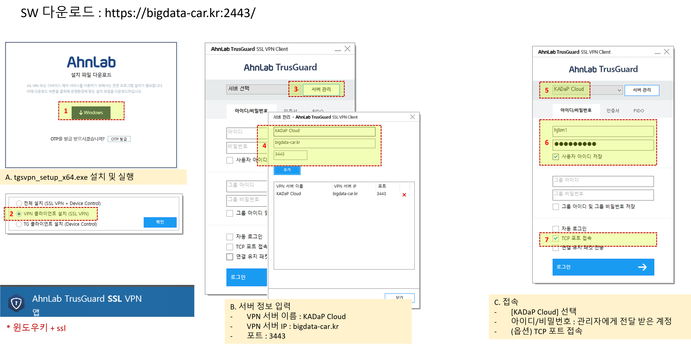

# KADaP VPN 접속 방법

자동차 데이터 플랫폼의 일부 서비스(클라우드, 가상서버 접속)은 외부 공격에서 보호하기 위하여 허가된 사용자에 한해서 접속 가능합니다.&#x20;

접속을 위해서는 하기 절차 진행하여야 합니다.&#x20;

1. 관리자(admin@bigdata-car.kr)에게 하기 내용 자유 서식으로 전달
   1. 소속&#x20;
   2. 이름&#x20;
   3. 연락처 (이메일 주소, 전화 번호)
   4. 사용 목적&#x20;
2. 내부 검토 이후 접속을 위한 ID와 비번번호를 전달 드립니다.&#x20;
3. VPN 접속을 위한 프로그램을 https://bigdata-car.kr:2443 에 접속 하여 다운로드 받아 설치 합니다.
4. VPN 프로그램의 서버관리 메뉴에서 아래 정보를 추가 합니다.&#x20;
   1. 서버 이름 :  KADaP Cloud
   2. 서버 IP : bigdata-car.kr   (www 없이 입력)
   3. 포트 : 3443
5. \[2]에서 전달 받은 아이디와 비밀번호를 이용하여 접속을 진행 하면 됩니다.&#x20;

<figure><figcaption></figcaption></figure>
